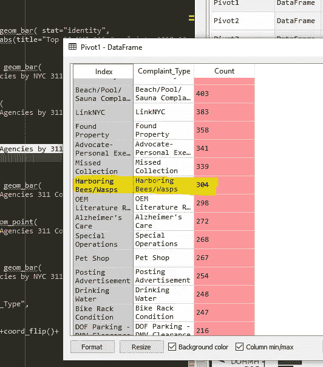
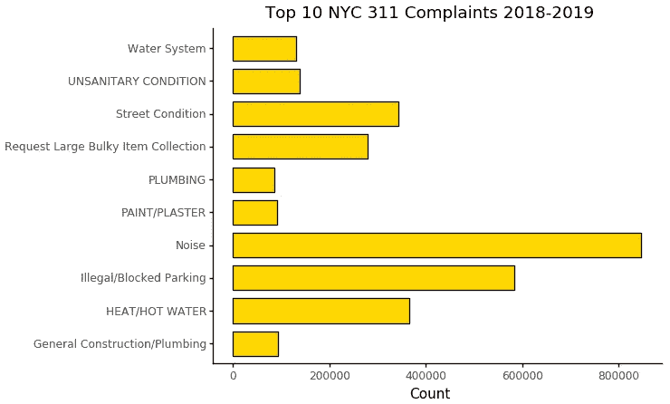
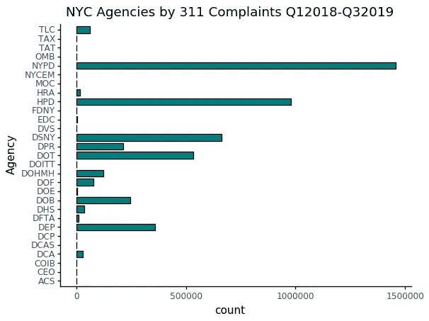
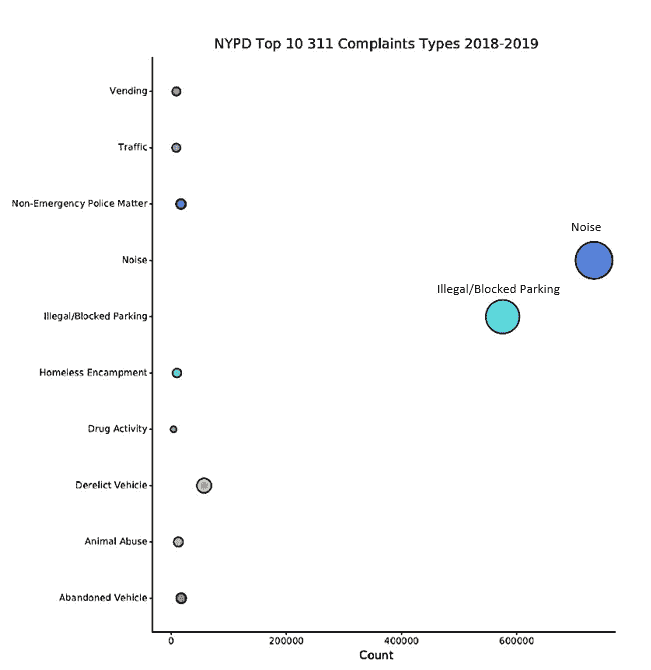

# 纽约人讨厌噪音——纽约市 311 投诉数据分析

> 原文：<https://medium.com/analytics-vidhya/new-yorkers-hate-noise-nyc-311-complaint-data-analysis-19083a40b068?source=collection_archive---------8----------------------->

使用纽约市的 awesome open [data](https://opendata.cityofnewyork.us/) 门户网站，我下载了一个关于纽约市从 2018 年 Q1 到 2019 年第三季度 311 起投诉的庞大数据文件。等了 20 分钟后，我兴奋地看到了定期更新的超过 400 万条记录的数据集。我想知道在美国人口最多的城市，人们抱怨最多的是什么！311 是一个非紧急电话号码和[网站](https://portal.311.nyc.gov/)，人们使用它来查找服务信息，进行投诉，或报告涂鸦或道路损坏等问题。在第一次浏览数据后，我发现数据中有 304 条关于人们窝藏蜜蜂的投诉，这让我感到有趣和惊讶。很高兴看到城市里的一些人正在努力拯救蜜蜂！

纽约人抱怨人们窝藏蜜蜂/黄蜂

然后，我把重点放在了对这座城市最常见的投诉上，如下图所示。不同类型的噪音投诉(住宅、街道、建筑等)被合并为一类，称为“噪音”。如下图所示，噪音投诉以超过 800，000 份报告位居第一，而“非法/堵塞停车”投诉紧随其后，约有 600，000 份。“暖气/热水”和“街道状况”投诉紧随其后，约一半的投诉是“噪音”

311 数据来自纽约市 2018 年 12 月 1 日至 2019 年 10 月 27 日的公开数据；噪音和非法/阻塞停车被合并为一类

我当时很好奇，哪些部门收到的投诉最多，因此为了处理所有这些投诉，可能要做的“工作”最多。到目前为止，纽约警察局(“NYPD”)接到的投诉最多，如下所示。下一个最受欢迎的机构是纽约住房和保护局(“HPD”)，其次是纽约卫生局(“DSNY”)。我很惊讶地看到纽约消防局(“NYFD”)有这么少的 311 投诉。

311 数据来自纽约市 2018 年 12 月 1 日至 2019 年 10 月 27 日的公开数据

因为迄今为止，NYPD 不得不处理最多的投诉；我很好奇 NYPD 到底处理了哪些类型的投诉。如下图所示，NYPD 承担了噪声投诉工作的主要任务，在 800，000 起投诉中，约有 735，000 起投诉属于该部门。NYPD 还被全市大约 60 万个非法停车和受阻停车投诉所淹没。其余类型的投诉频率要低得多，第三种最受欢迎的类型是废弃车辆，约有 60，000 起投诉。我注意到下图中绘图点的大小与投诉记录的数量相对应；点越大，该类别的投诉就越多。

如图所示，纽约人对城市噪音的投诉最多，有 311 起，这在这样一个拥挤和人口稠密的城市是有道理的。这些噪音报告是由 NYPD 处理的，他们的部门也收到了最多的 311 起投诉。在今后的分析中，我想看看 NYPD 是否获得更多的拨款，以应对除刑事投诉之外的所有 311 项投诉。这只是对纽约市提供的[公开数据的一点皮毛。请不要着急，自己去调查这些数据。](https://opendata.cityofnewyork.us/)