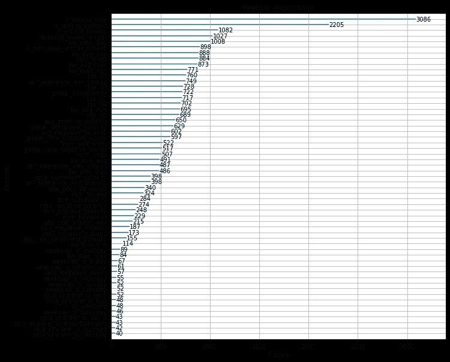
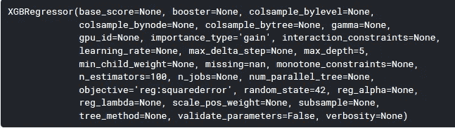
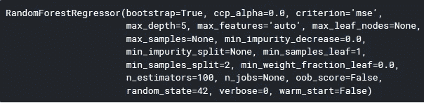
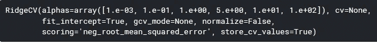
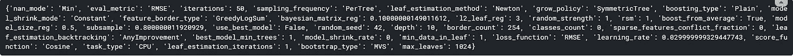
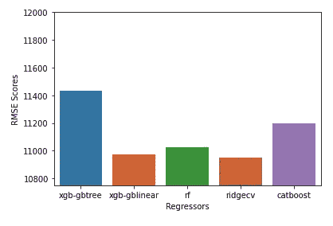

# 新闻文章病毒式预测

> 原文：<https://medium.com/analytics-vidhya/news-article-virality-prediction-c0c069de0c9c?source=collection_archive---------14----------------------->

前两篇文章解释了信息检索和一些基本代码，它们将帮助您实现 web 抓取。本文重点研究新闻文章的提取和使用各种机器学习模型预测其病毒传播性。根据“文章获得的份额数”来衡量病毒传播性。

如果您需要有关网页抓取的参考资料，请单击下面的链接。

1.  [信息检索第一部分:提取网页](/analytics-vidhya/information-retrieval-part-1-extracting-webpages-a9d0b715535d)
2.  [信息检索第二部分:简化信息](/analytics-vidhya/information-retrieval-part-2-simplifying-the-information-53880b930ebd)

# **1。数据集:**

[网络新闻流行度](http://archive.ics.uci.edu/ml/datasets/Online+News+Popularity)

# **2。使用的库**:

newspaper3k，TextBlob，sklearn，numpy，requests，BeautifulSoup，nltk，pandas，seaborn，catboost，xgboost

```
import numpy as np
import pandas as pd
import matplotlib.pyplot as plt
from sklearn import preprocessing
from sklearn.model_selection import train_test_split, GridSearchCV
from sklearn.ensemble import RandomForestRegressor
from catboost import CatBoostRegressor
from sklearn.linear_model import RidgeCV
from xgboost import XGBRegressor
from xgboost import plot_importance
from sklearn.metrics import mean_squared_error as RMSE
from sklearn.decomposition import PCA
import seaborn as sns
from newspaper import Article
import requests
from bs4 import BeautifulSoup
from textblob import TextBlob
from nltk.tokenize import word_tokenize 
from nltk.corpus import stopwords
```

# 3.使用数据集

*   最初会采取一些预防措施。例如格式化列名、删除不必要的列
*   提取重要特征(下)

**XGBoost** 库提供了一种方法***plot _ importance()***来计算数据集中包含的要素的重要性。以下是为 UCI 数据集创建的图。



UCI 在线新闻流行度数据集的 plot_importance()图

提取**前 20 个**特征，保持 600 的**阈值。我设法计算出了其中的 9 个，因为其余的描述不够清晰，无法表达。以下是计算的特征:**

*   **n_tokens_title** :标题字数
*   **n_tokens_content:** 内容的字数
*   **n_unique_tokens :** 内容中唯一单词的比率(#unique words / #words)
*   **average_token_length :** 内容中单词的平均长度
*   **avg_positive_polarity :** 正词平均极性
*   **n _ non _ stop _ unique _ tokens:**内容中唯一不停词的比率
*   **num_hrefs :** 文章中的链接数
*   **全局 _ 主观性:**文章内容的主观性
*   **全局情绪极性**:文本情绪极性

让我们简单介绍一下用于计算上述特征的两个库， **newspaper3k 和 TextBlob** 。

> 报纸是一个了不起的 python 库，用于提取和管理文章。

下面的代码着重于从新闻文章 URL 中提取新闻，并访问各种特性，如文章的标题**和内容文本**等。

> T extBlob 是一个用于处理文本数据的 Python 库。它提供了一个简单的 API，用于处理常见的自然语言处理(NLP)任务，如词性标注、名词短语提取、情感分析、分类、翻译等。

TextBlob 库帮助我们计算单词和句子的极性和主观性。它的用法如下:

这样做了之后，使用 **nltk.tokenize** 和 **nltk.corpus.stopwords** ，可以很容易地计算出前 6 个特征。(GitHub 资源库中的代码)。

最后， **num_hrefs** 用下面的方法计算:

# 4.抓取新闻文章

我从英国广播公司(BBC)的网站上搜集文章来收集新闻。

然后，文章链接被收集到一个列表中。此外，然后使用 newspaper3k 库来抓取文章。

最后，为文章文本计算前一节中描述的 9 个特征**并创建新闻文章特征的最终数据集。**

**注意:上面定义的 9 个特征是从原始的 UCI 数据集中切分出来的，以匹配新闻文章数据集的特征。**

# 5.机器学习模型的测试

UCI 数据集被分成 4 个不同的模型进行训练和测试，如下所示:

*   XGboost 回归器



使用了两个版本的 XGBoost，一个使用 **gblinear** 作为助推器，另一个使用 **gbtree** 作为助推器。

多次运行的平均结果给出了 gblinear 的～10973 和 gbtree 的～11430 的 RMSE。

*   随机森林回归量



多次运行的平均结果给出了～10973 的 RMSE。

*   RidgeCV 线性回归器



多次运行的平均结果给出了～10952 的 RMSE。

*   CatBoost



放大细节

测试参数的平均结果是 RMSE 11200。

评估的最终结果如下所示



显然，RidgeCV 是所有模特中表现最好的。然后，这些模型被用来预测新闻文章的份额。RidgeCV 的结果平均是其他模型的 10 倍。由于无法获得真实的股份数量，我无法断定哪些是准确的。

感谢您的关注！

下面是笔记本的链接。请随意评论任何可以改进的地方！:-)

**链接到 GitHub 知识库:** [**新闻病毒式预测**](https://github.com/arnabsinha99/MListheroxx/tree/master/Mini_Projects/News%20Virality%20Prediction)

**链接到 Kaggle 笔记本:** [**新闻病毒式预测**](https://www.kaggle.com/sherlocked99/news-virality-prediction?scriptVersionId=32865911#Converting-UCI-dataset)