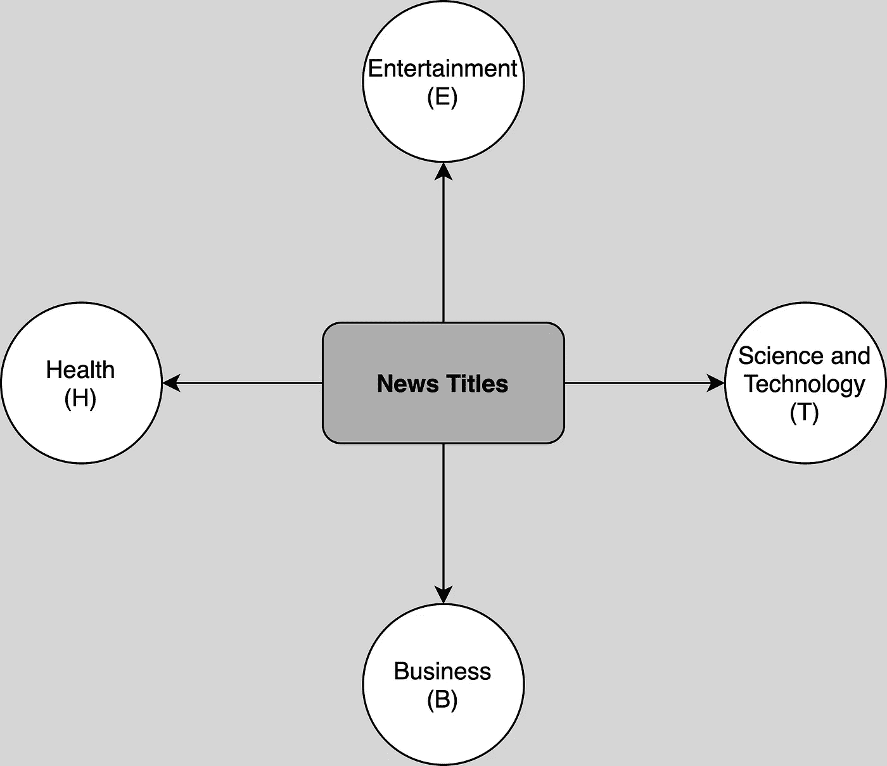
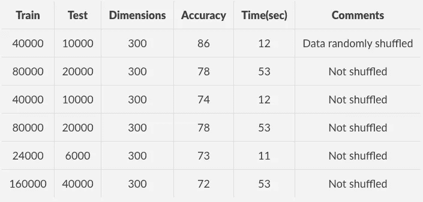
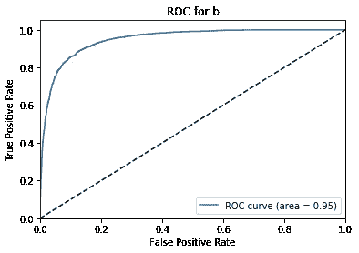
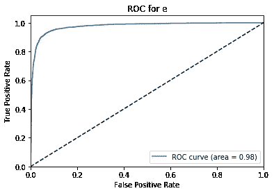
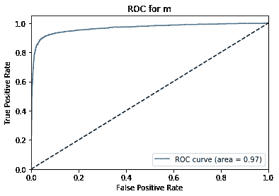
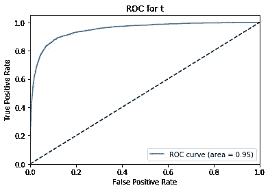

# 新闻数据分类

> 原文：<https://medium.com/analytics-vidhya/news-data-classification-61c04721d30c?source=collection_archive---------19----------------------->



用以上标签对新闻标题进行分类

# 目标

这个项目可以在标题的基础上直接给新闻数据添加一个类别。这是使用 word2vec、逻辑回归、nltk 等技术实现的。

# 资料组

该数据集包含 2014 年 3 月 10 日至 2014 年 8 月 10 日期间由网络聚合器收集的 422，937 条新闻故事的标题、URL 和类别。该数据集中的新闻类别包括商业、科技、娱乐和健康。涉及同一新闻条目的不同新闻文章(例如，关于最近发布的就业统计的几篇文章)也被分类在一起。新闻出版商包括经济时报、路透社、华尔街日报等。原始数据集可以从下面的链接下载。
[https://www . ka ggle . com/arjunchandrasekhara/news-classification/data](https://www.kaggle.com/arjunchandrasekhara/news-classification/data)

# 预训练 word2vec 模型

该项目使用谷歌训练的 word2vec 模型。这个模型是专门在谷歌的新闻数据集上训练的。word2vec 模型用于获得每个单词的 300 维向量。基于该模型去除停用词和词汇表外的词。标题中剩余单词的 300 维向量是通过获得单词的元素方式的平均值而获得的。特征中单个记录的形状为(300，1)。

# 项目详情

5 万条干净记录作为特征。干净的记录意味着记录中没有停用词，没有词汇和标点符号。这些记录有干净的标签，属于 b 类(商业)，t 类(技术)，m 类(医学)，e 类(娱乐)。对于每个标题，记录具有 300 维向量，并且其各自的标签具有单个字符。特征的形状为 50000*300，标签的形状为 50000*1。训练集与测试集的比例为 4:1。即用于训练模型的 40，000 条记录和用于验证模型的 10，000 条记录。

# 密码

下载原始和原始 csv 数据的回购。进入目录并签出到开发文件夹。然后，下载训练好的 word2vec 模型并解压。

```
!git clone [https://github.com/omkarsk98/NewsDataClassification.git](https://github.com/omkarsk98/NewsDataClassification.git)
%cd NewsDataClassification
!git checkout development
!wget -c "https://s3.amazonaws.com/dl4j-distribution/GoogleNews-vectors-negative300.bin.gz"
!gunzip GoogleNews-vectors-negative300.bin.gz
```

下载 nltk 库和依赖项，并导入所有需要的库。

```
import nltk
nltk.download('punkt')
nltk.download('stopwords')import pandas as pd
from gensim import models
from sklearn.linear_model import LogisticRegression
import numpy as np
from nltk.tokenize import word_tokenize
from nltk.corpus import stopwords
from sklearn.metrics import accuracy_score ,confusion_matrix
import time
from sklearn.manifold import TSNE
from google.colab import files
```

读取原始数据并设置要使用的最大记录数。此外，对所有单词进行标记，并获得英文的停用词，并定义所有可用于后续阶段的函数。

```
# read csv
main_data = pd.read_csv('News_Final.csv')# read titles from it
article_titles = main_data['TITLE']
labels = main_data["CATEGORY"]# Create a list of strings, one for each title
titles_list = [title for title in article_titles]# form a single string fro the list of strings
big_title_string = ' '.join(titles_list)# define total records to be considered for analysis
total = 50000# Tokenize the string into words
tokens = word_tokenize(big_title_string)# Remove non-alphabetic tokens, such as punctuation
words = [word.lower() for word in tokens if word.isalpha()]
stop_words = set(stopwords.words('english'))
```

定义所有的辅助函数来获得每个文档的向量，标记和删除停用词，在预处理后获得至少有一个词的文档。

删除停用词、非词汇词、空文档，为每个标题准备向量。

使用辅助函数预处理整个数据集

删除停用词和空文档后，

```
241 docs removed
1st filter: Length of corpus:422178, Length of titles_list:422178, Length of labels:422178
0 docs removed
2nd filter: Length of corpus:422178, Length of titles_list:422178, Length of labels:422178
```

**每个标题的向量**

所有标题和标签的 300 维向量列表包含各自的标签。这些向量的形状是(422178，300)。
它各自标签的形状(422178，1)。

过滤掉标签不正确的数据。标签只能是以下类型。

1.  商务
2.  t:技术
3.  e:娱乐
4.  男:健康

过滤数据以仅包含有效标签。

创建一个数据帧，对其进行洗牌和分割。

```
finalData = pd.DataFrame.from_records(features)
finalData.columns = range(1,301)
finalData["labels"] = labels# finalData.to_csv('FinalData.csv')
data = finalData.sample(frac=1) #shuffles the data
labels = data["labels"]
labels = np.array(labels)
labels = labels.reshape(labels.shape[0],1)
del data["labels"]
features = np.array(data)
features.shape, labels.shape
# ((50000, 300), (50000, 1))
```

**拆分数据。**

**训练数据:**将 80%的数据用于训练目的。
**测试数据**:使用 20%的数据进行测试。
**特征**:使用 300 维向量作为特征。它可以在 vectorsForEachDocument 中找到。
**标签**:使用类别作为标签。我可以在标签中找到。

**数据的形状**
训练特征:(160000，300)
训练标签:(160000，1)
测试特征:(40000，300)
测试标签:(40000，1)

**训练逻辑回归模型**

训练逻辑回归模型。

# 培训成果

逻辑回归模型可以在 12 秒内达到 86%的准确率。下面列出了各种实验模型的细节。



不同回归模型的结果。

对于按['b '，' t '，' e '，' m']顺序排列的标签，精度和召回率如下

精度:[82.947297775 83.25883789.44478787.46594 005】
召回率:[84.79757 80.9585966

ROC 曲线如下



这方面的一个主要参考来自于[https://towards data science . com/using-word 2 vec-to-analyze-news-headlines-and-predict-article-success-CDE da 5 f 14751](https://towardsdatascience.com/using-word2vec-to-analyze-news-headlines-and-predict-article-success-cdeda5f14751)。

同样的 github repo 可以在这里找到[。](https://github.com/omkarsk98/NewsDataClassification/tree/v1.5)