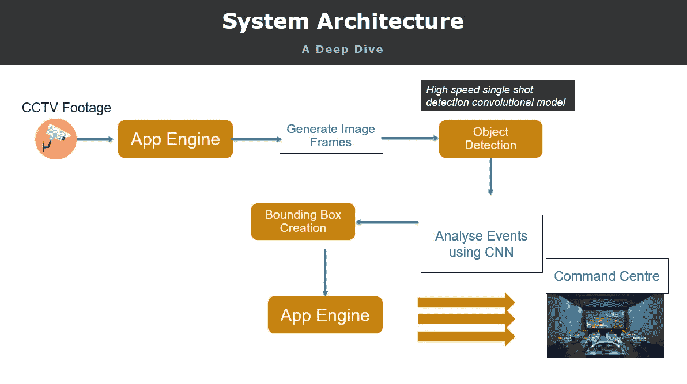

# 下一代机场:使用 YOLO 的计算机视觉模型实现实时飞机周转

> 原文：<https://medium.com/analytics-vidhya/nextgen-airports-using-yolo-based-computer-vision-models-to-enable-real-time-aircraft-turnarounds-5cd238ab57d7?source=collection_archive---------7----------------------->

在过去 10 年中，全球航空交通一直呈上升趋势，这在很大程度上可归因于亚洲国家的经济增长。这种上升趋势与老化的航空旅行基础设施相结合，如小型和老旧的机场，这些机场没有配备任何设备来处理不断增长的客运量，或者航班使机场瘫痪，阻碍了经济增长并增加了乘客的不便。其他地方的情况也不太好，即使在拥有广泛的航空旅行基础设施支持和辅助服务的国家，陈旧的基础设施再次成为顺畅无障碍旅行的瓶颈，最终导致机场在航班处理和旅客流量方面未得到充分优化，从而阻碍了经济增长。

幸运的是，许多政府和机场运营商已经意识到这一点，并采取积极措施，使用人工智能和计算机视觉等新方法来消除这些瓶颈。我们将在这里详细讨论其中一种方法。

> 博客的其余部分将重点关注使用基于计算机视觉的模型来优化飞机实时掉头，以及如何使用停机坪上的 yolo 和 cctv 摄像机来实现这一点。

**问题:**几乎所有的机场都面临着飞机在规定时间内周转的挑战。如果出现延误，下一架进港飞机无法分配登机口，这将导致延误，并给航空公司带来很大的成本。在每次飞行之前，每架飞机都必须经过一系列逐步检查和飞行安全流程，突然之间，这就变成了一个优化问题，飞行安全和运营必须与及时周转保持平衡，以实现客流效率和增加飞机处理量。

**目前的做法:**目前有多种解决方案和机制，这些方案和机制与运营商和政府机构所在的地区有很大不同。目标非阻塞时间(TOBT)测量用于估计从停靠到登机口到离开登机口所需的时间。多家供应商提供平台，一旦飞机停靠到登机口，就将遥测数据连接并发送到中央服务器，用于 TOBT 计算。

# **但是当前方法的问题是..**

> 不是航空公司服务提供商连接到这些平台上，经常导致 TOBT 中没有捕捉到的延迟。**例如，虽然所有现有系统都捕捉到了登机口的停靠和解锁，但很少能捕捉到其他同样重要的事件，如货舱门的打开和关闭、餐饮服务的开始和完成事件。大多数情况下，这些仅记录在纸和笔中，并且也只有大概的时间，这导致在获取任务关键数据时的大量信息空白。这不仅导致错过 TOBT，而且不允许对数据进行历史分析以了解飞机延误的根本原因。**

**在飞机周转中使用计算机视觉和人工智能:**人工智能和计算机视觉可以通过准确和实时地了解停机坪上飞机发生的一切来缓解机场的拥堵状况，而无需任何额外的投资。

**提出的方法:**提出了一种新的基于计算机视觉的实时人工智能引擎，它将直接从停机坪的摄像机摄取实时闭路电视信号，并发送给人工智能模型。

计算机视觉模型实时检查每一帧视频，检测感兴趣的事件，如货舱门打开、登机桥连接，并按顺序给它们打上时间戳，从而在不使用任何传感器的情况下实时准确计算飞机上发生的所有事件，并填补早期系统产生的数据空白。

我们建议使用高性能的单次检测模型 yolo(您只需查看一次)。yolo 优于其他型号，主要是因为它能够检测视频馈送中的变化，还因为它具有约 25 fps 的高速，这是任何实时视频检测用例所需要的。

示例架构

实时模型的样本架构检测来自闭路电视的所有事件，以加快飞机周转

# 这个项目是关于:

虽然在 python 中进行基于深度学习的图像分类和对象检测模型有很多关注点，因此有许多博客显示如何做同样的事情，但关于如何以独立的方式使用基于 java 的包(如 OpenCV)来进行图像分类和识别任务的信息很少，该项目专注于一步一步地使用 JAVA、JAVA 中的 OpenCV 包和 YOLO 进行视频流分析。请记住，我们没有在这个项目中使用 tensorflow/Darkflow/Darknet。在接下来的章节中，我们将详细介绍什么是对象检测，什么是 YOLO，以及如何使用 OpenCV 和 JAVA 实现 YOLO。接下来，我们将给出一个使用 YOLO 模型来检测视频流中的对象的示例 JAVA 代码

# 我们的筹码是什么:

对于本项目，我们将使用以下内容:

1.  JAVA SE 8 在这里获取:[https://www . Oracle . com/tech network/JAVA/javase/downloads/JDK 8-downloads-2133151 . html](https://www.oracle.com/technetwork/java/javase/downloads/jdk8-downloads-2133151.html)
2.  OpenCV 4.0，在这里获取:【https://opencv.org/ 
3.  TIBCO Streambase:我使用 TIBCO Streambase 一个复杂的事件处理引擎来编译和运行这个项目，但是您可以使用任何标准的 IDE

好了，让我们开始吧。

第一步:

设置 yolo 模型，并为您自己的模型进行定制。我用 Google Colab 来做这件事。一篇关于如何设置的优秀文章在[这里](/@today.rafi/train-your-own-tiny-yolo-v3-on-google-colaboratory-with-the-custom-dataset-2e35db02bf8f)

第二步

收集您自己的视频来训练模型，并从中取出帧来进行训练。我用 LabeLImg 做的。

第三步

经过训练后，我编写了一个定制的 Java 代码，它可以使用经过训练的权重在 Java IDE 中实时检测事件。

代码片段

 [## suddh 123/飞机 _turarounds

### 实时飞机转向检测。通过创建一个……为 suddh123/Aircraft_turarounds 开发做出贡献

github.com](https://github.com/suddh123/Aircraft_turarounds/tree/master) 

> **这是一个正在进行的项目的视频样本。我已经纳入了 2 个活动，自动检测与时间戳生成的飞机周转的每个活动的开始和结束。类似地，在飞机返航周期中，可以检测并记录多个此类事件的开始和结束时间。**

最终结果..

**积极的业务成果**

**无需安装新的硬件或昂贵的传感器，可与现有的摄像机设置配合使用**

**可以实时检测传统平台无法捕捉到的所有事件。餐饮车在装卸过程中花费的时间**

**消除基于纸笔的跟踪，将所有供应商整合到一个实时周转跟踪平台**

**一旦收集了每个事件的数据，就要进行假设分析和未完成目标的根本原因分析**

**向供应商/合作伙伴实时发送警报，以保持 SLA 范围内的周转。**