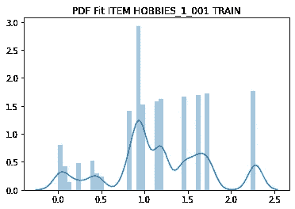
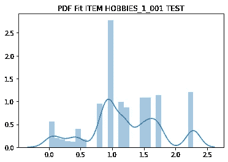
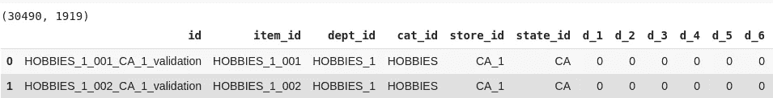
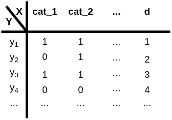
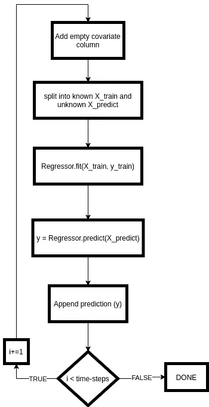

# NGBoost 增量预测

> 原文：<https://medium.com/analytics-vidhya/ngboost-incremental-forecasting-f4173b778f9e?source=collection_archive---------10----------------------->

或者*如何满怀信心地预测自己不知道的事情*——区间。

目前有一个突出的预测挑战正在 Kaggle 上发生， [M5 预测挑战](https://www.kaggle.com/c/m5-forecasting-accuracy/overview)。给定的是长时间范围内(1913 天或大约 5 年)产品项目的销售，日历信息和价格信息。从[这里](https://www.kaggle.com/headsortails/back-to-predict-the-future-interactive-m5-eda)可以找到 M. Henze 出色的深度分析。挑战的目标是，对个别商品在未来 28 天的销售情况做出明智的预测。人们可以用不同的方法来应对这一挑战:LSTMs、MCMC 等方法。本文将关注如何通过相对新颖的方法—**ng boosting**来**生成预测。**

NGBoost 由斯坦福 ML 小组开发，由 Tony Duan、Anand Avati 等人于 2019 年 [arXiv 上发表](https://arxiv.org/abs/1910.03225)。与其他增强方法相比，这种方法通过利用自然梯度来优化增强，如 [LightGBM](https://papers.nips.cc/paper/6907-lightgbm-a-highly-efficient-gradient-boosting-decision-tree.pdf) 或 [XGBoost](https://arxiv.org/abs/1603.02754) 。它减少了对已知数据点的过度拟合，并在标准基准数据集上至少达到了最先进的性能——参见[1]以获取参考和见解。此外，在拟合模型后，我们可以根据数据生成 pdf(概率密度函数)(见下文),甚至可以得到不确定性区间。



M5 数据集第一项的训练数据(上图)和测试数据(下图)的拟合 NGBoost 回归量的概率密度

使用 Boosting 算法进行预测不像 LSTMs 或 MCMC 方法那样简单。在模型学习了输入数据的底层结构后，LSTM 可以在指定的时间步长内生成新数据。如果你安装一个*助推模型*并简单地点击“*预测 28 天*”——按钮，它会吐出 28 次一致的值。
那么，让我们在你最喜欢的编辑器或笔记本中开始派对吧:

```
!pip install ngboost
from ngboost import NGBRegressordf = # load the dataset as provided on kaggle ...
X, y = # split the df into X and y as described below
X_train, X_test, y_train, y_test = train_test_split(X, y, test_size=0.2)ngb_clf = NGBRegressor(n_estimators=100, Score=LogScore, minibatch_frac=0.5)
ngb_clf.fit(X_train, y_train)ngb_clf.predict(X_test)
```

既然我们已经预测了一些事情，我们想要展望未来——一次一个。**获得调整预测**的方法是**将预测数据纳入考虑**。这意味着我们重新调整模型，并逐步进行下一次预测。您可以在下面的图 3 中找到一个可行的算法。假设我们有如下格式的输入数据(见图 1)。我们另外需要的是第二天的一个空列(例如第 1914 天)。



然后我们与我们的数据争论(你可能会使用 python 的 pandas 或 R-tidyverse)并得出下面这个漂亮的数据帧(见图 2)，这意味着我们有: **(1。)****销售额作为我们的 y 值**或者我们想要拟合和预测的东西， **(2。)** **one-hot-encoded** 我们感兴趣的**类别**，例如时间特征或价格特征等。和 **(3。)**对 item_id 进行标签编码(*这是可选的，但有助于稍后分配预测*)。现在我们按照下面的伪代码:



*   我们在已知的日子里分割数据帧(例如 1913+ *i* 其中 *i* 是我们已经处理过的时间步长)让我们称之为 *X_train* 而我们不知道的新数据称为 *X_pred*
*   我们根据现有的数据训练回归器。
*   我们在 *X_pred* 上调用拟合回归的预测函数
*   我们重复这个过程，直到我们有 28 天



关于 ngboost 提供了什么以及如何工作的用户指南可以在斯坦福 ML 集团网站上找到。
2020 年 6 月挑战赛结束后，将通过 github-link 提供我们解决方案的完整代码和一个笔记本。

最后，我的两点意见:NGBoost 将给出它认为最有可能发生的预测。对于这种预测挑战，这并不总是有用的，我们发现预测值并不总是实际(验证)值。我们配置中的算法给出了非常保守的估计。尽管在回归问题中有许多很好的应用案例，但我们不认为这是一个预测挑战。相反，我们实现了 PyTorch 模型，它可以更好地预测数据，并将成为另一个即将到来的故事的主题。

编码快乐！

# 参考

1.  托尼·段，阿南德·阿瓦提等。艾尔。 *NGBoost:用于概率预测的自然梯度推进*。v3。2020 年在 [arXiv](https://arxiv.org/abs/1910.03225) 上市
2.  [NGBoost 用户指南](https://stanfordmlgroup.github.io/ngboost/1-useage.html)
3.  [M5·卡格尔挑战赛](https://www.kaggle.com/c/m5-forecasting-accuracy/)