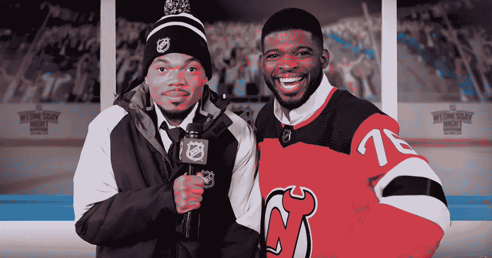

# NHL 玩家聊天机器人

> 原文：<https://medium.com/analytics-vidhya/nhl-player-chatbot-5c882e330fb7?source=collection_archive---------16----------------------->

*跟随* [*这个*](http://m.me/102447081166159) *链接与聊天机器人进行交互。训练代码和命令行 bot 可以在* [*这里*](https://github.com/danitamm/hockey-bot) *找到。为了最小化我的 Heroku 内存使用，部署代码保存在* [*这个*](https://github.com/danitamm/HockeyBotProduction) *单独的存储库中。*

图 1: Lazlo Holmes，又名 Chance 说唱歌手，采访新泽西魔鬼队球星 PK Subban。资料来源:NHL。

# 目标

我们想创建一个脸书聊天机器人，模仿采访 NHL 球员和教练的语音模式。这可以分为三个任务: