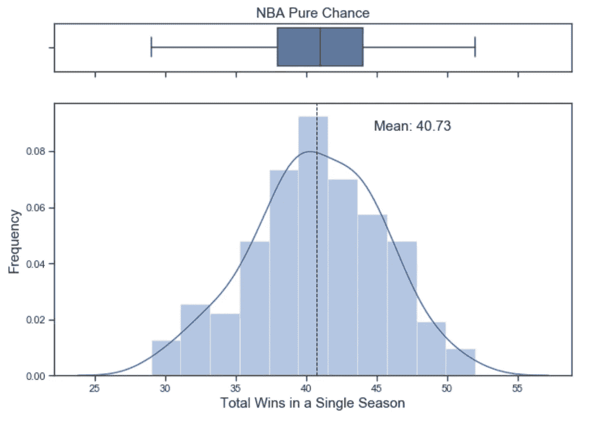
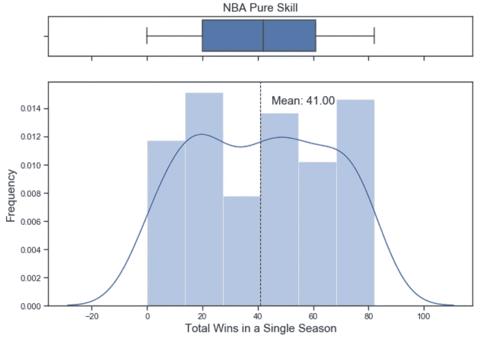
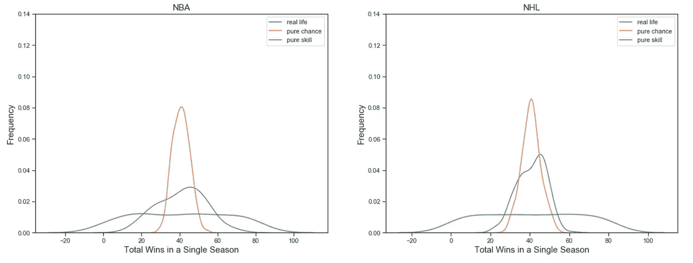
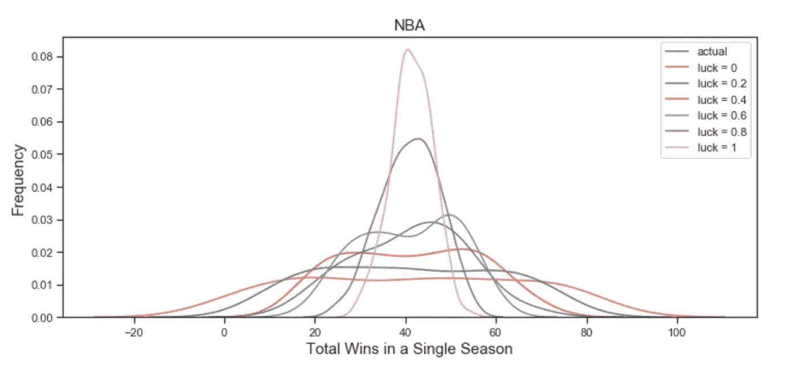
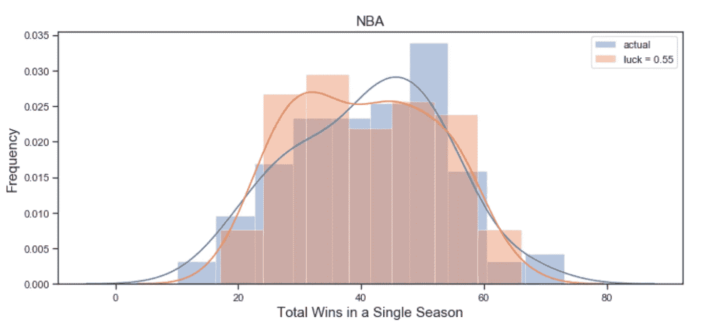
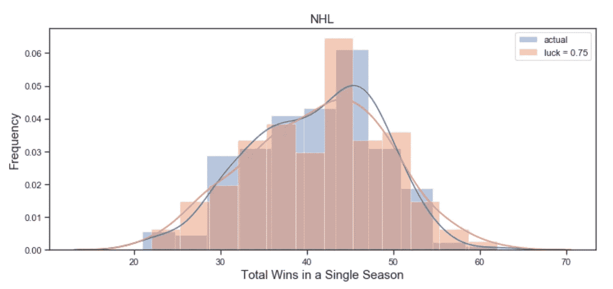
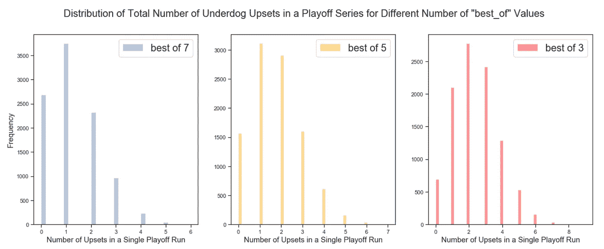
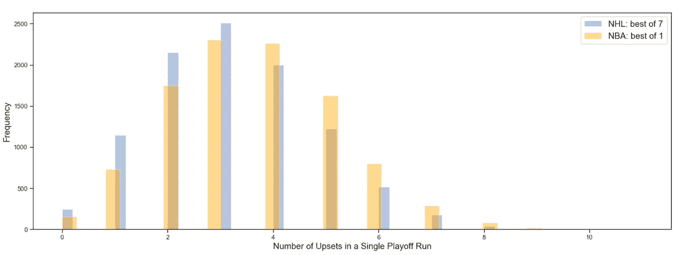

# NHL vs NBA:为什么弱队在曲棍球上表现更好？

> 原文：<https://medium.com/analytics-vidhya/nhl-vs-nba-why-do-underdogs-do-better-in-hockey-68e594946fad?source=collection_archive---------16----------------------->

作为这篇文章的引子，请看看这个[视频](https://www.youtube.com/watch?v=HNlgISa9Giw&t=6s)，它启发了我创作这篇文章！此外，代码可以在 [GitHub](https://github.com/Fmak95/NBA_vs_NHL/blob/master/nba_vs_nhl.ipynb) 上找到。

在过去的 30 年里，NBA 冠军已经成功卫冕 12 次，而同期 NHL 冠军只有 3 次。为什么会这样呢？为什么失败者在曲棍球上比在篮球上表现得更好？

如果你看过上面链接的 youtube 视频，你会知道原因是因为曲棍球是一项比篮球更依赖运气的运动。**但是，我们如何量化一项运动中运气和技巧的数量呢？**

要回答这个问题，让我们先假设篮球是一项纯粹碰运气的游戏。也就是说，在任何一场比赛中，任何一方都有均等的获胜机会，对半分。如果这种情况是真的，那么我们能指望一支球队在 82 场比赛中赢得多少场比赛呢？这个问题可以通过二项式概率分布来建模，使得赢得一场比赛的概率是 50%，并且次数是 82 次(一支球队在 NBA 和 NHL 赛季中参加的比赛总数)。下面的直方图显示了 5 个赛季数据的模拟结果(30 支球队 x 5 个赛季= 150 个数据点)。

如果比赛全靠运气，篮球赛季的样本分布。

现在我们对一项纯粹靠运气的运动的结果有了很好的认识。让我们反其道而行之，看看一项纯粹基于技能的运动的结果。也就是说，一个被认为比另一个更有技巧的团队将会 100%获胜。为了做到这一点，我们对 NBA 中的每支球队进行人为排名，并让他们根据从历史数据中提取的 NBA 官方赛程进行比赛。在这种情况下，我们希望总胜率的分布是均匀的。也就是说，同样数量的团队拥有 72-10 项记录，而团队拥有 10 - 72 项记录。我们再次模拟了 5 个季节的结果，并在下面给出了直方图。

一个篮球赛季的样本分布，如果比赛全是技巧的话。

从柱状图中，我们可以看到我们的预期有点偏差。战绩为 72-10 的球队数量与战绩为 10-72 的球队数量明显不同。这种差异是由于 NBA 赛季与赛季之间的赛程差异，因为每个赛季每个球队之间的比赛次数都不一样。然而，我们确实看到，总体结果比纯粹的概率模拟更平坦，在纯粹的概率模拟中，围绕 41 场比赛的平均值有一条钟形曲线。

真正的问题是 NBA/NHL 分布的真实数据与这些假设的数据相比如何？下面我们将展示所有三个场景重叠的结果图:纯运气，纯技巧和 NBA 和 NHL 数据的真实数据。为了清楚起见，我将从图中删除一些条，只是为了消除一些混乱，只显示概率分布估计。

NBA vs NHL 分布真实数据 vs 全技术 vs 全运气。

从上面的两个图表中，我们可以清楚地看到 NBA 和 NHL 数据之间的差异。NBA 的分布更平坦，看起来更倾向于纯技能分布，而 NHL 的数据则相反。换句话说，曲棍球是一项涉及更多运气的运动，因为实际数据的总体分布更类似于纯粹的概率模拟。与此同时，篮球则相反。

我们可以更进一步，通过运行另一个模拟来估计运气技能对每项运动的贡献。例如，让我们说篮球是一项由 40%的运气和 60%的技巧组成的运动，那么我们可以说，在 40%的时间里，一场比赛的获胜者可以通过抛硬币来决定，而在另外 60%的时间里，技巧更多的队获胜。我们用不同百分比的运气和技巧来模拟这个场景，结果如下。

在不同的运气-技能分解模拟中的 NBA 分布

看起来运气设置为 60%的图与真实数据的分布非常匹配。在更多的迭代之后，我确定了篮球比赛的最佳运气-技能分解是 55%运气和 45%技能。下面是结果图。

我通过执行 Kolmogorov-Smirnov 拟合优度测试验证了这是最佳分割，并获得了 0.89 的 **p 值。这意味着两个直方图有 89%的可能性来自相同的基础分布。**

对 NHL 数据进行了同样的分析，得出了 75%运气和 25%技能的优化运气-技能分解(T4 p 值为 0.70 )。你可以在下面看到模拟的结果。

**NBA 可以实施哪些最有效的改变来平衡比赛场地？**

这个问题的简短答案是:NBA 应该将他们的季后赛系列赛从 7 胜制改为 1 胜制。

为了更详细地回答这个问题，我模拟了一系列 NBA 季后赛赛季。每个季后赛赛季有 13 个系列赛，每个系列赛都以最佳形式决定。我认为当一个处于劣势的球队能够赢得一系列比赛并进入季后赛时，这是一件令人沮丧的事情。所以单个季后赛赛季，最多冷门 13 场。使用这种模拟格式和我们之前定义的篮球运气-技能 55%运气和 45%运气的分类，我在下面展示了一个季后赛赛季中冷门次数的直方图。

正如你所看到的，随着“最佳”数字的下降，平均值越来越向右倾斜。这表明，随着“最佳”系列中的数字下降，更多冷门的可能性增加。

为了理解在“最佳”系列中选择哪个数字来模拟 NHL 的结果，我们简单地比较两个直方图。结果显示，在每个季后赛赛季的冷门次数方面，NBA 的 1 胜制系列赛最接近 NHL 的 7 胜制系列赛。

总之，我证明了 NHL 失败者比 NBA 失败者做得更好的原因是因为曲棍球比篮球更幸运。一项深入的统计分析表明，曲棍球的运气与技能的比例为 75%至 25%，而篮球的运气与技能的比例为 55%至 45%。为了让 NBA 弱队有一个公平的竞争环境，我建议 NBA 将他们的 7 胜制季后赛系列赛改为 1 胜制，类似于 NFL 的做法。

# 参考

布莱恩·伯克的《运气和 NFL 结果》

[NHL 数据集](https://www.kaggle.com/martinellis/nhl-game-data)

[NBA 数据集](https://www.kaggle.com/pablote/nba-enhanced-stats)