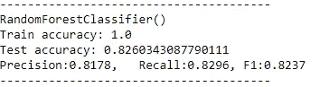
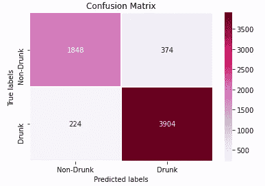
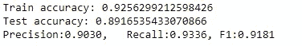

# NHTSA 死亡分析(装袋、助推、投票)分类模型

> 原文：<https://medium.com/analytics-vidhya/nhtsa-fatality-analysis-bagging-boosting-voting-classification-models-577775524045?source=collection_archive---------21----------------------->

[https://www.nhtsa.gov/equipment/takata-recall-spotlight](https://www.nhtsa.gov/equipment/takata-recall-spotlight)

在统计中，分类是根据包含类别成员已知的观察值的训练数据集，识别一个新观察值属于哪一组类别的问题。[维基](https://en.wikipedia.org/wiki/Statistical_classification)。
数据科学家的工作是确定用于训练模型的正确特征，选择最适合数据的正确模型，最后根据最重要的指标得出结论。

# 关于项目:

这是我通过美国国家公路交通安全管理局[**【NHTSA】**](https://www.nhtsa.gov/)**提供的关于 2018 年发生的死亡事故的数据做的一个研究，用来预测醉酒司机卷入车祸的可能性。
这个项目最重要的目标之一是使用亚马逊 Web 服务 **(AWS)** 构建模型，运行 Jupyter 笔记本，并将 PostgreSQL 数据库存储在一个弹性计算云 **(EC2)** 实例*(阅读我之前的* [***博客***](/analytics-vidhya/configure-amazon-ec2-to-run-postgresql-anaconda-and-jupyter-notebook-eefc0785a71f) *)。*
从简单的探索性数据分析开始 **(EDA)** 去扔标签编码，数据清理，用过采样的方法用不平衡的目标列拨号，最后，寻找完美的模型。**

# **循序渐进:**

## **1-从寻找比 Kaggle 更好的数据源开始:**

**如果我只依赖 Kaggle 的数据集，我会留下一些可以追溯到(2015 年)的旧数据。
在做了一些研究后，我找到了 NHTSA 数据的真正来源，并获得了更近的数据(2018 年)，由于数据本身不够，我不得不在同一网站上寻找其文档 **BAAM** (已完成)。**

****

## **2-将数据加载到 PostgreSQL 并创建关联视图:**

****

**在对数据进行总体概述后，根据右图，我决定从 27 个可用表中选择 3 个**(事故、车辆、人员)**由于有了数据文档，我能够确定哪些功能易于使用。
由于表之间存在(一对多)的关系，我需要找到一种方法将特性聚集到一行中，以适应模型。
我必须删除不可聚合的功能。人员表中没有可聚合的特征，但我计算了每辆车中男性和女性的数量。从车辆表中，我决定用合适的聚合方法获取图片中显示的特征。最后创建连接视图。**

## **3-探索性数据分析(EDA):**

*   *****探索目标变量:***
    在查看目标变量后，我发现它包含值 **(0，1，2，3，4)** ，该值表示涉及的醉酒人数，因此，如果我想将此列用作目标变量，我必须映射大于一对一的值**(不平衡哈)。****

****

*   *****以月份为单位探究事故:*** 因饮酒事件而发生的事故数量正在向夏季上升，这可以合理得多**(通宵派对)。****

****

*   *****使用地理地图探索事故:*** 查看左边的图表，您可以看到新年当天**美国**各州的事故地点分布，而右边的照片描述了 2018 年各州的事故数量**(得克萨斯州和佛罗里达州的事故数量最多)**。**

********

## **4-不平衡标签取样方法:**

*   *****训练不变:*** 首先我试图寻找一个最好的模型，它可以在不使用任何类别不平衡方法的情况下给我最好的结果(**随机森林分类器是赢家)。** 经过交叉验证，我得到的准确率是:0.78**

************

*   *****训练用随机结束采样器:*****

********

*   *****用 SMOTE 训练:*****

********

*   *****用 ADASYN 训练:*****

********

*   *****用 SMOTETOMEK 训练:*****

********

*   *****用 SMOTEENN:*** 训练**

********

## **5-使用投票的培训:**

**我使用了之前最成功的 5 个模型:**

1.  **随机森林分类器。**
2.  **GradientBoostingClassifier。**
3.  **AdaBoostClassifier。**
4.  **XGBClassifier。**
5.  **树外分类器。**

**权重=[5，4，3，2，1]**

********

# **最终结果:**

**在比较了使用不同过采样方法的随机森林分类器的交叉验证结果后，我注意到 **SMOTEENN** 方法是最适合我的方法！！！**

****

# **在以下位置找到我:**

**https://www.linkedin.com/in/yamenshaban/
**GitHub:**[https://github.com/yamenkaba](https://github.com/yamenkaba)**