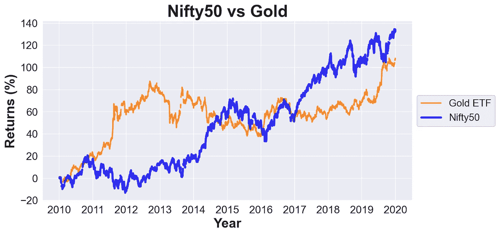

# 过去十年(2010–2019)的 NIFTY 历史分析

> 原文：<https://medium.com/analytics-vidhya/nifty-in-the-last-decade-2010-2019-historical-analysis-9d681e6e0b21?source=collection_archive---------2----------------------->


# 目录

1.  **简介**
2.  **Nifty50 性能**
3.  **俏皮的大盘指数表现**
4.  **漂亮的基于市值的指数表现**
5.  **俏皮的板块指数表现**
6.  **Nifty50 vs Sensex**
7.  **Nifty50 vs 世界主要股指**
8.  **Nifty50 vs 黄金**
9.  **Nifty50 vs Nifty50 TRI(总回报指数)**

# 1.介绍

***俏皮*** 是印度一家很受欢迎的证券交易所——国家证券交易所(NSE)推出的市场指数。

它是两个词的组合——***国家*** 和 ***五十***

*NIFTY 50 是一个基于基准的指数，也是 NSE 的旗舰，它跟踪根据自由流通市值选择的 50 家大型公司的表现。*

# *2.Nifty50 性能*

```
****Nifty50*** delivered the return CAGR of 8.81% in the last decade.It returned the most in the year 2014 (31.39%) aided by the Narendra Modi government's majority win in the Lok Sabha elections.It delivered negative returns in only two years.
2011 (-24.62%) due to high inflation, interest rate hike, rupee depreciation, and slowing economic growth.
2015 (-4.06%) due to poor corporate earnings and the Bharatiya Janata Party's loss in Delhi and Bihar state elections.*
```

******

# *3.**俏皮的大盘指数表现***

```
****Nifty Next 50*** outperformed other broad market indexes in the last decade though lost momentum in the last two years.*
```

****

# *4.**漂亮的市值型指数表现***

```
****Nifty100*** delivered slightly better returns than ***Nifty Midcap 100***, while the ***Nifty Smallcap 100*** underperformed with just 5.11% return CAGR though there had been a few times where ***Nifty SmallCap 100*** outperformed ***Nifty100.****
```

****

# ***5。漂亮的部门指数表现***

```
****FMCG***, ***Financial*** ***Services***, ***IT,*** and ***Auto*** were the major sectors that drove the rally in the last decade.The consistent ***FMCG*** sector delivered the highest return CAGR of 15.24%.***Auto*** sector lost momentum in the last two years that led to a sobering of performance.***Pharma*** sector was a star performer in the first half of the decade but after that lost momentum.***Realty*** sector delivered a negative return CAGR of -5.25%.*
```

****

# ***6。Nifty50 vs Sensex***

```
*Both Indian benchmark indices delivered similar returns in the last decade.*
```

****

# ***7。Nifty50 vs 世界主要股指***

```
****Nifty50*** delivered the second highest return CAGR in local currency among key world indexes in the last decade.
***Nasdaq*** (tech-dominant*)* delivered a double digit return CAGR of 14.54%.*
```

****

# ***8。Nifty50 vs 黄金***

```
****Nifty50*** delivered better returns than ***Gold*** in the last decade.*
```

****

# *9.Nifty50 与 Nifty50 TRI(总回报指数)*

```
****Nifty50 TRI*** (Nifty50 + dividends reinvested) delivered a double digit return CAGR in the last decade.*
```

****

# *Github 回购*

*[](https://github.com/SinghalHarsh/Nifty-in-the-last-decade) [## 过去十年中最时髦的

### 在 GitHub 上创建一个帐户，为 SinghalHarsh/Nifty 在过去十年中的发展做出贡献。

github.com](https://github.com/SinghalHarsh/Nifty-in-the-last-decade)* 

# *NIFTY50，NIFTY Midcap50，NIFTY Smallcap50 公司的历史回报率*

*[](/@harshsinghal726/nifty50-stocks-performance-in-the-last-decade-2010-2019-e25097245c36) [## NIFTY50，NIFTY Midcap50，NIFTY Smallcap50 公司的历史回报率

### Bajaj 金融:CAGR 十年回报率 62.3%！

medium.com](/@harshsinghal726/nifty50-stocks-performance-in-the-last-decade-2010-2019-e25097245c36)* 

# *感谢阅读这篇文章！如果你有任何问题，欢迎在下面留言。*