# 聊天机器人的自然语言处理和自然语言理解工具

> 原文：<https://medium.com/analytics-vidhya/nlp-and-nlu-tools-for-chatbots-f413895c16ba?source=collection_archive---------22----------------------->

可用于话语/用户消息添加的 NLP 和 NLU 工具很少:

1.  AWS Lex
2.  谷歌对话流
3.  微软路易斯
4.  Servicenow 内置 nlu 模型
5.  RASA nlu
6.  IBM 沃森

在本文中，让我来描述如何使用它们，以及如何编写后端函数来获得使用这些工具创建的意图的 bot 响应。

对于基于语音的聊天机器人开发，可以使用以下内容。

1.  AWS Alexa
2.  GoogleHome(对话流)

# **AWS Lex**

要使用任何 AWS 服务，您需要创建一个 AWS 帐户。(因此，我希望您创建一个 AWS 帐户，作为此操作的先决条件)

1.  使用以下链接登录您的 AWS 账户:【https://aws.amazon.com/console/ 
2.  在显示的服务中选择 Amazon Lex。

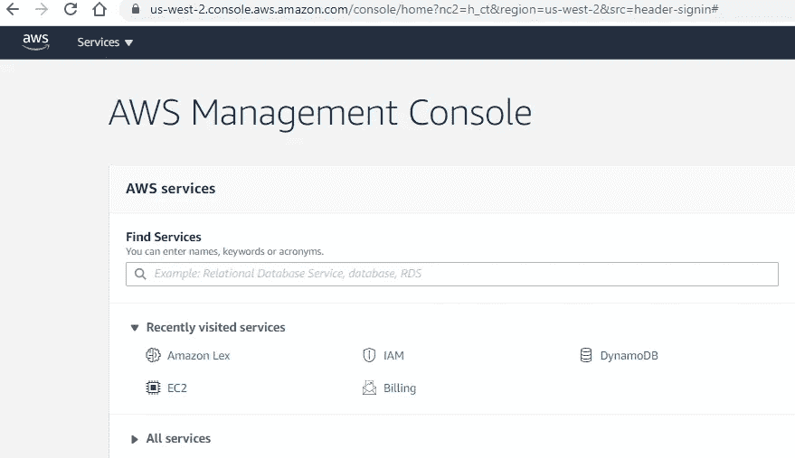

3.选择自定义机器人。

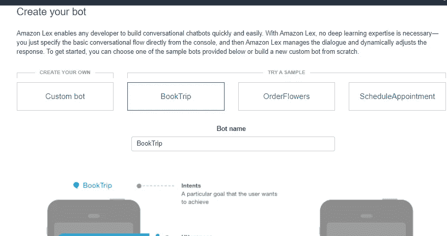

4.填写所有的基本细节来创建你的机器人。

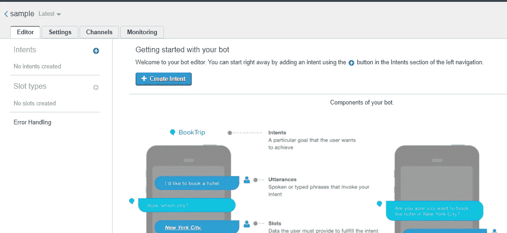

5.现在到了创建意图的有趣部分，它基本上是用户可能说的话的分离。

意图创建取决于机器人的主题，例如，如果你有一个关于如何浏览网站或产品的基本 FAQ 机器人，那么用户可能会直接问这个产品是什么。人们可以训练相似的话语，用户可能不会问确切的问题，但因为它经过训练，它会将话语映射到最接近的意图。

例如，我将在 lex 中创建一个机器人来使用 medium 网站，即如何创建一个故事，如何将其货币化，以及成为会员，我将添加一些小对话，以获得用户友好的体验。

*记住 lex 中的意图或表述不能包含特殊字符或数字。如果你必须在发音中添加一个数字，你可以使用内置的插槽。*

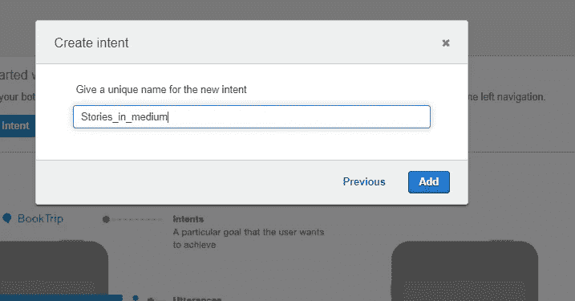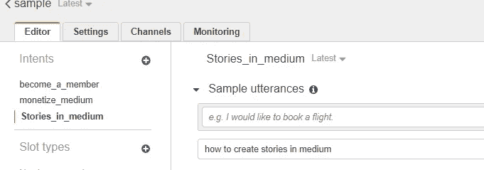

6.如上所示，我已经创建了 3 个意图，保存、构建和发布了相同的意图。

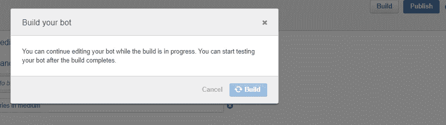

7.要让单词的同义词工作，双击单词，创建一个自定义槽。

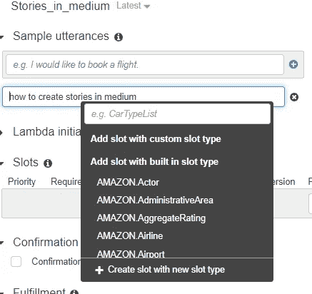

8.补充类似的话。

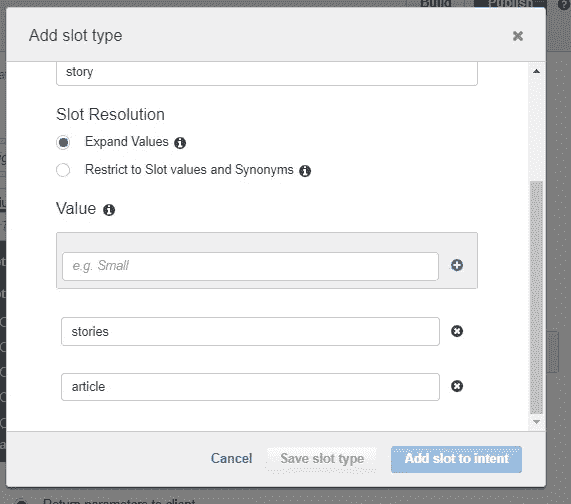

或者您可以添加一个内置插槽，如下所示。

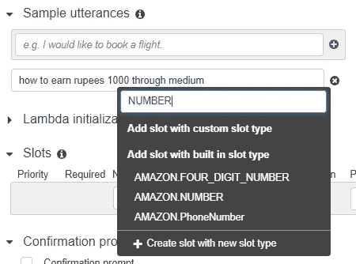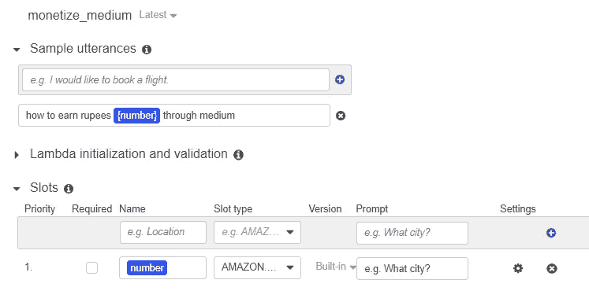

9.现在，我在 lex 响应中硬编码响应，您可以在下面找到它。而是为了有效的响应(在新页面中打开链接，或者使用传送带、表单或数据库操作)。您需要创建一个 lambda 函数(nodejs)并在 AWS 中部署，或者使用 nodejs 创建一个端到端框架(通过在 IAM 中生成 AWS lex 秘密密钥)，它使用 lexApi 并在创建的通道适配器中配置 bot 响应。
如果一个网页被用作一个通道，那么它的前端可以使用 Angular 创建。这个相同的 NLP 可以用于不同的信道，如脸书、Slack 等。

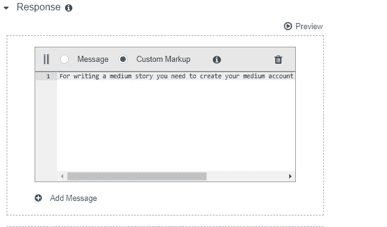

10.您可以在 lex 中的测试机器人中进行同样的测试。

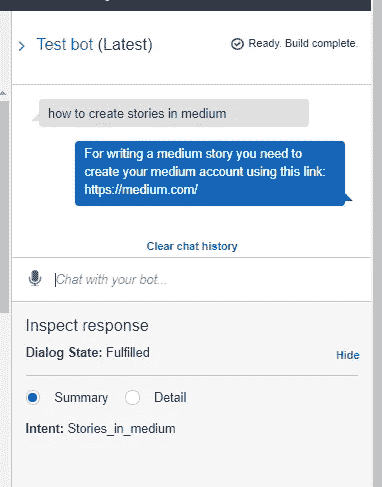

在 lex 中可以添加的 intents 和 slots 的总数是有限制的。因此，在设计 nlp 时，我们需要记住这一点。

我将在下一篇文章中讨论 Google dialogflow。