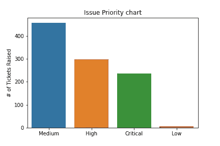
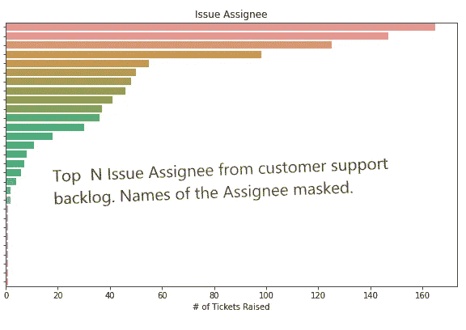
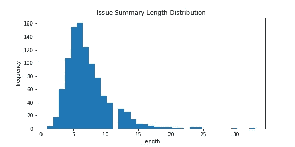
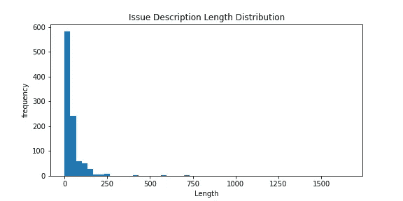
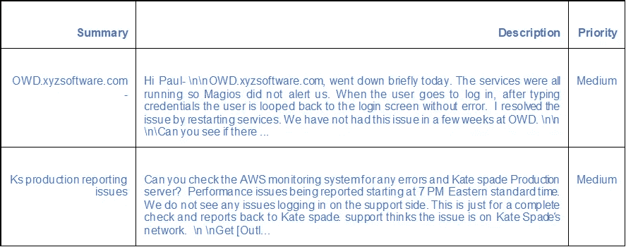

# 自然语言处理在支持呼叫中心中的应用

> 原文：<https://medium.com/analytics-vidhya/nlp-application-in-support-call-centers-b97d14e3ce21?source=collection_archive---------11----------------------->

**简介:**本文是我之前关于在支持环境中使用机器学习的文章的延续，我分享了我的观点，即如何使用简单的 python 代码来丰富我们自己的组织或客户组织中的呼叫中心/支持部门活动。在那篇文章中，我分享了一个见解，即我们可以如何使用 ML 来改变当前的环境，在解决客户呼叫方面提供更好的服务时间，并避免同一客户的多个用户重复提出略有不同的相同票据，从而增加票据积压计数。Python 字典用于创建非常有用的历史支持解决日志，这对于 L1/L2(级别 1、级别 2)的人员来说非常方便，他们经常处于救火模式，并确保 SLA 没有被违反，升级不会流向下一个级别。你可以在这里参考我之前的博客[*https://www . analyticsvidhya . com/blog/2020/10/genesize-support-logs-using-simple-python-commands/"*](https://www.analyticsvidhya.com/blog/2020/10/modernize-support-logs-using-simple-python-commands/%E2%80%9D)

通常可以看到，支持人员花费了大量的时间来解决过去发生的问题，因为不同的工程师 24x7 在呼叫中心工作，他们可能不知道已经存在解决方案，或者需要一些时间从吉拉/赛贝尔等工具中提取解决方案。此外，如果我们能够自动确定票证优先级，将会减少当前创建票证优先级的停机时间，并改进整个流程。

在这篇博客中，我将分享更多关于我们如何在我们组织的支持活动中使用机器学习概念的想法，这将有助于支持人员，也将改善整体流程，与以前相比，将有明显的变化。本博客分为以下 3 个部分/主题:

**Section1:** *票证的性质/重要性:*在任何受支持的环境中，了解我们从生产环境中获得的票证的类型及其原因非常重要。在这里，我分享了一些简单但非常有效的分析报告，这些报告可以通过 python 中的简单命令获得。

**第二节:** *支持票的优先权。*通常，优先级别设定为 P1、P2、P3、P4，P2 P1 需要立即处理，因为这会影响业务运营。P3、P4 是需要在指定时间内修复的软件错误，尽管它们不影响运营，因此支持人员会有一些时间，比如典型的 P3 电话需要 2-3 天，P4 电话需要 1 周。在这一部分中，我已经分享了我们如何使用 ML 来自动化来自过去历史语料库的任何支持票据的优先级，并且还将时间从 15-30 分钟(如果使用任何工具，如吉拉等)减少到 2-3 分钟(通过在工程师可以开始票据分析之前使用 ML 来自动化)。

**第 3 部分:** *从语料库中识别相似的票据:*相同的票据是从多个客户处筹集的吗？这是非常可能的，因为有多个客户在使用我们的产品。在这一部分中，我将告诉您我们如何从历史语料库中检查最相似的票据，这将有助于在旧票据中已经存在解决方案的情况下提供快速解决时间，并且不需要重复分析。即使机票不一样，但非常相似，工程师会在飞行中得到如何进行分析的想法，并节省一些时间。那么，现在让我们进入正题

***主题 1:少量有用但简单的分析/统计报告***

上面的图表可以用简单的 python 命令生成，但是非常有用。它按优先级描述了当前的支持积压(仅来自所有 P3 和 P4 的支持)。然后

这一项说明了分配给谁的问题以及每个工程师下的未解决问题的数量。同样还可以拿出一些图表(***Issue _ Resolution _ category***:{软件 bug:(99)，用户错误:20，性能:15，不可复制性:4……)。}、 ***软件问题*** : {Java Servlets : (55)、环境(11)、日志增长:(3)…..}等。

***话题二:自动票证优先排序***

**数据集快照**

数据.列

索引(['摘要'，'问题关键字'，'问题 id '，'问题类型'，'状态'，

项目关键字'，'项目名称'，'项目类型'，'项目领导'，

项目描述'，'描述'，'优先级'，

…

'注释 1 '，'注释 2 '，'注释 3']，dtype= '对象'，长度=341)

我将在本文中使用的列是“概要”、“描述”和“优先级”列。让我们首先检查摘要和描述的分布。

从上面可以看出，大多数摘要的长度为 4-8 个字，描述的长度在 50-65 个字之间。

我有一票过去历史资料的文集。利用这一点，我们将解决预测优先级的多类分类问题。在本文中，这个博客的重点更多的是应用程序，而不是实际的概念本身。然而，我将强调所有的关键领域，并触及围绕它的概念。我将展示 *TfidfVectorizer* ，但对于可部署版本，我们需要使模型更加健壮，并尝试不同的预训练模型，如 *W2Vec* 或 *Glove*

数据.形状

(1000, 341)

df =数据[['概要'，'描述'，'优先级']]

数据框中的样本行

***创建 X，y 为模型:***

一旦我们完成了所有的预处理步骤(即，估算缺失值，如果有的话，并使用 NLTK 或 Spacy 清理数据)，我们将有 2 个额外的列被创建为 Summary clean 和 description clean。现在，在数据框中创建一个较新的列，因为“Tickets”将是如下摘要和描述的合并

df['票证'] = df['干净 _ 摘要'] + ' ' + df ['干净描述']

对目标进行标签编码(在本例中为优先级列值)

le = LabelEncoder()

df[' Priority ']= le . fit _ transform(df[' Priority ']。价值观)

下面是使用 TfidfVectorizer 的 ML 模型的代码片段

….

从 sklearn .预处理导入 LabelEncoder

从 sk learn . feature _ extraction . text 导入计数矢量器、tfidf 矢量器

tf = TfidfVectorizer(min_df=5，max_df=0.9) #删除不太频繁或太频繁的术语

tf.fit(df['Ticket']。价值观)

TD _ vec = TF . transform(df[' Ticket ']。价值观)

….

target = np.array(df。优先级)

从 sklearn.model_selection 导入训练 _ 测试 _ 拆分

X_train，X_val，y_train，y _ val =
train _ test _ split(TD _ vec，target，test_size=0.25，
random_state=42，shuffle=True)

((750, 1064), (250, 1064))

…..

**最终模型**

从 sklearn 导入朴素贝叶斯

来自 sklearn.linear_model 导入逻辑回归

来自 sklearn.metrics 导入准确度 _ 分数

***#朴素贝叶斯模型***

模型=朴素贝叶斯。多项式 b()

model.fit(X_train，y_train)

nbp =模型.预测(X_val)

准确度分数(y 值，nbp)

***0.556***

***#逻辑回归模型***

model = LogisticRegression()

model.fit(X_train，y_train)

nbp =模型.预测(X_val)

准确度分数(y 值，nbp)

***0.58***

那么，如何进一步提高准确率呢？有相当多的技术我们可以尝试。我将在本文中强调第一点。

1.  *文本数据扩充*
2.  *创建新的重量特征。(高优先级问题将比中优先级问题具有更大的权重，等等)*
3.  *上采样以平衡目标类*

***文本数据增强***

在这里，我们只是随机打乱每个句子中的标记来创建一个新的。请记住，上下文可能会改变，因此我们需要为正在创建的新记录找到一些最佳值。因为在我的案例中，平均票据描述长度在 50-65 个令牌之间，所以我从每个原始问题语料库中创建了 5 个新问题。(1000 -> 5000).下面的代码片段

#简单文本增强

从 nltk 导入 word_tokenize

nltk.download('punkt ')

随机导入

def augment(句子，t 值，n):

new_sentences = []

target = []

words = word_tokenize(句子)

对于范围内的 I(n):

随机播放(单词)

new_sentences.append(')。加入(单词))

目标.追加(值)

new _ sentences = list(set(new _ sentences))

返回新句子，目标

文本数据增强后，模型精度提高如下

#朴素贝叶斯模型

***0.81***

#逻辑回归模型

***0.93***

pred = model.predict(X_val)

强的松

数组([0，3，0，…，3，0，0])

逆变换

数组(['临界'，'中'，'临界'，…，'中'，'临界'，

关键']，dtype =对象)

最后，我们可以尝试更多的模型，如 Random forest、XGBoost、LightGBM 等，并将结果与其他模型进行比较。

现在到这个博客的最后一部分

***话题 3:从票据语料库中找出最相同的问题***

这有助于在开始任何票据的*根本原因分析*之前提前了解是否有任何类似的票据报告，如果有，为该票据提供的解决方案是什么。考虑以下两种票证描述。

**‘系统中输入的最后一个密码未被验证’，**

**“系统中输入的最后一个滚动编号未被验证”**

以上两者看起来非常相似，最有可能的解决方案也非常相似。

让我们看看如何使用 NLP 来检测这些类型的相似性。

我将使用 gensim Doc2Vec 进行演示，它基本上是 W2Vec 的扩展，但在这里，我们可以进行段落嵌入，而不是矢量化记号。但是我会用这个来做句子对比。首先，我们需要创建一个过去的票据语料库(参考我以前的博客文章'*使用简单的 Python 命令现代化支持日志')*。下面的代码片段

*Ticket = PD . read _ CSV(file path '，encoding = ' ISO-8859–1 ')*

islst = ticketlist['Issue']。to_list() #旧票大全列表

*def _MSS(most_similar): #函数从语料库中输出最相似的票据*

*对于标签，索引在[('MOST '，0)]:*

*print(u'%s %s: %s\n' % (label，most_similar[index][1]，data[int(most _ similar[index][0])))*

*tagged data =[tagged document(words = word _ tokenize(_ d . lower())，tags=[str(i)]，for i，_d in enumerate(islst)]*

*max_epochs = 2000 #超参数。我们可以试验这些，直到我们得到最佳输出*

*vec_size = 100 #嵌入尺寸*

*alpha = 0.025 # lr——初始学习率*

*model = Doc2Vec(size=vec_size，alpha=alpha，min_alpha=0.00025，min_count=1，dm =1) #* 分布式内存'(PV-DM)代替*分布式字包* (PV-DBOW)

*model . build _ vocab(tagged _ data)*

*对于范围内的历元(max_epochs): #训练模型*

*打印('迭代{0} ')。格式(纪元))*

*模型.列车(tagged_data，*

*total _ examples = model . corpus _ count，*

*纪元=模型. iter)*

*#降低学习率*

*型号α-= 0.00001*

*#固定学习率，不衰减*

*model . min _ alpha = model . alpha*

*型号。保存(" d2v.model")*

*model = doc 2 vec . load(" d2v . model ")*

***test _ data = word _ token ize('系统中最后一个查伦号不正确'。lower())*** *#用新票号测试车型*

*v1 =模型.推断 _ 向量(测试 _ 数据)*

*_MSS(similar_doc) # finally #打印语料库中最相似的句子以及概率得分*

***MOST 0.32075077295303345:系统中输入的最后一个卷号没有被验证***

*几更验证*

***test _ data = word _ token ize('捕捉 PAN/GIR 的增值税字段应为 16 位数字'。*下级())**

***MOST 0.6367178559303284:在征税的销售税方案中，用于获取 PAN/GIR no /Reg 详细信息的字段。没有吗？其他人只能输入 14 位数字。而空间需要增加到 16 位。***

***test _ data = word _ token ize(‘如果交易维护中的认购已收栏不是 SB 账号，则应为有效账号’。*** 降低())

***MOST 0.7423350214958191:在 DA 主维护中，系统允许我们定义 DA %age 小于 100%。如果指定的 DA %age 大于 100，则会出现消息:DA 百分比应小于 100。提供根据适用费率定义 DA %年龄的规定，该比率可能大于 100。***

在从历史记录中识别出*最相似的票据后，*支持人员可以轻松地从解决日志字典中获得为该票据提供的解决方案。

暂时就这样了。

谢谢