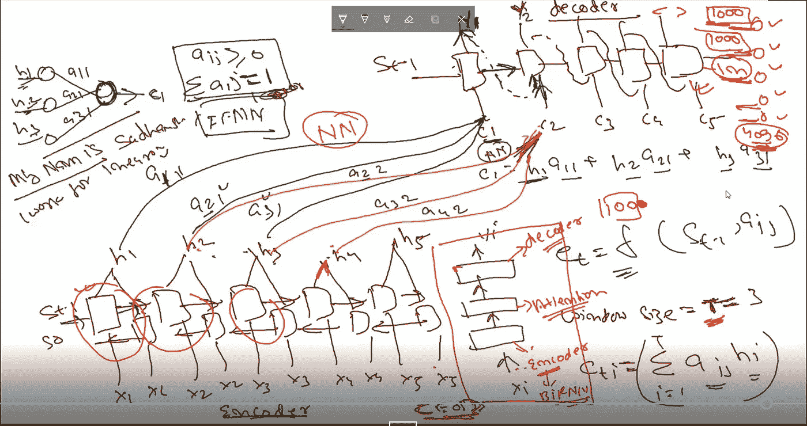
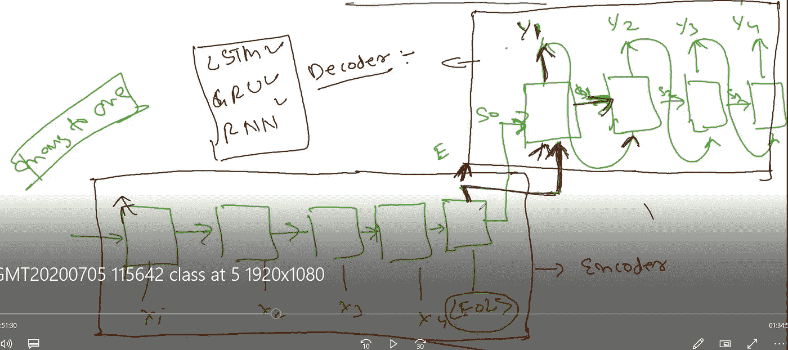
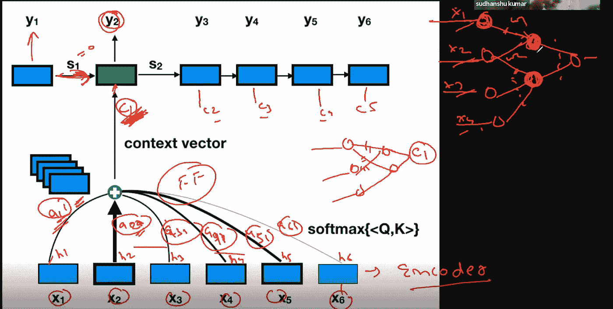
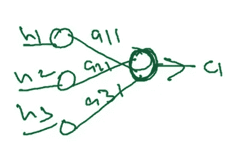
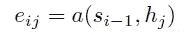
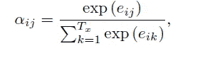
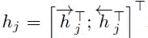
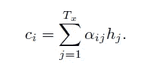
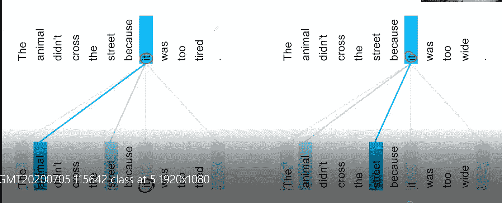
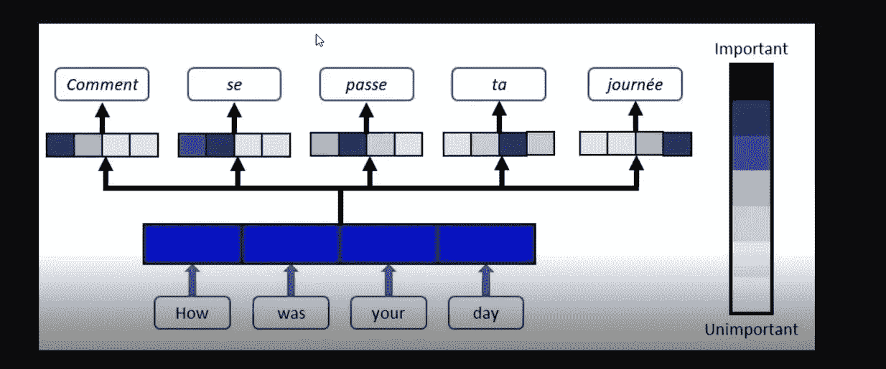

# NLP 系列:编码器-解码器模型和注意模型

> 原文：<https://medium.com/analytics-vidhya/nlp-attention-model-8127639ce37d?source=collection_archive---------18----------------------->

在这篇文章中，我将解释注意力模型。为了理解注意力模型，需要有 RNN 和 LSTM 的先验知识。对于 RNN 和 LSTM，你可以参考克里斯·纳伊克的 youtube [视频](https://www.youtube.com/watch?v=rdkIOM78ZPk)，克里斯托·奥拉[博客](https://colah.github.io/posts/2015-08-Understanding-LSTMs/)，以及苏丹书[讲座](https://www.youtube.com/watch?v=yPpfxFTh0XQ&feature=youtu.be)。

**CNN 在文本分析中的问题:**

CNN 模型用于解决与视觉相关的用例，但未能解决，因为它无法记住特定文本序列中提供的上下文。它不能记住数据的顺序结构，即每个单词都依赖于前一个单词或句子。RNN、LSTM、编码器-解码器和注意力模型有助于解决这个问题。RNN、LSTM 和编码器-解码器仍然苦于**记住大句子的顺序结构**的上下文，从而导致不良的准确性。

为了理解注意力模型，需要理解编码器-解码器模型，这是最初的构建块。

**编解码器型号**

图片取自 Sudhanshu 关于编码器-解码器模型的讲座

编码器-解码器模型在时间尺度上由输入层和输出层组成。

**编码器:**输入被提供给编码器层，在每个单元上没有立即输出，当到达句子/段落的结尾时，将给出输出。每个单元有两个输入:来自前一个单元的输出和当前输入。编码器中单元可以是多对一神经序列模型的 RNN、LSTM、GRU 或双向 LSTM 网络。目前，我们已经采用了单变量类型，可以是 RNN/LSTM/格鲁。在基本上是神经网络的编码器网络中，它将试图通过提供的输入和反向传播来学习权重。一旦学习了权重，隐藏层的组合嵌入向量/组合权重作为编码器的输出给出。

**解码器:**编码器的输出给解码器的输入(图中表示为 E)，解码器中第一个单元的初始输入是编码器的隐藏状态输出(图中表示为 So)。随后，解码器网络中每个单元的输出作为输入提供给下一个单元以及前一个单元的隐藏状态。解码器中的每个单元都产生输出，直到遇到句子的结尾。编码器中的单元可以是多对一神经序列模型的 LSTM、GRU 或双向 LSTM 网络。目前，我们已经采取了单变量类型，可以是 RNN/LSTM/格鲁

**优势:**

1.  不像在 LSTM，在编码器-解码器模型能够消费整个句子或段落作为输入。

**缺点:**

1.  大/复杂句子的问题:当我们在解码器网络中进行前向传播时，从编码器接收的组合嵌入向量的有效性逐渐消失。正如我们看到的，解码器单元的输出被传递到下一个单元。在长句的情况下，嵌入向量的有效性丧失，从而在输出中产生较低的准确性，尽管它比双向 LSTM 好。

**解决方案:**针对编解码模型所面临问题的解决方案是**注意力模型**。

**注意力模型:**

图片取自 Sudhanshu 关于基于注意力模型的讲座

注意力模型是来自深度学习 NLP 的构建块。高级模型基于相同的概念。

对于大句子，以前的模型不足以预测大句子。这就是为什么不考虑整个长句，而是考虑句子中被称为注意的部分，这样句子的上下文就不会丢失。

我们如何实现这一点？如前面在编码器-解码器模型中提到的，隐藏层的组合嵌入向量/组合权重的整个输出被作为解码器的输入。对于基于注意的机制，考虑句子/段落中的位或部分来集中或集中句子的部分，这样可以提高准确率。

编码器中的单元可以是多对一神经序列模型的 LSTM、GRU 或双向 LSTM 网络。目前，我们已经采用了双变量类型，可以是 RNN/LSTM/格鲁。双向 LSTM 将在两个方向上学习重量，向前和向后，这将提供更好的准确性。

参考上图，基于注意力的模型包括 3 个模块:

1.  编码器
2.  解码器
3.  注意力

**编码器:**e noder si 双向 LSTM 中的所有单元。存在向前连接的 LSTM 序列和向后连接的 LSTM 层序列。LSTM 中每个单元的输入在向前和向后方向上被馈入输入 X1、X2 …..Xn。来自 LSTM 中每个小区的前向和后向输出被组合以产生某种输出 h1、h2 …...网络中 RNN/LSTM 小区的数量是可配置的。如果网络的大小是 1000，并且提供了 100 个字，那么在 100 个字之后，它将遇到行尾，并且剩余的 900 个单元将不会被使用。

**注意模式:**编码器 h1，h2…hn 的输出通过**注意单元**传递到解码器的第一输入端。有可能这个句子的长度是 5，有时是 10。让我们考虑在解码器的第一个单元输入中从编码器取得三个隐藏输入。

隐藏层的多个输出通过前馈神经网络来创建上下文向量 Ct，并且该上下文向量 Ci 被馈送到解码器作为输入，而不是整个嵌入向量。

a11、a21、a31 是具有来自编码器的输出和到解码器的输入的前馈网络的权重。

在上图中，h1、h2…hn 是神经网络的输入，a11，a21，a31 是隐单元的权重，它们是可训练的参数。Ci 上下文向量是注意力单元的输出。

a11 权重指的是编码器的第一个隐藏单元和解码器的第一个输入。类似地，a21 权重指的是编码器的第二隐藏单元和解码器的第一输入。此外，使用具有大量输入和权重的前馈神经网络，我们可以发现哪一个在上下文向量创建中贡献更大。

窗口大小(称为 T)取决于句子/段落的类型。这是超参数，随不同类型的句子/段落而变化。50 的窗口大小给出了更好的蓝色比例。

**eij** 是由函数 **a** 描述的前馈神经网络的输出分数，其试图捕捉在 **j** 处的输入和在 I 处的输出之间的对准。这是主要的注意力函数。对于编码器网络，类似地，对于解码器，输入 Si-1 是 0。hj 是通过前馈神经网络学习的。表示它是一个前馈网络。

aij:为 aij 定义了两个条件:

1.  aij 应该总是大于零，这表示 aij 应该总是具有正值。这是因为在反向传播中，我们应该能够通过乘法来学习权重。负权重将导致消失梯度问题。
2.  所有权重的总和应该是 1，以具有更好的正则化。这就是 Softmax 函数。这是窗户的尺寸，这里是 3。

a11、a21、a31 是具有来自编码器的输出和到解码器的输入的前馈网络的权重。将进入第一上下文向量 Ci 的输入是 h1 * a11 + h2 * a21 + h3 * a31。类似地，第二上下文向量是 h1 * a12 + h2 * a22 + h3 * a32。

在**注意**单元中，我们引入了编码器-解码器模型中不存在的**前馈网络**。隐藏输出将学习并产生上下文向量，而不依赖于双 LSTM 输出。

所有的矢量 h1、h2..等。，在他们的工作中使用的基本上是编码器中的前向和后向隐藏状态的串联。简单来说，所有的向量 h1，h2，h3…，hTx 是输入句子中 Tx 个单词的表示。

权重也由前馈神经网络学习，并且使用注释的加权和来生成输出单词 yi 的上下文向量 ci:

**解码器:**每个解码器单元有一个输出 y1，y2…yn，每个输出在此之前被传递给 softmax 函数。第一个单元的输出被传递到下一个输入单元，并且通过关注单元创建的相关/单独的上下文向量也被作为输入传递。注意:每个单元都有一个独立的上下文向量和独立的前馈神经网络。

在上面的图片中，模型将尝试学习它所关注的单词。“它”是两只相依的动物和街道。在后学习中，**街**被赋予了很高的权重。

**注意力模型的例子:**

语言翻译:

结论:神经网络在训练过程中减少和增加特征的权重，同样注意模型在训练过程中考虑输入词。

我要感谢 Sudhanshu 揭示了注意力机制这个复杂的话题，我在文章中也提到了很多。