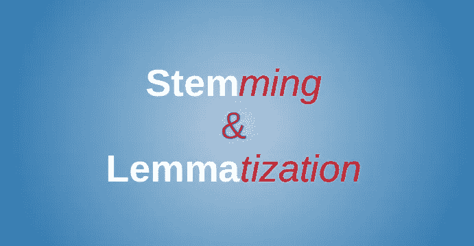

# NLP 要点:在 Python 中使用 NLTK 和 spaCy 删除停用词和执行文本规范化

> 原文：<https://medium.com/analytics-vidhya/nlp-essentials-removing-stopwords-and-performing-text-normalization-using-nltk-and-spacy-in-python-2c4024d2e343?source=collection_archive---------7----------------------->

# 概观

*   了解如何在 Python 中删除停用词和执行文本规范化，这是一个基本的自然语言处理(NLP)读物
*   我们将探索删除停用词的不同方法，并讨论文本规范化技术，如词干化和词汇化
*   通过使用流行的 NLTK、spaCy 和 Gensim 库在 Python 中执行停用词移除和文本规范化，将您的理论付诸实践

# 介绍

难道你不喜欢自然语言处理的多样性吗？我们以前从未想象过的事情现在只需要几行代码就能实现。太令人愉快了！

但是处理文本数据也带来了挑战。机器在处理原始文本方面有着强大的竞争力。在使用 NLP 技术处理文本数据之前，我们需要执行一些被称为预处理的步骤。

错过这些步骤，我们将面临一个拙劣的模型。这些都是基本的 NLP 技术，你需要将它们整合到你的代码、框架和项目中。


我们在本文的[中讨论了如何开始 NLP 的第一步。让我们把事情看得更远一点，进行一次飞跃。我们将讨论如何使用几个非常流行的 NLP 库——NLTK、spaCy、Gensim 和 text blob——在 Python 中移除停用词并执行文本规范化。](https://www.analyticsvidhya.com/blog/2019/07/how-get-started-nlp-6-unique-ways-perform-tokenization/?utm_source=blog&utm_medium=how-to-remove-stopwords-text-normalization-nltk-spacy-gensim-python)

*你是 NLP 的初学者吗？或者想开始机器学习，但不知道从哪里开始？我们的端到端课程全面涵盖了这两个领域:*

# 目录

*   什么是停用词？
*   为什么我们需要删除停用词？
*   我们应该什么时候删除停用词？
*   删除停用词的不同方法
*   使用 NLTK
*   使用空间
*   使用 Gensim
*   文本规范化简介
*   什么是词干化和词汇化？
*   执行词干化和词汇化的方法
*   使用 NLTK
*   使用空间
*   使用 TextBlob

# 什么是停用词？

停用词是任何自然语言中最常见的词。出于分析文本数据和构建 NLP 模型的目的，这些停用词可能不会给文档的含义增加多少价值。

> 一般来说，在文章中最常用的词是" the "、" is "、" in "、" for "、" where "、" when "、" to "、" at "等。

考虑这个文本字符串——“桌子上有一支笔”。现在，单词“is”、“a”、“on”和“the”在解析语句时没有给语句添加任何意义。而像“那里”、“书”和“桌子”这样的词是关键词，告诉我们这个陈述是关于什么的。


这里需要注意的是，我们需要在移除任何停用词之前执行标记化。我鼓励您仔细阅读我下面关于执行标记化的不同方法的文章:

*   [如何开始使用 NLP — 6 种独特的方法来执行标记化](https://www.analyticsvidhya.com/blog/2019/07/how-get-started-nlp-6-unique-ways-perform-tokenization/?utm_source=blog&utm_medium=how-to-remove-stopwords-text-normalization-nltk-spacy-gensim-python)

这里有一个基本的停用词列表，你可能会觉得有帮助:

```
a about after all also always am an and any are at be been being but by came can cant come could did didn't do does doesn't doing don't else for from get give goes going had happen has have having how i if ill i'm in into is isn't it its i've just keep let like made make many may me mean more most much no not now of only or our really say see some something take tell than that the their them then they thing this to try up us use used uses very want was way we what when where which who why will with without wont you your youre
```

# 为什么我们需要删除停用词？

这是一个非常重要的问题，也是你必须记住的问题。

**去除停用词在 NLP 中并不是一个硬性规定。这取决于我们正在进行的任务。**对于像文本分类这样的任务，其中文本将被分类到不同的类别中，停用词从给定的文本中被移除或排除，从而可以将更多的焦点给予那些定义文本含义的词。

正如我们在上一节中看到的，与**是**和上的**相比，像**那里**、**书**和表格这样的词给文本增加了更多的含义。**

然而，在类似于[机器翻译](https://www.analyticsvidhya.com/blog/2019/01/neural-machine-translation-keras/?utm_source=blog&utm_medium=how-to-remove-stopwords-text-normalization-nltk-spacy-gensim-python)和[文本摘要](https://www.analyticsvidhya.com/blog/2019/06/comprehensive-guide-text-summarization-using-deep-learning-python/?utm_source=blog&utm_medium=how-to-remove-stopwords-text-normalization-nltk-spacy-gensim-python)的任务中，删除停用词是不可取的。

以下是删除停用词的一些主要好处:

*   移除停用字词后，数据集大小会减小，训练模型的时间也会减少
*   删除停用词可能有助于提高性能，因为剩下的只有更少的有意义的标记。因此，它可以提高分类精度
*   甚至像谷歌这样的搜索引擎也移除了停用词，以便从数据库中快速、相关地检索数据

# 我们应该什么时候删除停用词？

我将此总结为两个部分:何时我们可以删除停用词，何时我们应该避免这样做。

# 删除停用词

我们可以在执行以下任务时删除停用词:

*   文本分类
*   垃圾邮件过滤
*   语言分类
*   流派分类
*   字幕生成
*   自动标签生成

# 避免停用字词删除

*   机器翻译
*   语言建模
*   文本摘要
*   问答问题

请随意在这个列表中添加更多的 NLP 任务！

# 删除停用词的不同方法

# 1.使用 NLTK 移除停用字词

NLTK，或自然语言工具包，是文本预处理库的宝库。这是我最喜欢的 Python 库之一。NLTK 有一个用 16 种不同语言存储的停用词列表。

您可以使用下面的代码来查看 NLTK 中的停用词列表:

```
import nltk 
from nltk.corpus 
import stopwords set(stopwords.words('english'))
```

现在，要使用 NLTK 删除停用词，可以使用下面的代码块:

以下是我们在标记化后获得的列表:

```
He determined to drop his litigation with the monastry, and relinguish his claims to the wood-cuting and fishery rihgts at once. He was the more ready to do this becuase the rights had become much less valuable, and he had indeed the vaguest idea where the wood and river in question were.
```

删除停用词后的列表:

```
He determined drop litigation monastry, relinguish claims wood-cuting fishery rihgts. He ready becuase rights become much less valuable, indeed vaguest idea wood river question.
```

请注意，文本的大小几乎减少了一半！你能想象去掉停用词的巨大作用吗？

# 2.使用空间删除停用词

spaCy 是 NLP 中功能最丰富、使用最广泛的库之一。我们可以使用 SpaCy 快速有效地从给定文本中删除停用词。它有一个自己的停用词列表，可以作为**停用词**从 **spacy.lang.en.stop_words** 类导入。


以下是在 Python 中使用 spaCy 移除停用词的方法:

这是我们在标记化后得到的列表:

```
He determined to drop his litigation with the monastry and relinguish his claims to the wood-cuting and \n fishery rihgts at once. He was the more ready to do this becuase the rights had become much less valuable, and he had \n indeed the vaguest idea where the wood and river in question were.
```

删除停用词后的列表:

```
determined drop litigation monastry, relinguish claims wood-cuting \n fishery rihgts. ready becuase rights become valuable, \n vaguest idea wood river question.
```

需要注意的重要一点是——停用字词的删除不会删除标点符号或换行符。我们需要手动删除它们。

与图书馆的共同创始人一起阅读这篇文章，了解更多关于 spaCy 的信息:

*   数据黑客电台#23:伊内斯·蒙塔尼和马修·霍尼巴尔 spaCy 背后的大脑

# 3.使用 Gensim 删除停用词

Gensim 是一个非常方便的用于 NLP 任务的库。在预处理过程中，gensim 还提供了删除停用词的方法。我们可以很容易地从类**gensim . parsing . preprocessing .**中导入 **remove_stopwords** 方法


[https://gist . github . com/shub ham-Singh-ss/ed 302 a 08 cc 4 af f1 F5 a 73179 b 79 e 50 f 6b](https://gist.github.com/shubham-singh-ss/ed302a08cc4aff1f5a73179b79e50f6b)

```
He determined drop litigation monastry, relinguish claims wood-cuting fishery rihgts once. He ready becuase rights valuable, vaguest idea wood river question were.
```

**使用 gensim 删除停用词时，我们可以直接在原始文本上使用它。**在移除停用词之前，不需要执行标记化。这可以节省我们很多时间。

# 文本规范化简介

在任何自然语言中，单词可以根据情况以多种形式书写或说出。这就是语言成为我们生活中如此激动人心的一部分的原因，对吗？例如:

*   丽莎吃了食物，洗了碗。
*   他们正在一家咖啡馆吃面条。
*   在我们离开之前，你不想吃吗？
*   我们刚刚吃过早餐。
*   它也吃水果和蔬菜。

在所有这些句子中，我们可以看到**吃**这个词以多种形式出现。对我们来说，很容易理解，吃就是这里的活动。因此，对我们来说，是“吃了”、“吃了”还是“被吃了”并不重要——我们知道发生了什么。

不幸的是，机器的情况并非如此。他们对这些词有不同的看法。因此，我们需要将它们规范化到它们的词根，在我们的例子中是“吃”。

因此，**文本规范化**是一个将单词转换成单一规范形式的过程。这可以通过两个过程来完成，即**词干**和**词汇化**。我们来详细了解一下它们是什么。

# 什么是词干化和词汇化？

> *词干化和词条化简单来说就是单词的规范化，也就是把一个单词还原成它的词根形式。*

在大多数自然语言中，一个词根可以有许多变体。例如，单词“play”可以用作“playing”、“played”、“plays”等。你可以想出类似的例子(而且还有很多)。



# 堵塞物

让我们首先了解词干:

*   词干分析是一种文本规范化技术，它通过考虑在单词中可能找到的常见前缀或后缀列表来截断单词的结尾或开头
*   这是一个基本的基于规则的过程，从单词中去掉后缀(“ing”、“ly”、“es”、“s”等)

# 词汇化

另一方面，词汇化是一个有组织的逐步获取单词词根形式的过程。它利用了词汇(单词的字典重要性)和词法分析(单词结构和语法关系)。

# 为什么我们需要执行词干化或词汇化？

我们来考虑下面两句话:

*   他在开车
*   他开车出去兜风了

我们可以很容易地说，这两个句子表达的是同一个意思，即过去的驱动活动。机器会区别对待这两个句子。因此，为了让机器能够理解文本，我们需要进行词干分析或词汇化。

文本规范化的另一个好处是它减少了文本数据中唯一单词的数量。这有助于减少机器学习模型的训练时间(难道我们都不想这样吗？).

# 那么，我们应该选择哪一个呢？

**词干提取**算法的工作原理是从单词中去掉后缀或前缀。**词汇化**是一个更强大的操作，因为它考虑了单词的形态分析。

引理化返回的引理是其所有词形变化形式的词根。

我们可以说，词干化是一种将单词截断为其词根形式的快速而肮脏的方法，而另一方面，词汇化是一种智能操作，它使用由深入的语言知识创建的词典。因此，词汇化有助于形成更好的特征。

# 执行文本规范化的方法

# 1.使用 NLTK 的文本规范化

NLTK 库有许多惊人的方法来执行数据预处理的不同步骤。有像 *PorterStemmer()* 和 *WordNetLemmatizer()* 这样的方法分别执行词干化和词汇化。

让我们看看他们的行动。

**词干**

```
He determined drop litigation monastry, relinguish claims wood-cuting fishery rihgts. He ready becuase rights become much less valuable, indeed vaguest idea wood river question.He determin drop litig monastri, relinguish claim wood-cut fisheri rihgt. He readi becuas right become much less valuabl, inde vaguest idea wood river question.
```

我们可以清楚地看到这里的区别。现在，让我们对同一文本进行词汇化。

**词汇化**

```
He determined drop litigation monastry, relinguish claims wood-cuting fishery rihgts. He ready becuase rights become much less valuable, indeed vaguest idea wood river question.He determined drop litigation monastry, relinguish claim wood-cuting fishery rihgts. He ready becuase right become much le valuable, indeed vaguest idea wood river question.
```

> *这里，* ***v*** *代表* ***动词*** *，* ***a*** *代表* ***形容词*** *和* ***n*** *代表* **lemmatizer 只对那些与 lemmatize 方法的***pos****参数匹配的单词进行 lemma tize。***

词汇化是在词性标注(词性标注)的基础上完成的。我们将在下一篇文章中详细讨论词性标注。

# 2.使用空间的文本规范化

正如我们前面看到的，spaCy 是一个令人惊叹的 NLP 库。它提供了许多行业级的方法来执行术语化。不幸的是，spaCy 没有词干模块。要执行词汇化，请查看下面的代码:

```
-PRON- determine to drop -PRON- litigation with the monastry, and relinguish -PRON- claim to the wood-cuting and \n fishery rihgts at once. -PRON- be the more ready to do this becuase the right have become much less valuable, and -PRON- have \n indeed the vague idea where the wood and river in question be.
```

这里的 *-PRON-* 是代词的符号，使用正则表达式可以很容易地删除它。**spaCy 的好处是我们不必传递任何 *pos* 参数来执行术语化。**

# 3.使用 TextBlob 的文本规范化

TextBlob 是一个 Python 库，专门用于预处理文本数据。**它基于 NLTK 库**。我们可以使用 TextBlob 来执行词汇化。然而，*text blob 中没有词干模块。*


因此，让我们看看如何在 Python 中使用 TextBlob 执行 lemmatization:

```
He determine to drop his litigation with the monastry, and relinguish his claim to the wood-cuting and fishery rihgts at once. He wa the more ready to do this becuase the right have become much le valuable, and he have indeed the vague idea where the wood and river in question were.
```

就像我们在 NLTK 小节中看到的那样，TextBlob 也使用词性标注来执行词汇化。有关如何在 NLP 中使用 TextBlob 的更多信息，请访问:

*   [面向初学者的自然语言处理:使用 TextBlob](https://www.analyticsvidhya.com/blog/2018/02/natural-language-processing-for-beginners-using-textblob/?utm_source=blog&utm_medium=how-to-remove-stopwords-text-normalization-nltk-spacy-gensim-python)

# 结束注释

停用词在情感分析、问答系统等问题中起着重要的作用。这就是为什么删除停用词可能会极大地影响我们模型的准确性。

正如我提到的，这是我的“如何开始使用 NLP”系列的第二部分。你可以在这里查看[关于标记化的第 1 部分](https://www.analyticsvidhya.com/blog/2019/07/how-get-started-nlp-6-unique-ways-perform-tokenization/?utm_source=blog&utm_medium=how-to-remove-stopwords-text-normalization-nltk-spacy-gensim-python)。

如果您正在寻找一个可以最终开始您的 NLP 之旅的地方，我们为您提供了完美的课程:

*   [使用 Python 的自然语言处理](https://courses.analyticsvidhya.com/courses/natural-language-processing-nlp/?utm_source=blog&utm_medium=how-to-remove-stopwords-text-normalization-nltk-spacy-gensim-python)

*原载于 2019 年 8 月 21 日*[*https://www.analyticsvidhya.com*](https://www.analyticsvidhya.com/blog/2019/08/how-to-remove-stopwords-text-normalization-nltk-spacy-gensim-python/?)*。*