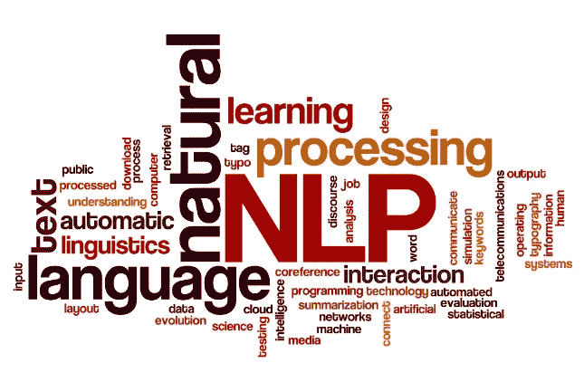
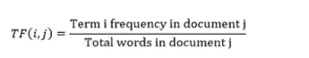
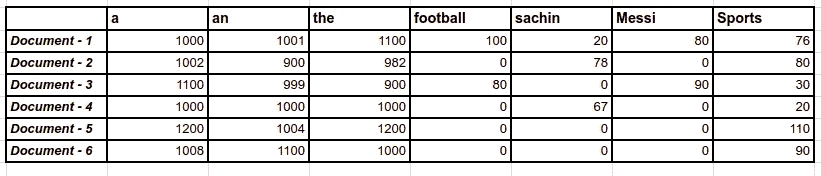
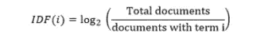
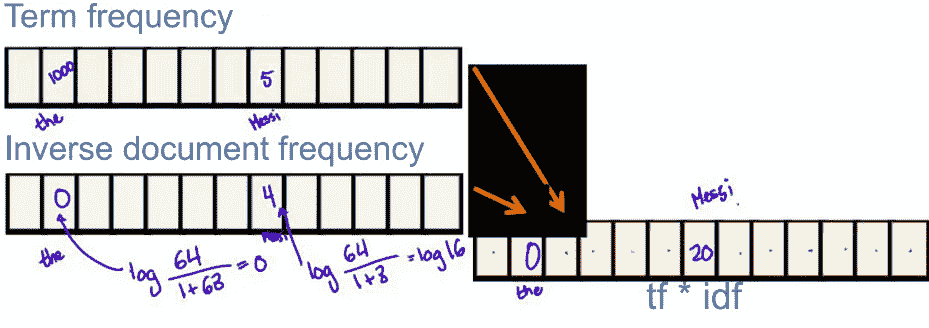
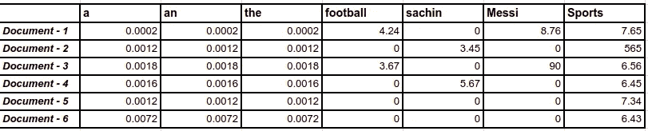
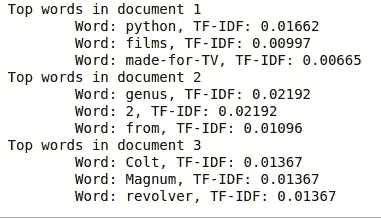

# NLP 使用 TF-IDF 进行特征选择

> 原文：<https://medium.com/analytics-vidhya/nlp-feature-selection-using-tf-idf-db2f9eb484fb?source=collection_archive---------3----------------------->



TF-IDF 是术语频率和逆文档频率的首字母缩写词，是一种强大的特征工程技术，用于识别文本数据中的重要单词，或者更准确地说，是罕见单词。

几乎所有文本数据的应用，如分类、信息检索系统、文本数据挖掘等。

另一个简单的定义是，TF-IDF 将字符串转换为数字，以便机器学习模型可以使用数字格式的数据。

在本文中，我们将打开 TF-IDF 方法来理解它的基本原理和 Python 代码。

# **词频— TF**

词频或 TF 是文档中可用的唯一词的总数。数学上，如果我们有 I 是 j 文档中的词频，那么一个词在文档中出现的次数除以文档中的总字数。



术语频率

例如，在虚拟分数的帮助下，将在内存中创建一个矩阵，其中包含各个文档的频率，如下所示



术语-频率矩阵的图示

# **逆文档频率— IDF**

逆文档频率用于确定稀有词或重要词的权重。

简而言之，在上面的例子 a、an 中，这些是频繁出现的单词，由于这些单词的权重与像梅西、沙钦、足球等有意义的单词相比在非常高的范围内。这是 TF 或字数统计矩阵的问题。这就是 IDF 的用武之地，它表现为



综合资料的文件（intergrated Data File）

让我们通过一个简单的例子来理解使用 TF-IDF 的权重生成。为了便于计算，我们将做一些假设。假设有 64 个文档可用，那么对于一个文档，IDF 计算将如下所示



因此，log 的属性是，当 log 0 = 1 和 log 1 = 0 时，它为较高的数字生成较低的值，为较低的数字生成较高的值。因此，通过使用这一属性，罕见词将获得更高的分数，而常见词将具有接近零的权重。



逆文档频率矩阵的图解

# **词频-逆文档频— TFIDF**

最后，将为术语频率和逆文档频率生成的矩阵相乘，并且将获得另一个矩阵，该矩阵将具有可用的归一化权重，并且通常被称为 TF-IDF 矩阵。

TFIDF = TF * IDF

下面是使用上面讨论的数学公式的 TFIDF 的 Python 代码:

```
import math
from textblob import TextBlob as tbdef tf(word, blob):
    return blob.words.count(word) / len(blob.words)def n_containing(word, bloblist):
    return sum(1 for blob in bloblist if word in blob.words)def idf(word, bloblist):
    return math.log(len(bloblist) / (1 + n_containing(word, bloblist)))def tfidf(word, blob, bloblist):
    return tf(word, blob) * idf(word, bloblist)document1 = tb("""Python is a 2000 made-for-TV horror movie directed by Richard Clabaugh. The film features several cult favorite actors, including William Zabka of The Karate Kid fame, Wil Wheaton, Casper Van Dien, Jenny McCarthy,Keith Coogan, Robert Englund (best known for his role as Freddy Krueger in the A Nightmare on Elm Street series of films), Dana Barron, David Bowe, and Sean Whalen. The film concerns a genetically engineered snake, a python, that escapes and unleashes itself on a small town. It includes the classic final girl scenario evident in films like Friday the 13th. It was filmed in Los Angeles,California and Malibu, California. Python was followed by two sequels: Python II (2002) and Boa vs. Python (2004), both also made-for-TV films.""")document2 = tb("""Python, from the Greek word (πύθων/πύθωνας), is a genus of nonvenomous pythons[2] found in Africa and Asia. Currently, 7 species are recognised.[2] A member of this genus, P. reticulatus, is among the longest snakes known.""")document3 = tb("""The Colt Python is a .357 Magnum caliber revolver formerly manufactured by Colt's Manufacturing Company of Hartford, Connecticut. It is sometimes referred to as a "Combat Magnum".[1] It was first introduced in 1955, the same year as Smith &amp; Wesson's M29 .44 Magnum. The now discontinued Colt Python targeted the premium revolver market segment. Some firearm collectors and writers such as Jeff Cooper, Ian V. Hogg, Chuck Hawks, Leroy Thompson, Renee Smeets and Martin Dougherty have described the Python as the finest production revolver ever made.""")bloblist = [document1, document2, document3]
for i, blob in enumerate(bloblist):
    print("Top words in document {}".format(i + 1))
    scores = {word: tfidf(word, blob, bloblist) for word in blob.words}
    sorted_words = sorted(scores.items(), key=lambda x: x[1], reverse=True)
    for word, score in sorted_words[:3]:
        print("\tWord: {}, TF-IDF: {}".format(word, round(score, 5)))
```



TFIDF 输出

TFIDF 由 sklearn 库提供，因此可以进行直接转换。下面是相同的片段:

```
vectorizer = TfidfVectorizer()
vectors = vectorizer.fit_transform([documentA, documentB])
feature_names = vectorizer.get_feature_names()
```

因此，根据选择，可以使用任何方法。