# 来自地下的 NLP 第二部分

> 原文：<https://medium.com/analytics-vidhya/nlp-from-the-underground-part-ii-d7565ed955c9?source=collection_archive---------28----------------------->

享受统计数据和 19 世纪最伟大的文学作品

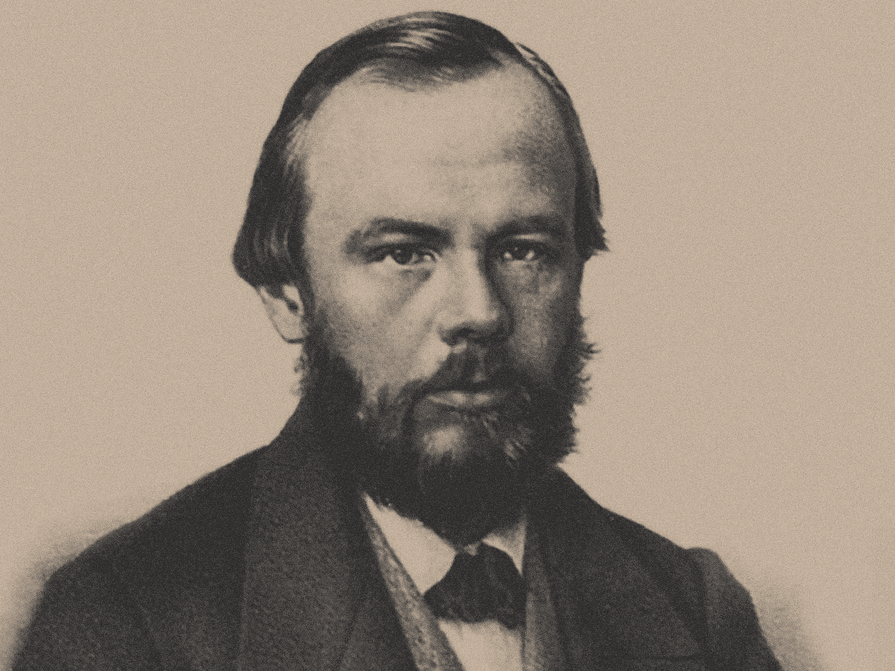

费奥多·陀思妥耶夫斯基

本文假设您已经阅读了地下部分 I 中的 [NLP，并从上一篇文章停止的地方继续。概括一下:正在考虑的文集是陀思妥耶夫斯基的五部杰作:《地下笔记》、《罪与罚》、《白痴》、《着魔》和《卡拉马佐夫兄弟》。为了量化情绪，我们使用了](/@joshtaylor361/nlp-from-the-underground-part-i-7d5cac2cbb8a) [NRC 情绪词典](https://saifmohammad.com/WebPages/NRC-Emotion-Lexicon.htm)和 [AFINN 情绪词典](http://www2.imm.dtu.dk/pubdb/pubs/6010-full.html)。

该分析的完整代码可以在 [Github](https://github.com/josht-jpg/NLP-from-the-Underground) 上找到。

自然语言处理很棒。阅读伟大的书籍是伟大的。让我们继续分析。

## 使用 NRC 词典的机器学习

到目前为止，分析中引入的大部分背景都是在二元模型的水平上。使用 [AdaBoost 分类](https://en.wikipedia.org/wiki/AdaBoost)，我将尝试把它扩展到句子的层面。我已经开始从每本书的句子中创建一个大的列表。从这个列表中，我随机抽取了两个尺码为 100 和 30 的样品。这将分别是我们的训练集和测试集。

我已经手动将每个句子标记为传达负面情绪(-1)、中性情绪(0)或传达正面情绪(1)。我们将按如下方式重新载入带标签的句子:

我们现在使用的数据框如下所示:

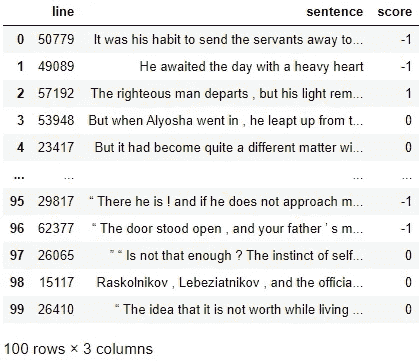

标签训练集

使用 NRC 词典，算法将学习的特征是句子中落入每个 NRC 情感/情绪的单词的数量。这一步的数据清理和准备与前面的 NRC 部分类似，只是我们现在考虑完整的句子:

将准备好的训练和测试数据输入到 ScikitLearn 的 AdaBoostClassifier 中，该分类器有 70 个估计器，我得到了 0.72 的训练分数和 0.7 的测试分数。对我有用。

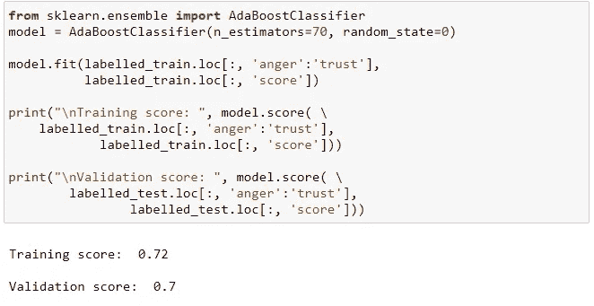

在进一步讨论之前，有必要提出警告。该模型的预测将是对情绪的不完美衡量。为了获得更可靠的结果，我可以使用由除我之外的其他人标记的更大的训练和验证集。如果我有时间，我甚至会这样做。但就目前而言，我认为该模型是一个足够强大的工具，可以让我们从数据中挖掘出真知灼见。只要我们记住它的弱点。

让我们使用模型来预测语料库中每个句子的情感。

下面的情节按照我们的模型，展示了每部小说的情绪轨迹。绘制的每个数据点是 50 个句子的情感总和。x 轴代表叙事时间。

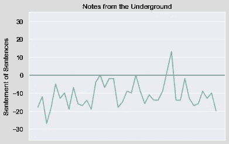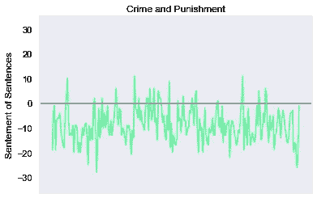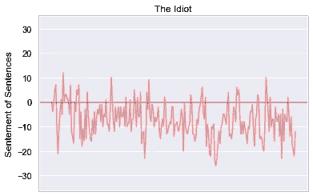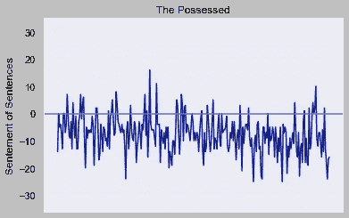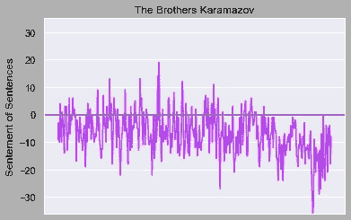

这是我们的模型得出的平均分数。1 分表示每个句子都是肯定的，-1 分表示每个句子都是否定的。

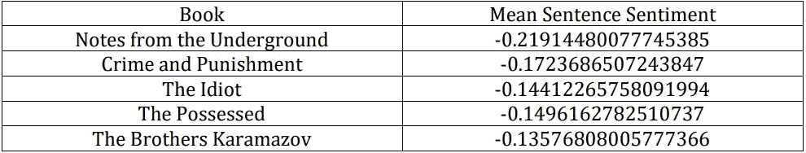

根据这一标准，《卡拉马佐夫兄弟》的正面情绪最高，《地下笔记》的负面情绪最高。精彩！我发现阅读《兄弟》是最令人振奋的经历，而《笔记》是最令人沮丧的。

## 用 AFINN 词典进行统计推断

现在我们将使用推理统计学来看看这五部杰作与 19 世纪的其他伟大作品相比如何。我想回答的问题是:使用在第一部分中用 AFINN 词典计算出的积极和消极情绪的衡量标准，陀思妥耶夫斯基每部杰作中的平均情绪是否低于 19 世纪文学巨著中的平均情绪？

现在，一些澄清是必要的。“19 世纪文学巨著”这一类别没有明确的定义。这类书没有一个普遍认可的清单。但是我们可以得到一个大多数人都会同意的好的近似值。goodreads.com 网站列出了 19 世纪以来排名最高的 1076 部 T2 文学作品。这些排名是 Goodreads 用户排名的汇总。

我使用 [beautifulsoup4 包](https://www.crummy.com/software/BeautifulSoup/bs4/doc/)从列表中抓取所有标题:

当我看标题时，一个问题变得很明显:其中许多是陀思妥耶夫斯基的作品。幸运的是，Goodreads 也有一个页面列出了陀思妥耶夫斯基排名最高的书籍。下面的代码从我们最伟大的书籍列表中删除了所有陀思妥耶夫斯基的书籍。

为了执行回答我们的问题所需的统计测试，我们必须对标题进行随机抽样。在下面的代码中，我选取了 60 个标题作为样本。然而，有些书没有英文数字格式，这使得它们与我们的分析不相容。最终结果是 42 个标题的样本，这正是我想要的。

注意:这是我第一次浏览一个不断变化的网站。所以你可以想象，当我对本文进行最后一次检查时，发现代码产生了一组不同的标题，我有多惊讶。如果有人知道如何以一种更具可复制性的方式从不断变化的网站中抓取信息，请告诉我。

下面是构成最终样本的标题列表。获取每本书内容的方法和从第一部分获取陀思妥耶夫斯基的书的内容是一样的。

在这一点上，有必要重新审视我们试图回答的问题。我们现在真正要问的问题是:*陀思妥耶夫斯基的每部杰作中的平均情绪是否低于英文数字格式的* [*Goodreads 的 19 世纪最伟大的书籍*](https://www.goodreads.com/list/show/16.Best_Books_of_the_19th_Century?page=1) *列表中的平均情绪？*你可能不再认为我们的问题有意义(假设你认为第一个问题有意义)。我会注意到，只有晦涩的标题缺乏有助于我们分析的表示。我挑选的所有 19 世纪最伟大的书籍都在名单上，并且有英文电子版。我仍然感兴趣。

对于陀思妥耶夫斯基的每一部杰作，我们的无效假设和替代假设是:

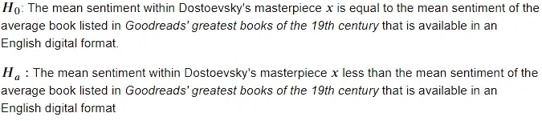

我将使用的显著性水平是 0.05。由于我将测试 5 部杰作中的每一部，一个 [Bonferroni 修正](https://en.wikipedia.org/wiki/Bonferroni_correction)将我们的显著性水平更新为 0.01。

让我们将 AFINN 分数应用于我们的样本，并检查一些属性:

样本中的最小值:-0.004975
样本中的最大值:0.082889
样本平均值:0.028879
样本标准偏差:0.021198

为了有把握地解释测试结果，必须满足以下假设:

1.  观察是独立的——我认为这种假设是安全的。名单上某本书的作者可能会受到名单上其他书的影响。但是我不相信这样的影响会大到破坏我们的测试。
2.  数据必须近似正态分布——我将对我的样本数据执行[正态性测试](https://en.wikipedia.org/wiki/Normality_test#:~:text=In%20statistics%2C%20normality%20tests%20are,set%20to%20be%20normally%20distributed.),显著性水平为 0.05。如果测试返回小于 0.05 的 p 值，我将不得不得出数据不是正态分布的结论。否则，我们可以继续假设我们正在处理一个正态分布。如下面的代码块所示，对我的样本进行的正常测试产生的 p 值约为 0.18。我们可以继续了。

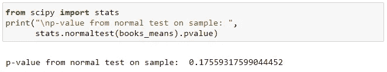

假设满足，我们可以执行我们的测试:

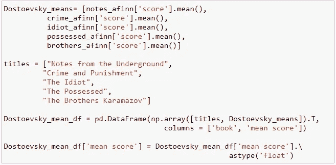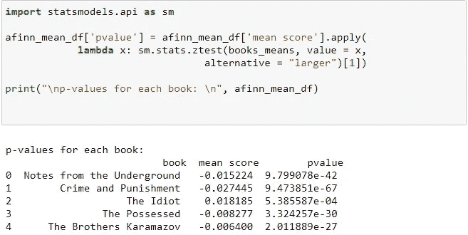

下面是一个漂亮的表格中的结果:

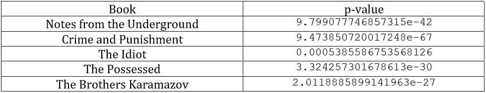

好极了。我们所有的无效假设都毫无机会。我们可以得出这样的结论，陀思妥耶夫斯基每部杰作中的平均情绪低于 Goodreads 的 19 世纪最伟大的书籍列表中的平均情绪。这是否适用于任何更有趣的问题是你的决定。

谢谢你的阅读，朋友们。

# **参考文献**

AFINN:

f .尼尔森。(2011) ANEW:微博情感分析词表评估。ESWC2011“理解微柱”研讨会论文集:CEUR 研讨会论文集，第 93-98 页，小包装中的大东西 718。

NRC:

穆罕默德、S. M .和特尼博士(2013 年)。众包一个词-情感联想词典。计算智能，第 29 卷第 3 期，第 436-465 页。

穆罕默德、S. M .和特尼博士(2010 年)。常用词和短语引起的情绪:使用机械土耳其人创建情绪词典。NAACL-HLT 2010 年文本情感分析和生成计算方法研讨会会议录。

最初的灵感:

Silge，j .和 Rabinson，D. (2020 年)。用 R. O 'Riley 挖掘文本。https://www.tidytextmining.com/index.html