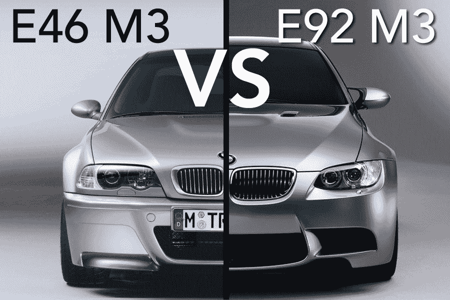
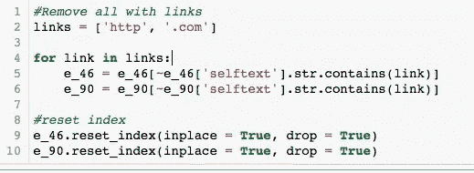
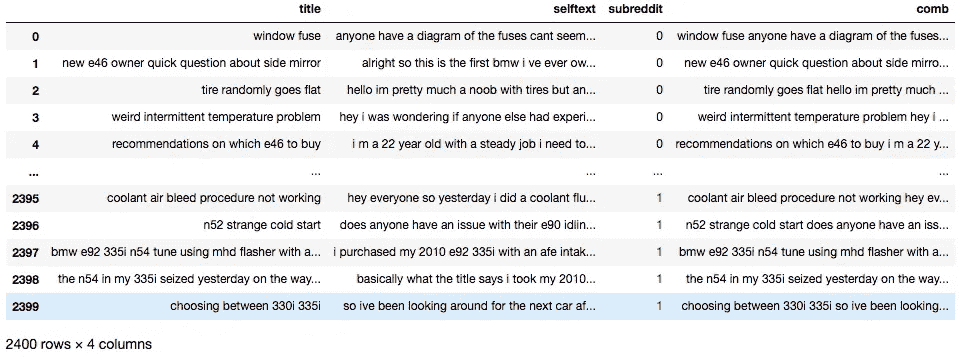
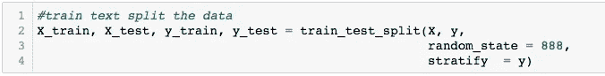
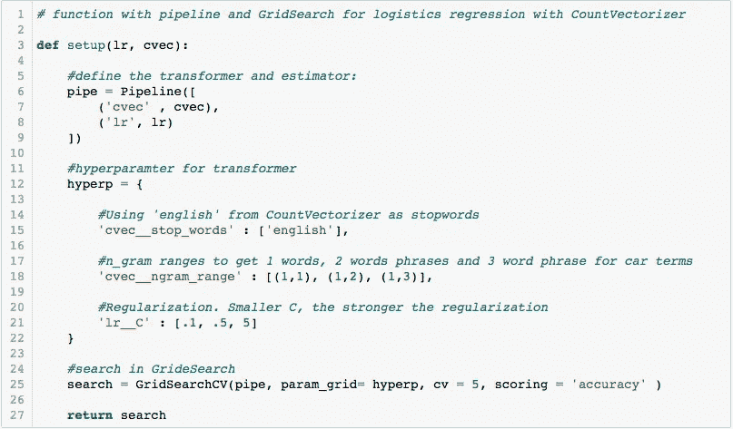
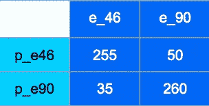
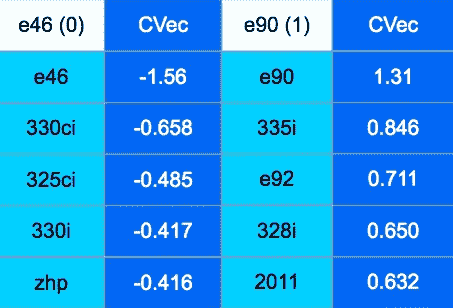

# NLP 在行动。宝马 E46 还是 E90s？

> 原文：<https://medium.com/analytics-vidhya/nlp-in-action-bmw-e46-or-e90s-412e6fd1bf18?source=collection_archive---------24----------------------->

自然语言处理是机器学习的一个非常重要的概念，因为它结合了人工智能、语言学和计算机科学。它学习和识别输入的行为，并使用它来提出建议或推荐。自动更正、拼写检查和自动完成是我们日常使用的自然语言处理的几个例子。

今天，我们将通过使用 Python 中的逻辑回归来使用 NLP 区分 reddit 中 E46 或 E90s 的帖子。

E46 和 E90s

# **数据**

在 E46 和 E90 的每个子页面中，有 2000 条最新的帖子是通过 Pushshift 的 API 发布的。总共产生了大约 4000 个帖子或数据点。

查了资料，有些帖子是链接。在我们今天的分析中，链接不起作用。因此，它们通过下面的代码被删除:

移除链接的语法

此外，许多帖子包含在 API 过程中遗留下来的 HTML 工件。它们也被删除了，所以每个帖子只包含必要的文字和数字。

数据清理后，数据集共有 2400 行。标题和自文本被组合在一起形成一个用于自然语言处理的特征。标签 subreddit 映射为 E46 的“0”和 E90 的“1”。

清理后的数据集。

# **逻辑回归**

设置:

X = ['comb']

y = ['subreddit']

训练-测试-分割 X 和 y，默认为 75% -25%分割:

在为逻辑回归做好准备之前，文本必须转换为数值。为此，我们将使用 CountVectorizer 转换器。它将一个文本集合转换成一个单词计数矩阵。([此处](https://scikit-learn.org/stable/modules/generated/sklearn.feature_extraction.text.CountVectorizer.html)了解更多信息)。

我们将通过管道和 GridSearch 为计算机提供逻辑回归和计数向量器，以迭代最佳参数和精度。

# **结果**

**最佳参数:**

n_gram = (1，3)

stop_words = '英语'

C = 0.1

**准确度和混淆矩阵:**

混乱矩阵。

准确率= 86%

总错误数= 85

**E46 和 E90s 的热门词汇:**

这些词更有助于将帖子归类为 E46 或 E90。

E46 和 E90s 的热门词汇

# **总结:**

正如我们所看到的，在我们用单词及其与 E46 和 E90s 的关系训练逻辑回归之后，它在区分两个系列汽车之间的新数据点方面具有良好的准确性。

热门词汇不足为奇，因为这些是用户在描述他们的 E 系列宝马时最常用的词汇。在被错误分类的 85 个数据点中，许多都没有使用任何重要的词。这些帖子很短，用的词非常笼统，几乎可以适用于任何事情。

NLP 模型和我们训练的一样好。因此，这个模型不是傻瓜证明，可以在许多方面进行改进。该模型仅适用于区分 E46 和 E90s 之间 post，因为它仅被训练来这样做。但是，这个模型说明了 NLP 可以帮助我们完成的一些重要任务。

给你。一个简单的自然语言处理的例子。