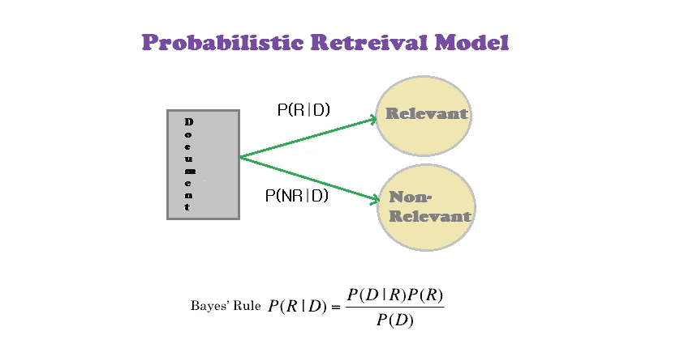
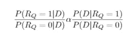
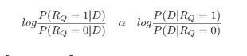
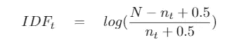
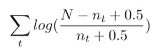

# 概率检索

> 原文：<https://medium.com/analytics-vidhya/nlp-lecture-series-from-basic-to-advance-level-additional-content-1c1e51c9f936?source=collection_archive---------13----------------------->

作者图片

当我们通过将常用术语和文档频率作为参数馈送到贝叶斯模型来估计文档与给定查询的相关程度时，我们称之为概率检索，或者我们可以用其他术语来说，我们可以说这是试图根据概率论来形式化排序检索背后的思想。

这个模型其实是基于一些假设  。我们假设

*   每个文档与给定的查询相关或不相关
*   判断一个文档相关或不相关并不能告诉我们另一个文档的相关性。

基于这两点，这个理论不承认相关度，也没有告诉我们找到一个文档可能会使另一个变得不相关。这两点得出结论，相关性的理论概念与实际效用有多远，即在实际概念中，这不能告诉我们一个文档对搜索者有多有用。

这些相关概率确实有实际用途。我们使用这些相关概率来确定向用户呈现点击的顺序。这里出现了**概率排序原则的概念。**

> **概率排序原则** **:** 根据可用数据，通过降低与查询相关的概率来对文档进行排序将产生最佳“性能”，即最佳排序。

## [**关联概率**](https://doc.lagout.org/science/Artificial%20Intelligence/Natural%20Language%20Processing/Natural%20Language%20Processing%20for%20Online%20Applications%20Text%20Retrieval%2CExtraction%20and%20Categorization%20-%20Peter%20Jackson%20%2C%20Isabelle%20Moulinier.pdf) **:**

给定查询‘q’的文档‘d’的相关性概率可以表示为: **P(Rᵩ = X|D)** 这里我们根据相关性的二元性质假设 X ∈ {0，1}。

我们进一步计算这个比率，如下所示

查询和文档的匹配分数可以表示为相关概率和不相关概率之间的比率:

因为 **P(Rᵩ=1)** 这里随机选择的文档与查询相关，并且是在不知道其内容的情况下选择的。对于 **P(Rᵩ = 0 也是如此)。**我们忽略了原始方程中的这两个量，因为这个量对于所有文件都是相同的，所以方程变为:

双面登录:

**P(D|Rᵩ = 1)** 这里是从相关集合中选择文档的概率， **P(D|Rᵩ = 0)** 是从不相关集合中选择文档的概率。为了估计这些，我们需要看到查询词在文档和整个集合中的分布。
Q= {t1，t2……。tm}。为此，我们需要计算每一项 t 的权重(wₜ,𝒹)

## **期限权重:**

N =集合的大小
nₜ =包含查询项 t 的文档数量
因此，权重的一个分量由下式给出

反向文档频率的平滑版本

如果文档内频率计数不可用，匹配分数可通过将各部分相加得出，如下所示:

[1]([Robertson](https://www.researchgate.net/profile/Stephen_Robertson2)et al . 1982)关联概率:两种竞争性文献检索模型的统一。

[2]([Robertson](https://www.researchgate.net/publication/235253512_The_Probability_Ranking_Principle_in_IR)1977)IR 中的概率排序原理。

[3] ( [Peter Jacksons 和 Isabelle Moulinier](https://doc.lagout.org/science/Artificial%20Intelligence/Natural%20Language%20Processing/Natural%20Language%20Processing%20for%20Online%20Applications%20Text%20Retrieval%2CExtraction%20and%20Categorization%20-%20Peter%20Jackson%20%2C%20Isabelle%20Moulinier.pdf) ) NLP 用于在线应用、文本检索、提取和分类