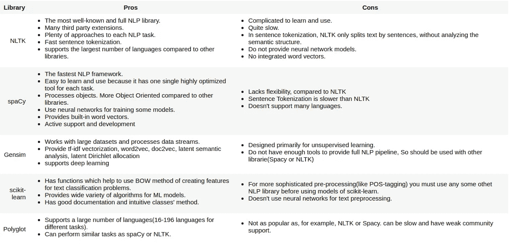
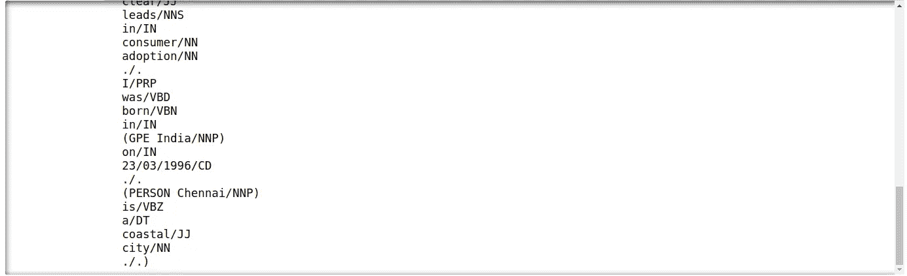
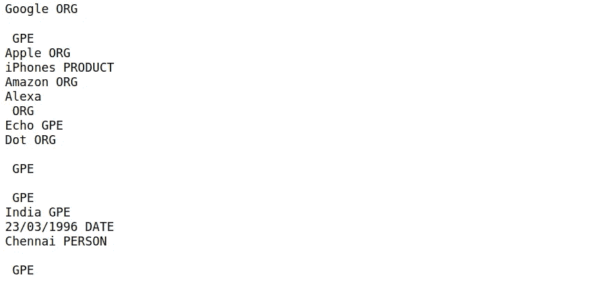
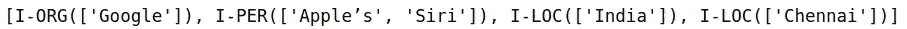
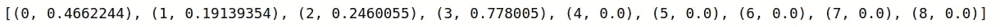

# NLP 库和预训练模型

> 原文：<https://medium.com/analytics-vidhya/nlp-libraries-and-pretrained-models-94c9a53a295a?source=collection_archive---------5----------------------->


Patrick Schneider 在 [Unsplash](https://unsplash.com/collections/288927/books-libraries?utm_source=unsplash&utm_medium=referral&utm_content=creditCopyText) 上的照片

*本文是 NLP *入门系列* **的第三篇。*** 希望你已经涵盖了前两个。它们将为您提供进入 NLP 世界的起点。以下是这两者的链接:
1。[NLP 入门的一切。](/@ajeet.singh.ec14/everything-to-get-started-with-nlp-3ccfbb7405a2?source=friends_link&sk=a66eaccadf8dcc00e4baf07d70ee1c33)
2。[使用 Tfidf 的情感分类器。](/@ajeet.singh.ec14/sentiment-classifier-using-tfidf-3ffce3f1cbd5?sk=cd23d564be7a9b6cef3504657cfe2cd9)

在本文中，我们将关注 NLP 库和预训练模型。这会非常有趣。所以系好安全带，让我们开始吧。

NLP 的世界是巨大的，需要花费大量的时间和资源才能掌握它。驯服它完全是另一回事。

这是几年前的情景，但不是现在。感谢预先构建的 NLP 库和模型，它们让我们在巨大的 NLP 世界中的生活变得轻松。研究人员花费了多年的时间来制作这些库和模块。

由于他们已经为我们设计了很多基准模型/库，而不是从头开始构建东西来解决类似的 NLP 问题，我们应该在我们的数据集上使用预先训练的模型/库。在情感分析(上一篇文章)中，您已经看到了 scikit-learn 库的例子，这是一个用于机器学习的 python 库。

在 NLP 中有很多已经发生并仍在进行的研究。因此，自然地，已经存在大量的模型和库。有些很好，有些不太好。因此，为了使您选择哪个库/模型适合您的任务变得容易，我将解释最流行的模型和库。

这只是库和模型的概述，请点击链接获取完整信息。

# 1.NLP 库


照片由 [Alfons Morales](https://unsplash.com/@alfonsmc10?utm_source=unsplash&utm_medium=referral&utm_content=creditCopyText) 在 [Unsplash](https://unsplash.com/s/photos/library?utm_source=unsplash&utm_medium=referral&utm_content=creditCopyText) 拍摄

有许多可用的 NLP 库。以下是前五名。

## 1.[自然语言工具包(NLTK)](https://www.nltk.org/)

*   NLTK 处于 NLP 世界的最前沿。它相当成熟，自 2000 年以来一直在发展。当使用 Python 进行语言处理时，人们广泛使用 NLTK。
*   NLTK 是用非常好的编码实践编写的，相当容易使用。最重要的是，它带有数据集，你可以下载，使生活变得简单。
*   支持许多任务，如分类、标记化、词干提取、标记、解析等。刚接触 NLP 和 Python 的开发人员通常从 NLTK 开始。

## 2.S [paCy](https://spacy.io/)

*   可以说是 NLP 任务中第二著名的库。它非常容易使用，直观，非常强大。它自称为*工业级自然语言处理*
*   尽管相对较新，SpaCy 提供了当今市场上最快的语法解析器。最重要的是，由于工具包是用 Cython 编写的，所以速度非常快。
*   Spacy 支持几乎所有的 NLP 特性。一些例子是 NER，标记化。最重要的是，Spacy 支持 49 种以上的语言，预先训练的单词向量，以及帖子标签等。

## 3. [Gensim](https://radimrehurek.com/gensim/)

*   一个相当专业的无监督语义建模库。它是高度优化的。因此，您可以期待高性能。
*   说到语义分析和主题建模，Gensim 是首选库。它速度快、可扩展且非常高效。
*   Gensim 广泛使用 Numpy，这使得它非常快。除了速度，由于 Numpy，内存也进行了高度优化。由于这两个因素，Gensim 可以处理大量的数据。

## 4. [scikit-learn](https://scikit-learn.org/stable/)

*   到目前为止，Python 中最重要的机器学习库。您已经在情感分析文章中看到了这个库的用法。
*   这个库提供了各种文本预处理工具。我们已经使用了其中的一些。

## 5.[多语种](https://pypi.org/project/polyglot/)

*   Polyglot 主要是为多语言应用程序设计的，因此与我们之前讨论过的其他库有很大不同。尽管它也提供了典型的 NLP 特性，但多语言性使它与众不同。
*   它提供了同时处理各种语言的功能。虽然其他图书馆也有这样的功能，但不如 Polyglot 准确和先进。
*   Polyglot 的后端也依赖于 Numpy，因此它也非常快。

# 这些库的利与弊



图书馆的比较。[来源](https://activewizards.com/blog/comparison-of-python-nlp-libraries/)

# 如何使用这些库


由[伊利亚·巴甫洛夫](https://unsplash.com/@ilyapavlov?utm_source=unsplash&utm_medium=referral&utm_content=creditCopyText)在 [Unsplash](https://unsplash.com/s/photos/coding?utm_source=unsplash&utm_medium=referral&utm_content=creditCopyText) 上拍摄

既然我们已经看到了这些库的优缺点，也比较了它们，那么让我们看看它们是如何工作的，以及我们如何使用它们。

我们将看到如何安装每个库，也将看到一个如何使用它们的简短示例。我们已经看到了 *scikit-learn* 如何工作。所以我们不需要再讨论了。对于 *NLTK* 、 *spaCy、*和 *Polyglot* 我们将随机抽取一个文本，看看它们如何执行命名实体识别(NER)。即它们能够多好地识别一个单词是否是一个实体。对于 *Gensim* ，我们将看到一个文档相似性的示例。关于这些库的所有其他用法，请查阅它们的文档。我已经在每个库的标题中给出了每个库的文档链接。

首先，我们将使用 *NLTK* 、 *spaCy* 和 *Polyglot* 做 **NER** (命名实体识别)。

> 请注意，我用的是 Jupyter 笔记本和 Python 3。

```
#We will take this paragraph to perform NER using all three libraries.text = '''But Google is starting from behind. The company made a late push into hardware, and Apple’s Siri, available on iPhones, and Amazon’s Alexa software, which runs on its Echo and Dot devices, have clear leads in consumer adoption. I was born in India on 23/03/1996\. Chennai is a coastal city.'''
```

NLTK

```
#installing NLTK. 
#If having any trouble go to this link : [https://pypi.org/project/nltk/](https://pypi.org/project/nltk/)!pip install nltk#importing tokenizer, POS tagger and NER chunker
from nltk import word_tokenize, pos_tag, ne_chunk#performing tokenization followed by POS tagging. Then extracting #NER.
print(ne_chunk(pos_tag(word_tokenize(text))))
```

输出:



输出的一小部分

输出是令牌、POS 标签对的形式。您可以看到 NLTK 已经将整个文本转换成了标记，然后执行了词性标记，接着提取命名实体。所有命名的实体都在括号中。
比如 ***(GPE 印度/NNP)*** 就是说*印度*是一个 *GPE(地点)*而它的 *POS* 标签是一个*名词(专有，单数)*。
有很多 POS 标签，要了解所有这些标签，请参考这个 StackOverflow [答案。](https://stackoverflow.com/questions/15388831/what-are-all-possible-pos-tags-of-nltk)

# 宽大的

```
#installing spaCy. 
#If having any trouble go to this link : [https://spacy.io/usage](https://spacy.io/usage)!pip install -U spacy#To use spaCy you must have some language model. The model that we #need depends on our language and also on our usage. 
#Please refer the above spaCy installation link for full details. 
#We will download the Enlish model for our usage!python -m spacy download en#To download English's small statistical model. Medium and Large #models are also available.!python -m spacy download en_core_web_sm#importing spaCy, English's small statistical model and loading itimport spacy
import en_core_web_sm
nlp = en_core_web_sm.load()#performing NER over the same text.doc = nlp(text)
for entity in doc.ents:
    print(entity, entity.label_)
```

输出:



空间输出

在 spaCy 中，当我们执行 NER 时，只显示 NER 的输出。其他所有细节都被隐藏了。spaCy 的 NER 的输出是令牌 NER 标签对的形式。例如，***23/03/1996***表示 *23/03/1996* 是一个日期，*日期*是它的 *NER* 标签。

# 懂得多种语言的

```
#installing Polyglot and other important modlules. All the other #three modules must be present for the working of polyglot. 
#If having any trouble go to this link : [https://pypi.org/project/polyglot/](https://pypi.org/project/polyglot/)!pip install PyICU
!pip install pycld2
!pip install morfessor
!pip install polyglot#Downloading other requirements like POS tagger, embeddings and NER #tagger!polyglot download pos2.en
!polyglot download embeddings2.en
!polyglot download ner2.enpoly_text = Text(text)
print(poly_text.entities)
```

输出:



多语种输出

Polyglot 只给出命名的实体作为输出，并隐藏所有其他细节。输出的形式是 ***NER 标签(['token'])*** 。例如， *I-ORG(['Google'])* 意味着 *Google* 是一个实体，I-ORG 是它的 *NER* 标签。

# 根西姆

对于 Gensim，它不像上面三个那样工作，我们将从 [Gensim docs](https://radimrehurek.com/gensim/tutorial.html#id2) 中取一个相似性查找的例子。有关 Gensim 的所有其他示例，请访问此[链接](https://radimrehurek.com/gensim/tutorial.html#id2)。

对于我们的例子，我们将采用 9 个文档，并找到它们与样本文档的相似性。

```
#installing Gensim
#If having any trouble go to this link : [https://pypi.org/project/gensim/](https://pypi.org/project/gensim/)!pip install gensim#importing gensim
import gensim#First, let’s create a small corpus of nine documents and twelve #features.
#From the sentiment analysis example we are familiar with how #documents are converted into vectors. This is same. 
#We have taken documents as vectors. Total number of features are #12.corpus = [[(0, 1.0), (1, 1.0), (2, 1.0)],
           [(2,1.0), (3,1.0), (4,1.0), (5,1.0), (6,1.0), (8,1.0)],
           [(1, 1.0), (3, 1.0), (4, 1.0), (7, 1.0)],
           [(0, 1.0), (4, 1.0), (7, 1.0)],
           [(3, 1.0), (5, 1.0), (6, 1.0)],
           [(9, 1.0)],
           [(9, 1.0), (10, 1.0)],
           [(9, 1.0), (10, 1.0), (11, 1.0)],
           [(8, 1.0), (10, 1.0), (11, 1.0)]]#Now we will convert the vectors in our corpus into tf-idf vectors.
#We have already seen tf-idf vectors in sentiment analyses example.from gensim import models
tfidf = models.TfidfModel(corpus)#Now we will create a sample document to calculate similarity with #all other documents in our corpus.
#we will apply tf-idf vectorization over this document also.
#In the output you can see the output as tf-idf vectors.sample_doc = [(0, 1), (4, 1)]
print(tfidf[sample_doc])
```


tfidf 输出

```
#let us transform the whole corpus via TfIdf and index it, in #preparation for finding similarityfrom gensim import similaritiesindex = similarities.SparseMatrixSimilarity(tfidf[corpus], num_features=12)#Now calculate the similarity of our sample document against every #document in the corpus:sims = index[tfidf[sample_doc]]print(list(enumerate(sims)))
```

输出:



Gensim 相似性输出

输出是具有文档编号和相似性的元组列表的形式。例如，*第一个文档(索引=0)的相似性得分为 0.466=46.6%，第二个文档的相似性得分为 19.1%，等等*。

因此，根据 TfIdf 文档表示和余弦相似性度量，与我们的 sample_doc 最相似的是 4 号文档，相似性得分为 77.8%。请注意，在 TfIdf 表示中，与 sample_doc 没有任何共同特征的任何文档(文档编号 5-9)的相似性得分为 0.0。

**scikit-learn**

因为我们已经在上一篇文章中广泛地看到了它的用法，所以我在这里就不再赘述了。

# 关于图书馆的结束注释

请注意，所有这些库并不像它们的文档所显示的那样工作良好。您需要尝试不同的库来检查哪一个满足您的目标。
例如，在空间 ***钦奈*** 不是一个实体，但在 NLTK 中却是。在 NLTK***1996 年 3 月 23 日*** 不是一个日期，但在空间中却是。

如果任何库不能满足您的要求，那么您可以为自己的数据集训练库。训练图书馆可能会花费很多时间和资源，但它可以帮助很多。

# 2.迁移学习和 NLP 预训练模型


照片由[普里西拉·杜·普里兹](https://unsplash.com/@priscilladupreez?utm_source=unsplash&utm_medium=referral&utm_content=creditCopyText)在 [Unsplash](https://unsplash.com/s/photos/teaching?utm_source=unsplash&utm_medium=referral&utm_content=creditCopyText) 上拍摄

训练库的替代方法可以是训练预训练模型。

**目录**

1.  什么是迁移学习？
2.  什么是预训练模型？
3.  为什么重要？
4.  如何使用它们？
5.  有哪些最好的型号？

让我们逐一讨论所有这些主题

1.  **什么是迁移学习？**
    迁移学习(Transfer learning)是一种机器学习方法，其中为一项任务开发的模型被重新用作第二项任务的模型的起点。这就像从某人那里学到一些东西，然后将这些知识用于其他任务。
2.  **什么是预训练模型？**
    预训练模型是其他人为了解决类似问题而创建的模型。这个模型最重要的因素是它的学习。它已经从训练中学到了什么。所以与其从头开始解决一个类似的问题，不如把它的学习作为一个起点。
3.  **为什么重要？特定模型的研究人员和作者已经投入数月甚至数年来训练一个模型。将其细化到已经实现基准结果的水平。既然已经完成了，为什么还要重复同样的步骤呢？我们唯一需要做的就是针对我们的特定用例对模型进行微调。
    比如你要造一辆自学习汽车。你可以花费数年时间从头开始构建一个像样的图像识别算法，或者你可以采用谷歌的 Inception 模型(一个预先训练的模型)，它基于 ImageNet 数据来识别这些图片中的图像。**
4.  **如何使用它们？**
    请参考这篇[博客](https://www.analyticsvidhya.com/blog/2017/06/transfer-learning-the-art-of-fine-tuning-a-pre-trained-model/)，因为他们已经解释得很好了。你可以把这个作为我正在使用的预训练模型的例子。那就是利用别人的知识，而不是从零开始。
5.  **有哪些最好的型号？**
    ULMFiT，Transformer，谷歌的 BERT，Transformer-XL

要对所有这些进行概述，请浏览此[链接](https://www.analyticsvidhya.com/blog/2019/03/pretrained-models-get-started-nlp/)。在那里，您还可以找到更多资源来完全掌握预训练模型。

我试图让你深入了解 NLP 的巨大世界。我希望你对 NLP 的工作原理有所了解。我希望你能利用这些知识去探索更多。

如果你喜欢这篇文章，那么你可以想按多少次拍手按钮就按多少次。还有，你可以在[**LinkedIn**](https://www.linkedin.com/in/singhajeet23/)**上联系我，或者在**[**GitHub**](https://github.com/AjeetSingh02)**上关注我。**

> 仅此而已。感谢阅读。快乐学习。


克拉克·蒂布斯在 [Unsplash](https://unsplash.com/s/photos/success?utm_source=unsplash&utm_medium=referral&utm_content=creditCopyText) 上拍摄的照片