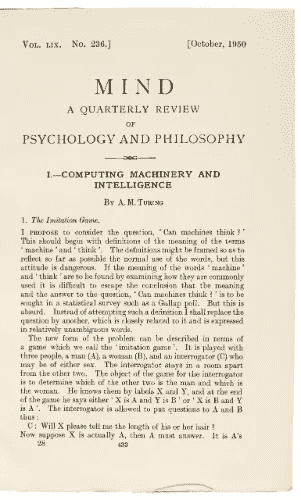

# Node.js 和 JavaScript 的 NLP 库

> 原文：<https://medium.com/analytics-vidhya/nlp-libraries-for-node-js-and-javascript-bdb605bb803c?source=collection_archive---------23----------------------->

在这篇文章中，我们将讨论我们遇到的最好的 Node.js 和 JavaScript 的 NLP 库。让我们马上开始。

# 什么是自然语言处理(NLP)？

自然语言是指人类相互交流的方式。

自然语言处理(NLP)被广泛定义为通过软件对自然语言(如语音和文本)进行电子处理。

[**创建免费聊天机器人**](https://dashboard.kommunicate.io/signup)

NLP 很重要，因为我们希望以更自然的方式打开机器和人类之间的交流。NLP 有各种用例，如运行搜索引擎、情感分析、实体识别、基于语音的应用程序、聊天机器人和个人助理。

自然语言处理(NLP)的历史一般始于 20 世纪 50 年代。艾伦·图灵发表了《计算机器与智能》一文，这是一篇关于人工智能的开创性论文。



20 世纪 60 年代开发的一些非常成功的 NLP 系统是 [SHRDLU](https://en.wikipedia.org/wiki/SHRDLU) 和 [ELIZA](https://en.wikipedia.org/wiki/ELIZA) 。直到 20 世纪 80 年代，大多数自然语言处理系统都是基于复杂的手写规则集。在 20 世纪 80 年代，NLP 在引入机器学习算法后开始兴起。

现在，几十年后，世界上充满了多种 NLP 库和引擎。让我们来看看其中的一些，特别是对于较新的语言，比如 Node.js 和 JavaScript。

# Node.js 和 JavaScript 的 NLP 库

尽管有许多有用的 NLP 库，如 [Spacy](http://Spacy.io) 、NLTK 和 CoreNLP。然而，大多数这些库在 JavaScript 中都不可用。我们很难找到一些好的 JavaScript NLP 库。经过大量的研究和测试，以下是我们认为有用的库:

# #1 NLP.js

github:[https://github.com/axa-group/nlp.js](https://github.com/axa-group/nlp.js)

NLP.js 由 AXA 集团开发。这是一个用于构建机器人的 NLP 库，具有实体提取、情感分析、自动语言识别等功能，支持 40 种语言。

[**30 天免费试用**](https://dashboard.kommunicate.io/signup)

NLP.js 是构建聊天机器人的完美 node.js 库。文档非常清晰，使用非常容易。

下面是一个基本的代码片段，可以帮助您理解设置它是多么容易。

```
const { NlpManager } = require('node-nlp');
const manager = new NlpManager({ languages: ['en'] });

// Adds the utterances and intents for the NLP
manager.addDocument('en', 'goodbye for now', 'greetings.bye');
manager.addDocument('en', 'bye bye take care', 'greetings.bye');

// Train also the NLG
manager.addAnswer('en', 'greetings.bye', 'Till next time');
manager.addAnswer('en', 'greetings.bye', 'see you soon!');

// Train and save the model.
(async() => {
    await manager.train();
    manager.save();
    const response = await manager.process('en', 'I should go now');
    console.log(response);
})();
```

# #2 自然

github:[https://github.com/NaturalNode/natural](https://github.com/NaturalNode/natural)

Natural 是 Node.js 的另一个著名的 NLP 库。“Natural”是 Node.js 的一个通用自然语言工具。它目前支持标记化、词干化、分类、语音、tf-idf、WordNet、字符串相似性和一些变形。

```
var natural = require('natural');
var tokenizer = new natural.WordTokenizer();
console.log(tokenizer.tokenize("your dog has fleas."));
// [ 'your', 'dog', 'has', 'fleas' ]

console.log(natural.HammingDistance("karolin", "kathrin", false));
console.log(natural.HammingDistance("karolin", "kerstin", false));
// If strings differ in length -1 is returned
```

# #3 妥协。酷

github:【https://github.com/spencermountain/compromise/ 

Compromise.cool 确实是一个很酷的轻量级库，非常容易使用。它可以用来在您的浏览器上运行 NLP。

请注意，妥协只适用于英语。

```
let doc = nlp(entireNovel)

doc.if('the #Adjective of times').text()
// "it was the blurst of times??"
if (doc.has('simon says #Verb')) {
  return true
}
```

# #4 Wink.js

github:【https://github.com/winkjs/wink-nlp-utils 

Wink 提供了 NLP 函数，用于放大否定，管理省略，创建 ngrams，词干，语音代码到标记，等等。

```
// Load wink-nlp-utils
var nlp = require( 'wink-nlp-utils' );

// Extract person's name from a string:
var name = nlp.string.extractPersonsName( 'Dr. Sarah Connor M. Tech., PhD. - AI' );
console.log( name );

// Tokenize a sentence.
var s = 'For details on wink, check out http://winkjs.org/ URL!';
console.log( nlp.string.tokenize( s, true ) );
// -> [ { value: 'For', tag: 'word' },
//      { value: 'details', tag: 'word' },
//      { value: 'on', tag: 'word' },
//      { value: 'wink', tag: 'word' },
//      { value: ',', tag: 'punctuation' },
//      { value: 'check', tag: 'word' },
//      { value: 'out', tag: 'word' },
//      { value: 'http://winkjs.org/', tag: 'url' },
//      { value: 'URL', tag: 'word' },
//      { value: '!', tag: 'punctuation' } ]
```

# 结论

选择一个库最终取决于用例以及你正在使用的技术。如果你正在寻找一个用于构建聊天机器人的 NLP 库，那么我会推荐 NLP.js。

[**免费试用**](https://dashboard.kommunicate.io/signup)

参考资料:[https://machine learning mastery . com/natural-language-processing/](https://machinelearningmastery.com/natural-language-processing/)

*原载于 2020 年 6 月 9 日*[*https://www . komunicate . io*](https://www.kommunicate.io/blog/nlp-libraries-node-javascript/)*。*