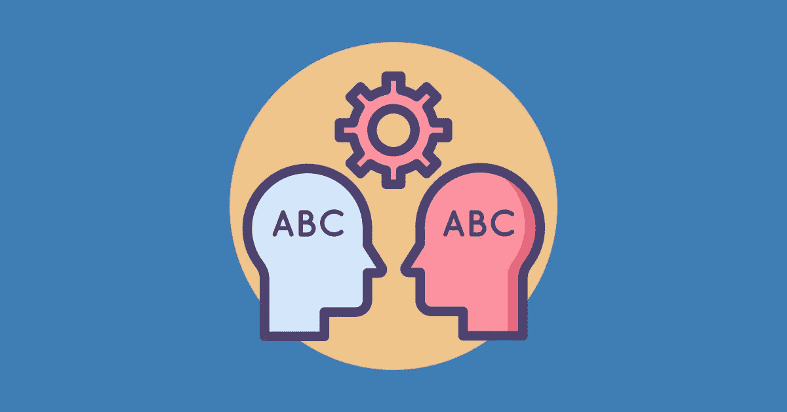

# 有了这些库，NLP 变得简单了

> 原文：<https://medium.com/analytics-vidhya/nlp-made-easy-with-these-libraries-3fe4b1ac49a1?source=collection_archive---------18----------------------->

# 什么是自然语言处理？

人工智能的一个分支，用自然语言处理人机交互。

## 自然语言处理的应用:

1.  情感分析
2.  文本摘要
3.  文本到语音转换
4.  垃圾邮件过滤
5.  问题回答

这是应用自然语言处理的五个主要应用。除了这五种应用之外，使用自然语言处理还有许多无限的可能性。

重要的部分是你应该如何开始自然语言处理？

这里有一个 8 个图书馆的列表，你可以从那里开始学习 NLP

1.  自然语言工具包(NLTK)
2.  PyNLPI
3.  文本 Blob
4.  宽大的
5.  CoreNLP
6.  模式
7.  天才论
8.  张量流

我强烈建议您从 NLTK 开始，然后尝试使用 TextBlob 库，因为这对初学者来说非常容易理解。

# 在自然语言处理领域工作的大多数公司

1.  [塔斯库斯](https://www.taskus.com/)
2.  [声音猎犬](http://www.soundhound.com)
3.  [语义机器](http://www.semanticmachines.com)
4.  [诊断流程](http://www.diagflow.com)
5.  [Twiggle](http://www.twiggle.com)

# 学习 NLP 的资源

1.  [Kaggle 课程](https://www.kaggle.com/learn/natural-language-processing)
2.  [普俄亥俄州 Youtube 课程](https://www.youtube.com/watch?v=xvqsFTUsOmc)
3.  [NLP 零到英雄由 Tensorflow](https://www.youtube.com/watch?v=fNxaJsNG3-s&list=PLQY2H8rRoyvzDbLUZkbudP-MFQZwNmU4S)
4.  [tensor flow 中的自然语言处理](https://www.coursera.org/learn/natural-language-processing-tensorflow?ranMID=40328&ranEAID=vedj0cWlu2Y&ranSiteID=vedj0cWlu2Y-wgj8Myzz2vl_evrRgDXOSg&siteID=vedj0cWlu2Y-wgj8Myzz2vl_evrRgDXOSg&utm_content=10&utm_medium=partners&utm_source=linkshare&utm_campaign=vedj0cWlu2Y)
5.  [自然语言处理](https://www.edx.org/course/natural-language-processing-nlp-2?source=aw&awc=6798_1592546779_9ca144acf8dee9c331cd86db0c3ea892&utm_source=aw&utm_medium=affiliate_partner&utm_content=text-link&utm_term=427859_Digital+Defynd)

youtube 上有很多其他教程，你可以在那里学习 NLP。

快乐学习！！！

希望这篇文章有用。别忘了鼓掌，跟着学。