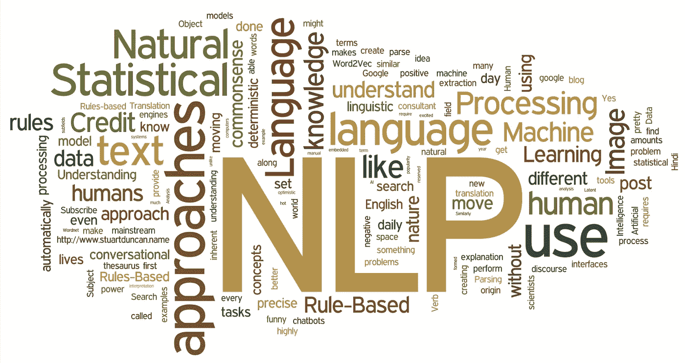
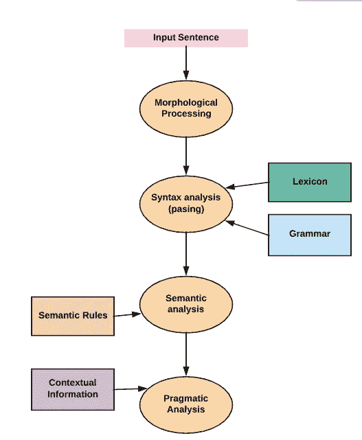
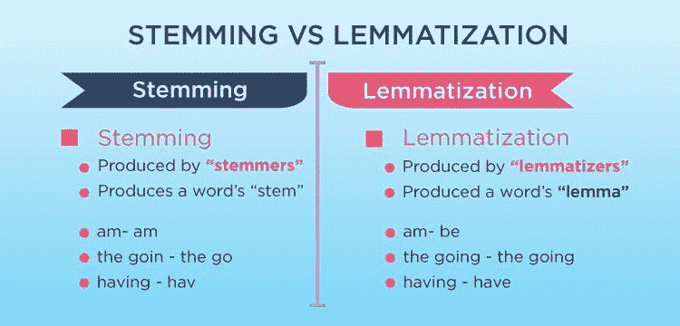
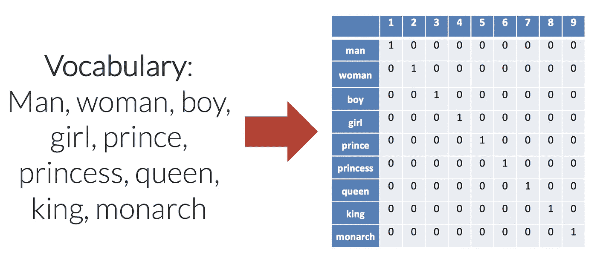

# 神经语言程序设计和垃圾邮件检测

> 原文：<https://medium.com/analytics-vidhya/nlp-neuro-linguistic-programming-and-spam-detection-beabfae54a61?source=collection_archive---------23----------------------->

嗨我的同胞们，“**押韵”——**abcdefg 的曲子和《一闪一闪小星星》的曲子一样！。在这里，让我们看看建立一个 NLP 模型的要求。

# 什么是 NLP？

自然语言处理是人工智能的一个分支，帮助计算机理解、解释和操纵人类语言。NLP 帮助开发人员组织和构造知识，以执行诸如翻译、摘要、命名实体识别、关系提取、语音识别、主题分割等任务。

# **NLP 的组成:**

1.  **形态分析:**将语言输入的组块分解成对应于段落、句子和单词的记号集。例:不安到“un”+“easy”。
2.  **句法分析:**检查一个句子是否格式良好，并将其分解成一个结构，以显示不同单词之间的句法关系。例:学校去找男生——判“拒绝”。
3.  **语义分析:**从文本中抽取确切含义或词典含义。它显示了单词是如何相互联系的。热咖啡——被认为是有意义的两个词的摘录。
4.  **语用分析:**用语义阶段获得的宾语指称来拟合给定语境中存在的实际宾语/事件。它发现了文本的意图。例句:“关上窗户”——解释为请求而不是命令。另一个例子:“把苹果放在架子上的篮子里”——它有两种语义解释，语用分析器将在这两种可能性中进行选择。

# 让我们介绍 NLP 中涉及的步骤，并使用垃圾邮件检测数据集构建一个模型:

 [## 垃圾短信收集数据集

### 标记为垃圾短信或合法短信的集合

www.kaggle.com](https://www.kaggle.com/uciml/sms-spam-collection-dataset) 

**第一步:**读取数据。

**第二步:**数据预处理。

1.  将所有字符转换成小写。
2.  删除停用词。停用词是一种语言中最常用的词。我们从文本中删除这些单词，以使模型在良好的统计偏好下表现更好。
3.  **词干提取:**通过截断词尾从文本中提取单词的基本形式。有不同类型的 stem 函数 SnowballStemmer、PorterStemmer、LancasterStemmer。
4.  **词汇化:**提取单词基本形式的另一种方法，取决于它是用作名词还是动词。常用的有 WordNetLemmatizer。

**第三步:** **单词嵌入或 Word2Vec:**

单词嵌入就是**，**单词到实数的映射。每个单词都有一个唯一的编号。常用的矢量器有 sk learn . feature _ extraction . text 包中的 CountVectorizer 和 TfidfVectorizer。

**步骤 4:** 为模型构建创建标签和数据分割。

1.  **朴素贝叶斯:**朴素贝叶斯方法是一组基于应用贝叶斯定理的监督学习算法，在给定类变量的值的情况下，对每对特征之间的条件独立性进行“朴素”假设。
2.  **多项式 inb:**It**实现了用于多项式分布数据的朴素贝叶斯算法，并且是文本分类中使用的两个经典朴素贝叶斯变体之一(其中数据通常表示为词向量计数，尽管已知 tf-idf 向量在实践中也工作良好)。**

****步骤 5:** 检查模型的性能**

**模型的**准确率为 97%****

> ****注意:在本文中，我没有显示每一步的结果，因为我希望你们在笔记本上探索一下，清楚地了解每一步发生了什么，以便从中获得更好的知识。****

# **结论:**

**我们已经研究了构建 NLP 模型所需的一些初始需求。感谢我的同事们，花时间阅读这篇文章。感激不尽！**