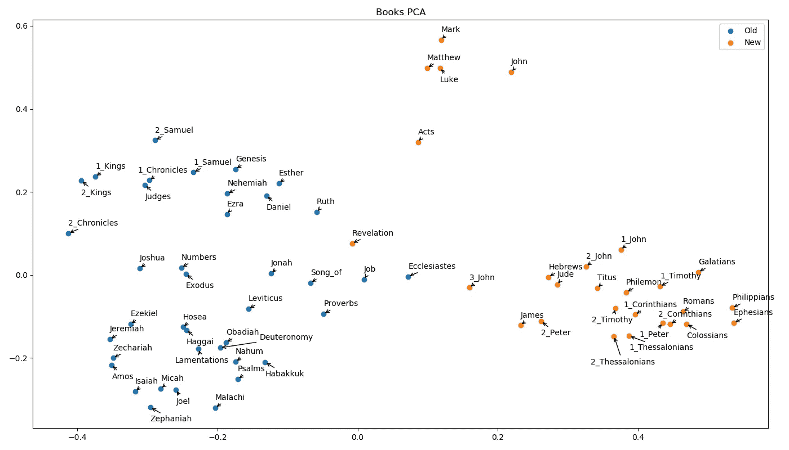

# 圣经章节和书籍的自然语言处理——与 Python 的相似性和聚类

> 原文：<https://medium.com/analytics-vidhya/nlp-of-bible-chapters-and-books-similarity-and-clustering-with-python-69c9073251e?source=collection_archive---------6----------------------->

圣经是我最喜欢的书之一。除了宗教，这里的目的是试图更好地理解圣经写作的背景，以及一系列的划分(章节，新约/旧约，福音书)在 NLP 方面是否有意义。

# 网络抓取和预处理——网络圣经

数据来自网络圣经门户，这是一个由一群学者做的新的免费翻译，附带了他们做的许多笔记。我真的很喜欢阅读这个版本，所以我选择它来进行分析。

关于框架，在 Python 上使用了 Selenium。该代码和该工作中的主要问题将在未来的新故事中发布。在这里，我们只加载数据。

```
df = pd.read_csv(**'data\\Original\\netBible.csv'**, index_col=0)
```

这些数据是按章节组织的。为了分析书籍，这些章节被连接起来。

```
df.book = [r.replace(**'netText_'**, **''**) **for** r **in** df.book]
df[**'chapter'**] = [r.split(**'_'**)[1] **for** r **in** df.book]
df[**'book'**] = [r.split(**'_'**)[0] **if** len(r.split(**'_'**)) == 2 **else** r.split(**'_'**)[0] + **'_'** + r.split(**'_'**)[1] **for** r **in** df.book]
```

我们还创建了一个特性来识别旧约还是新约。由于这些行的顺序与圣经中的顺序相同，我们只选择了《新约》的第一本书，并将其他行标在下面。

```
df[**'testament'**] = 0
firstMat = df.loc[df[**'book'**] == **'Matthew'**, :].index[0]
df.loc[firstMat:, **'testament'**] = 1
```

最后，我们替换了新的行字符(' \n ')，并删除了停用词。

```
df.text = [re.sub(**r'\d+'**, **''**, r.replace(**'\n'**, **' '**)) **for** r **in** df.text]
**for** t **in** stopwords.words(**'english'**):
    df.text = [s.replace(**' '** + t + **' '**, **' '**) **for** s **in** df.text]
```

# 矢量化—转换数字文本

这里使用的矢量化方法是术语频率—逆文档频率(TF-IDF)。这种矢量化方法提取文本中每个术语的频率，并将所有文档中每个术语频率的倒数相加。具体来说，我们使用了 sklearn 包。用于创建矢量器的代码如下。

```
vec = TfidfVectorizer()
vecRes = vec.fit_transform(df.text).toarray()
```

# 类似

在将文本转换成数字(向量)后，我们想计算出所有的书彼此有多少相似之处。为此，我们对 TF-IDF 提供的数据使用了余弦相似度。

```
*# Similarity of Chapters* vec = TfidfVectorizer()
vecRes = vec.fit_transform(df.text).toarray()
simRes = cosine_similarity(vecRes)
*## Testaments* vecResOT = vec.fit_transform(df[df.testament==0].text).toarray()
vecResNT = vec.fit_transform(df[df.testament==1].text).toarray()
simResOT = cosine_similarity(vecResOT)
simResNT = cosine_similarity(vecResNT)

*# Similarity of Books* vec = TfidfVectorizer()
df[**'_'**] = **' '** vecRes_books = vec.fit_transform(df.groupby(**'book'**)[[**'text'**, **'_'**]].agg(**'sum'**).text).toarray()
simRes_books = cosine_similarity(vecRes_books)
*## Testaments* vecRes_booksOT = vec.fit_transform(df[df.testament==0].groupby(**'book'**)[[**'text'**, **'_'**]].agg(**'sum'**).text).toarray()
vecRes_booksNT = vec.fit_transform(df[df.testament==1].groupby(**'book'**)[[**'text'**, **'_'**]].agg(**'sum'**).text).toarray()
simRes_booksOT = cosine_similarity(vecRes_booksOT)
simRes_booksNT = cosine_similarity(vecRes_booksNT)
```

结果表明，对于章节，平均相似度在 0.68%左右，最大相似度为 97.24%。对于书籍，平均值为 0.27%，最大值为 91.31%。

```
chaptersSim = pd.melt(pd.DataFrame(simRes)).value.drop_duplicates()
booksSim = pd.melt(pd.DataFrame(simRes_books)).value.drop_duplicates()

fig, ax = plt.subplots(nrows=1, ncols=2)

chaptersSim.hist(ax=ax[0])
ax[0].set_title(**'Chapters'**)
booksSim.hist(ax=ax[1])
ax[1].set_title(**'Books'**)
plt.show()
```


遗嘱分析表明，这些群体可能不会影响相似性的结果，但是，更多的测试将在这个主题中完成，并在未来的新故事中发表。

```
chaptersSimOT = pd.melt(pd.DataFrame(simResOT)).value.drop_duplicates()
booksSimOT = pd.melt(pd.DataFrame(simRes_booksOT)).value.drop_duplicates()
chaptersSimNT = pd.melt(pd.DataFrame(simResNT)).value.drop_duplicates()
booksSimNT = pd.melt(pd.DataFrame(simRes_booksNT)).value.drop_duplicates()

fig, ax = plt.subplots(nrows=2, ncols=2)

chaptersSimOT.hist(ax=ax[0, 0])
ax[0,0].set_title(**'Chapters - Old Testament'**)
chaptersSimNT.hist(ax=ax[1, 0])
ax[1,0].set_title(**'Chapters - New Testament'**)
booksSimOT.hist(ax=ax[0,1])
ax[0,1].set_title(**'Books - Old Testament'**)
booksSimNT.hist(ax=ax[1,1])
ax[1,1].set_title(**'Books - New Testament'**)
plt.show()
```


这些结果表明，尽管所有这些书都属于同一组，但它们可能不太相似。

# 使聚集

对于聚类任务，使用主成分分析(PCA)来降低维度。这种技术使得减少特征的总数成为可能。在这种情况下，数据集减少到 2 个要素。

```
dr = PCA(n_components=2)
pcaDF = pd.DataFrame(dr.fit_transform(vecRes))
pcaDF_books = pd.DataFrame(dr.fit_transform(vecRes_books))
```

在那之后，每一章/书只有两个数字特征，这使得在散点图中绘制结果成为可能。

```
fig, ax = plt.subplots(nrows=2, ncols=1)
fig.set_size_inches(14, 12)

*# Chapters* ax[0].scatter(pcaDF.loc[df.testament == 0, :].iloc[:, 0], pcaDF.loc[df.testament == 0, :].iloc[:, 1], label=**'Old'**)
ax[0].scatter(pcaDF.loc[df.testament == 1, :].iloc[:, 0], pcaDF.loc[df.testament == 1, :].iloc[:, 1], label=**'New'**)
ax[0].set_title(**'Chapters PCA'**)
ax[0].legend()

*# Books* ax[1].scatter(pcaDF_books.loc[testament.testament == 0, 0], pcaDF_books.loc[testament.testament == 0, 1], label=**'Old'**)
ax[1].scatter(pcaDF_books.loc[testament.testament == 1, 0], ax[1].set_title(**'Books PCA'**)
ax[1].legend()
plt.show()
```


通过分析该图，可以注意到形成了三个主要群体。我们将需要单独绘制图书图，并带有名称，这样我们可以更好地理解结果。

```
# Create object with book names
testament = df.groupby(**'book'**)[[**'testament'**]].agg(**'mean'**)
testament.index = range(0,66)
bookNames = df.groupby(**'book'**).agg(**'sum'**).index# Plot
fig = plt.figure()
fig.set_size_inches(14, 8)

pcaDF_books = pd.DataFrame(dr.fit_transform(vecRes_books))
plt.scatter(pcaDF_books.loc[testament.testament == 0, 0], pcaDF_books.loc[testament.testament == 0, 1], label=**'Old'**)
plt.scatter(pcaDF_books.loc[testament.testament == 1, 0], pcaDF_books.loc[testament.testament == 1, 1], label=**'New'**)
# Labels moved down
lbBelow = [**'Luke'**, **'Judges'**, **'Daniel'**, **'2_Kings'**, **'Haggai'**, **'Amos'**, **'1_Thessalonians'**, **'Colossians'**, **'2_Peter'**, **'Exodus'**, **'Joel'**, **'Zephaniah'**, **'Habakkuk'**]# Labels moved down and left
lbBelowL = [**'Lamentations'**, **'1_Peter'**, **'2_Timothy'**]# Labels moved left
lbLeft = [**'1_Chronicles'**, **'1_Corinthians'**, **'2_Corinthians'**]**for** p **in** pcaDF_books.index:
    print(bookNames[p])
    **if** bookNames[p] **in** lbBelow:
        plt.annotate(bookNames[p], (pcaDF_books.loc[p, 0], pcaDF_books.loc[p, 1]), xytext=(0, -18),
                     textcoords=**'offset points'**, arrowprops = dict(arrowstyle = **'->'**, connectionstyle = **'arc3,rad=0'**))
    **elif** bookNames[p] **in** lbBelowL:
        plt.annotate(bookNames[p], (pcaDF_books.loc[p, 0], pcaDF_books.loc[p, 1]), xytext=(-30, -18),
                     textcoords=**'offset points'**, arrowprops = dict(arrowstyle = **'->'**, connectionstyle = **'arc3,rad=0'**))
    **elif** bookNames[p] **in** lbLeft:
        plt.annotate(bookNames[p], (pcaDF_books.loc[p, 0], pcaDF_books.loc[p, 1]), xytext=(-15, 10),
                     textcoords=**'offset points'**, arrowprops = dict(arrowstyle = **'->'**, connectionstyle = **'arc3,rad=0'**))
    **elif** bookNames[p] == **'2_Thessalonians'**:
        plt.annotate(bookNames[p], (pcaDF_books.loc[p, 0], pcaDF_books.loc[p, 1]), xytext=(-30, -36),
                     textcoords=**'offset points'**, arrowprops = dict(arrowstyle = **'->'**, connectionstyle = **'arc3,rad=0'**))
    **elif** bookNames[p] == **'Deuteronomy'**:
        plt.annotate(bookNames[p], (pcaDF_books.loc[p, 0], pcaDF_books.loc[p, 1]), xytext=(50, 10),
                     textcoords=**'offset points'**, arrowprops = dict(arrowstyle = **'->'**, connectionstyle = **'arc3,rad=0'**))pcaDF_books.loc[p, 1]), xytext=(0, 10), textcoords=**'offset points'**)
plt.title(**'Books PCA'**)
plt.legend()
plt.show()
```



可以看出福音书彼此非常接近，表明这些书可能与所有其他圣经不同。有趣的是，使徒行传是福音书最接近的一点。

最后，我们使用 k-means 算法从这些数据点创建组。因为我们可以清楚地识别 3 个组，所以我们将 n_clusters 设置为 3。

```
# Train model
kmeans = KMeans(n_clusters=3).fit(vecRes)# Plot results
fig = plt.figure()
fig.set_size_inches(14, 8)

plt.scatter(pcaDF_books.loc[kmeans_books.labels_ == 0, 0], pcaDF_books.loc[kmeans_books.labels_ == 0, 1], label=**'Group 1'**)
plt.scatter(pcaDF_books.loc[kmeans_books.labels_ == 1, 0], pcaDF_books.loc[kmeans_books.labels_ == 1, 1], label=**'Group 2'**)
plt.scatter(pcaDF_books.loc[kmeans_books.labels_ == 2, 0], pcaDF_books.loc[kmeans_books.labels_ == 2, 1], label=**'Group 3'**)# Labels moved down
lbBelow = [**'Luke'**, **'Judges'**, **'Daniel'**, **'2_Kings'**, **'Haggai'**, **'Amos'**, **'1_Thessalonians'**, **'Colossians'**, **'2_Peter'**, **'Exodus'**, **'Joel'**, **'Zephaniah'**, **'Habakkuk'**]# Labels moved down and left
lbBelowL = [**'Lamentations'**, **'1_Peter'**, **'2_Timothy'**]# Labels moved left
lbLeft = [**'1_Chronicles'**, **'1_Corinthians'**, **'2_Corinthians'**]**for** p **in** pcaDF_books.index:
    print(bookNames[p])
    **if** bookNames[p] **in** lbBelow:
        plt.annotate(bookNames[p], (pcaDF_books.loc[p, 0], pcaDF_books.loc[p, 1]), xytext=(0, -18),
                     textcoords=**'offset points'**, arrowprops = dict(arrowstyle = **'->'**, connectionstyle = **'arc3,rad=0'**))
    **elif** bookNames[p] **in** lbBelowL:
        plt.annotate(bookNames[p], (pcaDF_books.loc[p, 0], pcaDF_books.loc[p, 1]), xytext=(-30, -18),
                     textcoords=**'offset points'**, arrowprops = dict(arrowstyle = **'->'**, connectionstyle = **'arc3,rad=0'**))
    **elif** bookNames[p] **in** lbLeft:
        plt.annotate(bookNames[p], (pcaDF_books.loc[p, 0], pcaDF_books.loc[p, 1]), xytext=(-15, 10),
                     textcoords=**'offset points'**, arrowprops = dict(arrowstyle = **'->'**, connectionstyle = **'arc3,rad=0'**))
    **elif** bookNames[p] == **'2_Thessalonians'**:
        plt.annotate(bookNames[p], (pcaDF_books.loc[p, 0], pcaDF_books.loc[p, 1]), xytext=(-30, -36),
                     textcoords=**'offset points'**, arrowprops = dict(arrowstyle = **'->'**, connectionstyle = **'arc3,rad=0'**))
    **elif** bookNames[p] == **'Deuteronomy'**:
        plt.annotate(bookNames[p], (pcaDF_books.loc[p, 0], pcaDF_books.loc[p, 1]), xytext=(50, 10),
                     textcoords=**'offset points'**, arrowprops = dict(arrowstyle = **'->'**, connectionstyle = **'arc3,rad=0'**))
    **else**:
        plt.annotate(bookNames[p], (pcaDF_books.loc[p, 0], pcaDF_books.loc[p, 1]), xytext=(0, 10), textcoords=**'offset points'**, arrowprops = dict(arrowstyle = **'->'**, connectionstyle = **'arc3,rad=0'**))pcaDF_books.loc[p, 1]), xytext=(0, 10), textcoords=**'offset points'**)
plt.title(**'Books K-Means'**)
plt.legend()
plt.show()
```


由 K-Means 模型创建的组与福音组中的使徒行传和埃斯特的新/旧/福音划分非常相似。传道书，最初是旧约全书，是“新约全书”中的一本书，而启示录则相反。

# 结论

如果你想开始学习面向 NLP 的 Python，这篇文章中的代码可能会对你有所帮助。然而，如果你想开始阅读圣经，从一大组(旧约、新约或福音书)开始，然后从你开始的地方转到其他相近的点可能会很有趣。我会建议你先读福音书，但这取决于你自己！

好好读书/编码！