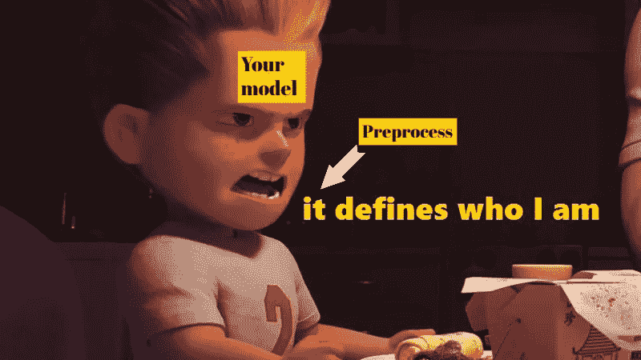

# 轻松进行 NLP 预处理

> 原文：<https://medium.com/analytics-vidhya/nlp-preprocess-with-ease-9a93e563df47?source=collection_archive---------10----------------------->

## **加速自然语言处理的数据清理**

本文旨在让读者了解用最少的代码处理常见的自然语言预处理所需的信息



资料来源:knowyourmeme.com

值得注意的是，无论是数据科学还是机器学习工程，预处理都是必不可少的过程。有些人可能会花很多时间在网上闲逛，寻找完成这一过程所需的工具。所以我决定撰写这篇文章，向您展示如何利用现有的 NLP 相关工具和框架。

在很大程度上，NLP 的预处理包括以下步骤:

1.  去掉标点符号
2.  转换为小写
3.  标记化
4.  删除姓名(或不在英语词典中的单词)
5.  删除停用词
6.  堵塞物
7.  填充/截断
8.  呈现模型可读的数据
9.  检查拼写并修复

与最初导入所有需要的库相反，您必须一直向上滚动才能看到方法是从哪个库导入的，我将在它们即将被使用之前导入它们。

假设我们已经有了所有需要的数据，并且已经在两个变量***X*** 和 **Y** 中有了它们，这两个变量分别是数据和标签。由于 **Y** 很多时候应该不会出现什么问题来处理，所以本文围绕 **X** 展开。为了一次涵盖所有情况，我将设置 **X** 如下:

```
X = [‘Despite    the rain, a boy is walking his.    dog \n on the streets   ‘]
```

这个例子涵盖了大多数关于自然语言的常见情况(换行符、连续空格、逗号、句号)。

让我们从第一行代码开始。

```
from keras.preprocessing.text import text_to_word_sequenceX = [text_to_word_sequence(X_point, filters=string.punctuation+"\n", lower=True, split=' ') for X_point in X]
```

上面的代码做了三件事: **(1)** 删除标点符号(也包括空格、连续空格、换行)， **(2)** 将字符转换成小写， **(3)** 标记文本。

对 X 进行这种处理后的结果将是:

```
print(X)# -OUTPUT-
[[‘despite’, ‘the’, ‘rain’, ‘a’, ‘boy’, ‘is’, ‘walking’, ‘his’, ‘dog’, ‘on’, ‘the’, ‘streets’]]
```

拼写检查 **(9)** 在数据准备中也起着非常重要的作用。所以我们可能想尝试一下，但是如果你有一个大的数据集，这个过程可能需要很长时间才能完成。

```
from spellchecker import SpellCheckerspell = SpellChecker()
X = [[spell.correction(word) for word in x] for x in X]
```

接下来，我们将继续用下面的代码处理 X 变量:

```
from nltk.stem.snowball import SnowballStemmer
from nltk.corpus import stopwordsstemmer = SnowballStemmer(‘english’)
stop_words = stopwords.words('english')
tmp_X = []for each in X:
    tmp_X.append([stemmer.stem(token) for token in each if token in eng_words and token not in stop_words])
X = tmp_X
```

上面的代码做了 3 件事: **(4)** 删除英语词典中没有的单词， **(5)** 删除停用词， **(6)** 词干。

当然，结果会是:

```
print(X)# -OUTPUT-
[['despit', 'rain', 'boy', 'walk', 'dog', 'street']]
```

> 词干是单词的核心或心脏。
> 
> 换句话说。词干是一个单词的最简单的形式，无论它是什么形式，它都可以使自己区别于其他任何单词。

正如你所看到的，我们已经成功地摆脱了停用词，并且在这样的变量中的所有单词都如我们所愿被词干化了。最重要的是，单词的顺序保持不变。

下一步可能会根据个人需求而有所不同。我们有多种方法将预处理数据转换为大多数现有机器学习模型可读的“进一步预处理”数据。

为了简单起见，我将向那些不熟悉 NLP 的人演示一种最基本也是最常用的技术，来掌握它的窍门，那就是 **(8)** 将每个单词转换成一个特定的整数。其余的需要先验知识，我可能会专门写一篇关于文本矢量化的文章**。**

我们将利用 keras 中可用的 tokenizer。因为它需要一个文档列表作为输入，所以我们需要做一些小的步骤来满足这样的要求，然后将其输入到 *texts_to_sequences* 方法中。

```
from keras.preprocessing.text import Tokenizerdoc = [' '.join(doc) for doc in X]
t = Tokenizer(split=' ', num_words=num_words)
t.fit_on_texts(doc)
X = t.texts_to_sequences(doc)
```

num_words 控制 tokenizer 只接受在 X 中出现次数最多的一定数量的单词。num_words 为 None 的 X 的结果如下(因为通常您希望保留所有单词):

```
print(X)# -OUTPUT-
[[1, 2, 3, 4, 5, 6]]
```

请记住，所有现有模型都接收固定长度的数据点。所以我们需要把它们塑造成同样的长度。填充和截断来了 **(7)** ！

```
from keras.preprocessing.sequence import pad_sequencesX = pad_sequences(X, maxlen=maxlen, padding=”post”, truncating=”post”)
```

*maxlen: int 要将数据点整形到的长度。*

*填充:字符串，“前”或“后”:在每个序列之前或之后填充。*

*截断:字符串，“前”或“后”:在每个序列之前或之后截断，直到达到所需长度。*

***现在它已经准备好输入你的模型了！！！***

# **一些想法**

希望你们喜欢这篇文章，并且已经真正了解了 NLP 预处理。

我自己花了太多时间寻找解决这个任务所需的库，我认为我需要将其中一些库限制在一个更窄的范围内。因此，这篇文章。

感谢您的阅读。请随时在下面留下您的评论，这样我可以让我的下一篇文章更好。你的话是我的成长。