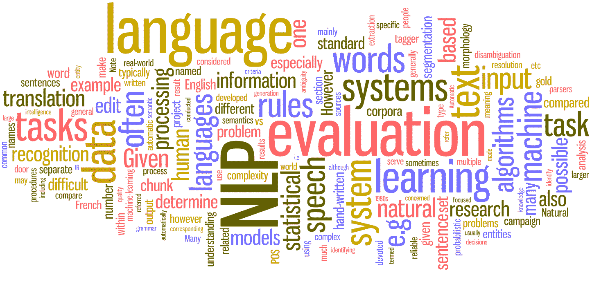

# NLP 预处理:一个有用且重要的步骤

> 原文：<https://medium.com/analytics-vidhya/nlp-preprocessing-a-useful-and-important-step-e79895c65a89?source=collection_archive---------16----------------------->

来源—[https://s3.amuction/post_images/435/NLP/original.jpg?1506438363](https://s3.amazonaws.com/re-work-production/post_images/435/NLP/original.jpg?1506438363)

# 介绍

GPT-3 模型由于其优异的性能，目前已经成为自然语言处理领域的研究热点。它有将近 1750 亿个参数，相比之下，GPT-2 有大约 15 亿个参数。这是自然语言处理领域的重大突破。但是在训练任何模型之前所需的预处理步骤是至关重要的。因此…