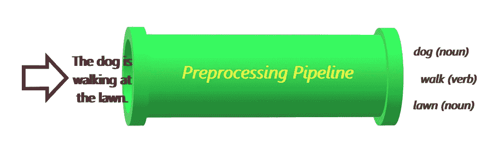
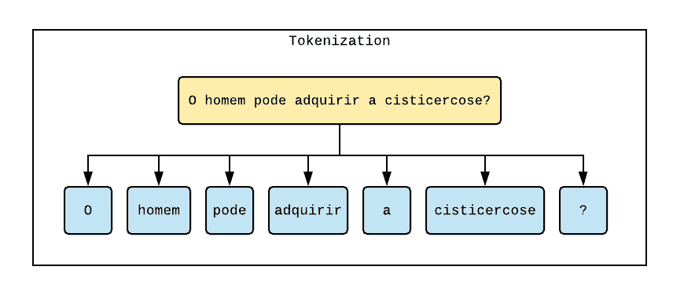
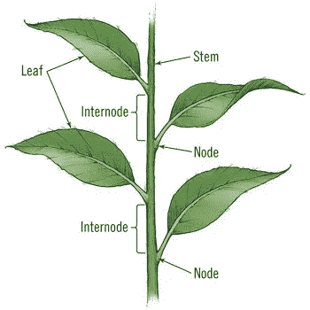
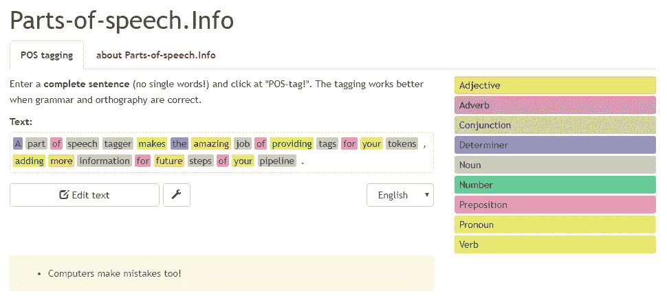
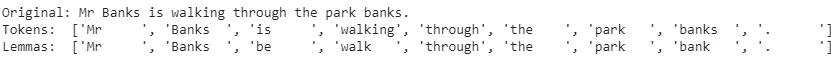
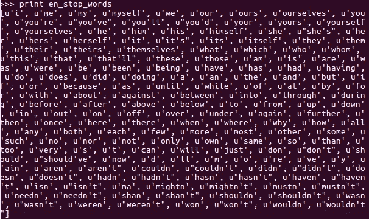
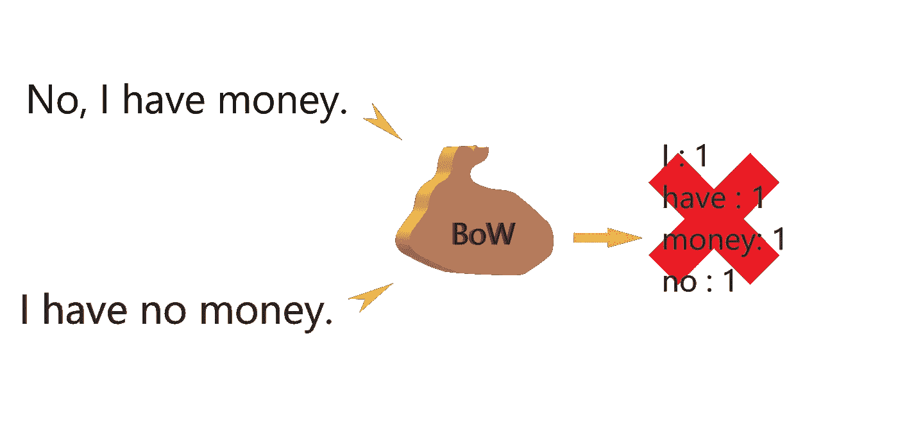
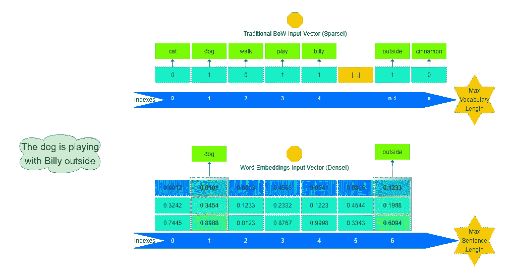
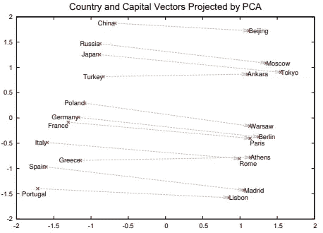
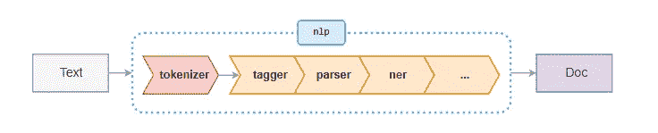

# NLP 预处理管道—什么，什么时候，为什么？

> 原文：<https://medium.com/analytics-vidhya/nlp-preprocessing-pipeline-what-when-why-2fc808899d1f?source=collection_archive---------4----------------------->

本文是旨在阐明 NLP 最重要的细节的系列文章的一部分。这里可以参考主文[。](/@tfduque/dissecting-natural-language-processing-layer-by-layer-an-introductory-overview-d11cfff4f329)

在一些故事之后，我们可以看到什么时候以及为什么要应用 NLP。在本专题中，有一个称为“预处理”的重要概念，它在数据科学的任何领域都很常见(您希望您的数据整洁干净，对吗？).

但是，在数字数据中，您通常会应用一些标准化规则(减少最大值和最小值之间的差异)，拖放和填充 nan(这意味着空值)并检测异常值(曲线外的点)；在 NLP 中，你会有更多的工作。

由于单词和短语比整数甚至实数更复杂(好吧，这里没有纯粹的数学家，但由于你可以用一组实数来表示一个单词，我们可以假设它们更复杂)，数据必须经过几个阶段的预处理，因此使用了术语预处理管道。



管道的阶段主要取决于你的项目和目的。在提及常见组合之前，让我们先快速介绍一下最常见的组合:

*   **裸字符串预处理**:通常不被认为是 NLP 预处理管道本身的一部分，是使用编程语言特定函数来修改输入字符串的行为(比如替换字符、应用正则表达式等)。

```
text = "My friend is at his home now. "
text = text.replace("My", "His")
text = text.strip()
```

*   **标记化**:这通常被认为是流水线的第一阶段(并且是所有未来阶段所需要的，因此是强制性的)。标记化将短语“拆分”成“标记”(或位)——每个标记可以包含单词、标点符号或特殊字符(如果语言是这样的话)。虽然看起来很简单，但是一个好的记号赋予器不仅仅是拆分空格字符。



我硕士的标记化例子。

*   **茎干**:茎是植物的“核心结构”。所有的叶子都与茎的不同部分相连。类似的概念也适用于单词。单词是叶子，它们的“核心”是茎(如果你明白我的意思，就想象一个 trie 数据结构)。词干化是将每个单词(由一个标记包含)减少到其核心元素的过程，减少了时间、性别(如果是语言情况的话)和年级变化(考虑到这些信息被附加到单词的最后部分)。通过减少字数，这意味着可以处理更少的稀疏数据(以及更少的信息，如果必须的话)！因此，在理想世界中，*吃*会变成*吃*，*做*和*做*会变成 *mak (* 耶，看起来怪怪的)等等……要知道**词干并不关心生成的词干是否存在于你的语言词汇中。**



茎，Ste，St，S

*   **【中间步骤】标记**:在介绍下一步之前，有一个步骤有时会被从业者忘记。标记过程是为每个令牌分配一个(或多个)标记的步骤。通常，这个标签是由标记表示的单词的词性(名词、动词、形容词、代词等)(称为形态分析)。标记过程通常使用基于规则的系统(经典)或机器学习(最近)来完成。这意味着令牌将携带更多的信息，而不仅仅是一个字符串，这在管道的未来阶段会有所帮助。请注意，如果您使用词干，这种标记可能(将)不能正常工作。



简单的词性标注由[词性信息](https://parts-of-speech.info/)提供。记住，电脑也会犯错！🤖

*   T21:这是词干的“进化”。你通常会更频繁地使用它。不是将一个单词简化为它的词干(实际上你会注意到这并不像它看起来那么有用)，而是将一个单词简化为它的引理，或者核心代表词。然而，为了正常工作，词条排序器需要识别词类(POS)——这就是词条排序器如何决定是否应该将银行词条排序为 *bank* (姓，银行，明白！？).目前，这是通过结合机器学习技术和手工规则来完成的。



一个我们可以看到词性标注发挥作用的例子。

*   **停止单词删除**:该活动旨在删除“不相关”的单词，将字典缩小到对模型有聚合价值的部分(相关和不相关的标准可能因上下文和目的而异)。在许多情况下，通常会删除“停用词”，或者代词、连词、限定词和介词(不要忘记标点符号)——这可以通过简单的词典或使用词性标注来完成(记住，首先需要将这些词放在适当的位置进行标注，然后可以删除它们😅🌴).另一种方法是删除最常用的单词。要知道这意味着丢失信息！做这件事需要你自己承担智力风险。



nlkt 的🛑words 列表。来自 tutorialexample.com[的又好又简单的教程。](https://www.tutorialexample.com/list-all-english-stop-words-in-nltk-nltk-tutorial/)

## 输入转换

现在，假设我们对自然语言输入进行了预处理，根据我们的意愿添加和删除信息。如果您实际上正在应用更专业的 NLP 活动，需要了解更多的步骤。然而，假设你正在做一个简单的文本分类任务。现在去哪里？

接下来的预处理步骤旨在为机器学习模型使用您的输入做准备(如何对它们进行矢量化)。

*   **计数矢量化(词袋):**为机器学习处理准备文本的经典方式。这种技术创建了一个文档词汇表中所有单词的字典(必须在训练之前定义)。然后，对于输入文档中的每个单词，字典会为该位置加 1。这导致了一个巨大的稀疏向量(一个列表，其中许多位置是空的，因为每个位置代表一个单词)。这就是为什么在此之前有一些预处理步骤集中在减少词汇多样性上。Btw，这就是所谓的 ***包字*** (一个包，因为【wo- arhem！[英语背诵文选袋子很乱——一进去就没有秩序。



看看计数矢量器(单词袋)的威力——它能让你变得富有！😆

*   **TF-IDF** :词频衬衫，逆词频。这是单词袋的一个进步，它不是仅仅根据频率给出分数，而是平衡所有文档中所有单词(频率)和单个文档中每个单词的分数。这个想法是，它能更好地洞察文档中哪些是最重要的单词。尽管如此，仍然破坏了词序(它还创建了一个巨大的向量来冒充字典)。


这张来自[computersciencemaster.com.br](https://www.computersciencemaster.com.br/2018/12/aula-09-aplicando-o-tf-idf.html)的图片展示了 TF-IDF 背后的想法:最重要的词既不是最频繁也不是最不频繁，而是位于中间的东西。

*   **单词嵌入:** *这个会长一点，多包涵。*

现在，以前的尝试有一个不方便的问题，即失去词序——这可能有几个不想要的副作用，比如在 BoW 图片中提到的那个。

但是，如果提供的值是一个文本，如何以一种连续的方式向机器学习程序提供它们所需要的数字输入呢？有人问:如果单词可以用 n 维向量来表示会怎么样？这是单词嵌入的基本解释——用向量表示的单词(记住:向量由系统的每个维度的强度和方向组成)。第一个也是最著名的单词嵌入实现是 Mikolov 等人的 [Word2Vec。](https://code.google.com/archive/p/word2vec/)

首先需要“训练”嵌入，然后您可以使用它们—这意味着在 n 维向量空间中为每个单词分配一个向量—单词向量是根据它在“训练数据”中出现的上下文来“定位”的。然后，不是一个频率和词汇大小的数组(让我们混合单词),而是一个固定长度的数组(比如，最大输入大小),其中填充了每个单词的嵌入(那些向量)。



这张图片代表了单词嵌入的最大优势之一——它保留了单词的顺序。另一个优点是减少了输入向量的稀疏性(不再有大的零向量，先生！)

有趣的是，这表明这些嵌入可以捕获一些单词语义，例如在向量空间中相关单词“更近”(或几乎同样远)。



Mikolov 等人使用单词嵌入获得的结果的图形表示—此图显示嵌入可以基于上下文捕获一些单词语义(注意，单词是空间中的点—向量！).

最后，必须补充的是，单词嵌入对于人工神经网络(和深度学习)特别好，它在向量乘法上运行得非常好。

**！重要！句子填充/截断**:如果你使用单词嵌入来准备你的输入，*每个输入的句子长度相同*是非常重要的。为此，通过在每个句子的末尾多次添加一个特殊的中性“单词”(标签)，填充被用来增加句子的长度。相反，如果句子太长，就必须缩减——这通常是通过简单的截断机制完成的(丢失数据，但如果你处理足够大的数据集，就不会有问题)。

## **管道示例:**

在下一节中，我将给出一些简单的例子，说明哪些步骤可以用于一些常见的 NLP(和机器学习)任务。其中一些将会在以后的文章中实现，但是如果你想使用一些已经可用的工具并得到一些结果，可以这样做:



默认空间管道示例

*   **经典情感分析:**

(1)清除数据移除特殊字符:仅保留对上下文有用的内容；

(2)标记化

(3)词性标注

(4)词汇化:这会让我们减少词汇量。如果不需要精度和速度，最好使用词干。

(5)删除停用词:它们在这里不会有太大帮助。在词性标注后这样做有助于过滤不需要的词性(保留形容词、副词、动词和名词)

(6)使用 BoW 或 TF-IDF (TF-IDF 可以抑制停用词移除的需要，但会保留大量词汇)。

(7)应用你传统的机器学习规范化技术。

剩下的就是默认的机器学习。

*   **基于规则的文本信息提取:**

这是我在 StackOverflow nlp 问题中发现非常频繁的一个活动。它与能够从非结构化文本输入中提取结构化信息相关。预处理管道非常简单，因为我们想要享受大部分的形态学特征:

(1)标记化

(2)词性标注

(3)解析:这是我们没有谈到的一个步骤——因为我不认为它是“预处理”,而是核心活动。

(4) NER:另一个我不认为是“预处理”的步骤。

→应用语法/语义规则匹配器。

*   **智能文本自动完成/NLG:**

(1)标记化

(2)填充/截断

(3)嵌入

→在 RNN 或变压器模型上训练。

附注:在 transformer 模型中，几乎不需要预处理，因为大量文档的使用超过了任何输入的不规则性。基本上，只需要好的嵌入。

*   **经典问答:**

(1)清除数据中的特殊字符

(2)标记化

(3)词性标注

(4)引理化

(5)鞠躬

对问题和答案做同样的预处理。之后，将问题向量与所有答案向量进行比较(有许多方法可以做到这一点，这不是本文的目的)。

虽然上面列出的预处理步骤并不详尽，但它涵盖了自然语言处理从业者必须了解的主要活动。下一步是通过它们开始我们的旅程！

[首先，我们来玩符号化——不，如果你想要一个好的产品，它并不像看起来那么简单！](/@tfduque/tokenization-building-a-tokenizer-and-a-sentencizer-c19a00393c19)

**部分参考文献:**

[](https://towardsdatascience.com/building-a-question-answering-system-part-1-9388aadff507) [## 从头开始构建问答系统—第 1 部分

### 该系列的第一部分集中在脸书句嵌入

towardsdatascience.com](https://towardsdatascience.com/building-a-question-answering-system-part-1-9388aadff507) [](https://towardsdatascience.com/introduction-to-natural-language-processing-nlp-323cc007df3d) [## 自然语言处理(NLP)简介

### 你有没有想过你的私人助理(例如:Siri)是如何构建的？你想自己造吗？我们谈谈吧…

towardsdatascience.com](https://towardsdatascience.com/introduction-to-natural-language-processing-nlp-323cc007df3d) [](https://spacy.io/usage/processing-pipelines) [## 语言处理流水线空间使用文档

### 当您在文本上调用 nlp 时，spaCy 首先对文本进行标记以产生 Doc 对象。然后在…中处理该单据

空间. io](https://spacy.io/usage/processing-pipelines) [](https://www.nltk.org/book/ch03.html) [## ch03.rst2

### 重要提示:从本章开始，我们的程序示例将假设您开始您的交互式会话或您的…

www.nltk.org](https://www.nltk.org/book/ch03.html)