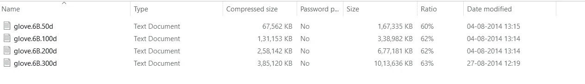
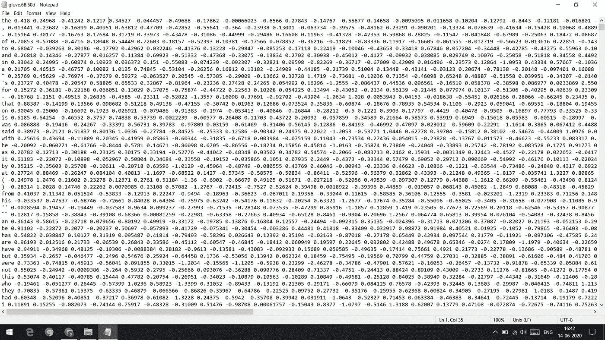
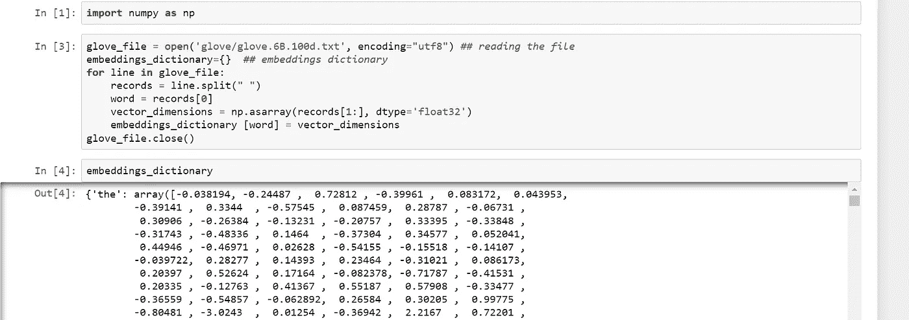
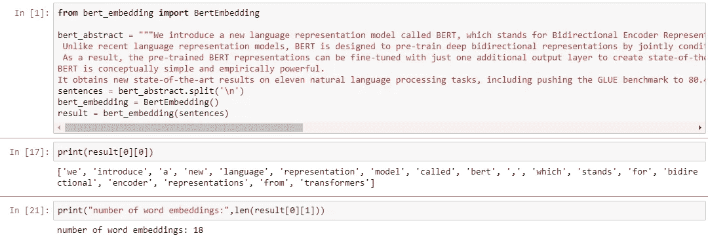
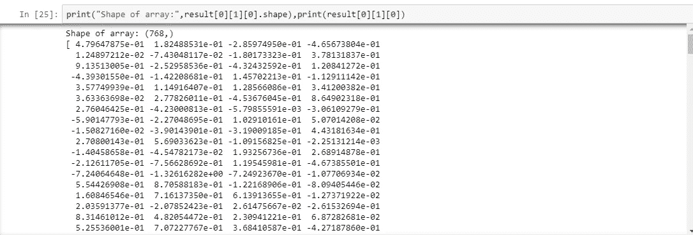
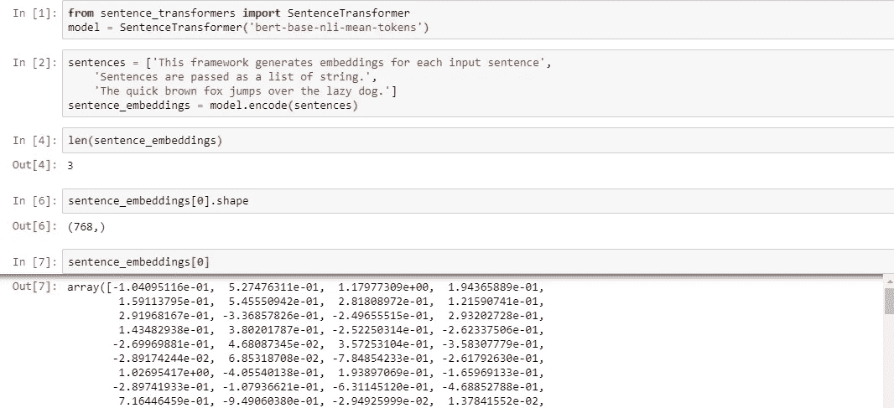

# NLP 表示技术第三部分

> 原文：<https://medium.com/analytics-vidhya/nlp-representation-techniques-part-3-18383b037e15?source=collection_archive---------30----------------------->

我已经在我的第一篇博客中解释了单词袋和 TFIDF。你可以在这里找到****。**然后我们讨论了 TFIDF 的一些问题，并在第 2 部分学习了单词嵌入，以及如何使用 Word2Vec 生成它们。如果你想了解这些，你可以在这里找到**。****

****我将向你展示一些先进的方法和嵌入去当你在一个工业规模的项目工作。这些包括手套、BERT 单词嵌入、BERT 句子嵌入和多语言嵌入。****

# ****手套****

****该手套是斯坦福大学在 2014 年提出的模型。目标是非常相同的，即学习单词嵌入和单词之间的关系。你可以在这里 **阅读更多关于 Glove [**的内容。**](https://nlp.stanford.edu/pubs/glove.pdf)******

**幸运的是，我们没有从头开始训练这个模型，所以我们可以在用例中使用预先训练好的嵌入。你所要做的就是点击 [**这里**](https://nlp.stanford.edu/projects/glove/) 然后去**下载预先训练好的词向量**部分。**

**你会发现这些选项，如维基百科，推特，这是他们用来训练模型的训练数据类型，所以单词嵌入的概念将取决于语料库。您还会发现 400，000，190，000 或 220，000，000 个词汇，这些是该型号词汇中的单词数。**

**我已经下载了 400K Vocab 的维基百科版本。您会发现这四个文件的名称类似于 glove50d、glove100d 或 glove300d。**

****

**如果是 50 维或 100 维等等，这些 50d、100d 或 200d 指示每个单词的向量的大小。**

****

**一旦你打开这个文件，你会发现每一行的第一个值是单词，其余的行是单词的单词嵌入。现在我们只需要阅读这个文件，并提取单词 embeddings。**

****

**我使用这段代码将文本文件转换成一个字典，字典中的单词作为键，单词嵌入作为相应的值。**

**你可以看到我们只是循环遍历文件中的每一行，并在拆分为 word 并保留为数组后设置第一项。我在这里使用 Numpy，因为它高效快捷。**

**现在我们有了语料库中每个单词的单词嵌入。你可以应用我们在 [**第二部分**](/analytics-vidhya/nlp-representations-techniques-part2-86b2fd4e04b9) 中讨论的所有技术，并根据你的需要使用它们。**

**单词嵌入的大小有 50 维或 100 维的变化。一般来说，这个想法是，如果我们使用向量大小更大的单词嵌入，我们就有更多关于单词的信息，所以我们应该在准确性方面得到提高，因为模型有更多的信息可以学习。**

**我在用 LSTM 神经网络做一个简单的情感分析。我试着从 50 维提升到 100 维，准确率提高了 5-7 %,但是当我提升到 300 维时，提升幅度就没那么大了，只提高了 0.03 %。你可以在你的项目上试试，看看有没有帮助。**

## **手套 vs Word2Vec**

1.  **如果你想用英语单词的知识建立一个通用的产品，并且你不想训练单词嵌入，那么就去找 Glove 吧**
2.  **如果你想为你的特定领域训练模型，可以使用 Word2Vec 或者像 Bert 这样更好的工具，并使用迁移学习。**

**3.下载 glove 嵌入时，请始终查看 vocab 的大小，因为如果明天的新单词不在您的 Vocab 中，您将根据您的实现获得 0 或 null。**

# **伯特**

**B**I directional Encoder re presentations from Transformers(BERT)**是 Google 开发的用于 NLP(自然语言处理)任务的模型。**

## **培训:**

**正如我们在 word2Vec 中看到的，我们试图根据上下文预测单词，如最后 4 个单词，或者我们有一个单词，我们试图预测上下文单词。**

**在伯特的训练中。他们寻求一种新的方法，在语料库中随机屏蔽 15%的单词，模型的目标是预测被屏蔽的单词。**

****

**这是一张双向 LSTM 的照片，但是伯特是在一个变形金刚模型上训练的。这个想法几乎是一样的。**

**使用具有注意机制的转换器从左到右和从右到左处理序列，以生成更好的嵌入**

> **例如:**
> 
> **我想看电影**
> 
> **会被这样处理:**
> 
> **我→想→想→看→a→电影**
> 
> **电影→a→观看→到→想要→I**

**那么两个结果将被连接并向前传递。**

**你可以想象通过双向 LSTM 来处理它，你有一个单词序列 x0，x1，x2，x3，每个单词被表示为一个独热向量，**

**在每个时间戳，我们都有一个新单词和一个来自上一个时间戳的隐藏状态。这两者被连接起来，并馈入 LSTM 单元，这个过程被重复，直到句子结束或最大序列长度。现在想象对同一个句子或单词序列做同样的过程，从 x3 倒排到 x2，x1，x0。在处理的最后，我们只是合并两个输出，并将其向前传递。**

**他们使用了带有注意力机制的变形金刚，但想法几乎是一样的。你拿起一个神经网络，给它一串文本，它试图预测一些单词，通过这样做，模型学习单词之间的关系。**

**现在我们已经有了训练好的模型，我们可以使用这个模型来生成单词嵌入。**

****

**这是具有输入层、隐藏层和输出层的神经网络的简单图像。想象一下，用整个 BERT 架构移除该输入层，然后将该架构的输出馈入密集或隐藏层，该层进一步连接到输出层。**

**输出层只是单词，但我们想要单词嵌入，而不是单词，因此我们移除该输出层，并获取网络中最后一个隐藏层的输出，并将其视为单词嵌入。**

**你可以尝试这样做，但是我发现了一个很好的单词嵌入的 Bert 实现 [**这里**](https://github.com/imgarylai/bert-embedding) 。你可以安装它，然后嘣！！它已经准备好了**

**你只需传递你的句子列表，它会返回你文本中每个单词的单词嵌入列表。**

****

****使用 BERT 进行单词嵌入****

**你可以看到我有一些文本，我已经把这些文本分成句子，现在我把这些句子传递给模块，它返回给我一个句子列表以及每个单词的单词嵌入。确保传递给它的是一个句子列表，而不是一个句子，因为这样它会为每个字符返回一串数字。该模块还在内部将句子分成单词，因此您也不必这样做。**

**该模块将返回一个句子列表，对于每个句子，您将获得一个单词列表。**

**这些模块返回给我一个长度为 18 的列表，它对应于上面截图所示的句子中的 18 个单词。**

****

**对于句子中的每个单词，你将得到一个大小为 786 的向量。你会得到一个向量列表，每个向量对应于句子中的每个单词。**

**你可以在这里阅读更多关于他们的****。你还会发现更多类似 BERT-1024 的型号。这不仅仅是在一个有更多参数和隐藏状态的更大的模型上训练的同样的想法。因此，您可以选择 786 或 1024 等嵌入式系统。******

> ******由于 Bert 是一个基于 transformer 的模型，你也可以用它进行迁移学习。它基本上采用了整个 BERT 模型，并针对您的特定任务(如文档分类或问题回答)对其进行了微调。但那只是以后的话题。******

****现在你已经有了单词 embeddings，你可以使用 LSTM 或者一些机器学习模型来完成你的 NLP 任务。****

## ****伯特的问题****

****虽然 BERT 非常适合 NLP 任务，但是它也有一些问题。****

****1)我已经讨论了如何将单词嵌入转换成句子嵌入，例如对单词嵌入取平均值，以及其他在 [**部分**](/analytics-vidhya/nlp-representations-techniques-part2-86b2fd4e04b9) **中详细讨论的技术。**如果你将这些技术应用于 BERT 嵌入，它们不会给你想要的结果。这是一篇相关的 [**论文**](https://arxiv.org/abs/1908.10084) 在这里他们讨论了这个问题。****

****他们还解决了这个问题，他们使用一个暹罗网络对架构进行了一些改变，然后针对句子级别的任务而不是单词级别的任务训练了整个模型。你可以免费使用他们的模型。在这里 可以找到所有 [**的信息。**](https://github.com/UKPLab/sentence-transformers)****

********

****伯特句子嵌入****

****你只需要安装程序库，模型就可以免费使用了。你只需要实例化这个模型，并把句子列表传递给它，它就会返回每个句子的句子嵌入列表。****

****这里我只给出了 3 个句子，每个句子我得到了 1 个向量。它具有与 BERT 原始模型相同的长度，即 768，但是这次它具有整个句子的信息，而不仅仅是一个单词。****

****你可以使用这个句子嵌入来做所有的机器学习工作，比如文档聚类或者文本分类。****

****2) BERT 是一个非常大的模型，因此它需要 GPU 一次处理多个批次。你可以在上面讨论的同一个库中找到 BERT 的精华版本。****

> ****蒸馏是一个过程，他们试图尽可能多地从神经网络中删除层，而实际上不会失去模型的准确性。这个过程导致神经网络具有更少的层、更少的参数，因此模型的大小缩小了。****
> 
> ****总是搜索提炼的版本并尝试使用它，你不总是需要那个大模型来获得更好的准确性。****

****既然您已经看到了如何从 word2vec、Glove 和 Bert 生成嵌入。是时候转向一些有趣的东西了，比如多语言嵌入。****

# ****多语言嵌入****

****多语种嵌入不仅仅是一个非常酷的概念，你可以为不同的语言进行嵌入，并将它们映射到同一个空间。****

****举个例子:如果你有一个英语句子，现在你把它转换成了一个向量。法语中有同样的句子，现在你把它转换成了一个向量。这两个向量在该特征空间中彼此非常接近。****

****这也有助于我们为不同的语言建立系统，当你有一个 NLP 问题，但是你没有足够的语言训练数据。该模型可以在多语言嵌入而不是普通嵌入上训练，现在该模型可以只接受多种语言的输入。你不需要改变管道中的任何东西。****

****你可以在这里 **找到我对垃圾邮件分类器 [**的多语言嵌入的完整实现。**我仅使用英语数据进行训练，并尝试了不同的语言来测试该模型，虽然我建议您应该有一些针对您的目标语言的训练数据。你可以点击](https://github.com/shivambatra76/Multilingual-Spam-classifier)** 查看更多关于多语言嵌入的信息。****

**如果您在这方面需要任何帮助，或者只想进行与数据科学相关的讨论，请联系 [**me**](https://www.linkedin.com/in/shivam-batra-34b63a17a) 。**