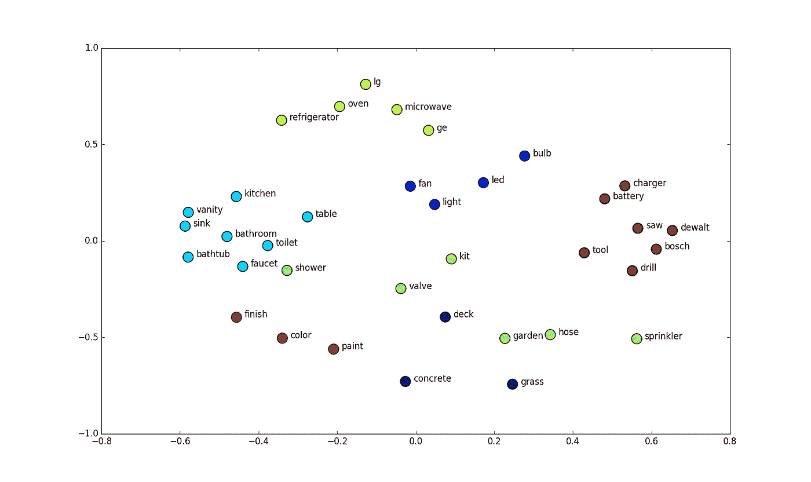
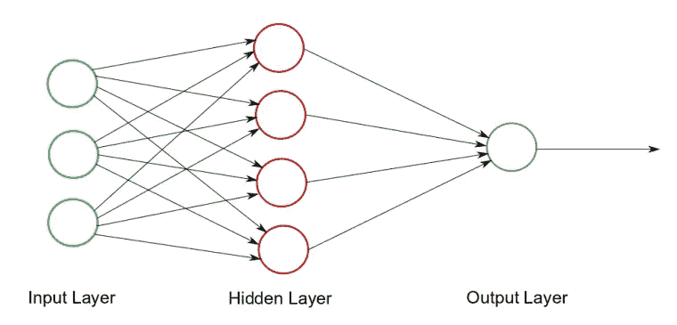
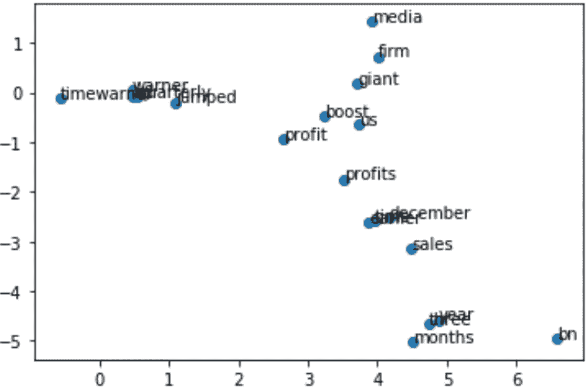

# NLP 表示技术第二部分

> 原文：<https://medium.com/analytics-vidhya/nlp-representations-techniques-part2-86b2fd4e04b9?source=collection_archive---------21----------------------->

在之前的博客中，我们已经看到了如何使用一包单词和 TF-IDF 将 NLP 数据转换为向量，然后在此基础上开始运行一些算法。如果你想了解他们，点击 [**这里**](/@shivambatra76/nlp-representations-techniques-e6d69096d4ad) 。在这篇文章中。我将解释像单词嵌入这样的嵌入技术，这些嵌入是如何生成的，以及如何使用单词嵌入来生成句子嵌入。

# TFIDF 问题

首先，我想告诉大家 TFIDF 的一些问题，以及为什么我们可能不想在工业规模的应用中使用它。
TFIDF 和单词包从你的数据集中生成向量，所以你的数据集中的每个单词都将被视为一个特征，从而产生非常大的向量表示。假设你有一个 10K 单词或更多的单词，这很常见。那么为每个句子生成的每个向量将具有 10K 或更大的大小。

比如:
我讨厌电影→【1，0，0，0.3，…。bunch zeroessss](1 * 10K 大小或更大)
假设你有一个 5 万句的数据集，你想在这个数据集上训练你的模型。然后，转换后的训练集将是一个形状为 50000*10000 的矩阵，这可能不适合您的内存，而且这是一个非常大的稀疏矩阵(它有很多零，或者不包含那么多信息)。此外，这些向量没有我将在本文后面解释的语义信息。

因为你已经从训练集中生成了向量，假设你在测试期间得到了一个新单词，而这个单词不在你的词汇表中，你将得到一个零分，这是不好的，因为这个单词可能接近训练集中的某个单词，但你仍然得到一个零分。这也适用于拼写错误和其他因素，如大写单词或词干技术，但可以通过编写脚本或监控预处理阶段来解决。
但是我们如何解决这种类似的文字问题呢？
这可以通过使用预训练模型(如手套)或一些最新的基于变压器的模型(如 BERT 或 XLNET)中的单词嵌入来解决。

# 单词嵌入

词嵌入是一种特殊的向量，它可以表示文本，同时保持文本之间的语义相似性。

单词嵌入背后的直觉是生成向量，使得彼此相似的单词在特征空间中彼此靠近。这只是一张图片，显示了风扇、灯、led 和灯泡等词相互靠近，冰箱、微波炉和烤箱等词相互靠近。但是我们如何生成这些嵌入或向量呢？
想法是你创建一个神经网络，给它一个任务来预测序列中的下一个单词，通过这样做，模型将学习单词和它们的上下文之间的差异。

## 生成单词嵌入的过程。

我们希望建立一个神经网络，它可以将单词作为输入，并生成一个新单词作为输出，通过这样做，模型将学习单词之间的映射。

我们将拥有:

1.  输入层
2.  隐蔽层
3.  输出层

我们首先对 vocab 中的每个单词使用一个热编码向量表示。

> 例如，你有一个这样的词汇
> 
> vocab →{喜欢:1，电影:2，无聊:3，讨厌:4}

对于热向量，我们将创建一个与 vocab 大小相同的向量，用零填充，然后在单词索引所在的位置标记 1。

然后一个热点矢量表示会是这样的

> 爱过→[1，0，0，0](vocab 的大小= vocab 的大小)
> 电影→[0，1，0，0]
> 无聊→[0，0，1，0]
> 讨厌→[0，0，0，1]

现在给定一个单词序列，你可以传递一个单词序列作为输入，一个单词作为输出
你必须决定你将给出多少个单词作为输入，然后这将创建一个输入向量，看起来像

> [第一个字热编码矢量，第二个字热编码矢量，…等等]
> 
> ***输入向量的大小=要考虑的字数*一键向量表示的大小(或 vocab 的大小)***

所以你会有
1)one-hot encode 输入向量(姑且称之为 I)
2)一些矩阵(W)这是我们要在整个过程中学习的隐藏层的权重。
3)输出向量(G →地面真实值)

现在，我们可以在输出层使用 softmax 函数来训练这一切，以最大化地面真实的可能性，并使用梯度下降来最小化损失。
现在您可以计算:

> 使得损失最小

现在，一旦你训练了你的模型，你就可以使用这个隐藏层为你的输入提供单词嵌入。所以你将删除最后一层并在输入中传递一个新的测试数据，最后隐藏的输出被当作单词嵌入。
一般来说，这些网络要深得多，也就是说，它包含更多的层，并在更大的 vocab 大小上进行训练，如 400K 甚至更大。
该任务的培训方法和架构有多种变化

## 单词嵌入生成方法

1)你可以只看一个单词，试着在上下文中为接下来的单词训练它。你将给出一个单词输入，并产生一个单词序列。这类似于 Word2Vec 使用的 Skip-gram 方法。

2)您可以查看序列，即输入中的单词序列和输出中的一个单词。这类似于用于训练单词嵌入的连续单词包方法。你可以在这里阅读更多

**3)还有一种方法，其中我们使用一个特殊的令牌跳过其中一个单词，并在作为输入的单词序列上训练网络，模型试图预测被跳过的单词。这用于训练一些最新的基于变压器的模型，如 BERT。**

**幸运的是，我们不必从头开始训练这些网络，我们可以使用这些开源的预训练模型。其中有 Glove、Bert 和多语言 Bert。在下一部分，我将向您展示如何在您的项目中使用它们中的每一个。但是首先，看看 Word2Vec。**

# **Word2Vec**

**Word2Vec 是 Google 提出的第一个单词嵌入模型。它可以用于根据您的训练集专门为您的领域创建嵌入。**

**我有一个不同领域的新闻文章数据集，如体育、娱乐和政治，所以我只是将它们添加到一个文件中，并将其作为模型的输入来学习单词嵌入。**

****

**这些是我的模型在这个过程中学到的单词嵌入，因为你可以看到单词利润，提升，巨大，公司紧密地躺在一起，远离像月和年这样的单词。**

> ****如果想用 Word2Vec 训练自己的单词嵌入。去我的** [**GITHUB**](https://github.com/shivambatra76/WORD-EMBEDDINGS) **随便用。****

## **如何使用单词嵌入**

**现在我们已经看到了如何创建和生成单词 embedding。**

**这些是单词嵌入，而不是像我们在单词包方法和 TFIDF 中使用的句子嵌入。**

> **句子嵌入是为每个句子 ie 生成的固定大小的向量。**
> 
> **[一些数字…](向量的大小等于 vocab 的大小)**
> 
> **但是单词嵌入是每个单词的固定大小的向量**
> 
> **[一些数字…..](尺寸取决于型号)**

**我们通常有可变长度的句子，那么我们如何使用单词嵌入来生成固定长度的向量，以便我们可以对它应用一些机器学习或深度学习算法。**

**我已经探索并尝试了这些方法，你也可以使用它们。**

## **平均法**

**这是一个非常基本的方法，但是效果相当好。**

**假设我们有一个长度为 4 的句子。**

> **单词 1 →单词 1 的嵌入**
> 
> **单词 2→单词 2 的嵌入**
> 
> **单词 3→单词 3 的嵌入**
> 
> **单词 4→单词 4 的嵌入**

**因为所有的嵌入都来自同一个模型，所以它们将是大小相等的向量。我们可以计算包含所有单词信息的所有向量的平均值，然后将该平均向量视为句子嵌入。**

> **例如:**
> 
> **向量 1 →[1，3，5]**
> 
> **向量 2 →[3，5，1]**
> 
> **平均向量→[2，4，3]每个维度的平均值**

## **串联方法**

**在这种方法中，我们可以设置一个固定长度的句子，然后将嵌入的单词水平堆叠，得到一个句子向量。**

**例如:**

**单词 1 →单词 1 的嵌入**

**单词 2→单词 2 的嵌入**

**单词 3→单词 3 的嵌入**

**单词 4→单词 4 的嵌入**

**让我们假设你的句子长度是 4**

> ****句子嵌入:****
> 
> **[单词 1 嵌入、单词 2 嵌入、单词 3 嵌入、单词 4 嵌入]**
> 
> **(句子嵌入的大小=句子长度*单词嵌入)**

**在实践中，我们有一个更长的句子长度，我们用零填充缺失的单词嵌入。**

**所以如果你在一个句子中有 3 个单词，但是你的句子嵌入长度是 4。那么，在这种情况下，我们将使用填充技术，简单地在缺少的值中添加零，这样我们就保持了特定的长度。**

> ****句子嵌入:****
> 
> **[word1 嵌入，word1 嵌入，word1 嵌入，[0，..一串零](单词嵌入的大小)]**
> 
> **(句子嵌入的大小=句子长度*单词嵌入)**

> **有时候我们也会出现这种情况，你的句子长度设置为 4，但是你输入的句子超过了 4。在这种情况下，我们必须将句子删减到所需的句子长度。这可以从开始或结束时进行**

**这是我们用来训练基本神经网络的东西。**

## **生成嵌入矩阵方法**

**这种方法用于训练一些先进的神经网络，如 LSTMS，RNNS 和 GRU**

**例如，你有一个这样的词汇。**

> **vocab →{喜欢:1，电影:2，无聊:3，讨厌:4}**

**我们将把我们的句子和词汇分配给每个单词。**

> **注意:我们不会给 1 分或 TFDIF 分。**

**示例:**

**我喜欢这部电影**

**喜爱的电影→[1，2，0，0，0](1 用于 vocab 中分配的令牌，2 用于相同的令牌，0 用于填充)(向量长度=句子长度)**

**在这种方法中，我们采用我们的 vocab，并为 vocab 中的每个单词生成嵌入，从而创建一个嵌入矩阵。**

> **嵌入矩阵看起来会像这样:**
> 
> **[**
> 
> **word1，word1 嵌入]，**
> 
> **word2，word2 嵌入]**
> 
> **…**
> 
> **单词 n [单词 n 嵌入]**
> 
> **]**

**通常，标记 1 的单词嵌入将在嵌入矩阵的第一行，同样标记 2 的单词嵌入在嵌入矩阵的第二行。**

**现在将把这些符号化的句子输入馈送到模型，并提供这个嵌入矩阵作为嵌入层的权重。**

****

**这是神经网络中使用的展开的 RNN 细胞的图像。我不会深入 RNN 的细节，因为这不是本文的范围，但我会给你一些想法。**

**这个想法不是一次性处理整个句子。这些 RNN 细胞处理一个单词作为输入，并产生一个隐藏状态，这是一段编码信息。然后，这个隐藏状态与作为输入的下一个单词一起被反馈到 RNN 单元，这个过程被重复，直到整个序列被处理，然后最终的隐藏包含关于作为输入给出的所有单词的信息。现在，这个最终的隐藏状态被认为是句子嵌入，这些句子嵌入被馈送到神经网络，该神经网络将在分类或一些其他任务上被训练。**

**我希望你看完这篇文章后有所收获，如果你需要任何帮助，请联系 [me](https://www.linkedin.com/in/shivam-batra-34b63a17a/) 。**

**我在第 3 部分讨论了 Glove、BERT 嵌入和多语言嵌入。你也可以在这里查看****。******

****领英:[https://www.linkedin.com/in/shivam-batra-34b63a17a/](https://www.linkedin.com/in/shivam-batra-34b63a17a/)****

****https://github.com/shivambatra76****