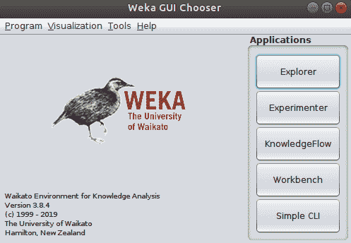
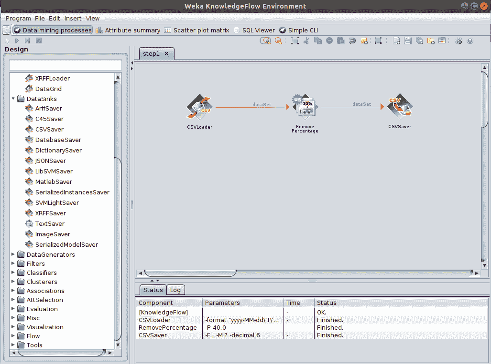
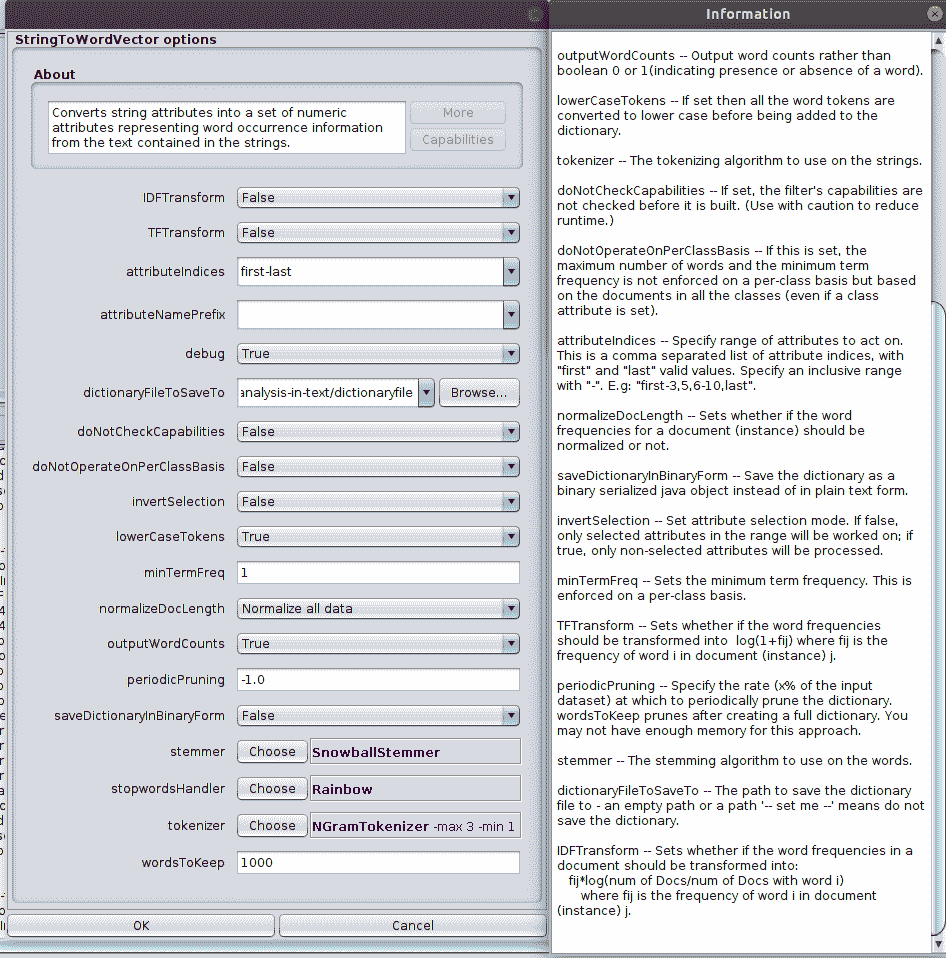
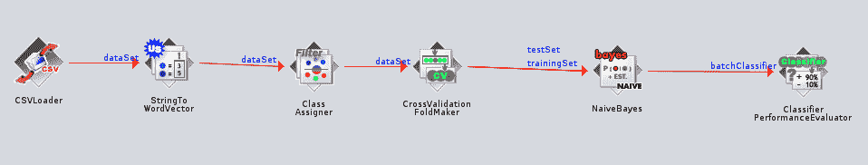
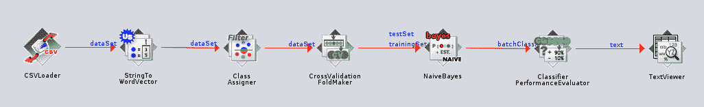
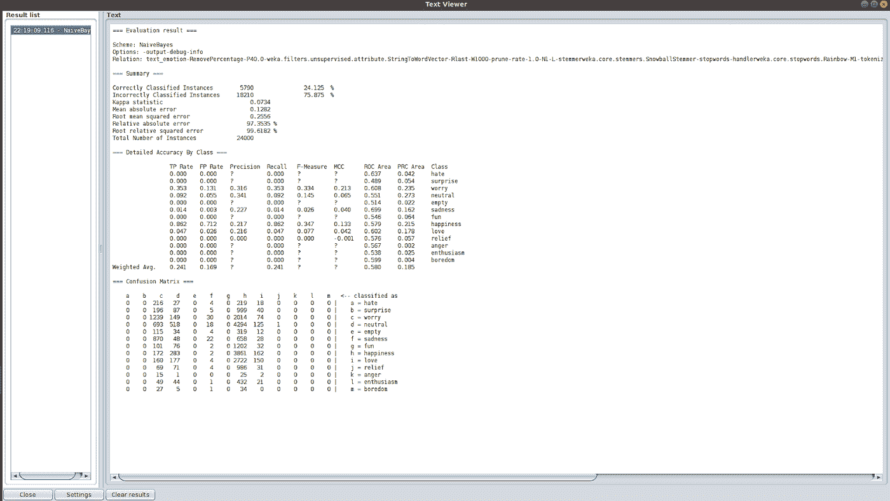

# 使用 WEKA 的 NLP

> 原文：<https://medium.com/analytics-vidhya/nlp-sentiment-analysis-using-weka-hands-on-648af0859797?source=collection_archive---------3----------------------->

# 新西兰黑秧鸡

Weka(怀卡托知识分析环境)是由怀卡托大学开发的开源软件，用于自动化数据挖掘任务。Weka 是一种灵活而简单的实现方式，它是可移植的，因此是独立于平台的。它提供了可用于任何选定数据集的各种算法。以下是 Weka 在其应用程序中提供的应用程序(图 1):

*   Explorer:对原始数据或通过抓取收集的数据执行数据挖掘任务的接口
*   实验者:允许用户在数据集上执行不同的实验变化
*   知识流:具有拖放功能的资源管理器。支持从以前的结果中进行增量学习
*   工作台:将所有 GUI 界面合并成一个
*   简单的 CLI:命令行界面，用于从终端执行命令

*图 1: Weka GUI*

以下是软件中可用于数据处理任务的技术:

## 方法

*   联合
*   属性选择
*   分类器
*   簇
*   预处理过滤器

## 算法

*   KNN 分类
*   多目标进化算法
*   C4.5 决策树
*   学习向量，量子化粒子，群优化

# 自然语言处理

在当今世界，人们试图为他们的日常工作部署机器，向用户传达结果或正在进行的过程报告非常重要。NLP 可以帮助机器学习交流的方式，或者帮助我们理解机器想要传达给我们的信息。

以下是已经在使用 NLP 的热门领域:

*   文章(新闻、博客等)
*   预测您的搜索
*   聊天机器人
*   电子邮件分类
*   视频/网站推荐
*   文本到语音转换

这样的例子不胜枚举。对于实践环节，我尝试进行情感分析，结果可用于分析用户的行为和习惯。

# 动手 WEKA

情感分析是机器学习中非常关键的一部分。这不仅有助于机器知道一个人表现出什么样的情绪或情感，而且还能做出同样的反应。在这里，我试图为 Twitter 文本数据库实现一个简单的情感分析。

我们将使用知识流进行以下分析。

**第一步:获取数据集**
我从[这里](https://data.world/crowdflower/sentiment-analysis-in-text)获取数据。数据集有四个字段，“tweet_id”、“情绪”、“作者”和“内容”。我们已经使用了来自数据源的 CSVLoader。该数据大约有 40，000 个数据点或实例或数据行。处理如此大的数据集可能是复杂和耗时的，而且我的处理器无法处理这么多的数据和处理，所以我随机删除/修剪了 50%的数据。这可以通过使用*filter . unsupervised . instances . remove percentage .*来完成，该数据需要存储在另一个 CSV 文件中，因此，需要添加另一个组件来以 CSV 格式保存该文件。所以现在我的知识流数据源有三个组件。CSVLoade r，*滤波器。unsupervised . instances . remove percentage*和 *DataSink。CSVSaver*

1.  右键单击 CSVLoader 图标并选择配置。您将能够编辑 CSVLoader 属性并添加文件。
2.  设置数据后，您现在可以将该数据集输入到下一个组件，即过滤器。
3.  右键单击 CSVLoader 并选择数据集。它会自动显示一个箭头/线会出来。把它接到过滤器上

> **提示**
> 用户可以配置和调整组件的属性。
> CSV saver 组件从过滤器获取数据集输入。

我们已经完成了数据集的导入。我已经运行了知识流，窗口现在看起来像图 2 。

*图 2:步骤 1 完成*

**第二步:数据预处理**

要实现情感分析，需要大量的预处理，包括:

1.  单词解析和标记化
2.  停用词删除
3.  词汇化或词干化
4.  特征抽出

这将提高处理后期的效率。这一步骤不仅减小了数据集的大小，还移除了可能在系统/算法中产生偏差的冗余数据。

我从*filters . unsupervised . attribute*中选择了 StringToWordVector 过滤器。通过右击过滤器，过滤器的属性是可编辑的(*图 3* )。

*图 3: wordtovec 属性*

**第三步:分类**

对于分类，我们需要首先使用*filter . unsupervised . attribute . class assigner .*定义将要预测的类或特征。我们需要将其添加到步骤 2，即预处理数据中。

我们需要使用验证折叠创建训练数据和测试数据，我们将需要*evaluation . crossvalidationfoldmaker .*这将给我们两个数据集，测试和训练。我们可以将它直接用于我们的分类器。

分类器，有几个用于情感分析的分类器，包括:

*   朴素贝叶斯
*   随机森林
*   物流回归
*   XgBoost

还有一些。我用过朴素贝叶斯分类器，*classifier . Bayes . naive Bayes .*

经过训练的模型将以批处理格式给出结果，因为我们对 10 个折叠使用交叉验证，所以我们将得到 10 个输出。我们需要添加另一个组件来评估分类器的性能，*evaluation . classifierperformanceevaluator .*在步骤 3 之后，知识流图如图 4 所示。

*图 4:第三步完成*

**步骤 4:结果**
处理完成，对于可视化部分，我们有*visualization . text viewer .*有各种方法可以查看最终结果，但文本看起来更适合任务。

结果如*图 6* 所示。
最终的知识流程图出现在*图 5* 中。

*图 5:情感分析的知识流程图*

*图 6:分类后的结果*

# 结论

Weka 是一个神奇的工具，用于机器学习。对于计算和内存利用部分，有几个限制，可以通过稍微调整来克服。我一直在编码并尝试实现这些算法，Weka 让我变得非常容易。除了学术项目或任务，我会使用 Weka