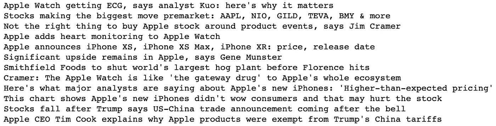
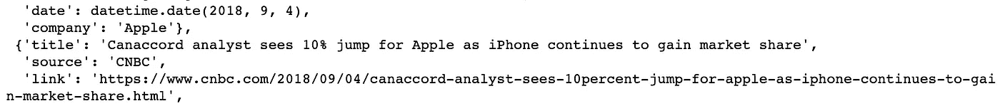
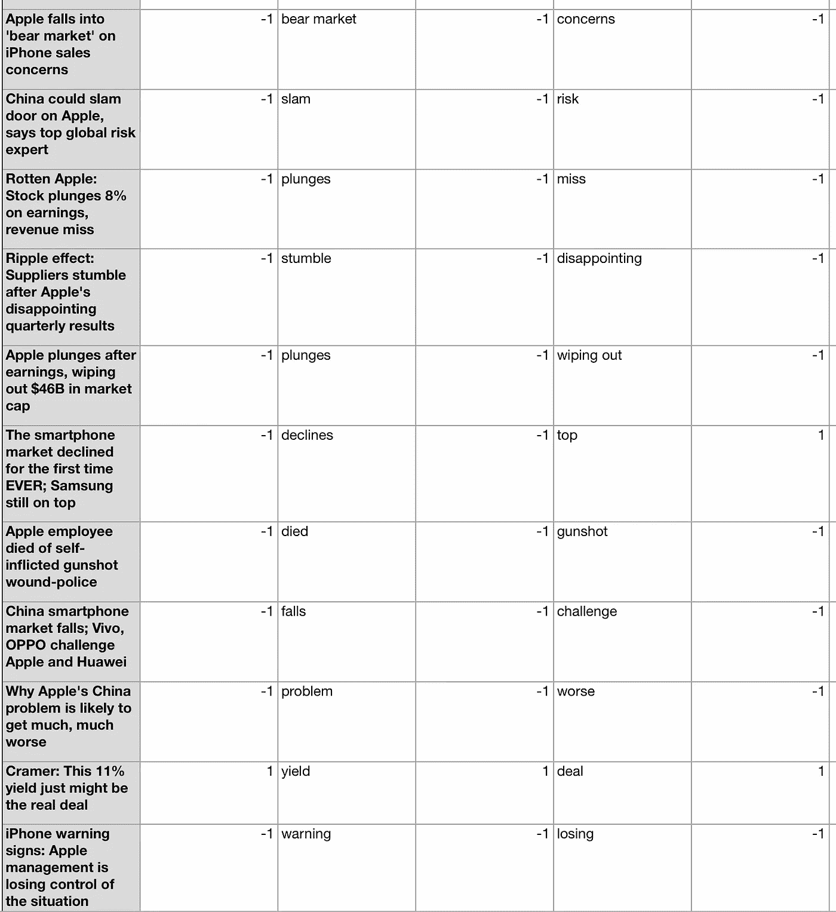
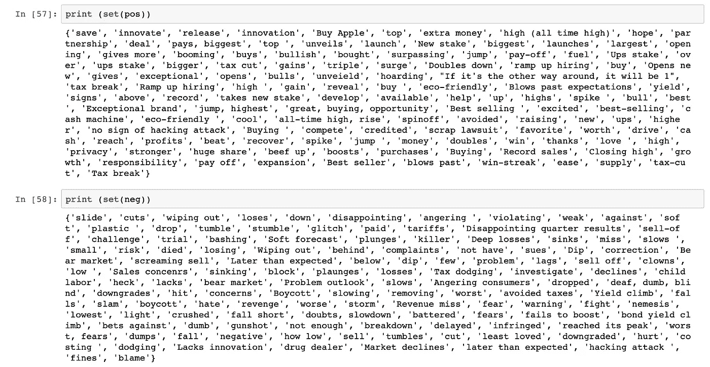
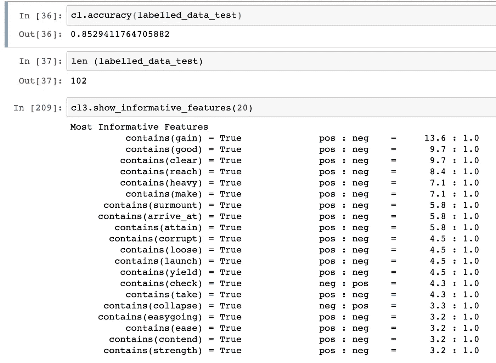
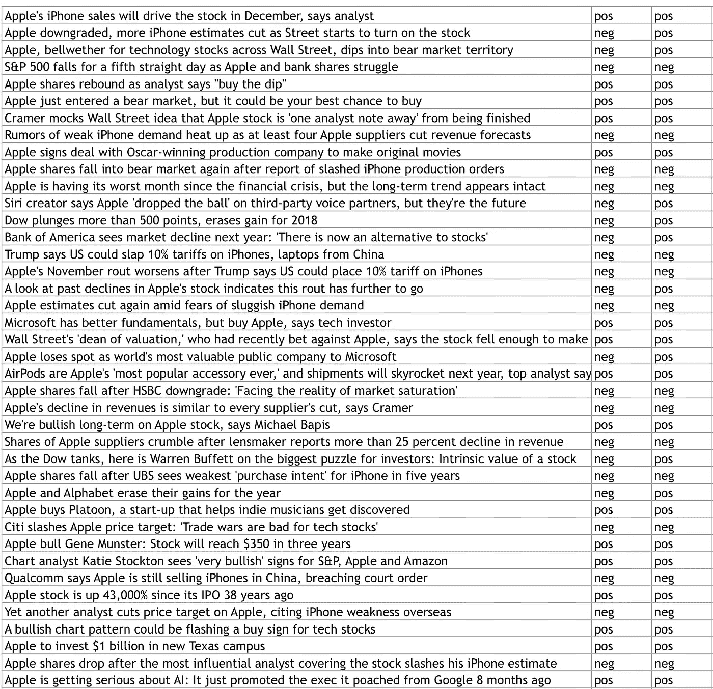

# NLP:使用苹果股票新闻的监督训练和测试机制的框架

> 原文：<https://medium.com/analytics-vidhya/nlp-skeleton-of-a-supervised-training-and-testing-mechanism-using-apple-stock-news-3c0561ac2c53?source=collection_archive---------31----------------------->

自然语言处理是机器学习的一个分支，旨在提出能够从文本数据中提取某些指标的模型。那里存在的大多数数据都是文本格式的，因此从数据科学的角度来看，能够从中提取价值是很有价值的。现有的自然语言处理技术可以产生一系列的输出，其中最大的是情感分析、主题识别和文本创建。在这篇文章中，我将使用一个经过基础训练的朴素贝叶斯模型来生成特定文本领域的情感分析分数。

任何机器学习努力的起点都是数据，你需要特征和标记输出，以便能够训练你可能选择的任何模型。我其实是要纠正自己，说起点不仅仅是数据，而是有标签的数据。如果你足够幸运，在你想要评估的特定类型的文本上找到一个带标签的数据集，你很幸运，你的工作已经完成了 80%。然而，绝大多数情况下并非如此，带标签的数据对于大多数类型的文本来说都是不可用的。

为了清楚地区分这样一个项目中的不同部分，我会通过问自己一些在这样的项目中经常出现的问题来组织它，并回答我是如何处理它们的。

**我们要看的文本数据的领域是什么？**

让我们看看财经新闻标题，更具体地说是关于苹果股票的新闻标题。出现这种情况的一些主要原因是:

1.  有大量的数据，这是一个被谈论很多的东西。
2.  使用的行话范围相对狭窄。有一套术语用来描述股票的走向。这将有助于训练模型。还有重复发生的事件，所以如果我们想扩展到一些其他的 NLP 输出，比如主题识别，我们也可以添加。
3.  股票有数字值，因此我们可以衡量从数据中得出的情绪与那些数字值(如股价和成交量)相比如何。

下面是标题的一个例子:



标题示例

我们也有一些关于标题的额外数据。



我们从谷歌新闻中搜集了这些数据。这也是一个完整的过程，我将在另一篇文章中强调这个抓取机制。

**我们如何给数据贴标签？**

我希望有一个自动化的机制，并且在一定程度上我们可以以自动化的方式扩展它，但是除非有预先存在的一组标记数据，否则这是一个手动过程。甚至像斯坦福这样有自己的 NLP 基础设施的学校，也有社区工作，人们手动标记数据集。



1 =正，0 =中性，-1 =负

以上是我们的新闻标题的子集，标有值。我们给完整的标题贴上标签，我们看着标题，试着提取出使情绪倾向于某种方式的词，并且也给它们贴上标签。这将在我们训练和测试的时候给我们一个以上的选择，并允许我们比较两种不同的训练方法。

就数据集大小而言，我们有超过 6000 个未标记的标题，我们已经从其中的 200 个标题中标记并提取了关键词。通过这个过程，这是我们能够提取的一组积极和消极的单词。



我们有一套 253 个单词。一点也不全面，但这是一个起点。

现在我们有了数据，下一步做什么？

嗯，我们需要弄清楚如何训练和测试数据。

**训练:**

我们将使用 NLP 最基本的库，TextBlob。它非常强大，但是简化了情感分析的训练和测试。有许多不同的选项，最常见的是 NLTK 来完成这项任务，它允许对参数进行更高级别的控制，但这篇文章是为了简单起见，因此 TextBlob 最适合我们的需要。

为了进行格式化以便能够进行训练，TextBlob 需要一个元组列表，其中元组的值是特征，标签是 pos 或 neg。

```
train_set = [('cuts', 'neg'),
 ('cash', 'pos'),
 ('highs', 'pos'),
 ('dropped', 'neg'),
 ('correction', 'neg'),
 ('highs', 'pos'),
 ('launch', 'pos')]from textblob.classifiers import NaiveBayesClassifier
cl = NaiveBayesClassifier(train_set)
```

上面是一个迷你元组，我用它来展示输入参数的格式。这是我上面提到的 253 个单词的集合，以那种格式作为训练数据。

**测试:**

为了创建一个数据集来测试我们的分类器，我回到我们的 6000 个标题集，随机挑选了 100 个标题，并给它们贴上标签。这是它的一个子集。

```
labelled_data_test = [('Monster sues Apple’s Beats over headphone deal', 'neg'),
 ('Apple Pay to help drive multiyear expansion at VeriFone', 'pos'),
 ('Why millennials hate the stock market', 'neg'),
 ('Apple still on top as U.S. corporate cash holdings reach $1.73 trillion',
  'pos'),
 ('Carl Icahn’s tweet worth over $8 billion for Apple investors', 'pos'),
 ('Apple’s stock to blame for more than half Dow’s drop', 'neg'),
 ('Apple confirms iPhone 6 Plus camera glitch', 'neg'),
 ('Dow closes down triple digits as stocks end one of worst first weeks ever',
  'neg'),
 ('7 reasons Apple is a buy-—commentary\n', 'pos'),
 ('Tech giants face child labor storm', 'neg'),
 ('Adoption of Apple Pay slows, survey suggests', 'neg'),
 ('Trump calls for Apple boycott over San Bernardino killer phone encryption',
  'neg'),
 ('Apple unveils 9.7-inch iPad Pro, 4-inch iPhone SE', 'pos')]
```

下面是输出的样子:



因此，从 102 个标题的迷你列表中，我们的分类器正确预测了 87 个标题。考虑到我们用于训练和测试的数据量很少，我认为这还不算太糟糕。以下是我们分类的一个子集:



标题、手册标签、分类标签

**结论:**

我想我能够在一定程度上强调训练一个用于情感分析的 NLP 分类器的基本过程。我们如何改进这个实验，答案就是更多的数据。

我们可以把它带到哪里？

嗯，可能性是无穷无尽的。我很想探索一些深度学习技术，但这些技术需要大量的数据，一想到坐在那里数小时标记数据，我就害怕。我对这与一些股票数值的关系很感兴趣。看看这些分类是否与股票价格有关系会很有趣。如果在正面或负面消息发布时，股票价格或交易量有一个模式，并且这对交易者和其他决策者有价值。一旦我们开始分析这种关系，我们也可以看看话题检测，看看是否有特定的新闻话题与给定的情绪有影响。

我将挖掘我的代码，并期待不久后发布一个 github repo。