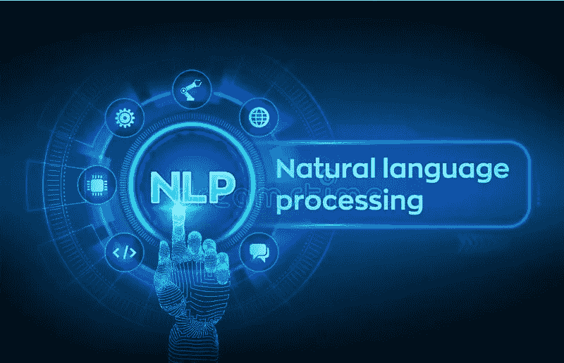

# NLP:关于文本处理的一些有用的注释

> 原文：<https://medium.com/analytics-vidhya/nlp-some-useful-notes-about-text-processing-e0eb0c0bf2f3?source=collection_archive---------25----------------------->

## 文本处理的 Python 技术

**简介**

M 任何时候我们都会听到关于机器学习的谈论，但重要的是要知道，在机器学习之前还有其他管道在大数据研究中发挥着重要作用。一些例子是 ETL(提取、转换和加载)或 NLP(自然语言处理)。