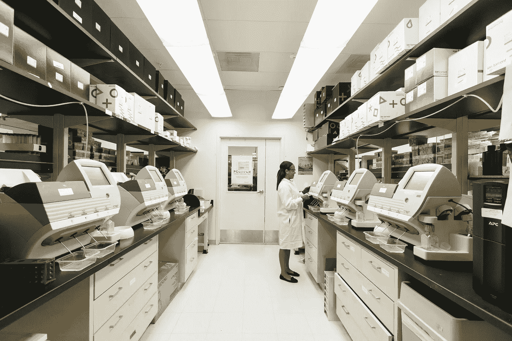
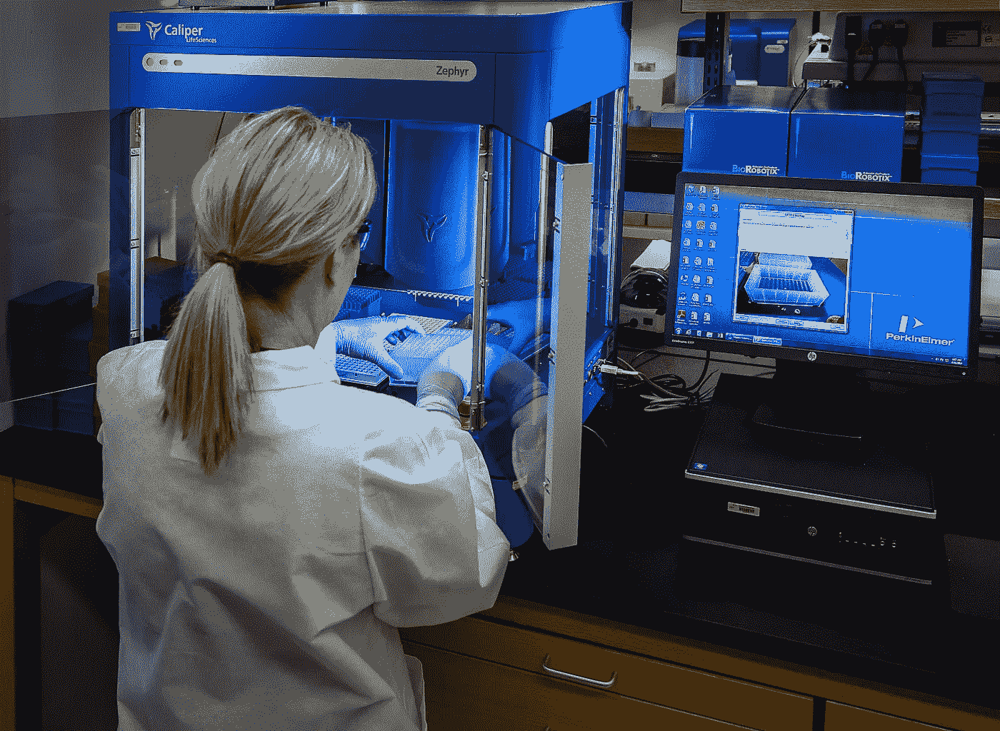

# NLP:在医疗保健中同步语言和数字

> 原文：<https://medium.com/analytics-vidhya/nlp-syncing-language-and-numbers-in-healthcare-e7c280c745bd?source=collection_archive---------19----------------------->

安迪·凯利在 [Unsplash](https://unsplash.com/) 上的照片

任何不是生活在 21 世纪的人都一定听说过自然语言处理或 NLP。它是教会机器以最有效的方式理解类似人类的语言的技术。维基百科是这样定义的:

> 自然语言处理(NLP)是语言学、计算机科学、信息工程和人工智能的一个分支，涉及计算机和人类(自然)语言之间的相互作用，特别是如何对计算机编程以处理和分析大量自然语言数据

[亚历山大·奈特](https://unsplash.com/@agkdesign)在 [Unsplash](https://unsplash.com/) 上拍照

在机器和人类之间的语言交流过程中出现的最根本的障碍是，机器除了数字什么也不懂，而人类不以数字的形式进行交流。这就是 NLP 来拯救和弥合人与机器之间的差距！

医疗保健行业每天都会产生数不清的文档和记录。如果 NLP 能够提供帮助，那么像处方中的药物细节、在跟踪患者生命体征时收集的数据，甚至是涉及患者和医生的一般信息交换等有价值的信息都可以得到极大的利用。

以下是 NLP 给医疗保健行业带来的一些最基本的好处:

## **语音识别**

在一天的整个过程中，医生很难记录患者互动过程中的每个重要方面。一个简单的 NLP 支持的语音识别系统可以充当人工智能助手，并为医生提供他们需要的东西:不知疲倦的速度！

## **临床文件改进**

随着医疗保健领域的数据量不断增加，处理信息变得越来越困难。CDI 有助于确保正确捕获和存储信息，以便进行高级处理。

[国立癌症研究所](https://unsplash.com/@nci)在 [Unsplash](https://unsplash.com/) 上拍摄的照片

## **数据挖掘研究**

众所周知，医疗保健的研究领域如此广阔，以至于专家们要花费一生的时间去了解大海中的一滴水。在人工智能辅助系统的帮助下，这些系统可以根据需要从网上收集可靠和相关的数据，研究过程得到了极大的促进，效率得到了提高。

## **计算机辅助编码**

计算机辅助编码系统研究可用的文档并识别文档中的特定术语或短语，如在实体识别中。此后，根据要求或相关性，将所识别的单元链接到行动项目或代码。这种编码通常是手动执行的；然而，据观察，当编码员利用计算机辅助编码时，这一过程所需的时间大大减少。

图片由[疾控中心](https://unsplash.com/@cdc)在 [Unsplash](https://unsplash.com/) 上拍摄

## **临床决策支持**

这是一个相对新颖的创新，承诺提供知识和特定于个人的信息，这些信息经过巧妙过滤，并在需要的时间和地点呈现。这些特征可以包括通知和提醒、患者总结、临床指南、参考文献和几个其他这样的重要数据，这些数据可以证明不仅对于患者和医生，而且对于一般工作人员都是非常有益的。

这些只是一组基本的 NLP 开发，更像是更大计划的垫脚石。NLP 的力量可能是惊人的，紧张的研究只是缩小了数字和文学之间的差距。机器熟练掌握我们世界的语言，并开始参与所有能引领我们前进的对话，这只是时间问题。

照片由[欧文比尔德](https://unsplash.com/@owenbeard)在 [Unsplash](https://unsplash.com/) 拍摄