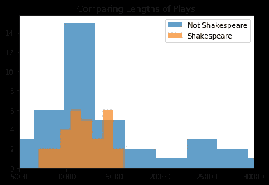
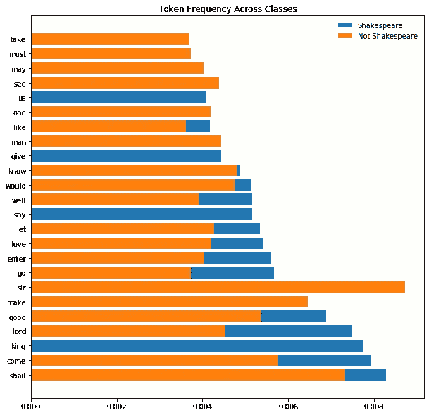
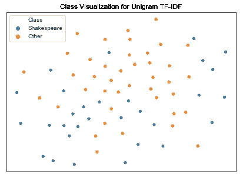
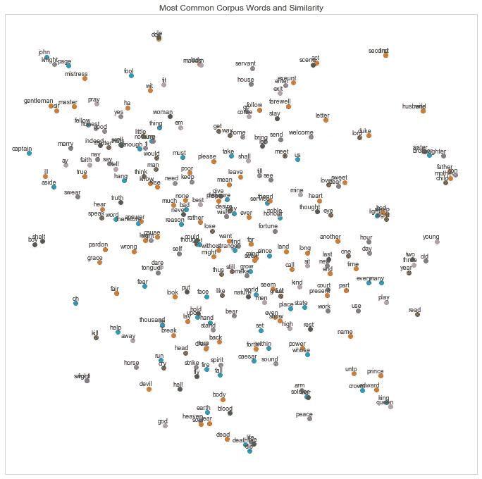
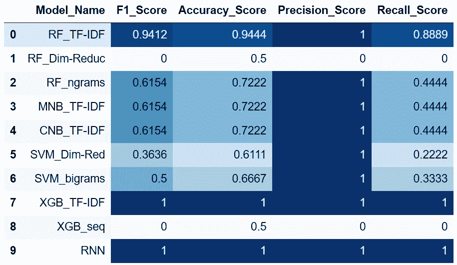
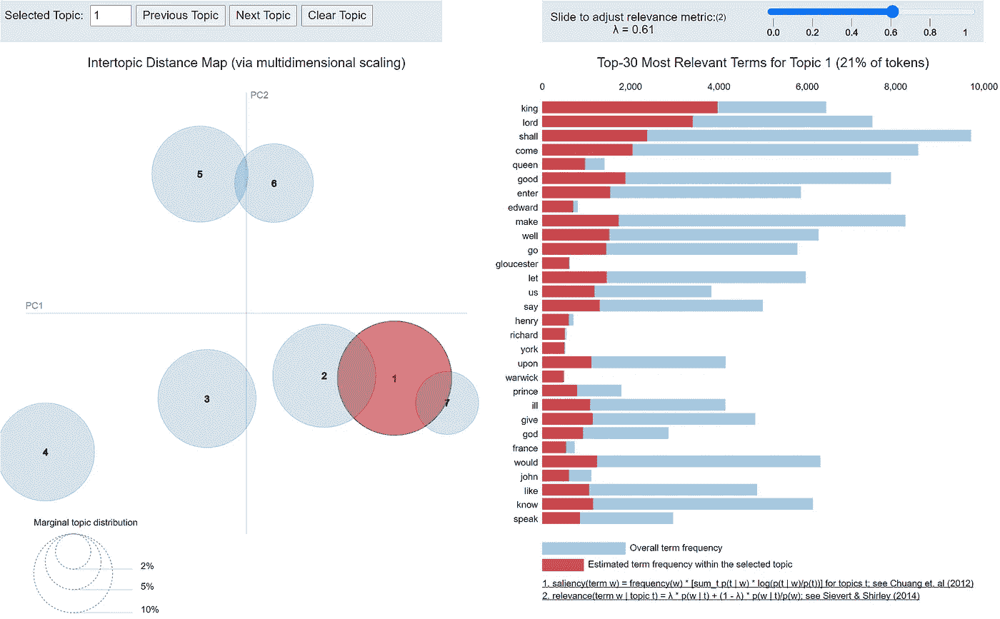

# 莎士比亚戏剧中的自然语言处理技术

> 原文：<https://medium.com/analytics-vidhya/nlp-techniques-with-shakespeares-plays-d8843ba26a4f?source=collection_archive---------7----------------------->


照片由[马特·里奇](https://unsplash.com/@voodoojava?utm_source=unsplash&utm_medium=referral&utm_content=creditCopyText)在 [Unsplash](/s/photos/shakespeare?utm_source=unsplash&utm_medium=referral&utm_content=creditCopyText) 上拍摄

## 用 Bard 清理和分类文本

考虑到今天生成的大量文本数据，自然语言处理是数据科学最有趣的方面之一，同时也可能是最挑剔的方面之一。文本数据可能很难处理，因为语言/方言、标点符号、时间段等等而变得复杂。然而，它是一个非常常用的工具——谁在工作中不会遇到自动完成或拼写检查呢？在我的项目中，我想探索如何使用 NLP 技术来处理文本分类，特别是作者识别。

我在这里概述的项目探索了文学中最有趣的问题之一，即莎士比亚戏剧的作者。大多数学者拒绝对他的作者身份提出任何挑战，尽管有一小部分人坚持认为他不具备皇家宫廷的知识，不了解欧洲大陆的地理，也没有接受过写剧本的教育，并提出这些剧本可能是由另一位伊丽莎白时代的剧作家如克里斯托夫·马洛，甚至是弗朗西斯·培根爵士写的。我的目标是创建一个分类模型来区分他的戏剧，并探索可视化这些文本的方法。

# 数据



我的整个数据集包括 39 部莎士比亚戏剧(这包括两位贵族亲戚和爱德华三世的部分作品)和 50 部非莎士比亚戏剧。该图表还会让你更好地了解每一类戏剧的长度，包括去除停用词后的字数，以及每一类对语料库的贡献(大致相同，尽管有几个更长的非莎士比亚戏剧)。所有这些都是以。来自古腾堡计划的 txt 文件。莎士比亚以外的戏剧都是由英国文艺复兴时期的其他剧作家写的，如本·琼生、托马斯·米德尔顿、约翰·弗莱彻和弗朗西斯·博蒙特，他们都在同一时期工作，即 16 世纪末至 17 世纪初。在英国文艺复兴时期上演的戏剧很少出版，所以莎士比亚同时代的戏剧更是少之又少。这个数据有一些局限性。首先，我们的莎士比亚戏剧全集的样本量意味着我只有 39 个数据点用于我们的目标类。此外，非莎士比亚戏剧也遭受自己的作者问题，其中一些已经在莎士比亚的名字下出版，并被列在古登堡计划下。最后，相对缺乏对非莎士比亚戏剧的编辑和拼写修改，一些单词在不同的戏剧中可能会有不同的拼写。

在进行数据清理之前，我随机地将数据分成训练/测试文件夹，在训练集中产生 71 个文本，在测试集中产生 18 个文本(20%)。我这里并不是在处理一个显著的类别不平衡——我们的目标包括我们数据的 43%。

# 清理数据

下面是一个上传的. txt 片段的例子。在许多情况下，在我想要删除的文本前后都有大量注释——一些编辑笔记、描述该作品及其出版历史的文章、透露各版本不同拼写和行差异的脚注，以及古腾堡计划插入的描述发行限制的法律语言。每部剧都有这种不同格式的笔记，所以我编辑了文本，从剧中人开始，在许多(但不是所有)文本包含的古腾堡计划**结尾* *行之前结束。为了绝对确保我删除了任何中间或结尾的音符，我传递了用于删除的单词(例如莎士比亚'，'古腾堡'，'电子')剥离任何挥之不去的不需要的线。

```
 'That I neither feel how she should be loved, nor know how she\n',
 'should be worthy, is the opinion that fire cannot melt out of me: I will\n',
 'die in it at the stake.\n',
```

接下来，我删除了停用词和标点符号，包括由 Bryan Bumgardner 提供的伊丽莎白时代的停用词，在这里可以找到。然后，我将句子分割开来，使用词性标注器，以便将每个单词词条化。然后，对每个词汇化的游戏进行符号化，以创建用于分类模型的数据的 TF-IDF 表示。TF-IDF(term frequency-inverse document frequency)是语料库中所有单词的常用矢量化表示，通过描述一个单词在单个文本中的频率以及包含该单词的文档数量，来显示该单词对语料库有多重要/稀有。这种变换的结果形状是一个 71×41，361 的矩阵。我还通过创建数据的二元模型表示来减小这些向量的大小(例如，“but，soft”，“soft，what”，“what，light”，“light，from”)；我还使用了一个使用 scikit-learn 的截断 SVD 的降维 TF-IDF，它对文本的矩阵表示进行线性降维，可以有效地处理稀疏矩阵。得到的简化矩阵保留了 80%的解释方差。

# 探索性数据分析

虽然除了课文本身，我没有其他的特点，但是有很多方法可以探索我们课堂上的差异。很可能莎士比亚最常用的词十有八九与他的同龄人非常不同。您可以在下面看到，在我们的两个类中，用于训练数据的 20 个最常见的标记是完全不同的，重叠部分比我预期的还要少。或许基于此，人们可以推断莎士比亚比他的同龄人写了更多的历史剧(或者至少是涉及宫廷的戏剧)。



虽然我在完整的 TF-IDF 中使用了 41，361 个“特征”,但我使用了 t-分布式随机邻居嵌入(t-SNE)来在二维空间中可视化这一高维数据，并查看我们的类如何彼此相关地分布，如下所示。我们的班级代表的领域之间似乎有一些重叠，但这为我的分类能力带来了希望。



t-SNE 用于训练数据的一元模型

使用 t-SNE 的另一种方法是创建一个 Word2Vec 模型，这是一个双层神经网络，可以为语料库中的每个单词生成一个矩阵，并根据单词共现的可能性生成相似性。我使用了一个非常宽的**窗口**20(与每个单词的距离)来确定共现，并为每个单词创建了一个向量，大小为**100，用于每个类的可视化，以及一个 200 个单词的 **min_count** (出现次数少于 200 次的单词被忽略)。我们可以在下面看到使用我们训练集中的所有文本得到的可视化结果，并使用这些向量根据我们的文本提取最相似的单词。例如，与爱情最相似的 5 个词是“心”、“我的”、“思想”、“公平”和“欲望”。**



虽然看到 T-SNE 可视化如何表达我们数据中的相似性很有趣，但重要的是要注意，作为一种降维算法，不同的运行会根据我们的 Word2Vec 模型中设置的困惑和其他超参数产生不同的结果，因此我们可以继续探索这些图形如何最好地表达这种规模的数据。进一步阅读 t-SNE 和绘图类

# 分类模型

我使用了前面提到的三个 TF-IDF 表示来构建下面的模型，以及使用手套重量的单词嵌入数据集。GloVe(单词表示的全局向量)是斯坦福大学建立的 NLP 方法，包含预先训练的权重，以便生成我们语料库的数据表示。我使用网格搜索来调整随机森林和 XGBoost 的超参数，并使用管道将手套嵌入传递给 XGBoost 和 RNN。

*   随机森林
*   朴素贝叶斯(多项式和补码)
*   支持向量机(具有线性核)
*   XGBoost
*   LSTM 递归神经网络

最成功的模型是使用我们的 unigrams 的完整 TF-IDF 表示的 XGBoost，以及使用预训练手套权重的递归神经网络，这两个模型在我们的测试和训练数据上都实现了 100%的准确性，随后是使用完整 TF-IDF 的随机森林和网格搜索，这实现了 94%的准确性，并且在我们的目标类上实现了 94%的 F1 分数。基于单词嵌入的 XGBoost，最初担心手套重量不适合我的数据，但使用 RNN 证明了这一点。您可以在下面看到这些模型的结果，尽管许多其他模型要么由于表现不佳而被放弃，类似于具有降维 TF-IDF 的随机森林，它在我的许多模型中表现不佳，以及 RNN，它被反复调整以确保它不会过度适应我的训练/验证数据。



# 主题建模

最后但同样重要的是，我使用 Gensim 的潜在 Dirichlet 关联工具来探索执行无监督学习的可能性——在这种情况下，主题建模。下面是一个例子，它使用 Gensim 的 pyLDAvis 将两个类中的所有文本结合在一起，为 LDA 模型提供了一个交互式仪表板。这个主题将“国王”作为这个主题最重要的符号，这并不奇怪，因为它也从许多政治/历史剧(爱德华三世，李尔王，亨利二世)中引入了角色名称。在右边，我们还可以调整λ/relevance，允许我们调整术语在每个主题中出现的概率和 lift 之间的权衡，lift 是术语在主题中出现的次数与它在语料库中其他地方出现的次数的比率。



值得注意的是，随着主题数量在 3 到 30 之间的变化，我的连贯分数从未达到 0.36 以上，所以尽管这些主题在将某些角色联系在一起方面很有趣，但这些都不是高质量的可解释主题，甚至与我们的 7 个主题也有一些重叠。

# 结论

这些文本为探索文本清理、可视化、分类建模和主题建模的 NLP 技术提供了一种令人兴奋的方式。作者归属只是处理文本数据的一种方式，这些技术适用于一切，从标记假新闻/垃圾邮件，识别整个文学作品的写作风格相似性，或捕捉抄袭。即使使用较小的语料库，这一过程的转换和产生的数据集使用不是一个而是两个模型在我们的数据上产生 100%的准确性。展望未来，有许多方法可以扩展这个项目——例如，随着新文本继续添加到古腾堡计划，扩展我们的非目标类，或者甚至可以为莎士比亚爱好者创建一个推荐系统来找到新的阅读材料。

这个项目的完整代码可以从 Github 上的[获得。](https://github.com/Kaguilar1222/Module5_NLP)

# 其他来源:

赛义德、沙欣和马可·斯普雷特。“全文还是摘要？使用潜在的狄利克雷分配检查主题连贯性分数。2017 年 IEEE 数据科学与高级分析国际会议(DSAA)，2017，doi:10.1109/dsaa.2017.61

"用 Python 和 Gensim 进行主题建模."*机器学习加*，2020 年 4 月 16 日，[www . Machine Learning Plus . com/NLP/topic-modeling-gensim-python。](http://www.machinelearningplus.com/nlp/topic-modeling-gensim-python.)