# NLP —文本编码:初学者指南

> 原文：<https://medium.com/analytics-vidhya/nlp-text-encoding-a-beginners-guide-fa332d715854?source=collection_archive---------0----------------------->

—在这篇博客中，我们将了解**什么是**文本编码？**如何**去执行它？而宁**为什么要执行**呢？

来源:谷歌

让我们先试着了解一些基本规则…

> 1.机器不理解字符、单词或句子。
> 
> 2.机器只能处理数字。
> 
> 3.文本数据必须编码成数字，以便任何机器输入或输出。

**为什么要执行文本编码？**

如上所述，我们不能将原始文本作为输入传递到机器中，除非我们将它们转换成数字，因此我们需要执行文本编码。

**什么是文本编码？**

文本编码是将有意义的文本转换成数字/向量表示的过程，以便保留单词和句子之间的上下文和关系，从而使机器能够理解任何文本中关联的模式，并能够识别句子的上下文。

**如何为任何 NLP 任务编码文本？**

有很多方法可以将文本转换成数值向量，它们是:

> *-基于索引的编码*
> 
> *-包话(鞠躬)*
> 
> *- TF-IDF 编码*
> 
> *-word 2 矢量编码*
> 
> *-伯特编码*

由于这是 NLP 文本编码的基本解释，因此我们将跳过最后两种方法，即 Word2Vector 和 BERT，因为它们是基于文本嵌入的深度学习方法的非常复杂和强大的实现，用于将文本转换为矢量编码。

你可以在我的另一篇博客中找到关于 Word2Vector 的深入信息: [*NLP —文本编码:Word2Vec*](https://bishalbose294.medium.com/nlp-text-encoding-word2vec-bdba5b900aa9)

在我们深入研究每种方法之前，让我们设置一些基本示例，以便更容易理解。

文档语料库:这是我们拥有的一整套文本，基本上是我们的文本语料库，可以是任何东西，如新闻文章、博客等。…等等。…

例如:我们有 5 个句子，即[“这是一个好手机”，“这是一个坏手机”，“她是一只好猫”，“他脾气不好”，“这个手机不好”]

数据语料库:它是我们的文档语料库中唯一单词的集合，也就是说，在我们的例子中，它看起来像这样:

【“一”、“坏”、“猫”、“好”、“有”、“他”、“是”、“移动”、“不”、“电话”、“她”、“脾气”、“这个”】

我们将坚持这些句子来理解每一种嵌入方法。

这样会更容易理解和把握这些方法背后的直觉。

所以让我们试着一个一个地了解它们:

## **1。** **基于索引的编码:**

顾名思义，基于索引，我们当然需要给所有独特的词一个索引，就像我们已经分离出我们的数据语料库，现在我们可以单独索引它们，就像…

答:1

坏:2

…

这个:13

现在我们已经为所有的单词分配了一个唯一的索引，因此基于这个索引我们可以唯一地识别它们，我们可以使用这个基于索引的方法来转换我们的句子。

理解起来很简单，我们只是将每个句子中的单词替换为它们各自的索引。

我们的文档集变成了:

[13 7 1 4 10] , [13 7 1 2 8] , [11 7 1 4 3] , [6 5 1 2 12] , [13 8 10 7 9 4]

现在，我们已经用索引号对所有的单词进行了编码，这可以用作任何机器的输入，因为机器理解数字。

但是有一个小问题需要首先解决，那就是输入的一致性。我们的输入需要和我们的模型一样长，不能变化。它在现实世界中可能会有所不同，但当我们将它用作模型的输入时，需要加以注意。

现在我们可以看到第一句话有 5 个单词，但最后一句话有 6 个单词，这将导致我们的模型不平衡。

因此，为了解决这个问题，我们所做的是最大填充，这意味着我们从我们的文档语料库中取出最长的句子，并将另一个句子填充为同样长。这意味着如果我所有的句子都是 5 个单词，一个句子是 6 个单词，那么我会把所有的句子都变成 6 个单词。

现在我们如何在这里添加额外的单词？在我们的例子中，如何在这里添加额外的索引呢？

如果你注意到我们没有使用 0 作为索引号，即使我们有 100000 个单词长的数据语料库，最好也不要在任何地方使用，因此我们使用 0 作为填充索引。这也意味着我们在实际的句子中没有附加任何东西，因为 0 不代表任何特定的单词，因此句子的完整性是完整的。

最后，我们基于索引的编码如下:

[ 13 7 1 4 10 0 ] ,

[ 13 7 1 2 8 0 ] ,

[ 11 7 1 4 3 0 ] ,

[ 6 5 1 2 12 0 ] ,

[ 13 8 10 7 9 4 ]

这就是我们如何保持输入的完整性不变，并且不干扰句子的上下文。

基于索引的编码考虑了文本编码中的序列信息。

## **2。** **包话(鞠躬):**

单词包或 BoW 是另一种编码形式，我们使用整个数据语料库来编码我们的句子。一旦我们看到实际上如何做，这就有意义了。

数据语料库:

【“一”、“坏”、“猫”、“好”、“有”、“他”、“是”、“移动”、“不”、“电话”、“她”、“脾气”、“这个”】

正如我们所知，我们的数据语料库永远不会改变，所以如果我们以此为基线来为我们的句子创建编码，那么我们将处于上风，不会填充任何额外的单词。

现在，我们的第一句话是:“这是一部好手机”

我们如何用整个语料库来表示这句话？

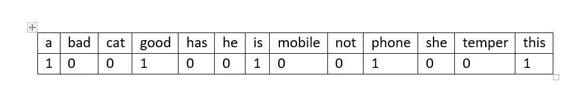

所以我们的第一句话变成了所有我们有的和没有的单词的组合。

[1,0,0,1,0,0,1,0,0,1,0,0,1]

这就是我们第一句话的表达方式。

现在有两种弓:

1.双星弓。

2.弓

它们之间的区别是，在二进制 BOW 中，我们为每个在句子中出现或不出现的单词编码 1 或 0。我们没有考虑这个词在那个句子中出现的频率。

在 BOW 中，我们还考虑了每个单词在句子中出现的频率。

假设我们的文本句子是“这是一部好手机，这是一部好手机”(仅供参考)

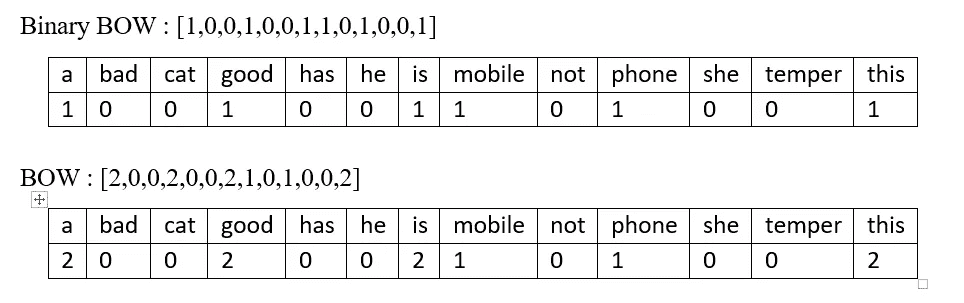

如果你仔细看，我们考虑了单词“这个”、“一个”、“是”和“好”出现的次数。

这就是二进制弓和弓的唯一区别。

BOW 完全抛弃了我们句子的顺序信息。

## **3。TF-IDF 编码:**

术语频率—逆文档频率

顾名思义，这里我们给每个单词一个相对频率编码 w.r.t 当前句子和整个文档。

词频:是当前单词在当前句子中的出现次数 w.r.t 是当前句子的总字数。

逆数据频率:整个数据语料库中单词总数的对数 w.r.t .包含当前单词的句子总数。

TF:

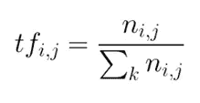

术语频率

IDF:

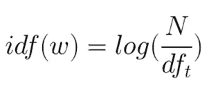

逆数据频率

这里要注意的一点是，我们必须计算特定句子中每个词的词频，因为根据一个词在句子中出现的次数，TF 值可以改变，而 IDF 值保持不变，直到并除非增加新的句子。

让我们通过实验来理解它:

资料语料库:["a "、"坏"、"猫"、"好"、"有"、"他"、"是"、"移动"、"不"、"电话"、"她"、"脾气"、"这个"]

TF-IDF:句子 1 中的“this ”:句子 1 中“this”的字数/句子 1 中的总字数

IDF : log(整个数据语料库中的单词总数/包含“this”单词的句子总数)

TF : 1 / 5 = 0.2

IDF : loge(13 / 3) = 1.4663

TF-IDF : 0.2 * 1.4663 = 0.3226

于是我们联想到“这个”:0.3226；类似地，我们可以找出该句子中每个单词的 TF-IDF，然后剩下的过程与 BOW 相同，这里我们不是用单词出现的频率，而是用该单词的 TF-IDF 值来替换该单词。

所以让我们试着编码我们的第一句话:“这是一部好手机”

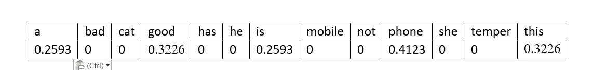

正如我们可以看到的，我们已经用各自的 tf-idf 值替换了该句子中出现的所有单词，这里需要注意的一点是，我们有多个单词的类似 tf-idf 值。这种情况在我们身上很少见，因为我们只有很少的文档，而且几乎所有的单词都有相似的频率。

这就是我们如何实现文本的 TF-IDF 编码。

# **自行实施:**

现在，我们将尝试自己实现它们:

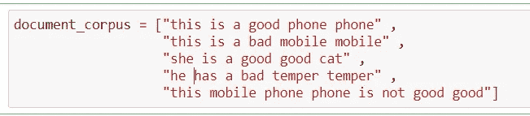

这是我们上面提到的文档库。我调整了数据，使其更容易理解，这将使编码更有意义。

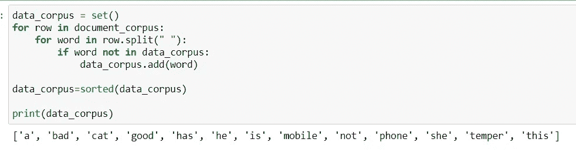

这就是我们如何基于我们拥有的任何文档语料库来创建我们的数据语料库。

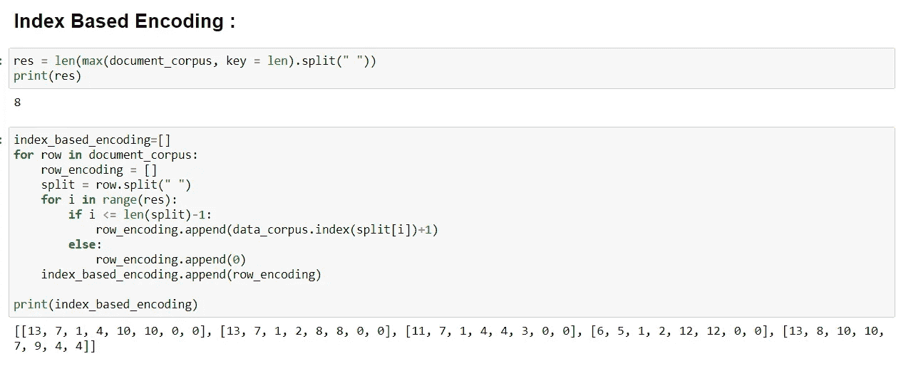

首先，我们找出一个句子的最大长度，然后使用我们的数据语料库，我们用基于索引的方案对所有文本进行编码。

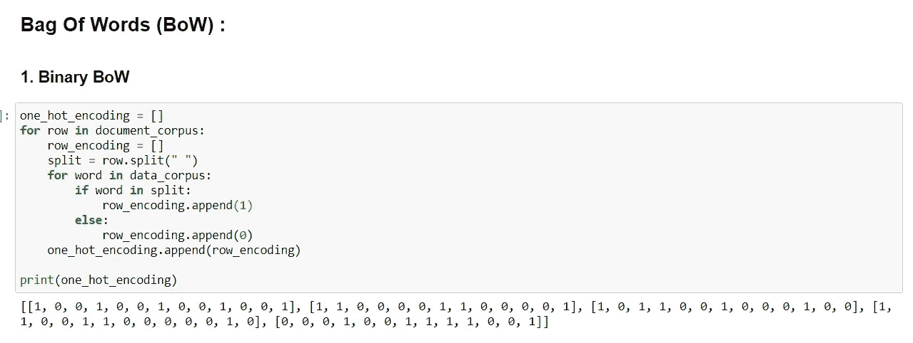

实现 Binary BoW，其中我们为在数据语料库中的句子中遇到的每个单词放置 1，为其余的单词放置 0。

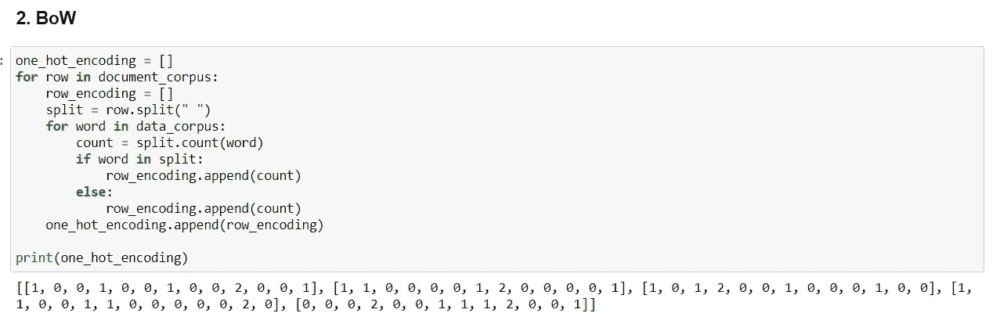

要实现 BoW，我们必须将这个词在特定句子中的每次出现次数编码到数据语料库中，其余的为 0。

首先计算每个元素在句子中的出现频率。

创建函数来计算特定句子中每个单词的 tf-idf，该函数参考上述创建的频率。

最后，为我们的模块创建 tf-idf 向量。

# Python 库实现:

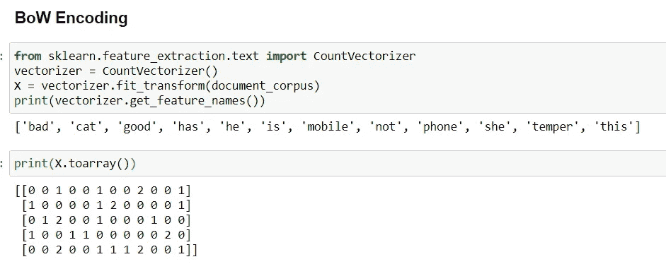

Scikit-Learn 模块中的 CountVectorizer 为我们提供了文本的 BoW 表示。我们可以使用不同的参数来计算二进制弓或弓和更多的定制。

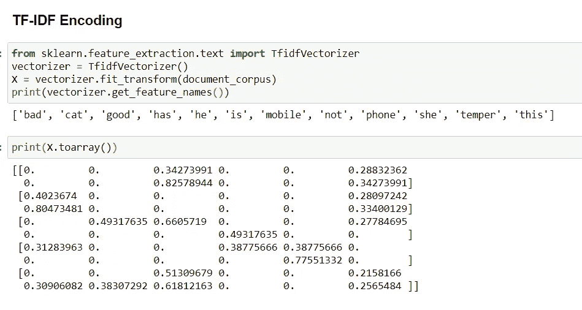

Scikit-Learn 模块中的 TfidfVectorizer 为我们提供了文本编码的 TF-IDF 表示，类似于 CountVectorizer，我们可以为转换设置许多参数。

由于我们实施的是 TF-IDF 的基本版本，因此在数值上会略有不同。在 Scikit-learn 库中，他们用不同的方法实现 TF-IDF，因此我们看到了这样的差异，否则，或多或少的事情是相同的。

现在你有了:基本的 NLP 文本编码实现。

你可以在我的 GitHub 链接 [**这里**](https://github.com/bishalbose294/NLPTextEncoding/blob/main/TextEncodings.ipynb) 找到代码。

下一节: [*NLP —文本编码:Word2Vec*](https://bishalbose294.medium.com/nlp-text-encoding-word2vec-bdba5b900aa9)

> **感谢阅读！**
> 
> 如果你想了解更多类似的话题或者看看我还能提供什么，一定要访问我的网站:[所有关于东西](https://digital.allaboutstuffs.com/)
> 
> 准备好让你的学习更上一层楼了吗？查看我提供的课程:[课程](https://digital.allaboutstuffs.com/courses/)
> 
> 生活工作压力大？花一点时间来放松和放松我的舒缓和放松的视频！现在就去我的频道，用"[灵魂镇定剂](https://www.youtube.com/c/TheSoulTranquilizer)"开始你的内心平和与宁静之旅