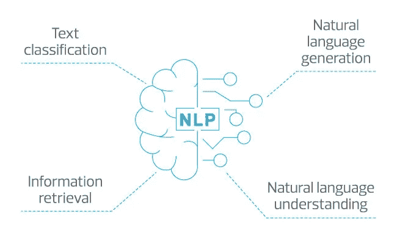
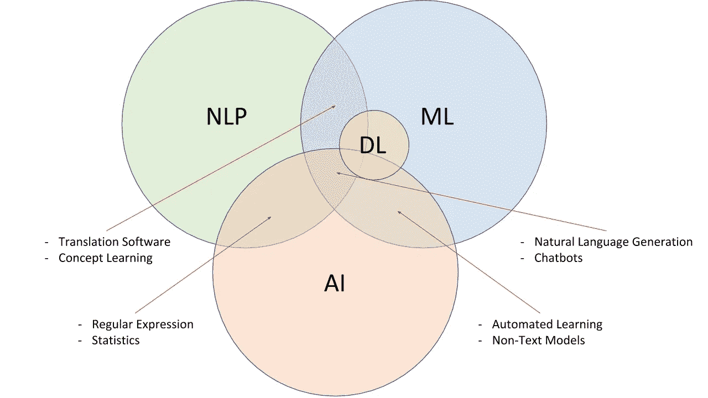
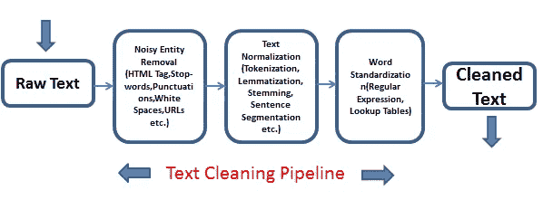
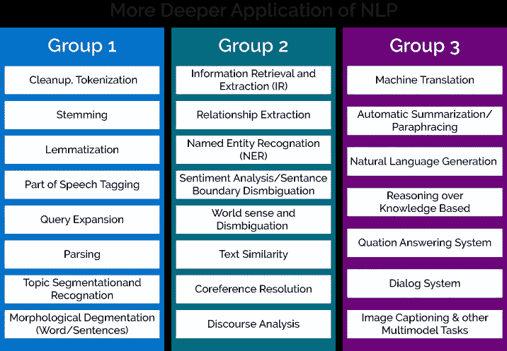

# NLP 工具、技术和应用

> 原文：<https://medium.com/analytics-vidhya/nlp-the-tools-techniques-and-application-baadb0ce42ad?source=collection_archive---------29----------------------->



自然语言处理

恭喜你！！你赢得了 25000 美元。点击此链接兑换您的货币$$$。你有没有注意到你的收件箱里再也看不到这样的邮件了。这类电子邮件被称为“垃圾邮件”。而你看不到这类邮件背后的现象，是因为 NLP(自然语言处理)。

因此，自然语言处理是人工智能中的一个子集，它处理分析，并使用文本和语音组件提供智能解决方案。由于 NLP deals 使用了 AI(深度学习、机器学习和一些数据科学)。重要的商品是数据/信息。并且在训练或使用数据之前，必须对其进行清理。原始数据称为原始数据，将原始数据转换/清洗成有用数据的过程称为处理。处理文本数据被称为文本处理。



关系集

## 文本处理、工具和技术

有各种方法和程序来处理文本。中的 NLTK 库提供了预处理数据所需的所有方法。各种文本预处理方法有



文本处理

1.  **去除噪声**:噪声是整个数据文档中存在的不需要的信息，它们可能是图像、一些数字、特殊符号，甚至是 html 标签，如< div >、< img >、< h1 >等等。这些标签并没有为程序员提供任何有用的信息，而是充当了 chunk 的角色。所以我们可以使用正则表达式(在 python 正则表达式库中被称为 re)来消除这些噪声

```
import re
text="<h1> Hello this is how Regular Expressions work in python and we can remove the noise using re module </h1>"
new_text= re.sub(r'<.?h1>','',text) #this replaces the h1 and /h1 tag with empty space 
```

2.**分词**:将文档信息转换成句子或单词(将文本拆分成单词)的过程。nltk 为我们提供了两种类型的分词器:单词分词器和句子分词器
a) **单词分词器**:将文本拆分成单词

```
from nltk.tokenize import word_tokenize
text= "This text is to be Tokenized"
tokenized=word_tokenize(text)
print(tokenized)# ["This", "text","is","to", "be", "Tokenized"]
```

b) **句子标记化**:句子标记化是将文本拆分成句子的过程。

```
from nltk.tokenize import sent_tokenize
text="hi this is a sentence. this is another sentence"
tokenized= sent_tokenized(text)
print(tokenized)#["hi this is a sentence", "this is another sentence"]
```

这两种标记化方法的使用取决于应用。在使用 NLP 构建应用程序时，标记化是一个重要的过程

3.词汇化是一把解剖刀，将单词分解到它们的词根形式。例如，NLTK 的精明的 lemmatizer 知道“am”和“are”与“be”相关。

```
from nltk.stem import WordNetLemmatizer 
lemmatizer = WordNetLemmatizer()
tokenized = ["NBC", "was", "founded", "in", "1926"] 
lemmatized = [lemmatizer.lemmatize(token) for token in tokenized]    print(lemmatized)
 # ["NBC", "wa", "founded", "in", "1926"]
```

在标记化文本之后，接着进行词汇化，以使用词汇化器将标记化的单词转换成它们的词根形式。这个过程被广泛用于建立聊天机器人。

4.**词干化**:就是去掉单词的前缀和后缀的过程。因为后缀没有给所需的数据增加任何意义，所以我们最好删除它们。雨变成了雨，光变成了光

```
from nltk.stem import PorterStemmer
stemmer = PorterStemmer()
tokenized = ['NBC', 'was', 'founded', 'in', '1926', '.', 'This', 'makes', 'NBC', 'the', 'oldest', 'major', 'broadcast', 'network', '.']  
stemmed = [stemmer.stem(token) for token in tokenized]  print(stemmed) 
# ['nbc', 'wa', 'found', 'in', '1926', '.', 'thi', 'make', 'nbc', 'the', 'oldest', 'major', 'broadcast', 'network', '.']
```

词干分析是搜索引擎用来提高用户输入和网站点击匹配度的常用方法。

5.**停用词去除**:停用词是我们在预处理过程中，在不关心句子结构的情况下去除的词。停用词的例子有“and”、“an”、“the”。幸运的是，nltk 库提供了一个删除不需要的单词的功能

```
from nltk.corpus import stopwords
stop_words = set(stopwords.words('english'))
nbc_statement = "NBC was founded in 1926 making it the oldest major broadcast network in the USA" 
word_tokens = word_tokenize(nbc_statement)  
# tokenize nbc_statement  
statement_no_stop = [word for word in word_tokens if word not in stop_words]  print(statement_no_stop)
# ['NBC', 'founded', '1926', 'making', 'oldest', 'major', 'broadcast', 'network', 'USA']
```

文本处理是使用自然语言处理构建应用程序的第一步。需要遵循各种流程，例如

*   词性标注
*   解析文本。
*   将单词转换为矢量(Word2Vec)
*   找出文本之间的相似之处。
*   主题建模。

# 应用程序

被称为自然语言处理的人工智能子集被用于构建许多产品，例如

*   聊天机器人
*   垃圾邮件分类器
*   情感分析(正面或负面反馈)
*   剽窃检查器
*   还有更多



最后，奖励检验情绪分析程序，并检查反馈是积极的还是消极的。