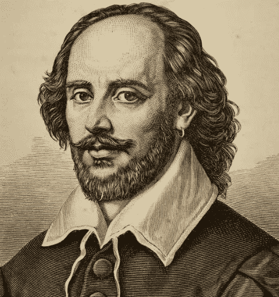
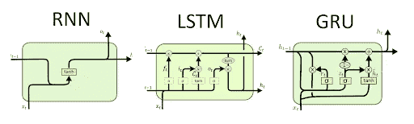
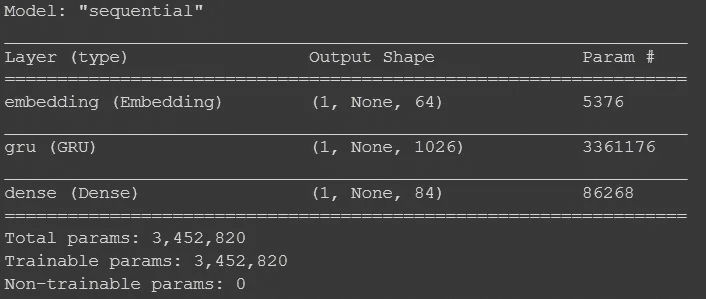
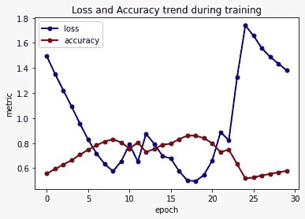

# 使用 RNN 的 NLP 你能成为下一个莎士比亚吗？

> 原文：<https://medium.com/analytics-vidhya/nlp-using-rnn-can-you-be-the-next-shakespeare-27abf9af523?source=collection_archive---------10----------------------->

合著者:[文卡特什·钱德拉](https://medium.com/u/9e828c14da26?source=post_page-----27abf9af523--------------------------------)


iOS 设备上的预测键盘

你有没有想过像预测键盘这样的工具如何在你的智能手机上工作？在本文中，我们探讨了使用先验信息生成文本的思想。具体来说，我们将在 Google Colab 上使用递归神经网络(RNNs)和自然语言处理(NLP)从 16 世纪的文学作品中生成段落。这个想法很简单，我们将尝试给一个模型一个样本莎士比亚戏剧生成假的部分，同时保持相同的方言。虽然预测键盘可以为可能包含多个单词的不完整句子生成最佳的“一个单词”，但我们将通过使用单个单词来生成莎士比亚戏剧的一部分，从而使这一过程变得更加困难。



威廉·莎士比亚的肖像(或者是？)

# **了解 NLP 和 RNNs**

我们先来刷新一下 NLP 的 RNNs 概念。rnn 广泛用于预测。对 RNNs 的数据集约束是它应该是时间序列的形式。NLP 是人工智能中的一个领域，它赋予机器阅读、理解和发现文本数据模式的能力。

可以这样想——我们可以将文本中的字母转换成数字，并将其输入 RNN 模型，以生成下一个可能的结果(听起来像预测，对吗？)

**RNN 变奏曲**



表示不同 rnn 内部机制的图表

rnn 拥有一种循环机制，充当允许信息从一个步骤流向下一个步骤的路径。这个信息是隐藏状态，它是先前输入的表示。

rnn 有许多不同的变体，最常见的是 LSTMs(长短期记忆)。在本文中，我们将利用一个不太为人所知的变体，称为门控循环单位(GRUs)。简单 RNNs 和 GRUs 之间的关键区别在于，后者支持隐藏状态的门控。如前所述，隐藏状态允许我们输入先前时间步长的信息。因此，rnn 和 gru 的不同之处在于传递信息的方式。区别在于何时应该更新隐藏状态以及何时应该重置隐藏状态的专用机制。

如果前面的段落超出了你的理解，不要担心！LSTMs 和 GRUs 一开始有点难掌握。总而言之，gru 与 LSTMs 非常相似。唯一的区别是 gru 没有单元状态，它使用隐藏状态来传递信息。事实上，GRU 有两个门:一个**更新门**和一个**复位门**。**更新门**的作用类似于 LSTM 的遗忘和输入门。它决定丢弃什么信息和添加什么新信息。**复位门**是另一个用于决定忘记多少过去信息的门。详细解释可以看这个[视频](https://www.youtube.com/watch?v=8HyCNIVRbSU)了解过程。

现在哪一个对我们有利？一个简单的 RNN，LSTM，GRU？像生活中的所有事情一样，没有什么是明确的。一切都取决于用例、数据量和性能。所以，决定权在每个人身上！

# **使用 GRUs 生成莎士比亚戏剧**

我们现在将使用戏剧《罗密欧与朱丽叶》中的文本来生成一些模仿 16 世纪文学的“假段落”。为此，我们从[https://www.gutenberg.org/](https://www.gutenberg.org/)提取了一定数量的数据。

数据集链接—[https://www.gutenberg.org/ebooks/1112](https://www.gutenberg.org/ebooks/1112)

您可以从。包含内容和确认部分的 txt 文件。这将有助于产生更好的模型。

我们将开发一个模型，使用先前的字符序列来预测下一个最高概率的字符。我们必须谨慎使用多少字符。一方面，使用非常长的序列将需要大量的训练时间，并且很可能过度适应与更远的字符不相关的字符序列。另一方面，序列太短会使我们的模型不适合。因此，我们从现有的数据长度中建立直觉。根据正常短语的长度，我们将使用一个单词来预测接下来的 180 个字符。

是时候行动了！遵循以下步骤:

**注意:下面提供了 Google colab 链接**

**第一步:**数据导入&基本功能

```
import numpy as np
import pandas as pd
import matplotlib.pyplot as plt
import tensorflow as tf
```

**导入数据集(Google colab 示例)**

```
input_text = uploaded[‘romeo_juliet.txt’].decode(“utf-8”)
```

**第二步:**数据预处理

创建一组独特的字符:

```
letter_corpus = sorted(set(input_text))
letter_corpus[:10]
```

将字母编码成数字

```
char_to_ind = {u:i for i, u in enumerate(letter_corpus)}
ind_to_char = np.array(letter_corpus)
encoded_text = np.array([char_to_ind[c] for c in input_text])
```

**第三步:**检查顺序

每个句子的长度是 43，如果我们捕获三个句子，模型应该能够拾取模式并学习它们。

```
part_stanza = “””Chor. Two households, both alike in dignity,
In fair Verona, where we lay our scene,
From ancient grudge break to new mutiny,
Where civil blood makes civil hands unclean”””len(part_stanza)**#Output - 181**
```

**第四步:**训练序列

```
seq_len = 180
total_num_seq = len(input_text)//(seq_len+1)**#We obtain 972 sequences**char_dataset = tf.data.Dataset.from_tensor_slices(encoded_text)
sequences = char_dataset.batch(seq_len+1, drop_remainder=True)**#drop_remainder=True** ensures that the last batch gets dropped if it #has less number of words
```

将序列映射到数据集

```
dataset = sequences.map(create_seq_targets)
```

**第五步:**创建批次

```
batch_size = 1buffer_size = 10000dataset = dataset.shuffle(buffer_size).batch(batch_size, drop_remainder=True)
```

**创建网络的时间到了**

```
vocab_size = len(letter_corpus)
embed_dim = 64
rnn_neurons = 1026
```

导入张量流模型、层和损失函数

```
from tensorflow.keras.models import Sequential
from tensorflow.keras.layers import LSTM,Dense,Embedding,Dropout,GRU
from tensorflow.keras.losses import sparse_categorical_crossentropy
```

我们定义损失函数

```
def sparse_cat_loss(y_true,y_pred):
 return sparse_categorical_crossentropy(y_true, y_pred,   
 from_logits=True)
```

创建模型

```
def create_model(vocab_size, embed_dim, rnn_neurons, batch_size): model = Sequential() model.add(Embedding(vocab_size, embed_dim,batch_input_shape=
 [batch_size, None]))
      model.add(GRU(rnn_neurons,return_sequences=True,stateful=True,recurrent_initializer=’glorot_uniform’))# Final Dense Layer to Predictmodel.add(Dense(vocab_size))model.compile(optimizer=’adam’, loss=sparse_cat_loss, metrics = ['accuracy'])return modelmodel = create_model( vocab_size = vocab_size, embed_dim=embed_dim, rnn_neurons=rnn_neurons, batch_size=batch_size)
```

我们的模型现在看起来像这样:

```
model.summary()
```



模型架构

# 该训练了


穆罕默德·阿里在行动，就像我们的模型！

将纪元设置为 30

```
epochs = 30
```

训练模型。请注意，这将需要一些时间。我们花了大约 40 分钟来训练数据集

```
model.fit(dataset,epochs=epochs)
```

# **模型评估**

我们在下面的代码中保存了模型历史并绘制了报告指标

```
losses = pd.DataFrame(model.history.history)

losses[[‘loss’,’accuracy’]].plot()
```



GRU 模特培训结果

注意损失是如何减少到第 20 个纪元，然后猛增的。在第 18 个历元上获得的最高精度是 86.03%。因此，我们已经为我们的模型训练了 18 个纪元。

# **生成文本**

我们定义了一个函数(没有固定种子)来使用序列 1 生成文本。如果我们用两个单词训练模型，那么我们的模型会更强大，但是训练时间会增加。

```
def generate_text(model, start_seed,gen_size=100,temp=1.0):num_generate = gen_sizeinput_eval = [char_to_ind[s] for s in start_seed]input_eval = tf.expand_dims(input_eval, 0)text_generated = []temperature = tempmodel.reset_states()for i in range(num_generate): **# Generate Predictions** predictions = model(input_eval) **# Remove the batch shape dimension** predictions = tf.squeeze(predictions, 0) **# Use a cateogircal disitribution to select the next character** predictions = predictions / temperature predicted_id = tf.random.categorical(predictions, num_samples=1)[-1,0].numpy() **# Pass the predicted charracter for the next input** input_eval = tf.expand_dims([predicted_id], 0) **# Transform back to character letter** text_generated.append(ind_to_char[predicted_id])return (start_seed + ‘’.join(text_generated))
```

对于生成，您可以使用下面的代码，其中您只需要指定起始单词和连续单词的数量。

```
print(generate_text(model,”But”,gen_size=1000))
```

# **输出**

我们获得了单词“flower”的如下输出

```
flowers, with power,
thitiest ince to speak.Enter Lady, packed turnare didomaid,
 O hands the fair creastrim! bystalt me this sare!
 Out you? O, pies, peach, ar, and outsides.Enter Julie.Cep.’ Hath you, Caup with such scater, ose must reports! colal, with so smally,
 ‘Year ‘ads-noods withal.Cap. Ay thou hast thou been shopy sender hase.Ey’ WAtch make close curtain, with the humour times.
 O, good night, s oppriwite up, in displayd-by so night raught
 Shall back that hous shalt confurers to away in this?Jul. He case us borny, my chall, is fould wish permission.
 Give me thy shrew, so bir, sighs all,
 Apphrel thee but but my lips?Jul. Ay, noinot makes, I cave me not doth she country.Man. The sorisim! O O, Capulet,
 Mush fairence the murte-baggage of Montaghous.
 Where viewild you but ny yo,
 Her simps to the-Ben.
```

注意我们的模型是如何初始化 Juliet 和 Ben 的名字的。此外，当句子以标点符号结尾时，它会选择模式，并模仿 16 世纪的散文，如 *Ey，你，你*等。

**输出为单词“But”**

```
But,
 Who say wethith is the day purg’d which your bight!
 Are providunity nurse, that mark much soul-D.ASCup on phforight or verfain, is doth compirications comes and curnais,
 How?
 Allotions back,
 Where I sear and kindroud.
 A plaguage of gracksten, creptain!
 Show her plamangled us, now, sir?Wife. Spaker, you, sir.Cap. What [and] Buy Halth will’dinging, non, and pular our soul
 And lovely dreamerly eress murkdeds
 Whose she beshes eyes will be in thy brace!Enter Appraide his banished.Ben. I can you like whose’s keaus.Speak. ’Tis answer ‘I’ shall up, corpudin!
 She [and by] Well, sight as as a know this may be the hight comes Refuchis works corns.Par. So am I conduct and Montague, Commend.Extut may cell till me comes she wret?
 Marry, the maid shrifid- grovimeo,
 Whoce arm Louren lover’d right.
 Th
```

这个模型太棒了，它设置了语音让妻子用先生称呼男人！

# **结论**

我们看到我们的模型模仿了剧本《罗密欧与朱丽叶》的写作方式。注意涉及字符的句子的开头。此外，整个方言被复制。

除了用《罗密欧与朱丽叶》训练模型之外，我们还打算用类似的方法训练其他文本，如《傲慢与偏见》和埃德蒙兹的汽车评论。虽然前者的模型训练显示了希望，但后者没有达到预期。具体来说，对于评论，模型的表现并不理想，因为它找不到模式。这很可能与评论的撰写方式有关。大多数人有不同的写作风格，这使得模型很难模仿散文。

在未来，当我们查看推文时，探索这样一种方法，以及我们如何用假推文实现这样一个模型，将会很有趣。但是为什么只有推特？理想情况下，我们还可以看看虚假的在线文章，甚至虚假的 WhatsApp 新闻(尤其是在选举期间)。

您可以在下面找到代码的链接:

[](https://github.com/chandravenky/Generating-Text-using-RNN) [## 钱德拉文基/生成文本-使用-RNN

### 使用 GRU 为罗密欧与朱丽叶生成文本。由 Shaan 和 Venkatesh 创作的 RNN 支持的 NLP 模型能写一个…

github.com](https://github.com/chandravenky/Generating-Text-using-RNN) 

请在 LinkedIn 上与我们联系，了解更多故事。

[](https://www.linkedin.com/in/shaan-kohli/?originalSubdomain=ca) [## 加拿大蒙特利尔德绍特尔管理学院

### 查看 Shaan Kohli 在世界上最大的职业社区 LinkedIn 上的个人资料。Shaan 的教育列在…

www.linkedin.com](https://www.linkedin.com/in/shaan-kohli/?originalSubdomain=ca) [](https://www.linkedin.com/in/venkateshchandra/) [## Venkatesh Chandra - Aon Canada |解决方案架构师-分析顶点项目- McGill…

### 我有 4 年的数据科学家经验。我曾与财富 100 强公司合作进行外部分析…

www.linkedin.com](https://www.linkedin.com/in/venkateshchandra/)