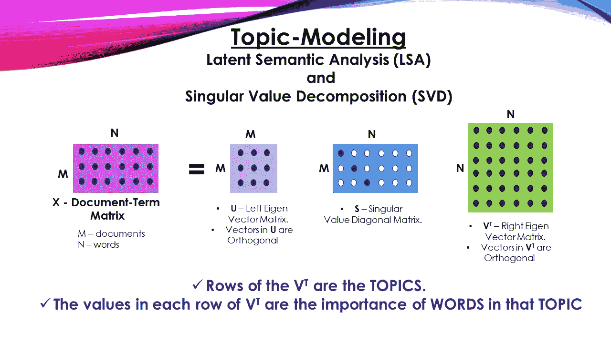

# 潜在语义分析的自然语言处理

> 原文：<https://medium.com/analytics-vidhya/nlp-with-latent-semantic-analysis-b3de6e16ad7d?source=collection_archive---------4----------------------->

主题建模是根据每个文档中出现的单词为语料库获取抽象主题的数学过程。它是一种无监督的机器学习模型，试图发现文档之间的文本相关性。有各种模型可用于执行主题建模，如潜在狄利克雷分配、潜在语义分析等。在这篇文章中，我们将着眼于潜在语义分析的功能和工作。我们还将研究这种方法背后的数学原理。


凯利·西克玛在 [Unsplash](https://unsplash.com?utm_source=medium&utm_medium=referral) 上的照片

# 潜在语义分析

潜在语义模型是一种统计模型，用于通过获得这些词之间的语义关系来确定文档集合和这些文档中存在的术语之间的关系。这里，我们从文本语料库中形成一个文档术语矩阵。列中的每一行代表文档中的唯一单词，每一列代表单个文档。该过程通过奇异值分解来实现。

# 模型背后的数学

潜在语义分析基于奇异值分解。这是一种将一个矩阵分解成三个矩阵的方法。让我们考虑一个要分解的矩阵 A。然后将其分解成三个唯一的矩阵 U、L 和 V，其中 U 和 V 是标准正交矩阵，L 是奇异矩阵。如果一个矩阵的行列式不存在或不可逆，则该矩阵被定义为奇异矩阵。

例如，看看下面的矩阵。



资料来源:datajango.com

这里，X 是术语-文档矩阵，它由每个文档中出现的所有单词组成。u 和 V 转置矩阵是标准正交矩阵，其中每一行都是正交向量。s 是一个奇异值对角矩阵，它的特征值沿着对角线出现。矩阵 V 转置的每一行代表主题，每一列中特定主题的值代表该单词在相应文档中的重要性和关系[注意:每一列代表一个独特的文档]。

# Python 实现

下面给出了奇异值分解的 Python 实现。我们将使用 SVD 的 scipy 包来执行操作。首先让我们导入所需的包并定义我们的 A 矩阵。

```
import numpy as np
from scipy.linalg import svd

A = np.array([[1, 2], [3, 4], [5, 6]])
print(A)
```

现在，让我们执行奇异值分解，通过因式分解获得我们需要的结果矩阵。

```
U, S, VT = svd(A)
print(U)
print(S)
print(VT)
```

# 文本分析

现在，让我们通过一个实时项目检查来清楚地了解这种方法是什么。这里，我们将执行潜在语义分析来识别给定语料库的主题集群。


照片由 [Unsplash](https://unsplash.com?utm_source=medium&utm_medium=referral) 上的 [Dmitry Ratushny](https://unsplash.com/@ratushny?utm_source=medium&utm_medium=referral) 拍摄

首先，让我们导入执行项目所需的所有包。

```
import re
import numpy as np
import pandas as pd
from scipy import linalg, spatial
from sklearn.cluster import KMeans
from sklearn.decomposition import PCA, SparsePCA, TruncatedSVD
from sklearn.feature_extraction.text import (CountVectorizer, TfidfTransformer, TfidfVectorizer)
from sklearn.cluster import KMeans

from sklearn.utils.extmath import randomized_svd

from nltk.tokenize import word_tokenize
from nltk.corpus import stopwords
```

现在，我们将导入要分析的文本。这篇文章是从维基百科中摘录的关于小罗伯特·唐尼的内容。仅使用文本的一小部分摘录来清楚地理解工作过程。这个过程可以使用 request 和 BeautifulSoup 包扩展到大型文本。

```
corpus = [

          "With all of the critical success Downey had experienced throughout his career, he had not appeared in a blockbuster film. That changed in 2008 when Downey starred in two critically and commercially successful films, Iron Man and Tropic Thunder. In the article Ben Stiller wrote for Downey's entry in the 2008 edition of The Time 100, he offered an observation on Downey's commercially successful summer at the box office.",
          "On June 14, 2010, Downey and his wife Susan opened their own production company called Team Downey. Their first project was The Judge.",
          "Robert John Downey Jr. is an American actor, producer, and singer. His career has been characterized by critical and popular success in his youth, followed by a period of substance abuse and legal troubles, before a resurgence of commercial success in middle age.",
          "In 2008, Downey was named by Time magazine among the 100 most influential people in the world, and from 2013 to 2015, he was listed by Forbes as Hollywood's highest-paid actor. His films have grossed over $14.4 billion worldwide, making him the second highest-grossing box-office star of all time."

          ]

stop_words = set(stopwords.words('english'))
```

我们在这个语料库中有四个文档。我们还删除了停用词，其中包括一些最常见的重复单词，这些单词对句子的意义没有贡献。

现在，我们将使用分词器将整个文档拆分成单个单词。然后将单个标记编译到 python 字典 filtered_text 中。

```
filtered_document= []
filtered_text = []

for document in corpus:

    clean_document = " ".join(re.sub(r"[^A-Za-z \—]+", " ", document).split())

    document_tokens = word_tokenize(clean_document)

    for word in document_tokens:
        if word not in stop_words:
            filtered_document.append(word)

    filtered_text.append(' '.join(filtered_document))
```

现在，我们将形成一个词频矩阵来统计语料库中不同文档中不同单词的用法。

```
vectorizer = CountVectorizer()

counts_matrix = vectorizer.fit_transform(filtered_text)

feature_names = vectorizer.get_feature_names()

count_matrix_df = pd.DataFrame(counts_matrix.toarray(), columns=feature_names)
count_matrix_df.index = ['Document 1','Document 2','Document 3','Document 4']

print("Word frequency matrix: \n", count_matrix_df)
```

这段代码的输出打印了一个矩阵，显示了每个单词在每个文档中出现的频率。

我们将查看获得的特征名称，并使用 Kmeans 算法通过无监督机器学习算法来识别密切相关的单词。

```
vectorizer = TfidfVectorizer(stop_words=stop_words,max_features=10000, max_df = 0.5,
                                    use_idf = True,
                                    ngram_range=(1,3))

X = vectorizer.fit_transform(filtered_text)
print(X.shape)
print(feature_names)

num_clusters = 4

km = KMeans(n_clusters=num_clusters)
km.fit(X)

clusters = km.labels_.tolist()
print(clusters)
```

现在让我们使用 SVD 为语料库生成主题。

```
U, Sigma, VT = randomized_svd(X, n_components=10, n_iter=100, random_state=122)

svd_model = TruncatedSVD(n_components=2, algorithm='randomized', n_iter=100, random_state=122)

svd_model.fit(X)

print(U.shape)

for i, comp in enumerate(VT):
    terms_comp = zip(feature_names, comp)
    sorted_terms = sorted(terms_comp, key= lambda x:x[1], reverse=True)[:7]
    print("Cluster "+str(i)+": ")
    for t in sorted_terms:
        print(t[0])
    print(" ")
```

从该方案获得的结果附后。这说明了话题是如何根据词与词之间的语义关系获得的。

```
Cluster 0: 
american
age
actor
article
ben
billion
called

Cluster 1: 
actor
article
ben
billion
called
career
changed

Cluster 2: 
american
age
actor
among
appeared
blockbuster
box

Cluster 3: 
american
actor
abuse
article
ben
billion
called
```

# 结论

在本文中，我们介绍了潜在语义分析及其 python 实现。我们还研究了奇异值分解数学模型。

# 参考资料:

01.【https://en.wikipedia.org/wiki/Robert_Downey_Jr. 

02.[https://en.wikipedia.org/wiki/Latent_semantic_analysis](https://en.wikipedia.org/wiki/Latent_semantic_analysis)

03.[https://www . data camp . com/community/tutorials/discovering-hidden-topics-python](https://www.datacamp.com/community/tutorials/discovering-hidden-topics-python)