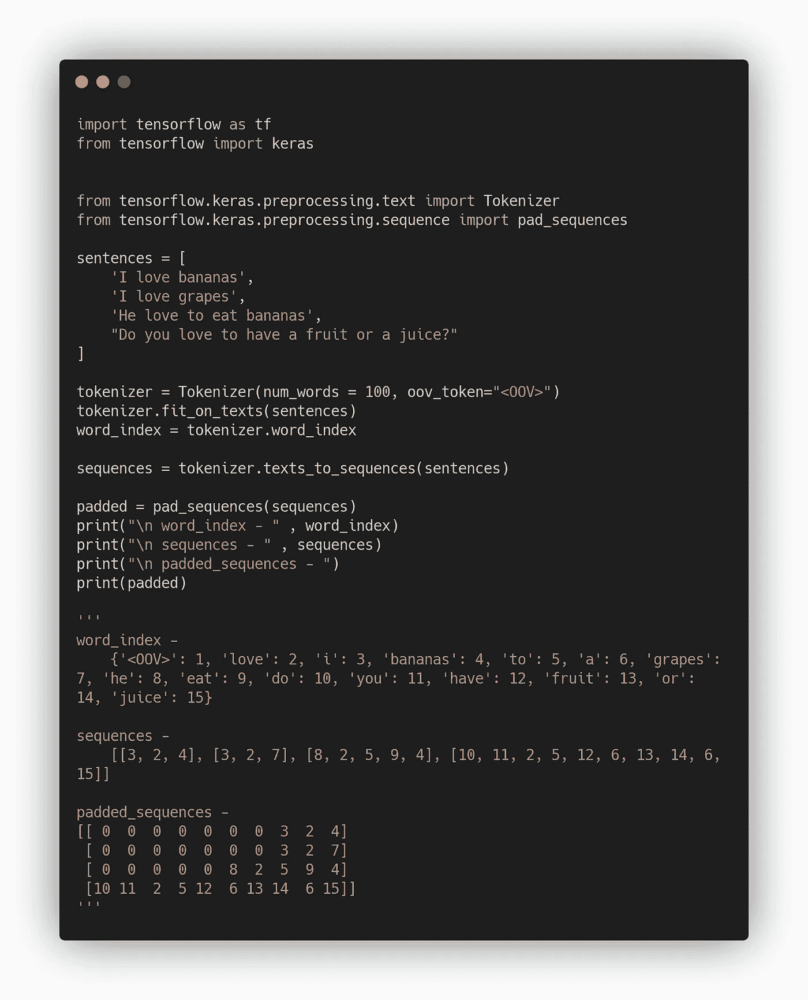
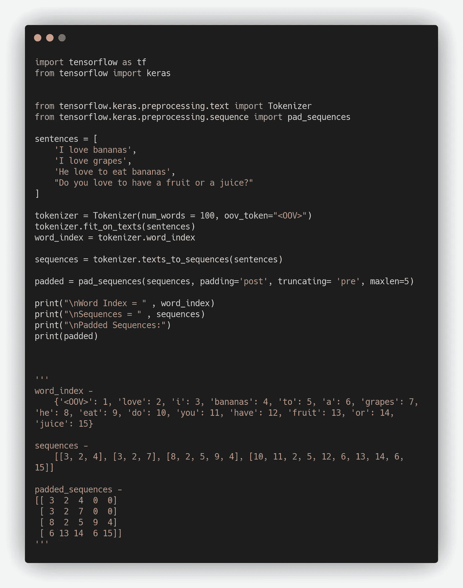

# 带张量流的自然语言处理——填充句子

> 原文：<https://medium.com/analytics-vidhya/nlp-with-tensorflow-padding-sentences-d2a265ea65?source=collection_archive---------27----------------------->

好的，在之前的文章中，我们已经学习了对句子中的标记进行标记和排序。我们可以观察到令牌的长度不同。

我们需要确保输入的长度相同。Padding 把我们从这个问题中解救了出来！

填充序列

' pad_sequences '将序列填充到相同的长度。您可以观察到，在较小的列表的开头填充了 0。

“pad_sequence”可以用来填充句子的结尾或开头，或者通过截断序列将句子填充到所需的长度…

好了，够了！在下一篇文章中，我们将应用我们所学的技术来处理一个真实的数据集！