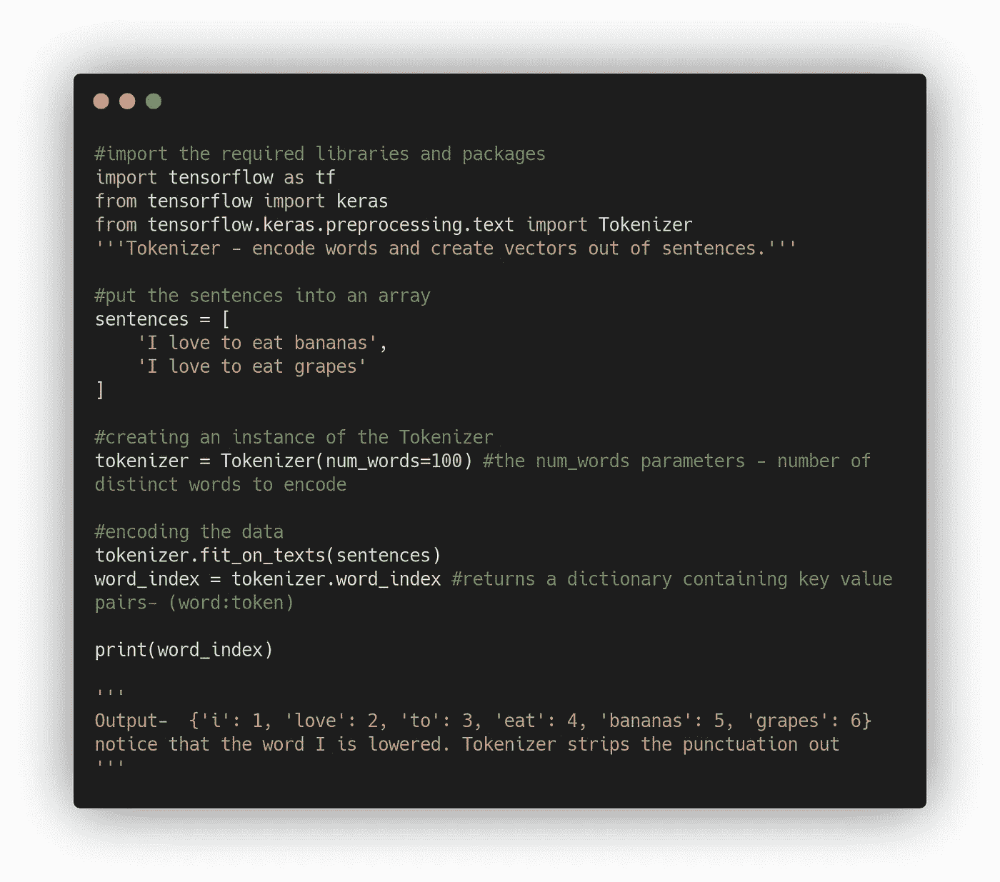
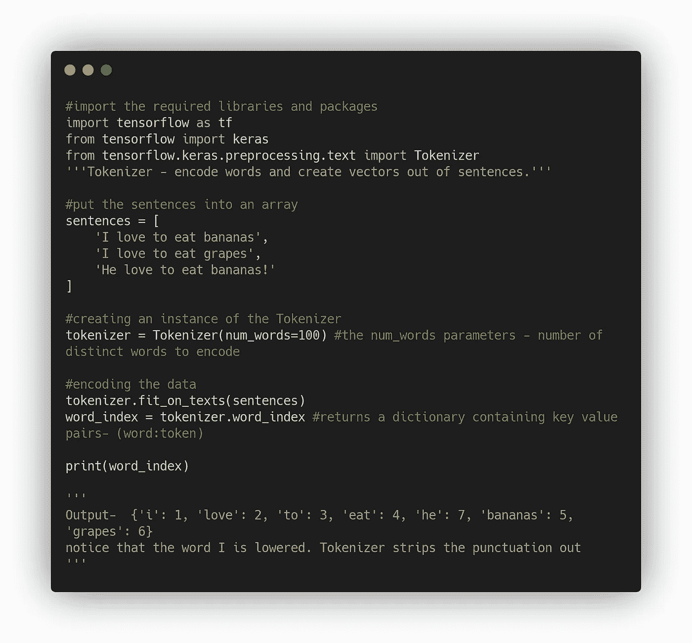
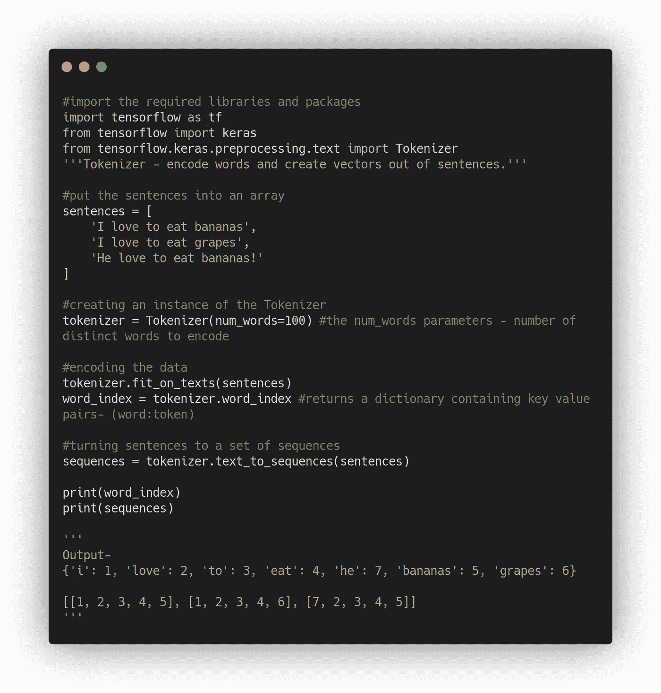
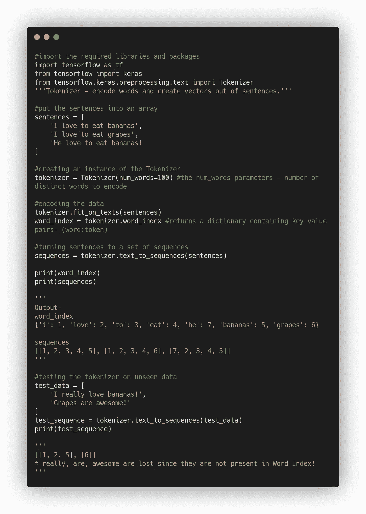
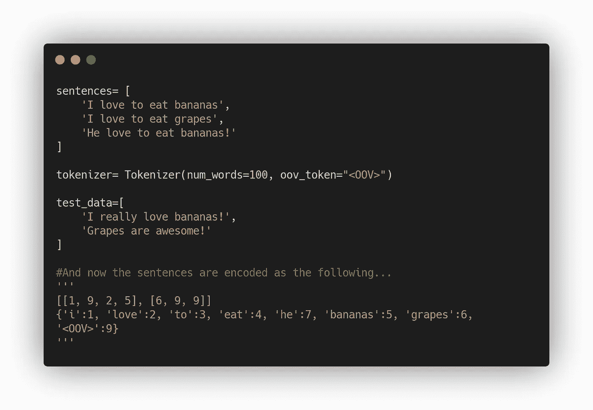

# 基于张量流的自然语言处理——句子的标记和排序

> 原文：<https://medium.com/analytics-vidhya/nlp-with-tensorflow-tokenizing-and-sequencing-the-sentences-ce13f91a658?source=collection_archive---------12----------------------->

当我们处理图像时，很容易将它们输入神经网络，因为像素值已经是数字了。但是文本会发生什么呢？我们如何用句子和单词做到这一点？

在 NLP 系列的这一部分中，我们将学习如何建立理解文本的模型，这些模型是在标记文本上训练的，然后根据它们所看到的对新文本进行分类。

嗯，我想你有一个想法，为什么我们不能编码每个字符(字符编码)。让我们来看一个例子…

阿拉伯联合酋长国-82 69 65 68

68 69 65 82

在这里，字符被编码成它们的 ASCII 值。这提供了单词的语义吗？READ 和 DEAR 是两个不同的字，字一样！好吧，如果我们把每个单词编码并用这些值输入神经网络会怎么样？

**我喜欢吃香蕉——1 2 3 4 5，**每个单词都被编码成一个值

**我喜欢吃葡萄——1 2 3 4 6，**由于前三个单词编码较早，我们正在用另一个值对最后一个单词进行编码。那就是我们为‘葡萄’创造了一个新的象征！

> 这可以帮助我们建立一个基于单词的神经网络模型。

我们如何开始训练一个基于单词的神经网络？很简单，通过使用 Tensorflow 和 Keras APIs。看看下面的代码来标记句子…

标记句子

现在我们再添加一个句子，看看记号赋予器是做什么的。

酷！我们建立了一个包含所有单词的字典来制作一个语料库。现在我们需要把你的句子转换成基于这些记号的值的列表。

标记化后的句子排序

> '***text _ to _ sequences***'调用可以接受任何句子集，因此它可以根据从传递给' ***fit_on_texts*** '的句子集中学习到的单词集对它们进行编码。

如果你在一个文本语料库上训练一个神经网络，并且该文本有一个从中生成的单词索引，那么当你想用训练模型进行推理时，你必须用相同的单词索引对你想进行推理的文本进行编码，否则这将是没有意义的。

我们可以通过大量的训练数据来避免这一点，以获得广泛的词汇，这样我们就不会错过单词。我们可以通过使用一个值来简化它，而不是忽略一个看不见的单词！

你观察到什么了吗？神经网络采用相同长度的输入数组。数据集中的句子可能没有相同的字数。序列中的数组具有不同的长度。

有办法解决这个问题吗？没错，就是**填充！**

在下一篇文章中，我们将讨论填充和更多…