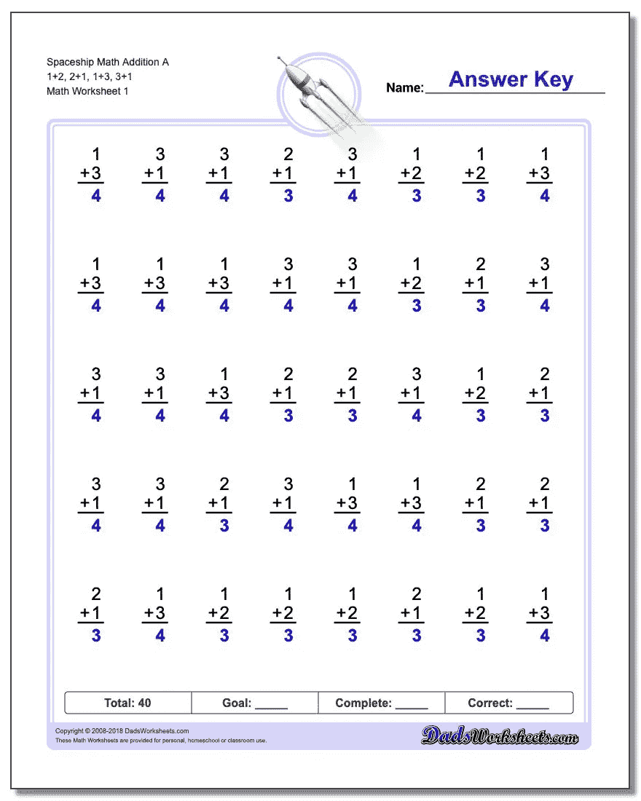
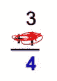

# 不但是实际上神经网络是如何？🤔-第一部分

> 原文：<https://medium.com/analytics-vidhya/no-but-actually-how-does-a-neural-network-part-1-1c22737f5bd0?source=collection_archive---------18----------------------->

## 对机器学习中的*神经网络*和**如何**建立你的第一个神经网络模型的快速而简单的介绍！😄

# 警告:

注意:如果你是深度学习的新手，这是你的第一篇文章，或者你希望*真正*理解这篇文章，那么你要比 Medium 多花 3-4 倍的阅读时间。我还建议你在跟随的时候拿起铅笔和纸。如果没有，那就大声读出来。

# 我的意图:

我希望这篇文章能帮助你建立直觉，理解神经网络是如何工作的，为什么工作。我的目标是帮助填补深度学习入门中可能出现的任何不确定性的角落和缝隙。

# 我们开始吧！

## **好吧，让我们先确定我们理解了这三件事:**

1.  学习的心态！
2.  什么是*神经网络，它是如何工作的*？
3.  我需要什么样的技术技能和资源来建造一个？

# 🧠MINDSET 学习！

其中最重要的一个，也是最容易被忽视的。所以我一开始就大写了！看上面的图片。我相信我们中的许多人，如果不是所有人，都经历过同样的时刻。如果你像我一样，你可能会经历这样的思考过程:看着眼前最近的可携带的物体，考虑是否要扔或砸这个物体，然后实际上*做*你考虑的事情。是啊，**不要**。对于有编码经验并正在阅读本文的人来说，这可能听起来有些重复，但对于大多数没有经验的人来说，请理解这一点:

## **将每个问题*单独*归结为你能理解的想法。**

期望进入一个研究的兔子洞。一个搜索问题将变成 3 个，那 3 个搜索变成 5 个，那 5 个变成 10 个…诸如此类。

## 编码是 95%的研究代码和 5%的实际编码。

在深度学习研究会议期间，我 95%的时间都在看 youtube 视频或 stack overflow，试图让我的脑袋围绕概念。

## 你肯定会犯错误。

我们用手指打字。在成百上千个字符中，你真的认为我们会把它们都输入正确吗？

> 其中最大的一个…

## DONT 拿自己和别人比较。

从个人经验来看，我过去总是觉得有必要将自己的进步与他人进行比较，甚至对自己也很难承认这一点。记住，每个人都有不同的学习方法和不同的经验水平。

不要犹豫，停下来思考。不要因为看了 3 遍整个视频而感到羞耻。经验需要**时间**。

好了，现在我们知道了:

# 什么是神经网络？

> 神经网络(或人工神经网络)是一类机器学习系统，由一系列复制人脑思维过程的算法组成。

为了进一步简化:

## 这是一种机器用来像人脑一样“思考”的系统。

# 神经网络是如何工作的？

看看这张图片。为了解决这个问题，我们将通过查看黑色的**数字**和**算术运算符**来解决。在我们的大脑中，我们本质上知道 1 + 3 等于 4，3+1 也等于 4，因为我们年轻时练习过它们。现在很难想象，但我们真的训练了我们的大脑。学习 1 + 3 是有意义的，因为我们有丰富的数数经验，这意味着在我们数数的过程中，我们会一次又一次地失败！

现在让我们说*哎呀*！4 岁的我很沮丧，因为我得到了错误的答案，所以我决定做一个扫兴的人，在一些红色蜡笔上乱涂乱画，破坏其他幼儿园小朋友的答案。为了简单起见**现在上图是一个神经网络试图解决的问题**(但实际上由于问题的简单性，你真的不需要解决)。

## 那么在这种情况下，神经网络将如何学习呢？

曾经在课堂上举手回答一个你一开始就不知道的问题吗？这正是神经网络开始训练时所做的。但是现在想象一下，如果你试图在不了解基本加法是如何工作的情况下记忆答案，你的答案仍然是随机的。这正是神经网络所做的！

**神经网络通过完全随机的猜测开始学习**

所以让我们开始像电脑一样思考。以上 8 个问题，我们来看看第一个。神经网络如何解决这个问题？在我们的大脑中，我们可以看到 3 和 4 相差 1。但是记住机器没有线索去做什么计算，所以它真的可以做任何事情。完全随机。这意味着对于红色涂鸦中缺失的数字，机器可以猜出 100，27，999999999999，任何数字，甚至可能是一个等式？**在深度学习中，这些随机变化被称为随机变化。**但是等一下，这不是只有一个例子吗？这么少的经验，机器怎么学习？

让我们再来看看这张图片。这就是我们要阐明观点的地方。

好了，现在我们知道了机器是如何开始学习的，我们如何将它应用于其他 7 个数字呢？嗯，机器做完全相同的事情！对于每一个红色的涂鸦，一个随机的数字或方程式将会填充那个点！所以问题 2 中的涂鸦可能是-1000，问题 3 中的涂鸦可能是 2341879，问题 4 中的涂鸦可能是 4273242342482943824。是的，为了证明这些数字的随机性，我敲了敲键盘。

## 好的，这很酷，但是你还没有解释目标？

坚持住，我快到了。所以我们已经确定，当机器开始学习时，它会猜测一个完全随机的涂鸦。现在我想让你们记住的是，在最初的几次尝试中，它将是完全随机的，但是为了例子的简单，我们会说它在第一次尝试中是随机的。

让我们记录下这些数字，看看它们在红色涂鸦中有什么值:

*   问题 1: 27
*   问题 2: -1000
*   问题 3: 2341879
*   问题 4: 4273242342482943824
*   问题 5: -243
*   问题 6: 94398
*   问题 7: -4270
*   问题 8: 99

一旦计算机完成了对所有 8 个问题的猜测，我们可以说它完成了一个**纪元，**并且它的发音为“史诗”(警告:我只是粗略地描述了一个纪元是什么，但是我在这里试图传达的思想是一次迭代就完成了)

现在，你认为下一个**时代**会发生什么？

嗯，机器会看答题卡，以确认答案的准确性。

…..它会意识到自己一开始就错了。那么它的目标呢？嗯，神经网络的目标是**学习如何尽可能准确地得到蓝色数字。**这些蓝色数字称为**目标数据。**因此，机器的目标是正确学习如何找到这个**目标数据。**因此，当机器检查**其**答案(猜测)时，对于**实际**答案(蓝色数字)，机器将尝试获得更接近目标数据的答案，称为**标签。**

所以第二个纪元可能会有像这样的红色涂鸦:

*   问题 1: 13
*   问题 2: -700
*   问题 3: 23418
*   问题 4: 427324234
*   问题 5: -50
*   问题 6: 943
*   问题 7: -2021 年
*   问题 8: 37

如果您将这些数字与之前的 8 个数字进行比较，它们更接近目标数据！我想你会同意我的看法，13 比 27 更接近 4。现在，记住为了让这些数字成为**标签**，你需要考虑它的**特征**，输入！而在我们的情况下，我们的特征是**给定的黑色数字**。

# 如果你能走到这一步，恭喜你！你现在应该知道神经网络是如何工作的了！

在继续之前，请确保您理解了上述所有概念。如果你不知道，从头开始重读这篇文章，或者回到你感到困惑的地方。

真正的回报是:我们将从头开始构建一个神经网络。以下是该系列第二部分的链接:

[https://evx xan . medium . com/no-but-actually-how-a-neural-network-part-2-2 F5 C5 E3 CDF 78](https://evxxan.medium.com/no-but-actually-how-does-a-neural-network-part-2-2f5c5e3cdf78)

# 另一边见！

如果你喜欢这篇文章，点击拍手按钮！👊🎯

> ***随时在我的 LinkedIn 上与我联系或通过电子邮件与我联系:***
> 
> [我的 LinkedIn:](https://www.linkedin.com/in/evan-lin-0b764b1a3/)
> 
> 我的邮箱:evanlin416@gmail.com