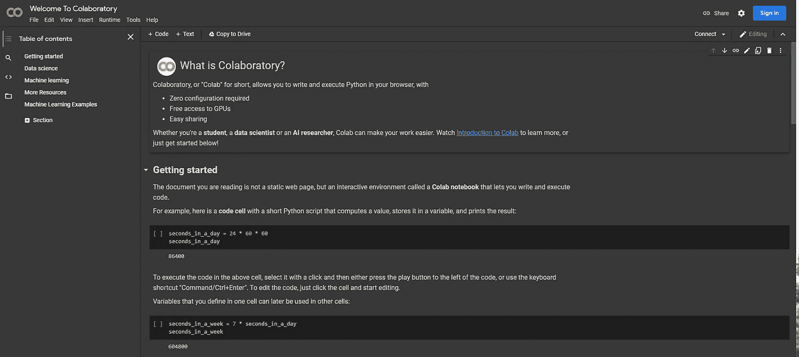
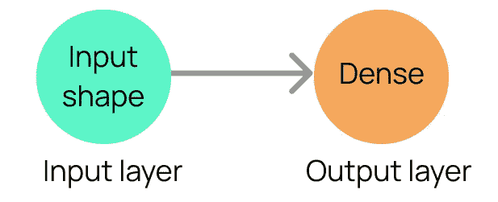
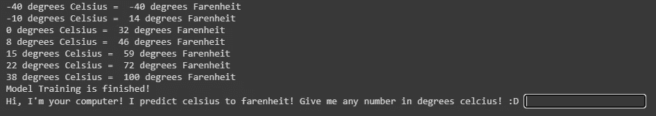
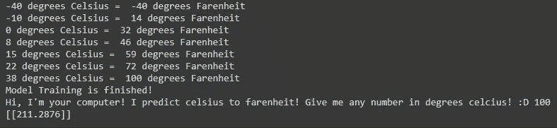
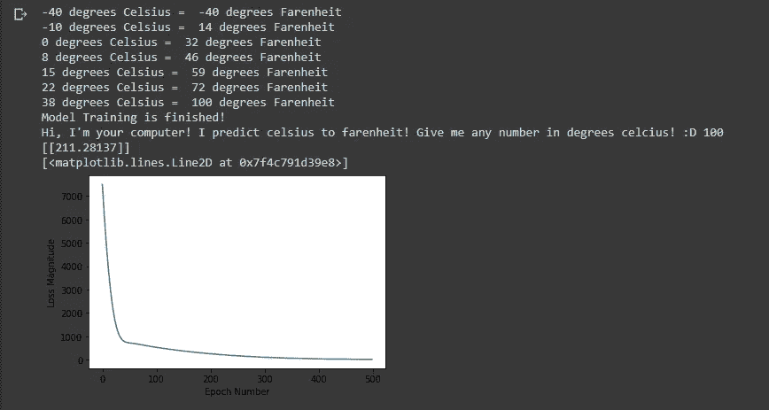

# 不但是实际上神经网络是如何？🤔-第二部分

> 原文：<https://medium.com/analytics-vidhya/no-but-actually-how-does-a-neural-network-part-2-2f5c5e3cdf78?source=collection_archive---------17----------------------->

## 第二部分，快速而轻松地介绍机器学习中的神经网络，以及如何建立您的第一个神经网络模型！😄


## 好了，让我们回顾一下上一篇文章中的关键术语:

> **功能:**我们机器的输入
> 
> **目标数据:**实际答案
> 
> **标签:**机器预测的输出——机器对实际答案的猜测
> 
> **历元:**学习的完整迭代
> 
> **随机:**随机

## 解决问题:

“但是等等，我需要任何编程知识吗？”

一点也不。拥有理解类型约定的编程背景当然很有帮助，但是我将尝试解释的直觉也是一样的。

*“如果我的电脑不够强大怎么办？”*


在阅读本文时，我们将使用 Google Colab 来运行我们的代码。Google Colab 是一个免费的云服务，允许你在云上运行机器学习代码！如果你的电脑上已经有了一个专用的显卡，你可能就不需要使用 Google Colab 的云服务了，但是在你文件的设置中，你可以把你的运行时类型改成你的 GPU。如果这三句话听起来令人困惑，不要担心。同样，我稍后会解释它们。

# 设置

**第一步:**点击此链接。你的屏幕应该看起来像下图。[https://colab . research . Google . com/notebooks/intro . ipynb # recent = true](https://colab.research.google.com/notebooks/intro.ipynb#recent=true)



**第二步:**在窗口右上方，将光标悬停在**文件**上，点击***新建笔记本。***

**

*步骤 3:现在你应该有一个名为“ **Untitled0.ipynb** ”的文件*

**

*我们已经布置好了！很简单，对吧？好了，我们开始吧。*

****

*为了编写我们的代码，我们将使用与 **Keras API** 配对的 **Tensorflow** 机器学习库和**NumPy**Python 数学库。只知道 TensorFlow，Keras，NumPy 让我们的生活更加*方便*。*

*定义:*

> *库:一组预编程的函数，减少了从零开始写代码的需要(这意味着我们不会进入数学的本质)*
> 
> *API:在两个软件之间来回发送信息的接口——就像网站和用户的中间人。*

# *入门指南*

*我们要解决的问题是:*

*假设摄氏温度值是**特征**，华氏温度值是**目标数据，如何训练神经网络使用监督机器学习将摄氏温度转换为华氏温度。给你 7 个摄氏度值:(-40，-10，0，8，15，22)。***

***我们希望教会我们的神经网络模型如何在看到输入时产生华氏温度，即摄氏温度。***

*你可能会想:“好吧，难道我们不能用一个公式吗？毕竟华氏等于摄氏乘以 1.8 加 32 (F = C * 1.8 + 32)？”嗯，那**就不会**是机器学习了。还记得我在文章前面谈到数字和方程的随机变化吗？这将会在这里发生。*

*所以我们得到了这些数字(-40，-10，0，8，15，22)。*

*我们到底该拿他们怎么办？首先，让我们重新定义我们的目标。我们的目标是将摄氏温度转换成华氏温度。为什么？还记得我们一起看的上一题中的蓝色数字吗？我们需要定义我们的**目标数据。在此之前，让我们先将所有必要的库导入到代码中。请记住，我们将在这里使用 Tensorflow 2.0，它已经包含了 Keras。***

*因此，让我们键入以下代码来导入我们必需的库。用 Python 简单地告诉计算机“嘿，我们需要访问另一个文件，以便将它的函数和快捷方式放入这个文件！”`as`告诉计算机“每次我们想在代码中使用库中的某个元素时，让我们为它取一个缩写。”所以每次我们想在代码中使用 Tensorflow 时，我们首先放入它的别名`tf`，对于 NumPy，我们首先放入它的别名`np`*

```
*import tensorflow as tf
import numpy as np*
```

*现在让我们定义我们的目标数据。这意味着，我们必须找到每个摄氏度的实际答案。为了做到这一点，我们可以去一个在线计算器，输入所有的摄氏温度值。*

*我们应该得到这个:*

*-40, 14, 32, 46, 59, 72, 100*

*请记住，顺序很重要。之所以是因为索引。-40 将在第一个索引中的训练期间与-40 配对，而-10 将在第二个索引中与 14 配对。索引只是将指令组织成数字，以便计算机能够处理它们。*

```
*celsius = np.array([-40, -10,  0,  8, 15, 22,  38])     
fahrenheit = np.array([-40,  14, 32, 46, 59, 72, 100])*
```

*因此，让我们创建 2 个变量，一个称为 Celcius(这是特性数据)，一个称为 Fahrenheit(这是目标数据)。*

*让我解释一下代码:所以在我们创建了两个变量之后，我们必须找到一种方法来存储两个数字列表，第一个列表是摄氏列表，第二个列表是华氏列表。为此，我们必须在一个称为数组的 Python 数据类型对象中处理这些信息。数组的**语法**(它的代码结构由键盘上的字符定义)看起来就像这样(如下)*

```
*anyVariable = []*
```

*我们刚刚在这里输入的是一个常规数组，但是因为我们试图创建一个 NumPy 数组，我们需要在方括号周围加上圆括号(这个东西)→()。在左括号前面，我们需要写`np.array`,因为我们试图访问 NumPy 库内部的数组变量类型。*

*我们为什么要做这些？Tensorflow 只兼容少数几种数据类型的数组，NumPy 恰好是其中之一。我们必须将数组创建为 NumPy 数组，以便 Tensorflow 能够**理解**我们希望计算机如何处理这些信息。众所周知，NumPy 数组比常规 Python 数组更快，因此在深度学习的世界中，一切都是关于纳秒级的速度，一切都很重要。*

*好了，现在你明白了，让我们继续前进，继续输入我们的代码。*

```
*for i,c in enumerate(celsius):
  print(c, "degrees Celsius = ", fahrenheit[i], "degrees Farenheit")*
```

*如果这看起来令人生畏，别担心，我会解释的。我还将加快一点速度，因为我假设如果你已经阅读了这篇文章，你可能知道如何 FIO(解决问题)。因此，如果您对任何 Python 或任何与其库相关的语法感到困惑，无论如何，请继续搜索！那是程序员心态的一部分。我将首先解释代码实际上是什么，然后我将解释它的功能和它为什么工作。我们首先要插入一个 for 循环，不管在 Celcius NumPy 数组中有多少个索引，它都会运行。正如我们在下图中看到的，我们正在查看之前的一段代码，Celcius 变量。如果我们数一数数组中的索引数，然后用手指数，结果是 7。`enumerate`允许 for-loop 读取一个以摄氏度为单位的数字作为索引值，而不是它自己在数组中的值。因此-40 会读作 0，-10 会读作 1，0 会读作 3…依此类推。同样重要的是要注意，如果你还没有学会的话，电脑会从 0 开始计数。*

```
*celsius = np.array([-40, -10,  0,  8, 15, 22,  38])*
```

*好吧，让我们回到这个话题:T4 I，c，T5 是什么意思？*

```
*for i,c in enumerate(celsius):
  print(c, "degrees Celsius = ", fahrenheit[i], "degrees Farenheit")*
```

***‘I’**表示由数字表示的迭代阶段(这将是`enumerate(celcius)`的结果，而**‘c’**表示运行的迭代次数，以摄氏度为单位的索引总数。因此' **i** '和' **c** '在 for 循环的每个新迭代中都应该是相同的数字。接下来的一行将打印出两个变量，摄氏的实际值(而不是它的索引，因为它没有被传入枚举)和华氏的实际值，由**‘I’**中的一个数字访问，其中**‘I’**的值将被用作一个索引，以在任何给定的迭代中找到**处华氏的值。***

## *唷！现在我们已经准备好了数据，让我们开始真正的深度学习吧！*

*下面的代码是我们如何构建深度学习模型的。*

***定义:***

> *`*Sequential*`:一种神经网络模型——最简单的一种模型，允许你一层一层的叠加*
> 
> *`*layers*`:一组神经元——一个简单的神经网络有一个输入层、一个隐藏层和一个输出层*
> 
> *`*Dense*`:告诉神经网络模型“我们完全连接”这意味着每一层都通过单个神经元相互连接*

*我们将首先创建我们的模型，并给它一个变量名“模型”*

*接下来，我们将使用 TensorFlow 的别名访问它，然后使用 Keras，使用`tf.keras`，最后使用`Sequential`模型类型。在我们的模型中，我们将声明我们将只接受一个输入形状模型`input_shape = [1]`，它代表**摄氏度**值的输入。这是因为 Celcius 是一个一维数组，一个表示度数的数字。我们还将声明我们将在使用`units = 1`的层中有 1 个神经元。神经元的数量告诉神经网络在该层要学习多少个**变量**，所以只学习 1 个变量。*

```
*model = tf.keras.Sequential([tf.keras.layers.Dense(units = 1, input_shape = [1])])*
```

**

*这是我制作的一个图形，用来帮助更好地可视化这个模型。*

*所以现在我们已经完全定义了我们的神经网络模型，我们要编译它！这就是 Keras 的神奇之处，它为我们做了所有的数学运算(激活函数等等)。我们将定义模型的损失，并选择一个名为 Adam 的优化器类型。请记住，这段代码实际上不会做任何事情，直到在`*model.fit*` *(这将在此之后出现)的培训中使用它。**

***定义:***

> *`*loss:*`计算机器对目标数据的猜测有多不准确*
> 
> *`*optimizer:*`根据损失的不准确性计算调整以变得更加准确*
> 
> *`*Adam:*`使用随机梯度下降的优化器类型(不用担心这个)*
> 
> *`*mean_squared_error:*`衡量误差:“我有多不精确？”*

*每当我们为我们的神经网络构建编译器时，我们需要始终考虑的一件事是我们的学习速率(0.1)。它告诉 Tensorflow 应该如何积极地尝试并找到最佳模型。这应该是一个很小的数字，可以帮助你调整你的价值观，但也不能太小。如果太小，那就要花很长时间来训练，如果太大，哦，伙计，那就跟你的准确性说再见吧。你如何找到完美的学习率？只要试错就行了！玩数字游戏。**通常，你会希望学习率在 0.001 到 0.1 之间**。*

```
*model.compile(loss = 'mean_squared_error', optimizer = tf.keras.optimizers.Adam(0.1))*
```

# *最后一步！*

*好了，现在让我们结束吧！**这部分代码是机器训练的地方。**我们将把我们的训练函数命名为“历史”在 model.fit 函数中，我们传入模型需要知道的参数:*

> *`*epochs:*` 1 次完整的培训迭代——基本上是我们到目前为止的所有内容*
> 
> *`*verbose:*` *显示进度条和每个历元的计算损失**

*在其他神经网络模型中，您可能会看到像 **x** 和 **y** 这样的变量被传递到`model.fit`中，但是为了简单起见，我们将 **x** 变量保持为摄氏温度，将 **y** 变量保持为华氏温度。我们将选择以 500 个历元运行这个模型，这意味着模型将训练 3500 次。这是因为我们有 7 对(称为元组)训练数据(一对摄氏和华氏)。我们将 verbose 设置为 false，只是为了保持我们的界面整洁…然而，我鼓励您尝试一下代码，甚至可以将`verbose`设置为 true。它可能会帮助你一步一步地理解训练是如何进行的。*

*在代码的最后，我们让计算机告诉我们它已经完成了训练。您可以在`print(" ")` *中键入任何内容。*我刚输入了“模特训练结束！”所以你们可以理解这个模型已经完成了训练。*

```
*history = model.fit(celsius, fahrenheit, epochs = 500, verbose = False)print("Model Training is finished!")*
```

# *我们完了！现在让我们来测试一下。*

*使用简单的 python 语法，让我们创建一个输入语句。为此，我们必须创建一个变量，并将输入赋给变量名。下面是语法:*

*`varName = float(input(" "))`*

*`float` 可以让机器接受十进制数字，而`(input(" "))` 可以让你给计算机处理数字。`print(model.predict([prediction]))`将打印出你输入华氏温度的预测值。*

```
*prediction = float(input("Hi, I'm your computer! I predict celsius to farenheit! Give me any number in degrees celcius! :D "))print(model.predict([prediction]))*
```

*现在是你期待已久的时刻了！运行代码！*

**

*单击代码左边栏上的这个小图标。您应该会看到如下所示的内容*

**

*而且……正如你所看到的，我们的模型预测我们的摄氏 100 度到华氏 211.28 度。现在让我们用在线计算器检查一下…*

**

## *Heyyyyy，那挺好的！*

**

# *数据可视化*

*这一部分是一个额外的步骤，但是如果你想更好地掌握(我相信你想)，那么就按照这些步骤:只需在最后键入这段代码，跟在你之前键入的代码后面。我们正在导入一个名为`matplotlib`的 Python 数据可视化库，它将帮助我们制作一个线形图来显示随着时代的增加我们的损失。我们希望看到我们的损失随着时代的增加而减少。*

```
*import matplotlib.pyplot as plt
plt.xlabel('Epoch Number')
plt.ylabel("Loss Magnitude")
plt.plot(history.history['loss'])*
```

*所以只需点击播放按钮再次运行代码…*

****

*你应该得到这个！*

***恭喜！您已经读完了这篇文章，如果您一直关注这个项目，那么您已经创建了一个工作的神经网络模型！***

*如果您遗漏了一些代码或者您的模型没有运行，请尝试复制并粘贴下面的代码！这是我们这个小项目的全部代码！*

```
*import tensorflow as tf
import numpy as npcelsius = np.array([-40, -10,  0,  8, 15, 22,  38])
fahrenheit = np.array([-40,  14, 32, 46, 59, 72, 100])for i,c in enumerate(celsius):
print(c, "degrees Celsius = ", fahrenheit[i], "degrees Farenheit")model = tf.keras.Sequential([
tf.keras.layers.Dense(units = 1, input_shape = [1])
])model.compile(loss = 'mean_squared_error', optimizer = tf.keras.optimizers.Adam(0.1))history = model.fit(celsius, fahrenheit, epochs = 500, verbose = False)
print("Model Training is finished!")prediction = float(input("Hi, I'm your computer! I predict celsius to farenheit! Give me any number in degrees celcius! :D "))
print(model.predict([prediction]))import matplotlib.pyplot as plt
plt.xlabel('Epoch Number')
plt.ylabel("Loss Magnitude")
plt.plot(history.history['loss'])*
```

*总之，总结一下，我真的希望你通过阅读这个系列学到了一些新的东西！如果你先看了这篇文章，我还是希望你学到了新的东西！如果你喜欢它，按下拍手按钮！👊🎯*

> ****随时在我的 LinkedIn 上与我联系或通过电子邮件与我联系:****
> 
> *[我的 LinkedIn:](https://www.linkedin.com/in/evan-lin-0b764b1a3/)*
> 
> *我的邮箱:evanlin416@gmail.com*

**本文的灵感来自 uda city tensor flow 课程简介。**

*看看吧！[https://www . uda city . com/course/intro-to-tensor flow-for-deep-learning-ud 187](https://www.udacity.com/course/intro-to-tensorflow-for-deep-learning--ud187)*