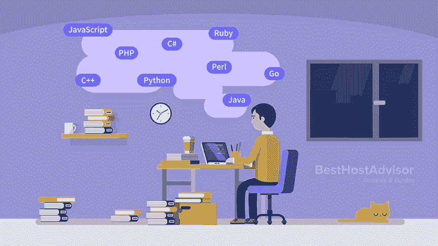
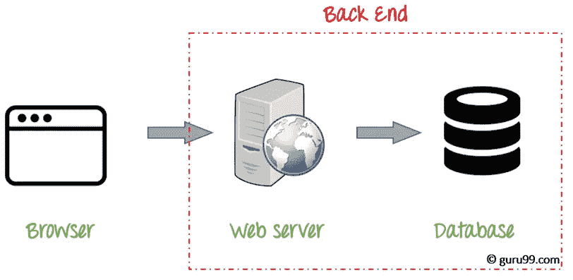
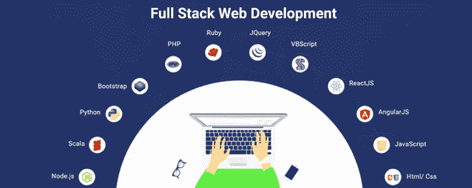

# 没有 CSE 学位！但仍然想成为一名软件开发人员。

> 原文：<https://medium.com/analytics-vidhya/no-cse-degree-but-still-want-to-be-a-software-developer-70272450bf96?source=collection_archive---------17----------------------->

读者们好，
我是苏伦德拉，我的专业是**电子与仪器仪表**工程。我从来不想成为一名仪器或电子工程师
，但是我走错了方向。我并不是说电子和仪器不好，但我对此不感兴趣。好了，我的故事讲完了，是时候回到与标题相关的上下文了。

> **成为程序员的步骤**

> 步骤 0

如果你想成为一名程序员，首先要像程序员一样思考:)。
**总是从 0 开始计数。**

> 第一步

让你自己非常清楚你的最终目标和你想要学习的领域。花些时间探索在这个广阔的领域中你会遇到的不同种类的机会，并决定你想在哪个领域看到自己。一些重要的领域是
1。前端开发
2。后端开发
3。全栈开发

> **想学习成为前端程序员**

前端开发是软件领域中最重要和最有创造性的一种。这是一个主要关注用户体验的领域，通过实现漂亮的 UI 部件，用户可以与你的实现进行交互。每个前端程序员必须具备的主要素质
1。创意
2。好的选择技巧
3。理解颜色、字体及其重要性。
要成为一名前端开发人员，必须学习这些技能
基础知识 **HMTL、CSS、JAVASCRIPT
高级 JAVASCRIPT 框架(Reactjs/Angular/Vue)
了解更多关于前端开发的信息**

> **想学&成为后端开发者**

如上所述，后端开发是让互联网在幕后运行的东西。后端开发人员主要关注网站如何工作。他们编写的代码专注于他们正在开发的应用程序的功能和逻辑，而他们所开发的技术永远不会被用户直接看到。它是服务器、应用程序和数据库的组合。要成为后端开发者，你必须至少学习一门后端语言。一些著名的后端语言有 javascript、Python、Java、PHP。参考[这个](https://learntocodewith.me/posts/backend-development/#:~:text=Backend%20development%20(also%20stylized%20as,the%20backend%20developer%20or%20team.)来学习更多关于后端开发的知识。

> **想学&成为全栈软件开发人员**

全栈开发是前端和后端技术的结合。一个全栈开发人员还不能精通所有的技术，但是他/她必须精通所有的技术。他/她必须了解或意识到所有使用的现有技术。他们是一些栈(灯，MERN，平均)，是更有名的在今天的市场上，这有助于你很容易成为一个全栈开发者。要成为一名全栈开发人员，你应该了解 HTML、CSS、javascript 等前端技术，以及(React/Angular/Vue)等 Javascript 框架和 Laravel、Nodejs、Django 等后端框架。你需要知道如何使用 SQL 和 NoSQL 数据库，如 MYSQL，MongoDB。
参考[本](https://careerfoundry.com/en/blog/web-development/what-is-a-full-stack-web-developer/)了解有关全栈开发的更多信息。

> 第三步

尽可能多地构建项目。建立项目让你不断更新，并让你进入一些具有挑战性的情况，在那里你可以挣扎一下并开始寻找解决方案。所以，在你的清单中，用一些好的项目来激励你自己。

> 第四步

永远不要停止学习，永远做一个好的学习者。今天流行的技术明天就会过时。所以，让自己跟上技术的发展，开始尽可能多地探索自己。

> 第五步

> 最后但同样重要的是。无论什么阻碍你，都不要放弃。继续走好:)

感谢阅读
[我的作品集](https://surendradev.netlify.app/)
[我的 Linkedin](https://www.linkedin.com/in/surendra-vadaparthy-07b145193/)
关注我获取更多有趣的博客