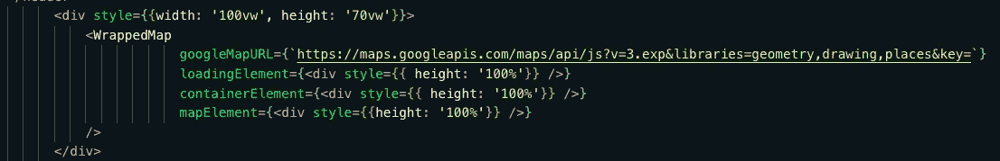

# 轻松开始使用谷歌地图

> 原文：<https://medium.com/analytics-vidhya/no-hassle-way-to-get-started-with-google-maps-dd4da0cf1482?source=collection_archive---------24----------------------->

如果任何位置有一个地址，在地图上找到它是一种习得行为。自从美国宇航局在 1978 年率先使用 GPS 技术以来，使用这种技术的设备呈指数级增长。今天，世界上有 35 亿部智能手机。几乎所有这些设备都能够在 4.9 米的距离内定位智能手机。仅仅通过*纬度*和*经度*坐标来记录一个位置是非常容易的。

今天位置信息被提议用来[对抗](https://www.washingtonpost.com/technology/2020/03/17/white-house-location-data-coronavirus/)现代最大的疫情。

因此，让我们尝试创建一个应用程序，可以在谷歌地图上定位这些坐标。我们将利用谷歌地图库对 COVID-29 爆发的主要热点地区进行地理定位。

`npx create-react-app <your app name>`

`npm i react-google-maps`

接下来我们在父组件中导入`WrappedMap`。

`import {WrappedMap} from ‘./Map’;`

我们将尝试在 App.js 中渲染地图

为此，我们必须将地图包装在包装地图中，我们将从自定义组件 Map.js 导入该地图

把它包在一个 div 中，并添加`style={{width: ‘100vw’, height: ‘70vw’}}`

当你第一次制作这个应用程序并且没有 google api 密钥时，请编辑上面的链接。

`googleMapURL={`https://maps.googleapis.com/maps/api/js?v=3.exp&libraries=geometry,drawing,places&key=`}`

基本上，您正在删除以下组件:

`${process.env.REACT_APP_GOOGLE_API_KEY}`

没有 api 密匙仍然可以渲染你的地图，但是会有警告和水印。一旦你有了一把钥匙，你就可以越过这里的[去学习如何隐藏它们。](/better-programming/how-to-hide-your-api-keys-c2b952bc07e6)

现在我们可以制作`<Map>`组件了。

让我们把它变成一个功能组件

导入以下内容

`import { GoogleMap, withScriptjs, withGoogleMap, Marker, InfoWindow } from “react-google-maps”`；

我们的状态中有两个值，`Cases`和`selectedCase`

数据来源:我们将使用全世界新冠肺炎确诊病例报告的 json API。链接到 API [这里](https://covid19.mathdro.id/api/confirmed)。

数据结果在下面的`json`文件中。

让我们获取数据并将其存储在我们的状态中。

`const [cases, setCases] = useState([])`；

我们可以继续渲染<googlemap>元素。</googlemap>

在上面的代码中，我们已经渲染了一个`<GoogleMap>`，并且我们迭代了数组中的所有对象，为数组中的所有对象创建了`<Marker/>`(请参考上面的代码)。

我们需要的唯一值(对于每个对象)是“country region”“lat”和“long”。现在，我们需要在单击地图上的大头针时显示信息。

让我们将 selectedRegion 添加到我们的状态:

`const [selectedRegion, setSelecteRegion] = useState(null)`

我们将默认保存它`null`，这样就不会选择管脚。

当地图上呈现的任何大头针被点击时，我们可以添加一个函数，这样当`onClick()`时，`selectedRegion`被设置为我们点击的那个。

如果从 selectedRegion 中选择了任何内容(基于`<InfoWindow>`的`.lat`和`.long`，我们可以拉出 Region ( `selectedRegion.countryRegion`)和我们需要的任何其他值，并在 pin 上显示出来。

最后，我们导出地图，以便`App.js`可以将其作为`<WrappedMap>`接收

`export const WrappedMap = withScriptjs(withGoogleMap(Map));`

请在下面找到完整的代码。

App.js

Map.js

请在此找到上述网站[的现场版。您可以使用这段代码在任何项目中实现它。这里的](https://googlemapsdemo.netlify.com/)代号[。](https://github.com/ransing/map-blog)

感谢您的阅读。