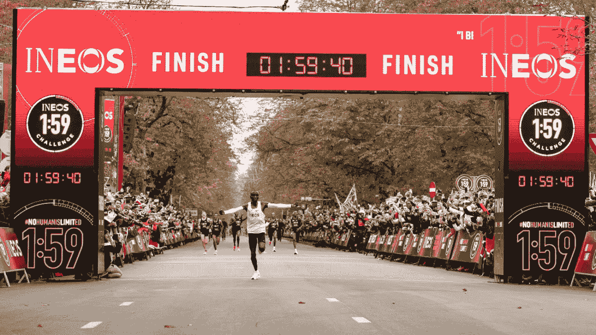
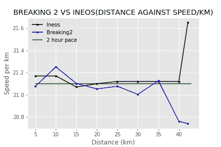
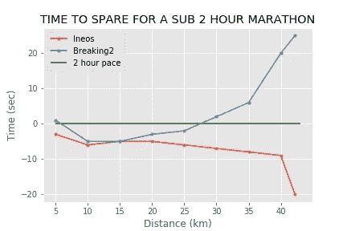
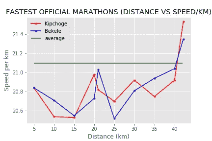
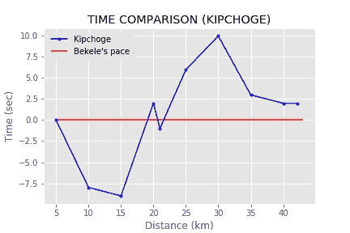

# 没有人是有限的

> 原文：<https://medium.com/analytics-vidhya/no-human-is-limited-3afc2a53b3ed?source=collection_archive---------12----------------------->

## 一个关于 2 小时以下马拉松世界纪录的数据分析项目

2019 年 10 月 12 日上午，埃鲁德·基普乔格成为历史上第一个在奥地利维也纳跑完不到两小时马拉松的人，证明了人无所不能。基普卓格以 1 分 59 秒 40 的惊人成绩跑完了 42.195 公里的距离。欲了解更多关于此次破纪录跑步的信息，您可以访问[这里](https://www.ineos159challenge.com/news/history-is-made-as-eliud-kipchoge-becomes-first-human-to-break-the-two-hour-marathon-barrier/)。这是他第二次尝试跑不到两小时的马拉松，第一次是在 2017 年 5 月，当时他的成绩是 2:00:25，仅差 25 秒就达到了目标。

图一。

这个博客将分为两部分，在第一部分，我将关注由 Eliud 在 Breaking 2 和 Ineos Challenge 中跑出的两个最快的非官方马拉松时间。在第二部分，我将在 2019 年柏林马拉松赛上比较 Eliud Kichoge 的世界纪录 2:01:39 和 Kenanisa Bekele 的 2:01:41。

对于我的分析，我将使用 Python 3、Pandas、Matplotlib 和 Jupyter Notebook。

## **Breaking 2 vs . Ineos 挑战赛**

这两个时间是由肯尼亚的埃鲁德·基普乔格在 Breaking 2 中跑出的 2:00:25，在 Ineos Challenge 中跑出的 1:59:40。我绘制了每 5 公里比赛的平均速度线图，并比较了 Eliud 在两场比赛中的表现。为了在 2 小时内完成 42.195 公里的全程，需要以 21.0975 公里/小时(5.8604 米/秒)的平均速度跑步。在 Breaking 2 中，平均速度为 21.0245 km/h (5.8401 m/s)，在 Ineos challenge 中，平均速度为 21.1563 km/h (5.8767 m/s)。

从*图 2* 中的图表，我注意到在 Ineos 挑战赛中，全程配速更加一致，并且配速也经常超过 2 小时配速。我还看到 40 公里大关后速度有了明显的提高。我会把这归因于赛车速度的下降和即将书写历史的兴奋带来的肾上腺素激增。从*图 3* 中，我还看到了 Ineos 挑战赛中的速度制定非常出色，因为他们从未低于两小时的速度。

我还从*图 2* 的图表中看到，在 Breaking 2 中，配速没有达到 2 小时配速，到第 35 公里时，平均速度明显下降，主要是由于疲劳。从*图 3* 中，我看到配速一直很好，直到 25-30 公里标记处，在此处他们偏离了两小时配速时间。

图二。

图 3。

从这个图表中，我得出了以下结论，为什么 Eliud 能够在一场比赛中跑完 2 小时以下的马拉松，而在另一场比赛中却不行。

1.  在 Ineos 挑战赛中提高速度。
2.  不屈服于疲劳的精神力量通常是马拉松运动员在 30 公里后经历的。
3.  更强的比赛结束。
4.  仅仅差 25 秒就打破了 2 秒的记录。

# **最快官方马拉松时间**

在这里我将重点介绍 2018 年柏林马拉松的获胜时间- 2:01:39(埃鲁德·基普乔格的世界纪录)和 2019 年-2:01:41(Kenanisa be kele 的第二快马拉松)。

从*图 4* 中，我注意到埃利德起步较慢，但当他接近 20 公里标记时，他跑得更快了，然后他似乎在半程标记和 25 公里标记之间失去了一点速度，他在最后也有一个强有力的结束。还是从 F *图 4，* Bekele 比 Eliud 有更好的起步，不断提高速度直到半程标记，在那里他似乎真的很挣扎，在 25 公里标记之前失去了很多速度。在那之后，他似乎恢复了活力，并继续有一个强有力的结束。

图 4。

如果能看到这两个人在一场比赛中的表现将会非常棒。考虑到这一点，我用 Bekele 的速度作为基准，试图看看 Eliud 的时间与 Beleke 的时间有多远。从图 5 中，我可以看到 Bekele 的起步更强，到 15 公里时，他将落后 Eliud 秒。随着比赛的进行，Bekele 确实在 20-25 公里之间挣扎，Eliud 会赶上来，他会领先 be kele 6 秒，领先 25 公里。Eliud 本可以继续进行一场精彩的比赛，以 35 公里的成绩领先贝克勒 10 秒，尽管他在最后 15 公里紧追不舍，但他只领先贝克勒 2 秒完成比赛。

图 5。

看过这两场比赛后，我相当有信心 2:01:39 的世界纪录可以被这两个人中的一个打破(在 2021 年之前)，因为他们中没有人在跑那些时间时有一场完美的比赛。

数据来源:

1.  【2018 年柏林马拉松
2.  [柏林马拉松 2019](https://berlin.r.mikatiming.com/2019/?content=detail&fpid=list&pid=list&idp=00001705C9AFB000004BB4CD&lang=EN&event=MAL&search%5Bsex%5D=M&search%5Bage_class%5D=%25&search_event=MAL)

3.信息- [Ineos 挑战](https://www.ineos159challenge.com/news/history-is-made-as-eliud-kipchoge-becomes-first-human-to-break-the-two-hour-marathon-barrier/)和 [Ineos 数据](https://en.wikipedia.org/wiki/INEOS_1:59_Challenge)

如果你想要我用来做这个分析的代码和数据，请随时联系我的电子邮件 timothymadegwa@gmail.com