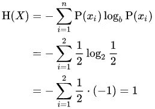

# 没有必要被困惑所困扰

> 原文：<https://medium.com/analytics-vidhya/no-need-to-be-perplexed-by-perplexity-cd4cb71ac97b?source=collection_archive---------8----------------------->

当我第一次在自然语言处理中听到这个术语时，困惑这个名称引起了我的兴趣。于是想到了写一篇文章。相信我，困惑并不像听起来那样。

一般来说，困惑是一种混乱的状态或复杂而困难的情况或事情。从技术上来说，困惑被用来衡量一个语言模型的效用。语言模型是估计一个句子或一系列单词或即将出现的单词的概率。在这篇文章中，你将会知道什么是真正的困惑，并且非常容易理解。

# 介绍

困惑是对概率模型预测测试数据的程度的度量。基本上，它是一个句子、短语、单词序列等的概率分布。困惑是我们用来评估语言模型的一个变量。低困惑度表示概率分布擅长预测样本。让我们看看在评估语言模型时如何使用它。

# 困惑背后的数学

基本上，最好的模型是能够最好地预测未知测试集的模型。语言模型在测试集上的困惑度是测试集的逆概率，用单词数归一化。对于单词为 W = w_1，w_2，…，w_N 的测试集，测试集上模型的困惑度为:

这样，刑期越长，可能性就越小。然后再由链式法则:

困惑是句子概率的函数。困惑反转的意思是**每当我们最小化困惑时，我们就最大化了概率。**

# 概率分布的困惑

离散概率分布 p 的困惑度被定义为熵的指数:

来源:https://en.wikipedia.org/wiki/Perplexity

其中 H(p)是分布 p(x)的熵，x 是所有可能值上的随机变量

> 熵是对随机变量的结果进行编码所需的预期或平均位数的度量。熵可以被视为一个信息量，而困惑可以被视为随机变量的选择数量。

**举例:**

考虑扔一个公平的硬币，出现正面或反面的概率。

下一次掷硬币的未知结果的熵被最大化，即如果正面和反面都有相等的概率 1/2。

所以**，熵**为 1。

**困惑度**为 2。

熵使用对数，而困惑和它的 **e^** 使它回到线性范围。一个好的语言模型应该预测高的单词概率。所以，困惑越小越好。

**作为分支因素的困惑**

对任何指数熵度量的解释都是作为一个分支因子(随机变量拥有的加权平均选择数):熵以比特为单位来度量不确定性，但在指数形式中，它被度量为具有同等不确定性的同等加权分布的大小。也就是说，exp(H(p))是为了获得与分布 p 相同的不确定性，在一个公平骰子上需要多少个面

熵有一个常数的不同，这取决于你是用以 2 为底的对数还是用自然对数来测量，但是不管你用哪个底，困惑都是一样的。

# 困惑和概率是如何关联的？

最小化困惑和最大化概率是一样的

*   更高的概率意味着更低的困惑
*   信息越多，困惑越少
*   更低的困惑意味着更好的模型
*   困惑越低，我们就越接近真实的模型

# 参考资料:

*   [https://web . Stanford . edu/class/cs 124/LEC/language modeling . pdf](https://web.stanford.edu/class/cs124/lec/languagemodeling.pdf)
*   [https://en.wikipedia.org/wiki/Perplexity](https://en.wikipedia.org/wiki/Perplexity)

谢谢你读到这里。敬请关注更多内容！