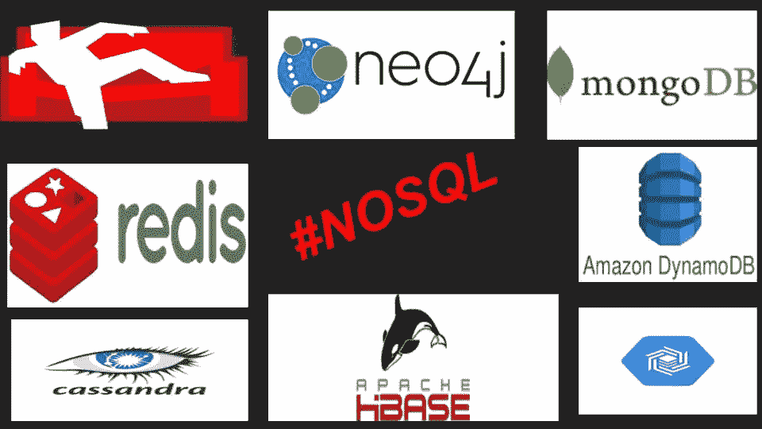
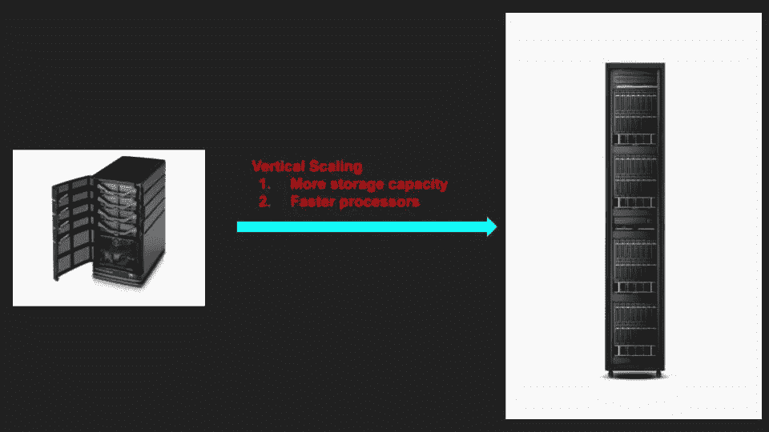
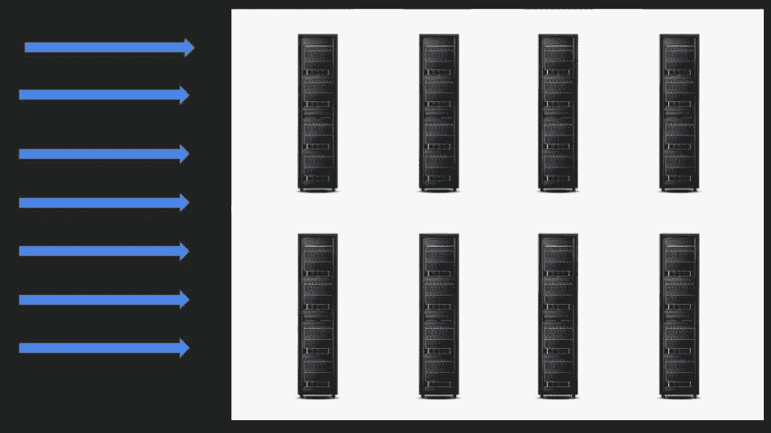
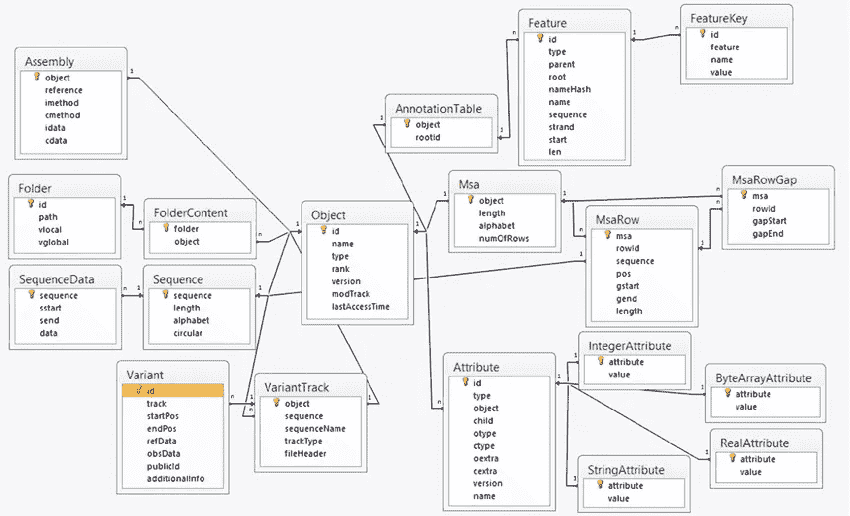
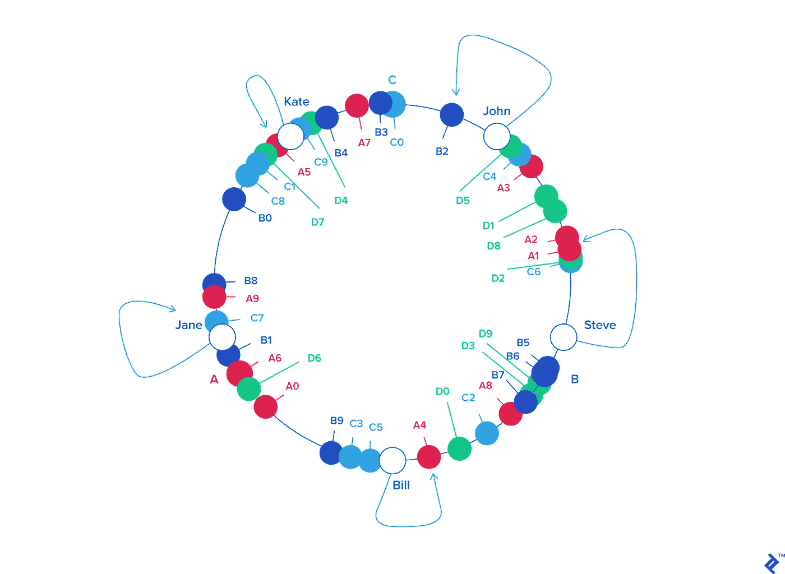
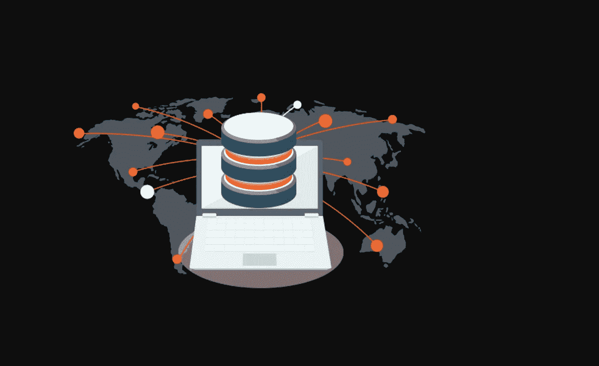

# NoSQL 数据库介绍

> 原文：<https://medium.com/analytics-vidhya/no-sql-databases-an-introduction-eb9706fbe3?source=collection_archive---------2----------------------->

NoSQL 数据库

# NoSQL 一词的由来

在互联网时代，企业使用传统的关系数据库。21 世纪中期，随着互联网的普及，亚马逊和谷歌等公司的流量和数据激增。诸如 MySql、Postgres、Oracle 等关系数据库不能很好地扩展。Amazon 提出了 SimpleDB，Google 引入了 BigTable 来克服 RDBMS 的局限性。这两个非关系数据库的进入引发了技术社区的兴趣。2009 年，Johan Oskarsson 组织了一次讨论分布式非关系数据库的会议。为了推广这个聚会，他在推特上使用了标签 **#NoSQL** ，这催生了 NoSQL 数据库。在本文中，让我们浏览一下 RDBMS 的局限性，NoSQL 数据库的工作原理、功能和误解。

# 扩展关系数据库

让我们想象一下，我们在 2005 年左右开始了一项互联网业务。我们的业务有所起色，我们见证了网站流量的指数级增长。我们的客户抱怨网页加载速度慢。我们下一步做什么？我们要求聪明的数据库管理员优化数据库查询，并使用索引来提高网站性能。几个月后，我们又开始收到投诉。垂直扩展现在来拯救我们了。多投资几美元购买更大的服务器确实解决了我们的问题。

**垂直缩放**

对于我们数据库的垂直扩展，我们能走多远是有实际限制的。如果我们的网站想要进入一个新的业务，并存储视频，图像，聊天和所有形式的其他数据怎么办？

**水平缩放**

答案很简单。由于单个机器可以存储有限的数据量，我们不得不求助于水平扩展。我们购买了数百台大型服务器，并在这些机器上分配数据和流量。

SQL 数据库不是为水平伸缩而设计的。将来自多台机器的数据集和数据聚合连接起来会给我们的设计带来复杂性。

传统的关系数据库如 MySQL、PostgreSQL 等支持 A.C.I.D(原子性、一致性、隔离性和持久性)事务。否-SQL 数据库符合 B.A.S.E(基本上可用且最终一致)。让我们浏览一下 NoSQL 数据库的特性。

# **NoSQL 数据库的特点**

## **1 —无模式**

关系数据库有一个严格的模式。用户必须经历多次迭代才能对数据建模。改变属性的数据类型对于开发人员、主管和 DBA 来说是一场噩梦。

**修改数据库模式**

NoSQL 通过提供灵活的模式克服了这一限制。这些数据库从用户那里抽象出数据存储和内部工作。它们支持存储用户定义的数据结构。数据可以以 JSON 对象的形式存储。用户可以灵活地添加、替换或删除数据中的属性。

SQL 和 NoSQL 类似于静态类型和动态类型的编程语言。SQL 数据库就像 C、C++一样，首先定义数据，然后存储值。NoSQL 提供了类似 python 的能力，你可以给一个变量赋值，这很有效。

**SQL 类似于 C、C++、Java**

**NoSQL 类似于 Python**

由于与模式无关，NoSQL 数据库也被称为读取模式数据库。你只需要在读取数据的同时知道数据是如何存储的。

灵活的模式缩短了开发时间。您不再需要经历数据建模和设计的多次迭代。开发人员可以存储和检索他们想要的任何东西。无模式设计的唯一缺点是由于缺乏控制而增加了风险。如果开发人员绕过开发过程修改生产系统，这只是一种威胁。

SQL 数据库支持列的空值。例如:-银行应用程序网页有许多可选字段，如街道名称、昵称等。如果用户没有填充可选字段，数据库仍然会为这些列保留空间，以防用户将来更新它们。在 NoSQL 数据库中，不传递空条目，因此存储得到了优化。

无模式并不意味着数据库中可以存储任何随机垃圾。例如，如果数据库列支持 JSON 数据类型，那么 JSON 必须是格式良好的。如果应用程序试图存储一个格式错误的 JSON 对象，它将得到一个错误。

## 2 —非相关

关系数据库将数据组织成行和列。您可以在许多表中存储数据，并且这些表可以有不同的关系。要获取数据，可以根据属性值连接表。当要连接的表的数量达到两位数或更高时，应用程序的性能会下降。如果应用程序连接存储在不同数据库服务器上的表，速度会显著下降。

NoSQL 数据库被反规范化了。NoSQL 数据库中的记录之间没有关系的概念。这意味着您只需要将聚合数据存储在一个表中，而不是分散在不同的表中。

以下是上述方法的主要优点

*   **查询速度**——速度显著提高，因为只需要对关键属性进行查找，而不需要连接许多表
*   **存储&检索** -简单地保存并获得一条记录

例如，当您使用 RDBMS 设计一个食品配送应用程序时，您将创建多个表——一个用于用户、餐馆、订单。在 NoSQL 数据库中，一个订单表可以有一个餐馆，用户数据在许多行中重复。上述好处克服了数据重复的缺点。

**复杂 ER 图**

您可以避免创建复杂的 ER 图和编写复杂的 SQL 查询。有了 NoSQL 数据库，您可以加快开发速度，专注于完成工作。

## 3 —高可扩展性和可用性

当 Google 发布其 BigTable 论文时，它将 BigTable 定义为“一个用于管理结构化数据的分布式存储系统，旨在扩展到非常大的规模”。NoSQL 数据库可以在许多计算机上存储数十亿字节的数据。

随着非结构化数据量的指数级增长，在单台机器上存储数据变得越来越困难。关系数据库需要专门的硬件来处理负载而不影响性能。因此，为了扩大规模，设计一个在计算机集群上存储数据并有效检索数据的系统变得至关重要。

NoSQL 数据库使用比高性能服务器便宜的商用服务器。随着数据存储需求的增加，可以添加更多的商用服务器。NoSQL 数据库使用一致的哈希算法将数据均匀地分布在一个服务器集群中。

**一致哈希**

NoSQL 数据库可以在许多机器上复制数据。如果任何一台服务器死机或崩溃，数据仍然可以访问。因此，NoSQL 数据库的可用性很高。

**数据复制**

## 4 —开源

开源开发使 NoSQL 软件独一无二。很少有开源厂商发布开源产品并销售企业附加功能。这些公司有一个类似红帽的商业模式。

以下是一些开源 NoSQL 数据库的列表

*   MongoDB
*   卡桑德拉
*   雷迪斯
*   伏地魔
*   超表格
*   Neo4j

# 对 NoSQL 数据库的常见误解

## 1-NoSQL 是单一类型的数据库

NoSQL 数据库是根据数据类型及其内部工作方式进行分类的。以下是不同类型的 NoSQL 数据库

*   key-Value——这些数据库像 HashMap 一样工作，可以存储任何类型的值。几个例子是雷迪斯，伏地魔和气塞
*   宽列存储-列的名称和格式可以根据行的不同而不同。Cassandra、BigTable 和 Hypertable 是宽列存储
*   文档存储 CouchDB、MongoDB 和 DocumentDB 等数据库能够以 JSON、XML 文档的形式存储数据
*   图形数据库——像 Neo4j 这样的数据库内部模型实体是图形节点，实体之间的关系由节点之间的边来表示

## 2 —使用 NoSQL 会有数据丢失的风险

由于 NoSQL 数据库牺牲了一致性而不是可用性，因此可能会出现每次读取都不遵循最近一次写入的情况。然而，这些数据库最终是一致的，因此保证了数据的持久性。

## 3——NoSQL 只是一个时髦词

亚马逊、谷歌、微软、IBM 和甲骨文以及许多其他大公司已经建立了 NoSQL 数据库，并在生产系统中利用它们的能力。大型软件公司只有在看到利润时才会投资技术，因此 NoSQL 不再是炒作。

## 4 —增强型 RDBMS 将取代 NoSQL

NoSQL 的高度分布式特性正在与 RDBMS 技术集成，这导致了许多 NewSQL 数据库的出现。NewSQL 数据库克服了大多数与 RDBMS 技术有关的批评。然而，NoSQL 数据库是为使用不同的数据结构解决不同的数据问题而建立的。

# 参考

*   [NoSQL 的假人](https://www.google.com/aclk?sa=L&ai=DChcSEwjqzNzFzuLkAhWMgHAKHfjqAVcYABAHGgJzYg&sig=AOD64_3WUYDqMdzgPbh4uXupHmzMAoRGvw&ctype=5&q=&ved=0ahUKEwjg8NbFzuLkAhW28HMBHdabAlcQ9aACCNYB&adurl=)
*   [NoSQL 蒸馏](https://www.amazon.in/NoSQL-Distilled-Emerging-Polyglot-Persistence/dp/8131775690/ref=sr_1_2?keywords=nosql&qid=1569092948&s=books&sr=1-2)
*   [卡珊德拉](https://www.amazon.in/Cassandra-Eben-Hewitt-Jeff-Carpenter/dp/9352134184/ref=sr_1_1?keywords=cassandra&qid=1569092992&s=books&sr=1-1)
*   [维基百科](https://www.wikipedia.org/)
*   [企业数据复制](https://www.attunity.com/solutions/database/enterprise-data-replication/)