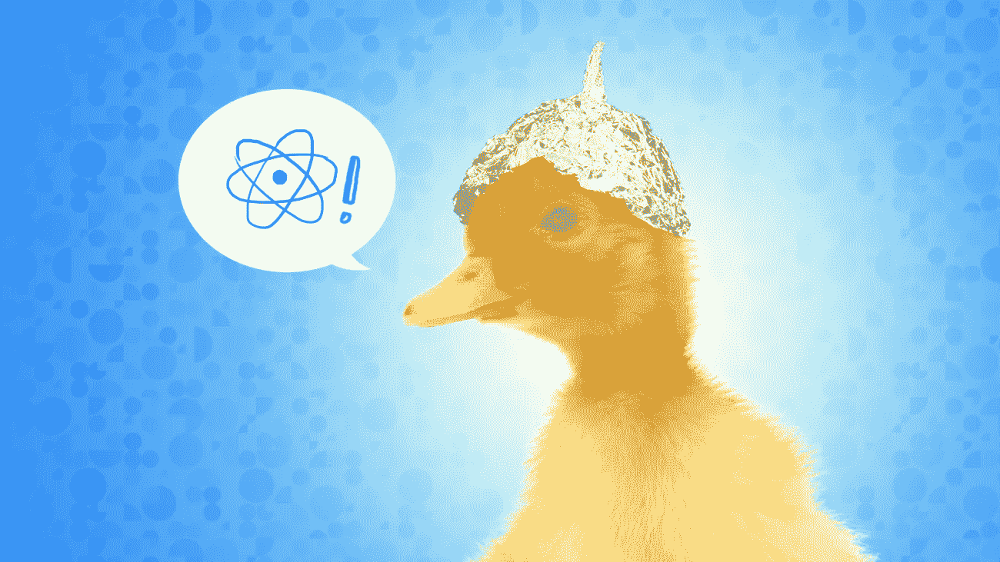
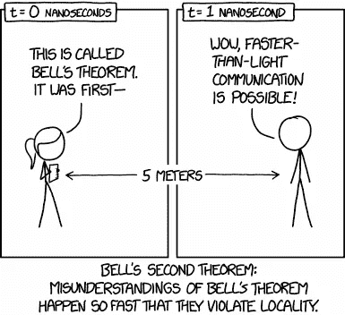
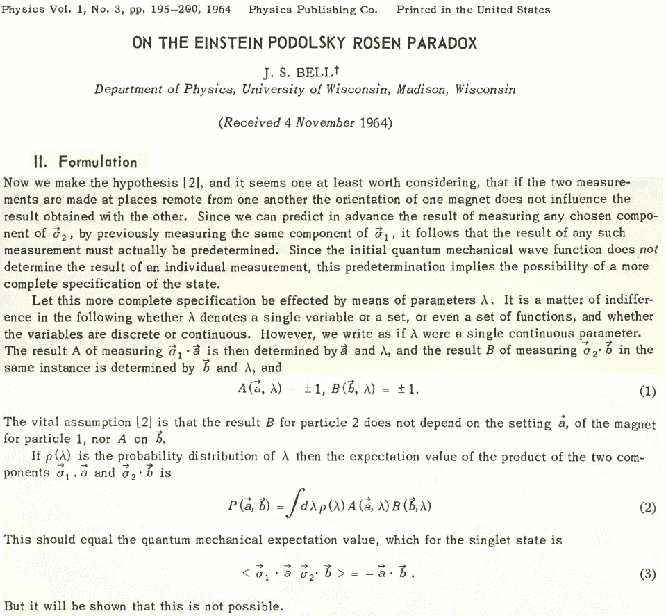
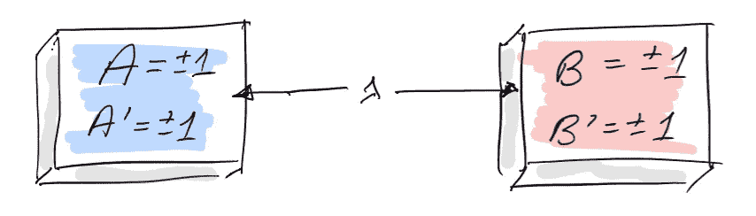
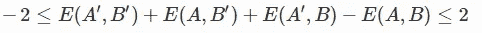
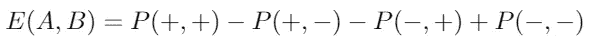
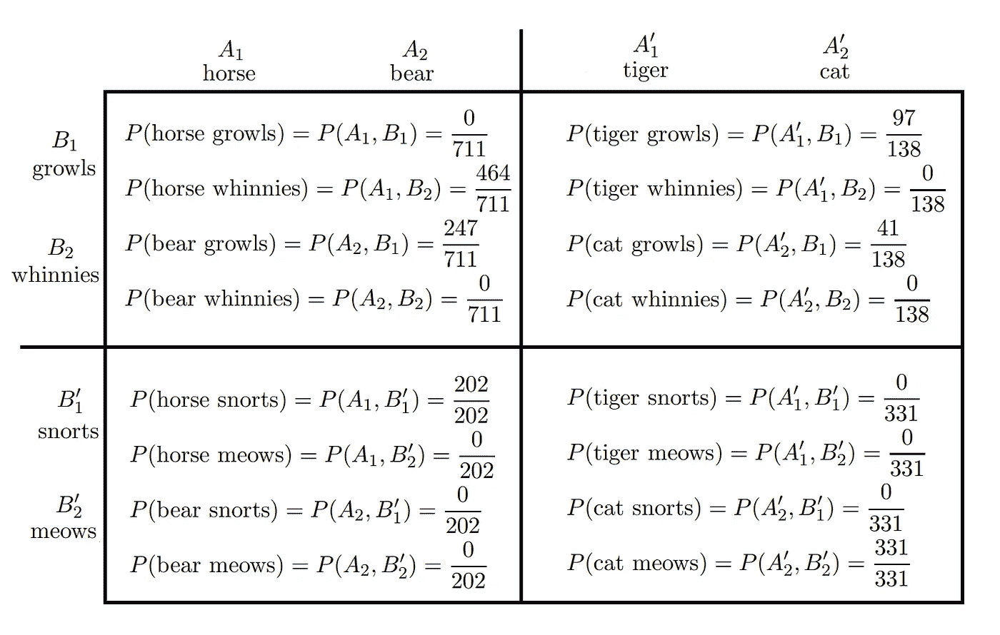
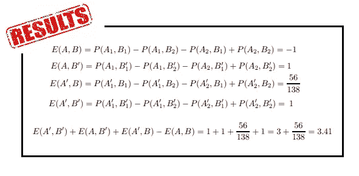

# 不，你的尸体没有被缠住！

> 原文：<https://medium.com/analytics-vidhya/no-your-corpuses-are-not-entangled-1f594b5b57db?source=collection_archive---------18----------------------->

*理解贝尔定理很难，但没有突破物理那么难。*

图片:生活黑客的文章，作者[艾米·图特尔博士](https://lifehacker.com/how-to-quack-proof-yourself-against-pseudoscience-1586708469)

早在 2018 年 12 月，一篇题为“*文件集*中的量子纠缠”的论文发表在斯普林格的期刊[科学基础](https://link.springer.com/article/10.1007/s10699-018-9570-2)上。这篇文章的作者声称，他们在谷歌图书集(语料库)中观察到了强于量子的相关性！当然，有一个完全合理的方法来证明这些荒谬的说法是错误的，但我们不应该错过一个学习的机会。所以抓紧你的**咆哮的马**，我们即将揭穿一些已发表的科学！

岗位组织为:
(1)贝尔定理概述。
(2)分析关于纠缠的说法。
(3)玩玩后量子关联吧！

*免责声明:我对量子巫术有偏见。我已经尽力以一种轻松(半公正)的方式写了这个帖子，并从中得到一些乐趣。希望它也能有教育意义！*

兰道尔·门罗的 XKCD

## 贝尔定理:

在继续之前，重要的是要记住贝尔定理是一个数学结果。它遵循公式“如果一组假设为真，那么这是一个结果”。如果假设不成立，没有人能保证会发生什么。所以举个例子，如果 A 边和 B 边的夹角不是 90°，毕达哥拉斯定理就不成立。我提醒读者这一点，因为通常在这种情况下，许多人说“贝尔证明了 EPR 是错误的”，这也是一种误解。EPR 结果是一个数学定理，它本身是正确的。只是我们的物理宇宙不符合局部实在论，所以我们不能期望结论能告诉我们任何关于我们实在的东西。

这确实是一个美丽的结果，以至于我将让约翰直接向我们解释它。原始文件的扫描版本在[此处](https://cds.cern.ch/record/111654/files/vol1p195-200_001.pdf)找到。

你还记得你第一次听说这个定理的时间吗？

基本上，它说在一个量子实验中，两个物理系统被分别测量“*并且一个【测量设备】不影响用另一个*获得的结果”，那么实验结果的概率分布不能用局部隐变量(LHV)来解释(方程 2)。这有一些非直观的结果，可以通过实验观察到。

最后，我们需要介绍一下 [CHSH 不等式。](https://en.wikipedia.org/wiki/CHSH_inequality)这个不等式是贝尔定理的另一种表述方式，在有两个物理系统{A，B}的场景中；在每个系统{A，A'}，{B，B'}上可能有两个实验；每个实验可能有两种结果{ 1}。

图片: [IBM](https://quantum-computing.ibm.com/docs/guide/mult-entang/entanglement-and-bell-tests) 贝尔不等式 QC 指南

这一切都可以用下面的表达式来概括:

CHSH 不等式

这里 E(A，B)是实验 A 和 B 的期望值，如果我们知道事件的概率，就可以很容易地计算出来{ 1}。在简化的符号中，它看起来像:

换句话说，CHSH 不等式表明，如果对 A 和 B 的实验以这样一种方式进行，即它们的结果互不影响，那么它们之间可以观察到的相关性的数量是有限的。

这个定理的含义是，如果不等式被“违反”,那么所涉及的物理系统必须具有不能用局部隐变量模型解释的相关性。换句话说，量子态是纠缠的。但是正如经典(LHV)系统有局限性一样，量子系统也有局限性。量子系统可以展现的绝对极限被称为 Tsirelson 界，对于 CHSH 不等式来说是 2 **√** 2 (~2.82)。任何高于 2 **√** 2 的东西都被认为是“超越量子”的[，如果我们找到打破这个界限的物理系统，会发生很多奇怪的事情。](https://en.wikipedia.org/wiki/Quantum_nonlocality#The_physics_of_supra-quantum_correlations)

而我们在这里，值得一提的是，贝尔定理存在大量所谓的[漏洞。也就是说，非常聪明的人已经广泛地研究了进行实验所需的所有微观假设，其方式是“*一个测量设备不影响另一个*”。确保这一点的最简单方法是以类似空间分离的方式同时进行实验。但是还有各种各样有趣的细节，关于公平采样、内存、有限统计等等。这是需要考虑的。](https://en.wikipedia.org/wiki/Loopholes_in_Bell_test_experiments)

## 索赔:

作者查看不同的文档语料库(此处显示:来自 Google Books 语料库的结果)，并寻找出现的形式:
**【动物】【行为】。**
有两个不同的【动物】随机变量 A 和 A’。其中 A 的事件在{马，熊}中，A '的事件在{虎，猫}中。同样，对于[行为]有两个变量 B and B '可能的结果分别为{咆哮，嘶鸣}和{鼻息，喵喵}。所以本质上，他们只是寻找包含“马咆哮”的句子的出现，并注意到他们没有找到实例，而他们找到了 464 个“马嘶声”的例子。

下表总结了开创性的成果:

诺贝尔奖获奖数据！

作者开始一步一步地计算 CHSH 值，因为他们不相信《量子认知》的读者能够理解。如果有这样的读者，让我把它贴在这里吧！

倒数第二个简化就是字面上的 1+1+x+1 = 3+x，谢谢！

## 等等……什么？真的！？

是啊！这些家伙不仅发现了非经典关联，还发现了超量子关联！这是他们对此的看法:

> “我们还注意到，我们为谷歌图书语料库确定的违规大于 Cirel 'son 的界限 2√2≈2.8322≈2.83。众所周知，在张量积希尔伯特空间内，纠缠态对乘积测量产生的违反不能高于 Cirel'son 界限，这意味着我们在这里识别的纠缠将与标准量子纠缠具有不同的性质。”-磅和 SG

所以，甚至他们也承认一些“特别”的事情正在发生！希望到现在为止，读者能够理解问题是什么，解决方案在下一段，但是我建议你现在停止阅读，思考这个问题。对量子科学家来说是很好的脑力锻炼。这类似于热力学学家努力揭穿那些承诺永动机或比卡诺更高效率的文章。对于教授量子基础领域的教授，我鼓励你们把这个作为家庭作业！

*什么失败了？* —显然，CHSH 不等式的假设不成立！我们，人类，不会通过独立地探索我们大脑中负责产生(动物)结果的部分，然后是产生(行为)结果的部分来写(连贯的)文档。我不敢说我了解我们的大脑是如何工作的，但我可以有把握地说这么多！绝对没有办法保证一个词的选择对另一个词没有影响。也许这篇论文的作者想自愿参加一项实验，让我们对他们的大脑进行非定位？

> “这不是一个众所周知的事实，但是，如果纠缠不仅存在于态中，而且存在于测量和演化中，那么 Cirel 'son 的界限可以被超过，CHSH 不等式的违反甚至可以达到它的最大值 4。”-磅和 SG

> 众所周知，误解贝尔定理是敲门砖。在为时已晚之前告诉你的孩子吧！—欧洲航空公司

顺便说一下，在阅读他们的论文时，我发现这个神奇的旅行变得更好了！2011 年，他们的一些同事发表了一份[心理研究](https://arxiv.org/pdf/1104.1322.pdf)，结构与这里的一样。参与者被要求将概念组合在一起，最后，他们计算频率，得到 2.42 的 CHSH 违反率！！令人惊奇的事情当然不是违反了 CHSH 不等式，而是 81 个人心甘情愿地做出了贡献！

你认为这只狗会发出嘶嘶声还是吠叫声？————[德鲁·海斯](https://unsplash.com/@drew_hays?utm_source=medium&utm_medium=referral)在 [Unsplash](https://unsplash.com?utm_source=medium&utm_medium=referral) 上拍照

## 总结:

贝尔定理不是魔法。正如理论物理中的任何其他结果一样，如果假设不成立，对结果下任何结论都是毫无意义的。我希望这篇文章能对第一次遇到非本地问题的学生有所帮助。

**奖金** —我为什么要写这个？2018 年底这个在 arXiv 上出来的时候，我就想写一个认真的回复，上传到预印本服务器。然而，我决定不助长这种疯狂，因为我不想给他们开罚单。我认为当有人试图利用这个系统时，向社区发出信号是我们科学家工作的一部分。最后，论文本身很有趣，它严肃地让我大笑不止！如果它只是作为愚人节的噱头出版，我会非常喜欢它。

感谢您的阅读。:)