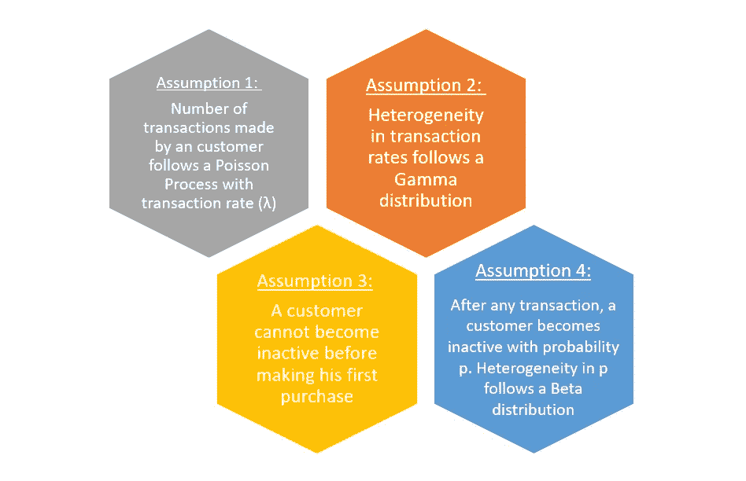
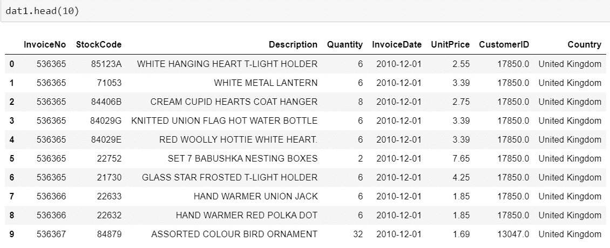
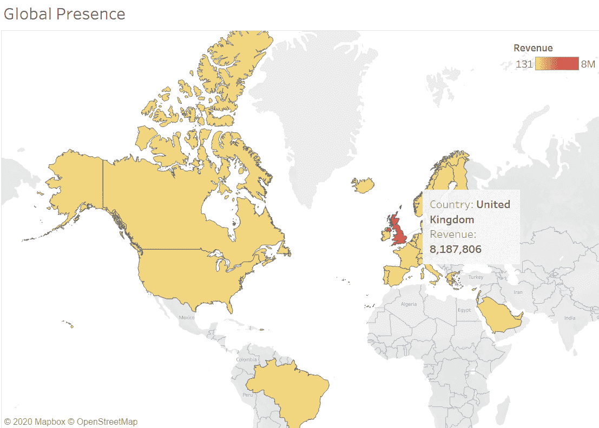
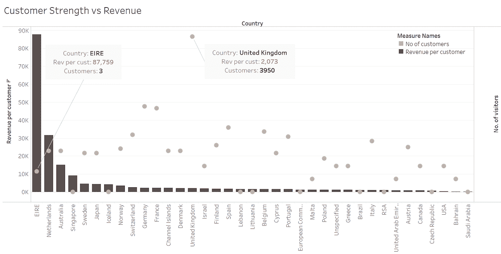
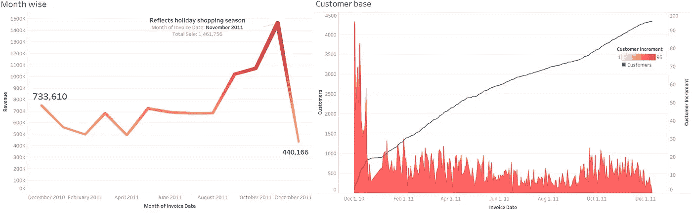
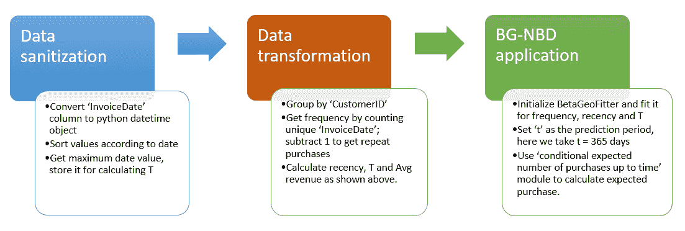
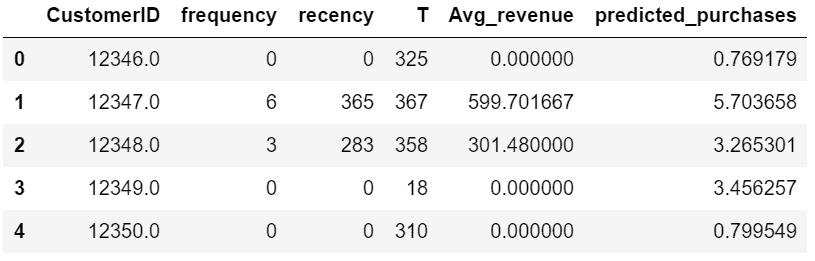
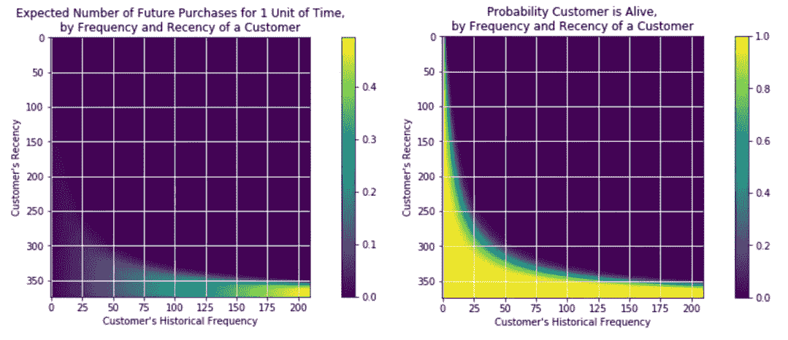
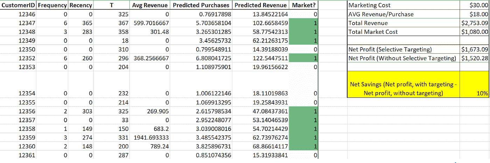

# 不，你的目标市场不是所有人。

> 原文：<https://medium.com/analytics-vidhya/no-your-target-market-is-not-everyone-6668cf2376d?source=collection_archive---------12----------------------->

作者 Aditya Khandelwal 和 Archit Gupta

*你有没有想过亚马逊是如何向每月 2 亿*[](https://www.nchannel.com/blog/amazon-statistics/)**独立访客推销自己的？他们是向所有用户营销还是选择少数有高购买机会的用户？如果是这样，他们是如何判断谁才是值得营销的对象呢？**

*这些问题困扰着我们，也让我们试图理解客户细分的重要性。读了一些文章后，我们认识到，公司不仅可以通过识别可能活跃的客户，还可以通过识别具有可观终身价值的客户来节省保留成本。但是主要的挑战是决定应该用什么样的特征来区分顾客。是基于人口统计信息，还是收入的历史趋势，或者仅仅是我们需要做聚类分析的公司的任期？然而，在看了这个[视频](https://www.youtube.com/watch?v=guj2gVEEx4s)之后，我们明白答案在 **r** 频率、 **f** 频率和 **t** ime 参数的范围内，这些参数代表:*

*   ***R**ecency——客户最近购买了什么？*
*   *频率——他们多久购买一次？*
*   *观察的时间框架是什么？*

*在视频中，宾夕法尼亚大学沃顿商学院的 Peter Fader 教授谈到了一种称为贝塔几何/负二项分布(BG-NBD)的复杂模型，作为一种准确预测客户行为的方法。通过拟合数据找到四个参数，即 a、b、r & alpha，并用于预测客户存活的概率以及在长度为 t 的未来时间段内的预期交易数量。我们不会深入研究此分析的数学。不过，如果你有兴趣，这里有[的论文](http://mktg.uni-svishtov.bg/ivm/resources/Counting_Your_Customers.pdf)。*

*BG-NBD 模型适用于非合同环境中的客户。为了理解这一点，契约环境是这样一种情况，当组织精确地知道一个客户是否已经离开公司，谁仍然“忠诚”,从而避免任何不确定性。类似地，非合同环境是指组织不知道客户是简单地“不活跃”还是确实已经离开了公司。这可能会导致市场营销或其他客户相关活动的不确定投资，给组织带来数百万美元的损失。因此，BG-NBD 模型对于拥有非合同类型客户的企业至关重要。*

**

*每个模型都有需要考虑的假设。对于 BG-NBD，这些在相邻的图表中有所提及。为了简单起见，我们在这里不再赘述。*

*见证了这种模式的力量，我们提供了一种简单的方法，让任何中小型企业使用随时可用的数据(如包含日期、价格和数量的交易数据)来识别高影响力客户(记住—在非合同环境中)。*

*出于我们分析的目的，我们选择了一个包含客户购买信息的在线电子零售商数据集，可以在[这里](http://archive.ics.uci.edu/ml/datasets/online+retail)找到。数据集的一瞥如下-*

**

*在我们深入研究之前，我们决定运行一些探索性分析来理解数据。我们看到有些分录的数量为负，这表明通过中和合并分类帐的价值纠正了以前的错误分录。然而，很难为每个不正确和正确对找到相应的匹配。因此，为了继续我们的分析，我们简单地忽略负值。我们应该记住，这可能会夸大我们的结果。*

*除此之外，大多数客户属于英国，因此构成了电子零售商的主要收入来源。(如下图所示)*

**

*然而，如果我们以每位顾客的收入作为衡量标准，英国排在第 12 位，其他国家如爱尔兰、荷兰和澳大利亚领先，这意味着从各自国家购买大额物品。但是，我们也看到这些国家的客户数量明显少于英国的客户数量，因此这个指标在这里没有用。*

**

*查看不同时间的数据，我们发现该网站在 11 月和 12 月最繁忙(见下图)。因为是假期，这是意料之中的。此外，客户基础图(右下图)以密度和累积方式显示了客户获取图。据观察，在 1 月 11 日左右有一个急剧下降，表明收购率大幅下降。*

**

*现在我们已经完成了初步分析，我们的路线图是转换数据，应用 BG-NBD 模型预测预期购买数量，使用每张发票的平均支出预测每位客户的收入，最后使用 solver 选择客户以优化利润。但在此之前，让我们先了解一些稍后会用到的基本术语:*

1.  ***重复购买**:除第一笔交易外的历史交易总数。*
2.  ***:顾客最后一次购买时的年龄，等于顾客第一次购买和最后一次购买之间的时间。***
3.  *****频率**:顾客重复购买的次数。***
4.  *****客户年龄(T)** :等于客户第一次购买和数据集中最后一天之间的持续时间。***
5.  *****平均收入**:每个客户的平均收入，等于特定客户每次重复购买的平均收入。***

***太好了！我们的下一步是清理数据，转换数据，并应用 BG-NBD 模型来预测预期购买数量。***

***下面的流程图给出了上述步骤的细节:***

******

***前两步完成后，我们使用 Python 中可用的“寿命”库来应用 BG-NBD 模型。这个库擅长于发现客户终身价值(CLV)和执行相关计算，例如在非合同环境中预测客户流失和频率。创建图表和执行计算的模块很容易获得，并且可以很容易地投入使用。查找预测购买的代码如下:***

```
***#BG/NBD From here
#m1 is our modified datasetfrom lifetimes import BetaGeoFitter
from lifetimes.utils import *bgn = BetaGeoFitter(penalizer_coef=0.0)
bgn.fit(m1['frequency'], m1['recency'], m1['T'])
print(bgn)t = 365
#this means that we are predicting for repeat purchase till 
# the next year in futurem1['predicted_purchases'] = bgn.conditional_expected_number_of_purchases_up_to_time(t, m1['frequency'], m1['recency'], m1['T'])***
```

***输出表如下所示:***

******

***观察结果，我们发现一个有趣的事实:BG-NBD 模型对未来预期重复购买的预测在很大程度上取决于购买的新近性。意思是——与购买了相同数量的产品但一段时间没有活动的客户相比，最近购买产品的客户“活着”的概率更高(或者简单地说，拥有更大的权重)。此外，下面的图表告诉我们，最近比客户的频率更重要！因此，除了保持健康的频率之外，保持客户的最近性是企业应该关注的事情。结合两个图表中的信息，位于右下角的客户是我们应该关注的对象。***

******

***我们已经从客户那里获得了预期的收入。但是核心问题仍然是一样的——为什么不应该把每个人都作为保留/收购的目标呢？回答这个问题的最佳方式无疑是尝试量化电子商务零售商通过采用目标营销可以预期节省的成本。这里，我们通过选择正确的客户，利用预期收入来优化客户保持费用(这里我们采用营销费用)。就本文的范围而言，我们将此分析仅限于 50 个客户。我们需要知道我们企业的每个客户的平均保留成本和每次购买的平均收入。我们假设每个客户的保留费用是 30 美元的营销成本。***

***步骤如下-***

1.  ***我们从数据集中计算出每张发票的平均花费，大约为每位客户 18 美元。***
2.  ***为了衡量细分的影响，我们首先计算没有选择性目标的净利润。因此，每个客户都会成为目标，而不管他/她在一段时间内的预期回报。***
3.  ***然后，获得选择性瞄准后的净利润。对于选择性目标，Excel 的规划求解软件包用于拟合一个在改变“市场”的同时使净利润最大化的解决方案(参考下面的 excel 快照)参数为 1(目标)或 0(非目标)。在确定是否营销时，预测的预期收入起着重要作用。***

******

> ***获得了 **~10%** 的净节约，这展示了选择性营销的力量及其给营销活动带来的潜在好处。***

***因此，通过使用 BG/NBD 模型，人们可以通过有选择地锁定客户，在保留成本方面节省大量成本。我们的研究结果证实了细分在数字营销中发挥着重要作用，并且可能是贵组织营销成功的主要因素。***

***希望你在阅读这篇文章时感到愉快。请在评论区告诉我们你对我们分析的看法。保持安全:)***