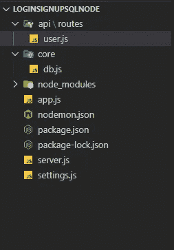
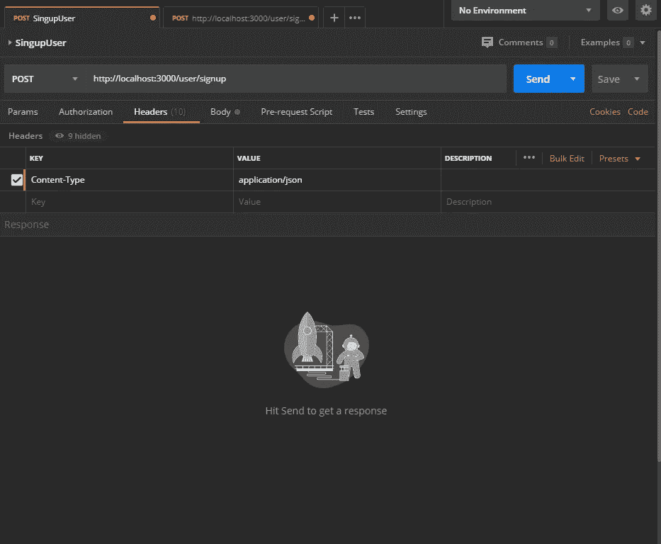
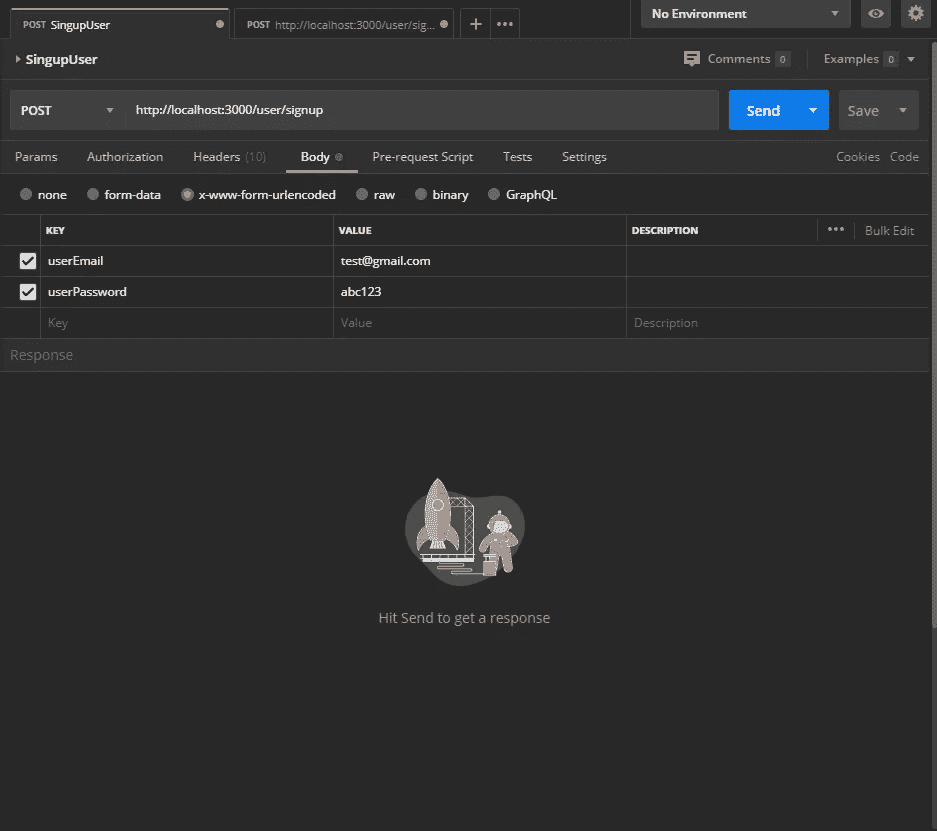
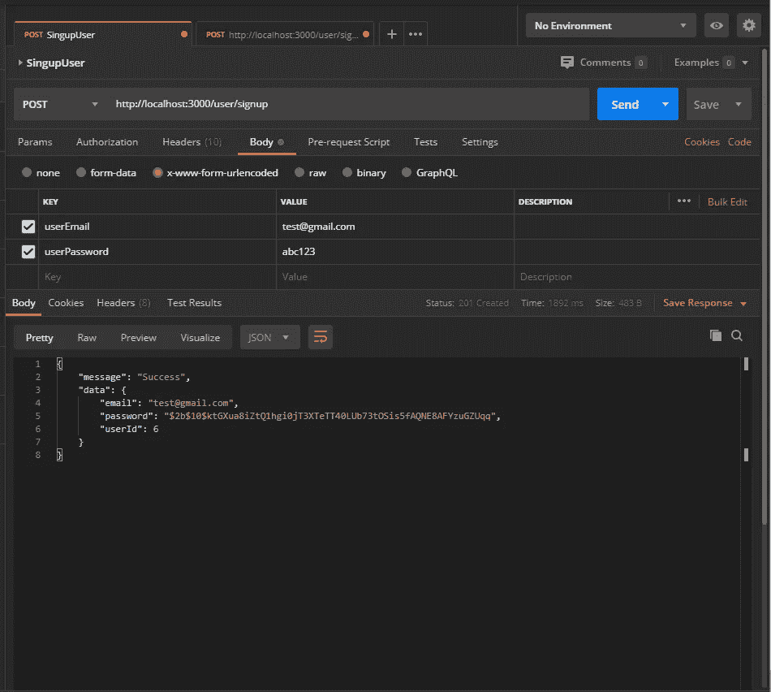
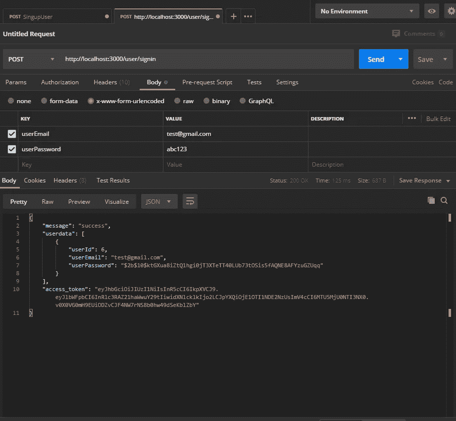
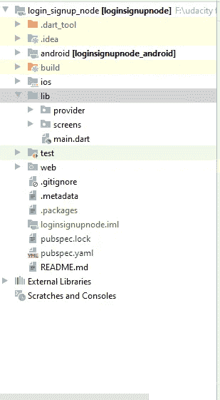

# 节点 JS，Express，SQL Server，和 Flutter 一起调情。

> 原文：<https://medium.com/analytics-vidhya/node-js-express-sql-server-and-flutter-together-flirting-a7e57bccb697?source=collection_archive---------1----------------------->

你好，今天我们将讨论如何使用 store procedure 和 Node JS 和 SQL server 创建一个 restful API，并在 flutter 应用程序中使用它。

首先，我们将在 SQL server 中创建数据库和存储过程:

```
Create database loginSignup

use loginSignup

Create table signupUser(
userId int primary key identity(1,1),
userEmail nvarchar(50),
userPassword nvarchar(max)
); --Signup Store Procedure.
Create proc spSignupUser
@userEmail nvarchar(50),
@userPassword nvarchar(max),
@responseMessage varchar(50) output

as
begin
**set** nocount on;

begin **try** IF EXISTS (Select userEmail from signupUser where userEmail = @userEmail)
BEGIN
set @responseMessage = **'Failed'**;
END
ELSE
BEGIN
Insert into signupUser
Output Inserted.userId,@userEmail as Email,@userPassword as Password
values(@userEmail,@userPassword);

set @responseMessage = **'Success'**;
END
end **try** begin **catch** set @responseMessage = ERROR_MESSAGE();
end **catch** end

Declare @userEmail nvarchar(50), @userPassword nvarchar(50),@responseMessage varchar(50)
Exec spSignupUser @userEmail=**'mashood21@gmail.com'**,@userPassword = **'**$**2b**$**10**$fZe7hjws5AzGUa5J0yj2Le1fLAf3oV5SAEee3nneu4VUGEsVIAf82**'**,@responseMessage = @responseMessage output
print @responseMessage;--Signin Store Proc
Create proc spSignInUser
@userEmail nvarchar(50),
@userPassword nvarchar(max),
@responseMessage varchar(50) output

as
begin
**set** nocount on;
begin **try** IF EXISTS (Select userEmail,userPassword from signupUser where userEmail = @userEmail and userPassword = @userPassword)
begin
Select userEmail,userPassword from signupUser where userEmail = @userEmail and userPassword = @userPassword
set @responseMessage = **'Success'**;
end
**else** begin
set @responseMessage = **'Auth Failed'**;
end
end **try** begin **catch** set @responseMessage = **'Failed'** end **catch** end

Declare @userEmail nvarchar(50), @userPassword nvarchar(max), @responseMessage varchar(50)
EXEC spSignInUser @userEmail = **'mashood1@gmail.com'**,@userPassword=**'Passwords'**, @responseMessage = @responseMessage output
print @responseMessage
```

我们不会从后端处理任何加密或解密，因为我们将通过节点 js 来完成。

您需要在 pc 上安装 node。

首先，让我们为 Node js 创建一个项目，转到您想要创建项目的任何目录，创建一个文件夹，文件夹名称之间没有空格，然后进入该文件夹，然后进入新文件夹的地址栏或标题栏，编写 cmd 并按 enter，然后执行以下步骤:

1.  npm 初始化
2.  保持包名不变并按回车键，保持版本不变并按回车键
3.  用 SQL 写一个有意义的描述，比如一个节点 js restful API，回车
4.  然后对于入口点按 enter 键，将测试命令留空按 enter 键，如果您是 git repo link paste in git repository，否则按 enter 键，同时将其留空
5.  写一个关键字，即节点 js Restful API。
6.  然后写上作者姓名，即你的名字。
7.  然后按 enter 键获取许可，并在“这可以吗?”中输入 yes。。
8.  然后写代码。在 vs 代码中打开项目。

您已经成功设置了项目。

你的项目结构应该是这样的。



现在打开一个终端，逐个安装这些依赖项:

1.  npm 快速安装
2.  npm 安装 mssql
3.  npm 安装摩根
4.  npm 安装主体-解析器
5.  npm 安装 bcrypt
6.  npm 安装 jsonwebtoken
7.  NPM install—only-dev nodemon(“—”是连在一起的双破折号)。

安装这些包后，转到 package.json，在脚本中，复制粘贴以下代码:

```
**,"serve"**: **"nodemon server.js"**
```

安装完软件包后，让我们设置第一个 settings.js。记住，您已经设置了 SQL server 身份验证。

```
exports.dbConfig = {
**'user'**: **'Your User name'**,
**'password'**: **'Your password of sql'**,
**'server'**: **'Your Server name'**,
**'database'**: **'**loginSignup**'**,
options: {
enableArithAbort: **false**,
encrypt: **false**,
}
};
```

1.  用户:输入您的 SQL 用户名，默认用户名为“sa”。

2.密码:您的 SQL server 的密码。

3.server:SQL server 的实例名。

4.数据库:输入要使用的数据库的名称。

我们已经导出了这个文件，所以不需要在代码下面导出它。

现在让我们在 server.js 文件中创建一个服务器:

```
**const** http = require(**'http'**);
**const** port = process.env.port || 3000;
**const** app = require(**'./app'**);

**const** server = http.createServer(app);

server.listen(port);
```

我们在这里使用 HTTP 包对 API 进行网络调用。

端口从您的环境中获取，或者您可以使用硬编码的端口，即如果无法从环境中获取端口，则使用 3000 作为本地主机的端口。

应用程序是 app.js 文件，我们将很快介绍它，http.createServer(app)是完成所有魔术的地方，它从 app.js 获取所有代码和路由等，并为我们创建一个本地主机服务器。

server.listen(port)意味着监听我们从环境变量或硬编码 3000 中获得的端口。

现在，让我们转到 db.js 文件，复制粘贴以下代码:

```
**var** sqlDb = require(**'mssql'**);
**var** sqlDbSettings = require(**'../settings'**);

**const** poolPromise = **new** sqlDb.ConnectionPool(sqlDbSettings.dbConfig)
    .connect()
    .then(pool => {
console.log(**'Connected to MSSQL'**)
**return** pool
})
    .**catch**(err => console.log(**'Database Connection Failed! Bad Config: '**, err));

module.exports = {
sqlDb, poolPromise
}
```

这里我们使用我们安装的 mssql 包并导入我们创建的设置。

现在，我们将创建一个与 SQL server 的连接，作为一个单独的类，这样我们就可以导入它并在任何地方使用它，而不是一次又一次地创建请求池，这不是一个好主意。这里我导出 SQL 数据库，pool promise 这是另一种导出方式。

现在让我们转到 API/routes 中的 user.js 文件并导入这些文件:

```
**const** express = require(**'express'**);
**const** router = express.Router();
**const** db = require(**'../../core/db'**);
**const** sql = require(**'mssql'**);
**const** bcrypt = require(**'bcrypt'**);
**const** jwt = require(**'jsonwebtoken'**);
```

express 是一个节点包，它使我们可以很容易地创建 API，而 router 使我们可以访问不同的 API 路径，即 get 请求、POST 请求、PUT 请求。我们将只为注册和登录创建一个帖子请求。

现在，在导入上述包之后，复制粘贴这段代码。

```
async function getpool() {
  **const** pool = await db.poolPromise;
  **const** result = await pool.request();
  **return** result;
}
```

在这个方法中，我们运行异步方法来创建一个池，并以请求的形式发送查询或存储过程，然后获取数据，从而在 SQL 和 node 之间创建一个连接。

```
router.post(**'/signup'**, (req, res, next) => {

**if** (req.body.userEmail != **null** && req.body.userPassword != **null**) {
bcrypt.hash(req.body.userPassword, 10, **async** (err, hash) => {
**if** (err) {
**return** res.status(500).json({
error: {
message: err
}
});
}
**else** {

**const** result = **await** getpool();
result.
input(**'userEmail'**, sql.NVarChar(50), req.body.userEmail)
    .input(**'userPassword'**, sql.NVarChar(sql.MAX), hash)
    .output(**'responseMessage'**, sql.VarChar(50))
    .execute(**'spSignupUser'**, function (err, data) {
**if** (err) {
res.status(500).json({
error: {
message: err
}
});
}
**else** {
console.log(data);
**if** (data[**'output'**][**'responseMessage'**] == **'Failed'**) {
res.status(404).json({
error: {
message: **'User Exist'** }
});
}
**else** {
res.status(201).json({
message: **'Success'**,
data: {
email: req.body.userEmail,
password: hash,
userId: data[**'recordset'**][0][**'userId'**]
}
});
}
}
});
}

});
}
**else** {
**return** res.status(404).json({
error: {
message: **'not found'** }
});
}

});
```

这里我们创建了一个注册的 post 请求，当我们回到 app.js 类时，我将解释为什么我们使用/signup。

这里我们检查 post 请求，所以我们需要将主体传递给 API，所以这里我们首先检查电子邮件和密码是否不为空，

我们使用 bcrypt 包来散列密码，bcrypt 第一个参数是明文，第二个参数是 Salt，即我们要生成多少 salting 关键字，第三个参数是一个函数，这里没有必要有一个异步函数，但根据我的要求，我想访问池，所以我在这里使它异步。在 bcrypt 函数中，我检查发送请求时是否有错误，然后返回状态代码为 500 的错误，如果没有错误，则获取访问数据库的池请求。

现在主要部分在这里，我们正在访问这个代码:

```
result.
input(**'userEmail'**, sql.NVarChar(50), req.body.userEmail)
    .input(**'userPassword'**, sql.NVarChar(sql.MAX), hash)
    .output(**'responseMessage'**, sql.VarChar(50))
    .execute(**'spSignupUser'**, function (err, data) {
**if** (err) {
res.status(500).json({
error: {
message: err
}
});
}
**else** {
console.log(data);
**if** (data[**'output'**][**'responseMessage'**] == **'Failed'**) {
res.status(404).json({
error: {
message: **'User Exist'** }
});
}
**else** {
res.status(201).json({
message: **'Success'**,
data: {
email: req.body.userEmail,
password: hash,
userId: data[**'recordset'**][0][**'userId'**]
}
});
}
}
});
}

});
}
```

我们用它来运行一个存储过程，即获取一些输入，也可能有一些输出，输入意味着用户要输入什么，输出是为了共享结果，输入有三个参数:

1.  您在 SQL 存储过程中定义的列名。
2.  列的数据类型。
3.  您正在输入的文本。

Execute function 执行存储过程，传递存储过程的名称，第二个参数是返回错误和数据对象的函数。我们再次检查我们是否得到 err，然后返回状态代码为 500 的错误，如果我们没有得到任何错误，那么在 else 部分，我们检查我们的存储过程的输出是否返回失败，所以我们发送 404 请求，用户存在。现在，如果我们没有得到任何错误或失败，那么我们将返回状态代码 201 和数据，一封电子邮件将来自 req.body.userEmail，密码将是我们对 bcrypt 使用的散列密码，用户 id 将可从我们执行存储过程得到的数据对象中访问。

现在我们将为我们的登录创建 API。

```
router.post(**'/signin'**, async (req, res, next) => {
**if** (req.body.userEmail != **null** && req.body.userPassword != **null**) {

**const** result = await getpool();
result.
input(**'userEmail'**, sql.NVarChar(50), req.body.userEmail)
.input(**'userPassword'**, sql.NVarChar(sql.MAX), req.body.userPassword)
.output(**'responseMessage'**, sql.VarChar(50))
.execute(**'spSignInUser'**, function (err, data) {
  **if** (err) {
    res.status(500).json({
      error:
      {
        message: err
      }
    });
  }
  **else** {
    result.query(**'Select * from signupUser where userEmail='** + **"'"** + req.body.userEmail + **"'"**).then(function (datas) {

    console.log(datas[**'recordset'**][0][**'userEmail'**] + **'RESULTS'**);
    bcrypt.compare(req.body.userPassword, datas[**'recordset'**][0][**'userPassword'**], (err, results) => {
    **if** (err) {
    **return** res.status(500).json({
    error:
    {
    message: err
    }
    });
    } **if** (results) {
    **const** token = jwt.sign({
    email: datas[**'recordset'**][0][**'userEmail'**],
    userId: datas[**'recordset'**][0][**'userId'**],
    },
    process.env.JWT_KEY,
    {
    expiresIn: **'1h'** },
    );
    console.log(results);
    **return** res.status(200).json({
    message: **'success'**,
    userdata: datas[**'recordset'**],
    access_token: token,
    });
    }
    **return** res.status(404).json({
    error:
    {
    message: **'Auth Failed'** }
    });
    });
    }).**catch**(function (err) {
  **return** res.status(500).json({
  error:
  {
  message: **'Auth Failed'** }
  });
  });
}

});
}
**else** {
**return** res.status(422).json({
error:
{
message: **'Parameter Not Supplied'** }
});
}
});
```

大部分代码与上面的相同，我们将关注 else 部分，因为有必要了解那里发生了什么，所以让我们来讨论一下:

```
**else** {
    result.query(**'Select * from signupUser where userEmail='** + **"'"** + req.body.userEmail + **"'"**).then(function (datas) {

    console.log(datas[**'recordset'**][0][**'userEmail'**] + **'RESULTS'**);
    bcrypt.compare(req.body.userPassword, datas[**'recordset'**][0][**'userPassword'**], (err, results) => {
    **if** (err) {
    **return** res.status(500).json({
    error:
    {
    message: err
    }
    });
    } **if** (results) {
    **const** token = jwt.sign({
    email: datas[**'recordset'**][0][**'userEmail'**],
    userId: datas[**'recordset'**][0][**'userId'**],
    },
    process.env.JWT_KEY,
    {
    expiresIn: **'1h'** },
    );
    console.log(results);
    **return** res.status(200).json({
    message: **'success'**,
    userdata: datas[**'recordset'**],
    access_token: token,
    });
    }
    **return** res.status(404).json({
    error:
    {
    message: **'Auth Failed'** }
    });
    });
    }).**catch**(function (err) {
  **return** res.status(500).json({
  error:
  {
  message: **'No Data Found'** }
  });
  });
}
```

在 else 部分，我们运行一个查询，从注册用户那里获取所有数据，电子邮件等于在 API 主体中输入电子邮件。在检查 bcrypt.compare 之后，它是一个将输入的密码与您的散列进行比较的函数，当 query 根据用户电子邮件将所有数据返回给我们时，我们可以访问该 datas 对象，该对象以数组的形式返回一个记录集，在该数组中我们可以访问零个元素并获得用户电子邮件或用户密码，它返回一个函数 error 和 results，如果有错误，则写入 500 状态代码，否则返回 boolean 类型的结果， 如果它的结果意味着如果它是真的，那么我们使用 JSON web token 创建一个令牌，jwt.sign 是一个为我们自动创建令牌的函数，在令牌内，我们传递我们的电子邮件和用户 Id，然后我们访问我们自己创建的 JWT_KEY，然后我们有一个接受多个参数的 options 对象，我们将使用 email 树脂:“1h”用于安全目的，然后返回带有 200 个状态代码的数据，并自定义我们自己的数据。 现在我们也在这之后返回 Auth Failed，它将在我们无法比较密码并且没有把它变成上述语句时工作，然后它将触发这个函数。

现在让我们转到 App.js 文件:

```
**const** express = require(**'express'**);
**const** app = express();
**const** morgan = require(**'morgan'**);
**const** bodyParser = require(**'body-parser'**);
**const** userRoutes = require(**'./api/routes/user'**);

app.use(morgan(**'dev'**));
app.use(bodyParser.urlencoded({ extended: **false** }));
app.use(bodyParser.json());

app.use((req, res, next) => {
res.header(**'Access-Control-Allow-Origin'**, **'*'**);
res.header(**'Access-Control-Allow-Headers'**,
**'Origin, X-Requested-With, Content-Type, Accept, Authorization'** );
**if** (req.method === **'OPTIONS'**) {
res.header(**'Access-Control-Allow-Methods'**, **'PUT, POST, DELETE, PATCH, GET'**);
**return** res.status(200).json({});
}
next(); *// this will not block the incoming request;* });

*//setup routes here:* app.use(**'/user'**, userRoutes);

*//above throw error and whenever an error is throw this method will be triggered* app.use((req, res, next) => {
**const** error = **new** Error(**'Not Found'**);
error.status = 404;
next(error);
});

app.use((error, req, res, next) => {
res.status(error.status || 500).json({
error: {
message: error.message,
}
});
});

module.exports = app;
```

这里我们使用了一些我们安装的包和一些我们自己创建的文件，比如用户路径，morgan 用于当我们点击它时安慰我们 API 的数据。body-parser 用于将我们的 API 编码成 JSON 格式，我们不能将表单数据传递给这个 API。现在我们使用允许所有类型的源访问的头，我们也可以为源设置我们自己的 URL。next()；用于不停止 API 调用。

现在，我们设置用户路由，因为我们想要运行此路由，即进行注册或签名请求，之后，如果我们没有将其纳入用户路由，那么我们会创建一个在一个函数中没有找到的错误，并触发下一个函数发送该错误。

最后，我们导出 app.js 文件以在 server.js 中使用它。

现在，我们已经错过了 JWT_KEY，在根文件夹中创建一个名为 nodemon.json 的文件，并在其中复制粘贴以下代码:

```
{
**"env"**:{
**"JWT_KEY"**: **"secret"** }
}
```

现在让我们启动我们的服务器:

打开终端并编写 npm run serve，它将使用 localhost:3000 启动您的服务器，出于测试目的，我们将使用 postman 来发布我们的请求。

现在，首先我们将运行注册请求来创建一个用户:



首先将 content-type 的头设置为 application.json。



现在创建和我定义的一样的主体，然后点击发送按钮，你将得到如下输出:



您将获得成功消息和用户信息的数据对象。

现在，如果再次点击发送按钮，我们将得到相同的数据，我们将得到以下输出:


现在，如果我们不提供参数，我们将得到未提供的参数。

现在让我们运行我们的登录 API:



现在，我们使用相同的电子邮件和密码来获得成功消息和用户数据。

如果我们传递错误的密码或电子邮件，我们将得到认证失败:


如果我们不提供任何参数，那么我们将得到未提供的参数。

现在，让我们创建一个 fluter 项目，我们将只控制数据，我们不会为这个测试目的制作任何 UI，因为我的目标是让你们了解 node js API 和 SQL，并与 flutter 集成。

创建名为 login_signup_node 的 flutter 项目:

在 pubspec.yaml 中添加这些依赖项:

```
**http**:
**provider**:
```

和 pub 获得依赖关系。



你必须有一个这样的项目结构。

在屏幕内部，folder 创建了一个主页。dart 文件并复制粘贴以下代码:

```
**import 'package:flutter/material.dart'**;
**import 'package:loginsignupnode/provider/auth_provider.dart'**;
**import 'package:provider/provider.dart'**;

**class** HomePage **extends** StatelessWidget {

  String **_email**,**_password**;
  @override
  Widget build(BuildContext context) {
    **return** Scaffold(

      body: Center(
        child: Padding(
          padding: **const** EdgeInsets.all(10.0),
          child: Column(
            mainAxisAlignment: MainAxisAlignment.**center**,
            children: [
              TextField(
                decoration: InputDecoration(
                  labelText: **'Enter Email'**,
                ),
                keyboardType: TextInputType.*emailAddress*,
                onChanged: (val){
                  **_email** = val;
                },
              ),
              TextField(
                decoration: InputDecoration(
                  labelText: **'Enter password'**,
                ),
                keyboardType: TextInputType.*text*,
                obscureText: **true**,
                onChanged: (val){
                  **_password** = val;
                },
              ),
              RaisedButton(
                color: Colors.*blue*.**shade700**,
                child: Text(**'Press Me'**),
                onPressed: (){
                  Provider.*of*<AuthProvider>(context,listen: **false**).signupUser(**_email**, **_password**);
                },
              ),
            ],
          ),
        ),
      ),

    );
  }
}
```

现在，在 provider 文件夹中，创建 auth_provider.dart 并复制粘贴以下代码:

```
**import 'package:flutter/foundation.dart'**;
**import 'package:http/http.dart' as** http;

**class** AuthProvider **with** ChangeNotifier {
  String **_userId**;
  String **_userEmail**;
  String **_userPassword**;

  String **get getUserId** => **_userId**;

  String **get getUserName** => **_userEmail**;

  String **get getUserPassword** => **_userPassword**;

  Future<**void**> signupUser(String email, String password) **async** {
    **final** response = **await** http.post(**'http://localhost:3000/user/signup'**, headers: {
      **"content-type"**: **"application/x-www-form-urlencoded; charset=UTF-8"**,
    }, body: {
      **'userEmail'**: email,
      **'userPassword'**: password,
    });

    print(response.**body**);
  }

  Future<**void**> signinUser(String email, String password) **async** {
    **final** response =
        **await** http.post(**'http://localhost:3000/user/signin'**, headers: {
      **"content-type"**: **"application/x-www-form-urlencoded; charset=UTF-8"**,
    }, body: {
      **'userEmail'**: email,
      **'userPassword'**: password,
    });

    print(response.**body**);
  }
}
```

简单地说，我们使用 HTTP 包发送请求，我们还将报头设置为 URL 编码，我们只在控制台中打印 response.body。

现在让我们进入正题。dart 副本-替换以下代码:

```
**import 'package:flutter/material.dart'**;
**import 'package:provider/provider.dart'**;
**import 'screens/homepage.dart'**;
**import './provider/auth_provider.dart'**;
**void** main() {
  runApp(MyApp());
}

**class** MyApp **extends** StatelessWidget {
  *// This widget is the root of your application.* @override
  Widget build(BuildContext context) {
    **return** ChangeNotifierProvider.value(
    value: AuthProvider(),
      child: MaterialApp(
        title: **'Flutter Demo'**,
        theme: ThemeData(

          visualDensity: VisualDensity.*adaptivePlatformDensity*,
        ),
        home: HomePage(),
      ),
    );
  }
}
```

这里我们注册了提供者包，以便在子部件中使用它。

现在，如果我们运行应用程序并点击注册或登录，我们将在调试控制台中获得响应正文。

这就是今天的全部内容，我希望你可以理解如何将 node js 与 SQL server 连接，即创建一个 API 并在你的 flutter 应用程序中使用它。

留下掌声，并在媒体上跟进更多文章❤.

谢谢你，❤

Github 回购链接:

1.  SQL 查询:[https://github.com/Mashood97/sql-queries](https://github.com/Mashood97/sql-queries)
2.  节点 Js API 代码:【https://github.com/Mashood97/loginsignupSqlNode 
3.  颤振项目:【https://github.com/Mashood97/login_signup_node 

如果你喜欢这篇文章，请在我的 Github 上留下一颗星和一个关注。

我的其他文章:

1.  [https://medium . com/analytics-vid hya/flutter-and-automated-firebase-push-notification-complete-integration-8377 B4 fc 928 b？source=your_stories_page -](/analytics-vidhya/flutter-and-automated-firebase-push-notification-complete-integration-8377b4fc928b)
2.  [https://medium . com/analytics-vid hya/magic-of-flutter-provider-and-firestore-66f1a 86903 C3](/analytics-vidhya/magic-of-flutter-provider-and-firestore-66f1a86903c3)
3.  [https://medium . com/analytics-vid hya/refactoring-flutter-widgets-into-su B- widgets-3c f0f 1 f 29645](/analytics-vidhya/refactoring-flutter-widgets-into-sub-widgets-3cf0f1f29645)
4.  [https://medium . com/analytics-vid hya/forms-and-its-validation-in-flutter-1c 2 B3 F9 c 985 c](/analytics-vidhya/forms-and-its-validation-in-flutter-1c2b3f9c985c)
5.  [https://medium . com/analytics-vid hya/flutter-phone-authentic ation-with-fire base-using-provider-package-55 ffbce 7c 361](/analytics-vidhya/flutter-phone-authentication-with-firebase-using-provider-package-55ffbce7c361)