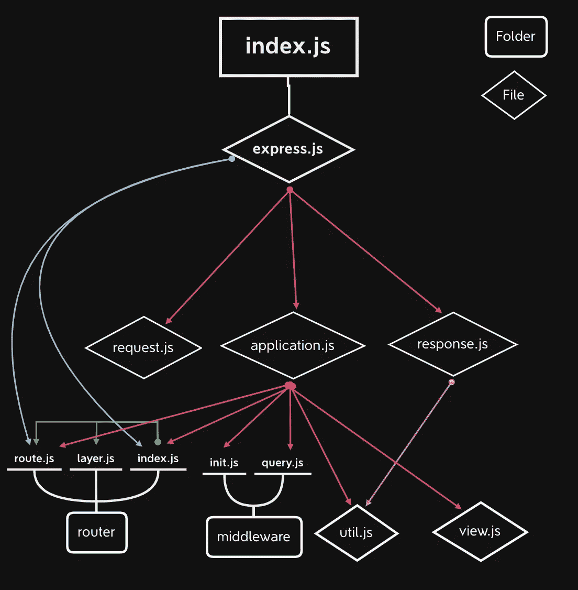
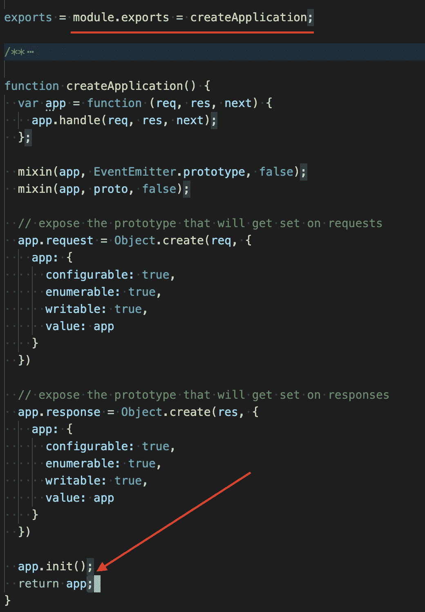
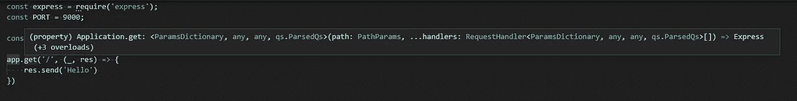
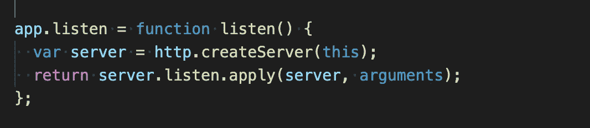
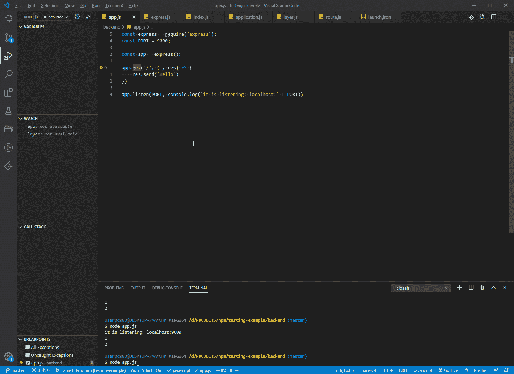
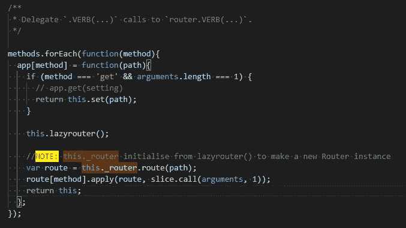
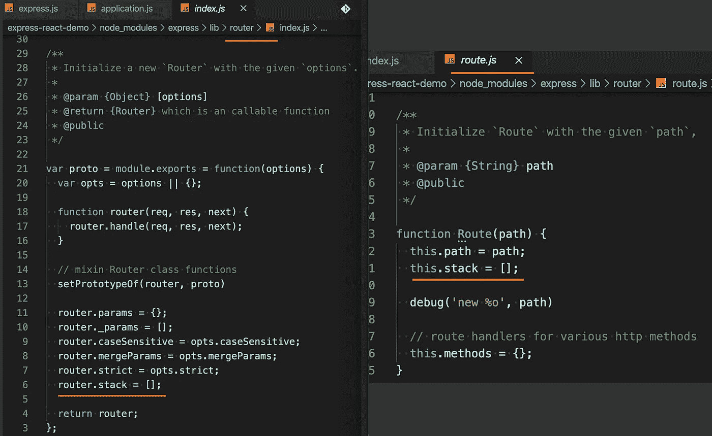
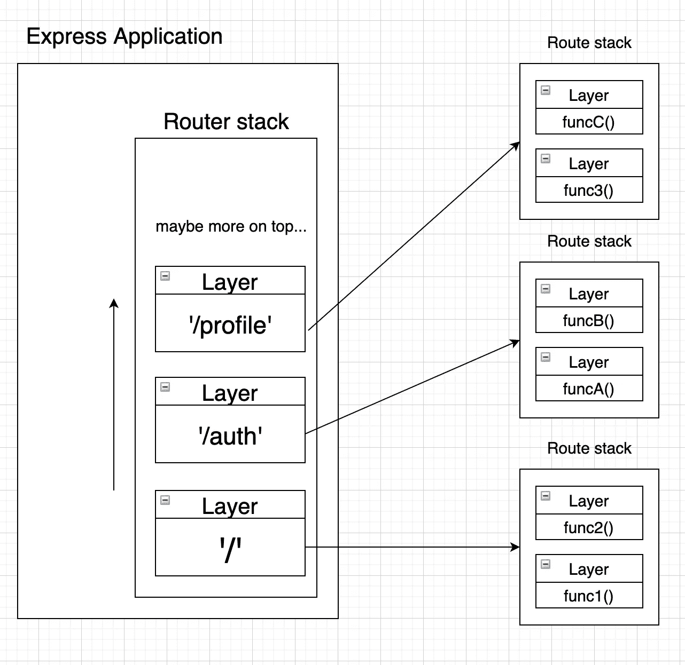

# [NodeJS] Express 源代码—路由器、路由、层

> 原文：<https://medium.com/analytics-vidhya/nodejs-express-source-code-explanation-c1770ac9c989?source=collection_archive---------9----------------------->


照片由[法比奥·康帕雷利](https://unsplash.com/@intothefab?utm_source=medium&utm_medium=referral)在 [Unsplash](https://unsplash.com?utm_source=medium&utm_medium=referral) 上拍摄

我想写一篇关于我经常使用的一些库的文章，并试图弄清楚它是如何工作的。要看你对它的理解程度，我认为可以通过你能否用自己的话解释概念来判断。这项技能值得花时间去练习。所以，这篇文章是一种修行。让我们开始吧。

# 文章内容

1.  Express 是做什么的？
2.  了解 Express 的文件结构
3.  举一个例子

# Express 是做什么的？

“Express”允许您构建一个用于接收请求和发送响应的服务器。此外，另一个基本功能是允许在访问某个端点时执行特定功能(例如，当 URL 为[https://my website/get/userInfo](https://mywebsite/get/userInfo)时，将 IP 地址保存到日志文件中……等等)。

# Express 的文件结构

下图显示了每个文件之间的关系。箭头一侧是文件需要运行的依赖项。比如`router/index.js`需要`router/router.js`和`router/layer.js`才能运行。不要被这样的图片吓到，我们不会全部看完，只看最重要的部分。



安装后，转到 node_modules > express > lib 查看源代码

*   index.js:模块的入口点
*   express.js:将应用程序的不同部分组合成一个对象
*   application.js:应用级属性和方法
*   router.js:路由器级属性和方法
*   route.js 和 layer.js:完成路由器功能的基本文件

# 通过

我将参考官方网站上的示例代码，并将该文件命名为`testing.js`

```
//testing.js
const express = require('express');
const app = express();
const PORT = 8000app.get('/', (req, res) => {
    res.send('Hello World!')
})app.listen(PORT, () => console.log(`Listening at [http://localhost:${PORT}`](http://localhost:${PORT}`)))
```

## 步骤 1:获取 express 的实例

从代码中，第一步是将`require('express')`赋给一个变量。这允许您从相关文件中获取`module.exports`对象。在这种情况下，它实际上是从`lib/express.js`获取函数`createApplication`，因为该函数已被分配给`module.exports`。



`lib/express.js`

## 步骤 2:使用“应用程序”对象

您可以使用`express()`执行我们的`testing.js`中的功能。在`createApplication`函数中的过程之后，将返回一个`app`对象。它包含了我们在使用 Express JS 时需要的方法。(例如，应用程序使用等)。要开始利用`app`带给我们的东西，我们可以进入下一步。

## 第三步:制定一条新路线

让我们转到`app.get('/', ...)`。这为快速应用程序创建了一条新的路径。显示如果端点`'/'`被命中，运行后一个函数。实际使用可以是，如果到达特定页面，发送请求到后端获取数据。你可以看到有两个参数。一个是“路径”。一个是名为“处理程序”的函数。



app.get 函数声明

绿色的字和`<>`符号如果你对`generic`不是那么熟悉可以忽略。不过，可以注意到的一些有趣的点是`handlers`中还有`...`。这意味着函数中可以传递多个处理程序。这涉及到我们将在后面讨论的中间件概念。

## 步骤 4:构建服务器



从最后一行演示代码开始，有`app.listen`。这是构建服务器的步骤，此时`app.listen`调用`createServer()`并通过调用`server.listen`监控是否有任何请求。

# 路由器、路由和层之间的关系

你可能认为 application.js 中有一个`app.get`函数，这样就可以调用这个函数了。是的，它是。然而，作者使用了一种聪明的方法来避免在 application.js 中声明一堆 HTTP 动词动作函数。已经使用了一个函数`methods.forEach(...)`。当我们使用`require`函数时，js 文件将运行一次。当运行时涉及到`methods.forEach()`时，它会将那些 HTTP 动词动作函数设置到`app`对象中。因此，它可以将 HTTP 动词动作功能委托给路由器[方法]功能。



使用调试器显示 app.get 后的函数



函数来处理不同的 HTTP 动词动作

功能`lazyrouter()`已经初始化了路由器。值得一提的是，有一个 ***路由器*** ***栈(实际上是 JS 中的一个数组)用于保存路由*** 。之后，路由器中的`route`方法将被执行，生成一个新的`Route`，并使用一个`Layer`来包装它。`Route` ***还有一个堆栈*** 用来存储匹配具体路线时应该调用的函数。



因此，`Router`、`Route`和`Layer`的关系可以表示如下:



层、路由器、路由之间的关系

路由器堆栈在 express 应用程序内部。最下面的应该是 app 路由器，可能上面还有其他路由器。在每个路由器中，都有一个路由堆栈来存储当端点被命中时需要执行的功能。

# 结论

我们在这篇文章中讨论了几件事情。以下是一些关键要点。可能下次的话题会集中在`req`和`res` 机构上。如果您有任何问题或意见，请在下面评论或通过 [Twitter](https://twitter.com/frankytse_07) (@frankytse_07)联系我。再见。

*   application.js 文件定义了 express 应用程序使用的必要方法。
*   `methods.forEach()`在 application.js 中，将 HTTP 动词动作(如 get delete…)委托给路由器，并进一步将路由器的处理函数分配给路由。
*   用于存储路由器的路由器堆栈。每个路由器都有自己的路由堆栈来保存功能。