# Nodejs 设置

> 原文：<https://medium.com/analytics-vidhya/nodejs-setup-bb1741774512?source=collection_archive---------23----------------------->

1.  使用此链接安装 nodejs:[https://nodejs.org/en/download/](https://nodejs.org/en/download/)
2.  一旦设置完成，当您在窗口中搜索时，您会发现 nodejs 的命令提示符。
3.  使用命令 node -v 在命令提示符下检查版本

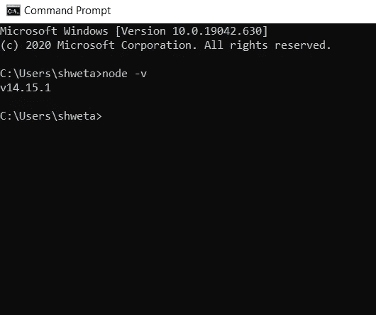

4.让我们在本地系统中创建一个 nodejs 应用程序。创建一个文件夹，并在文件夹中打开命令提示符。

输入命令

*npm 初始化*

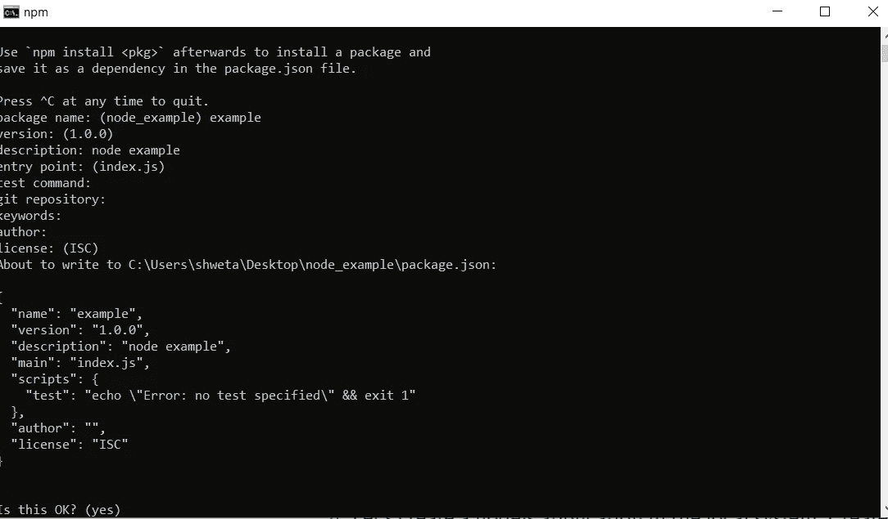

这将使用您填写的名称和描述创建一个 package.json。

5.您会发现在该文件夹中创建了 package.json。Package.json 就像帮助您运行节点应用程序的启动文件。它将包含运行应用程序所需的依赖项。

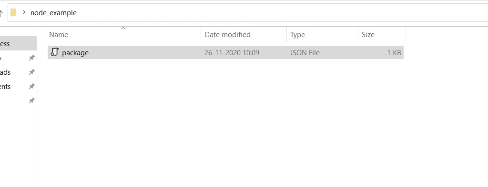

6.现在让我们创建一个 index.js 文件，并安装节点模块。节点模块是可重用的功能，就像库一样，您可以在创建应用程序时导入(这里需要)。

更多关于 npm 的细节，请看这里:【https://nodejs.org/api/fs.html 

让我们编写一个读写 JSON 文件的基本 nodejs 代码。

索引文件的内容。

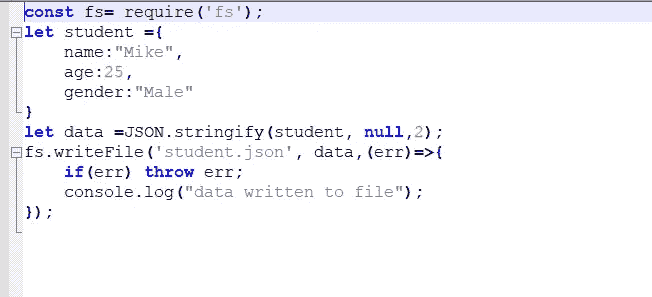

要使 fs 节点模块工作，您可以使用以下命令

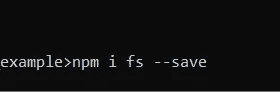

这将在应用程序中创建一个 nodemodule 文件夹。

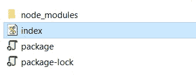

7.现在，要运行代码，请使用以下命令

*node index.js*

8.这将创建一个包含写入数据的文件 student.json，并在命令提示符下打印一个日志。

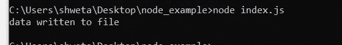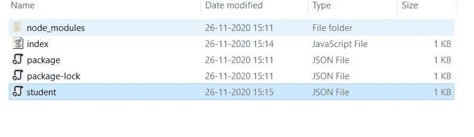

9.代替 node index.js，我们可以在 package.json 中定义一个 start 参数，使用命令 npm run start，并使用 nodemon 在保存更改时自动重启服务。

使用以下工具安装 [nodemon](https://www.npmjs.com/package/nodemon)

*npm 安装—保存-开发节点守护程序*

9.由于我们正在写入一个 json 文件，nodemon 将进入一个无限循环，为了停止这个操作，在 package.json 中添加 [nodemonConfig](https://stackoverflow.com/questions/44855839/nodemon-keeps-restarting-server#:~:text=If%20your%20db's%20.,nodemon%20configuration%20(if%20possible).)

当您使用 save 安装模块时，它会被添加到 package.json 中

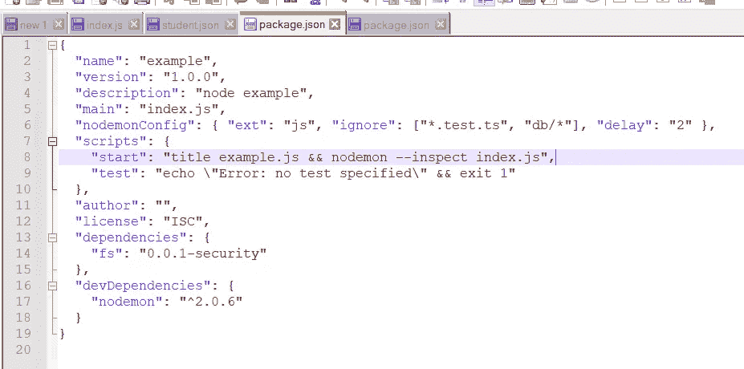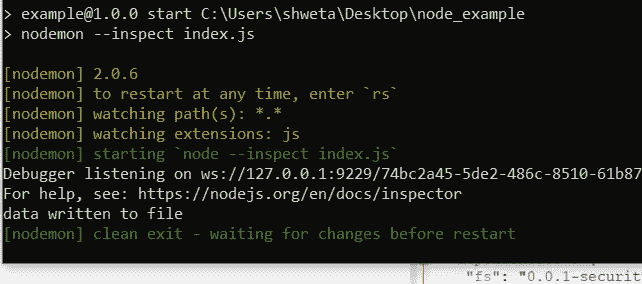

10.要向命令提示符窗口添加标题，可以在 package.json 中添加标题<name of="" the="" file=""></name>

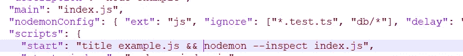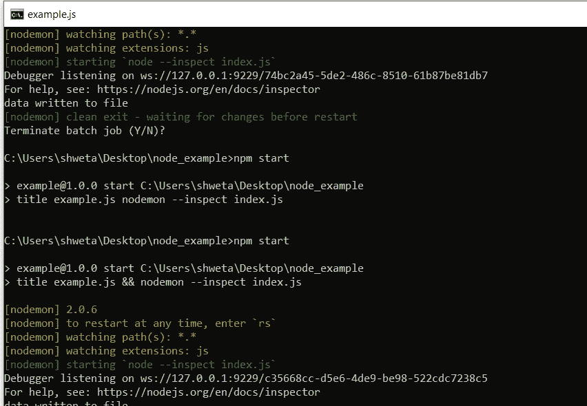